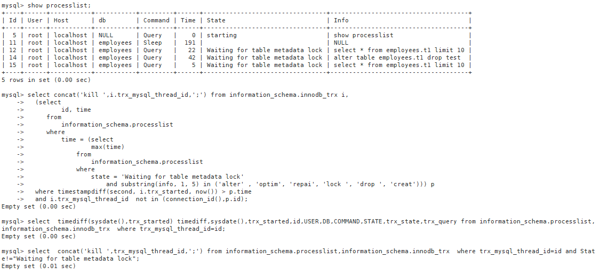
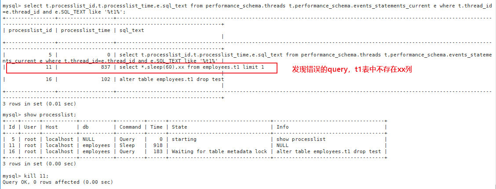

摘要：MetaData Lock即元数据锁，在数据库中元数据即数据字典信息包括db,table,function,procedure,trigger,event等。metadata lock主要为了保证元数据的一致性,用于处理不同线程操作同一数据对象的同步与互斥问题。

今天有客户(MySQL 5.6)遇到该问题，最关键的是属于第三种情况，google上根本找不到类似的故障案例，唯一一个非常接近的故障案例中数据库版本却不同（具体看下文慢慢聊），哎，困难重重啊，最终还是解决了哈。

alter table的语句是很危险的，在操作之前最好确认对要操作的表没有任何进行中的操作、没有未提交事务、也没有显式事务中的报错语句。如果有alter table的维护任务，在无人监管的时候运行，最好通过lock_wait_timeout设置好超时时间，避免长时间的metedata锁等待。
<!--more-->


## 什么是metadata lock？

MetaData Lock即元数据锁，在数据库中元数据即数据字典信息包括db,table,function,procedure,trigger,event等。metadata lock主要为了保证元数据的一致性,用于处理不同线程操作同一数据对象的同步与互斥问题。

### **MetaData Lock的前世今生**

MDL锁是为了解决一个有名的[bug#989](https://bugs.mysql.com/bug.php?id=989)，所以在5.5.3版本引入了MDL锁。其实5.5也有类似保护元数据的机制，只是没有明确提出MDL概念而已。但是5.5之前版本(比如5.1)与5.5之后版本在保护元数据这块有一个显著的不同点是，5.1对于元数据的保护是语句级别的，5.5对于metadata的保护是事务级别的。所谓语句级别，即语句执行完成后，无论事务是否提交或回滚，其表结构可以被其他会话更新；而事务级别则是在事务结束后才释放MDL。引入MDL锁主要是为了**解决两个问题**：

* 事务隔离问题：比如在可重复隔离级别下，会话A在2次查询期间，会话B对表结构做了修改，两次查询结果就会不一致，无法满足可重复读的要求。
* 数据复制问题：比如会话A执行了多条更新语句期间，另外一个会话B做了表结构变更并且先提交，就会导致slave在重做时，先重做alter，再重做update时就会出现复制错误的现象。也就是上面提到的[bug#989](https://bugs.mysql.com/bug.php?id=989)。

---

### DDL操作与MetaData Lock

* metadata lock 机制是为了保证数据一致性存在的，在有事务的操作时候，需要首先获得metadata lock ,然后操作，如果这个时候，又来了一个事务也要ddl操作同一个表，就会出现 metadata lock。
* 自动提交模式下，单语句就是一个事务，执行完了，事务也就结束了。
* preparestatement  会获得 metalock，一旦prepare 完毕， metalock 就释放了。
* online DDL应该是指在alter table进行的时候， 插入/修改/删除数据的sql语句不会Waiting for table metadata lock。一旦alter table TableA的操作停滞在Waiting for table metadata lock的状态，后续对TableA的任何操作（包括读）都无法进行，也会在Opening tables的阶段进入Waiting for table metadata lock的队列。

## Alter table 会发生锁的三种场景  

### 场景1

* 会话A对booboo表执行读操作`select *,sleep(60) from booboo;`，正在进行未提交事务
* 会话B对booboo表执行在线DDL操作`alter table booboo add q4 int default 0;`
* 会话C对booboo表执行隐式读操作`select *,sleep(60) from booboo;`,进行等待
* 会话D对booboo表执行显示读操作`begin;select * from booboo;`也会进行等待
* 通过`show processlist`可以看到会话A（对booboo表上正在进行的操作），此时会话B（alter table语句）无法获取到metadata 独占锁，会进行等待，会话C和会话D都会进行等待，且能从processlist表中看到对booboo表的操作
* 会话A提交事务后或kill之后，会话C事务结束，会话D`select`语句执行成功，事务提交则会话B可执行，否则进入场景2

```shell
mysql> show processlist;
+----+------+-----------+-----------+---------+------+---------------------------------+-----------------------------------------+
| Id | User | Host      | db        | Command | Time | State                           | Info                                    |
+----+------+-----------+-----------+---------+------+---------------------------------+-----------------------------------------+
|  6 | root | localhost | uplooking | Query   |  167 | Waiting for table metadata lock | alter table booboo add q4 int default 0 |
|  7 | root | localhost | uplooking | Query   |  155 | Waiting for table metadata lock | select * from booboo                    |
|  8 | root | localhost | uplooking | Query   |    0 | starting                        | show processlist                        |
|  9 | root | localhost | uplooking | Query   |  181 | User sleep                      | select *,sleep(60) from booboo          |
| 10 | root | localhost | uplooking | Query   |    7 | Waiting for table metadata lock | select * from booboo                    |
+----+------+-----------+-----------+---------+------+---------------------------------+-----------------------------------------+
5 rows in set (0.00 sec)
# id=9的线程为会话A 虽然是隐式事务，但是没有执行成功，所以为未提交的事务
# id=6的线程为会话B 在会话A有事务未提交的情况下，执行Alter操作,争抢metadata lock
# id=7的线程为会话C 隐式查询事务也会进入等待
# id=10的线程为会话D 显示查询事务同样进入等待
```

解决方法

```shell
# 查看metadatalock

## 第一种情况，则定位到长时间未提交的事务kill即可

# 查询 information_schema.innodb_trx 看到有长时间未完成的事务， 使用 kill 命令终止该查询。

select concat('kill ',i.trx_mysql_thread_id,';') from information_schema.innodb_trx i,
  (select 
         id, time
     from
         information_schema.processlist
     where
         time = (select 
                 max(time)
             from
                 information_schema.processlist
             where
                 state = 'Waiting for table metadata lock'
                     and substring(info, 1, 5) in ('alter' , 'optim', 'repai', 'lock ', 'drop ', 'creat'))) p
  where timestampdiff(second, i.trx_started, now()) > p.time
  and i.trx_mysql_thread_id  not in (connection_id(),p.id);
```


### 场景2

* 通过`show processlist`看不到booboo上有任何操作，但实际上存在有未提交的事务，可以在`information_schema.innodb_trx`中查看到。在事务没有完成之前，booboo的锁不会释放，alter table同样获取不到metadata的独占锁
* 会话D提交事务或回滚或kill，则会话B中的Alter可继续执行

```shell
# 在场景1的基础上，将会话A的事务完成或者kill掉，会话C执行成功，但是会话B和会话D继续进入metadata锁的等待。原因是会话D虽然select可以执行，但是事务没有提交，则表上的metadata锁还存在，导致会话B的ddl操作无法执行。
# 会话B和会话D，情况1：知道有未完成的事务D，则结束会话D的事务，会话B正常执行。
# 会话B和会话D，情况2：不知道有未结束的事务D，如何排错呢？
=================================

-- 请根据具体的情景修改查询语句
-- 如果导致阻塞的语句的用户与当前用户不同，请使用导致阻塞的语句的用户登录来终止会话

## 场景2的情况，是在场景1的基础上，还是有metadatalock锁（*一般生产环境不会停服务，因此不停的有新的query发送过来，就会出现场景2*），则手动继续kill掉长事务即可，注意生产环境中，有可能ddl操作需要保留（*例如MDL锁出现在主从同步的从中，从库需要去执行主发送的表变更，当然，也可以先将主从停掉，手动执行alter操作，都可以*）以下方法是在停止对从库的读操作后，将非ddl的连接kill掉

select id,State,command from information_schema.processlist where State="Waiting for table metadata lock";
select  timediff(sysdate(),trx_started) timediff,sysdate(),trx_started,id,USER,DB,COMMAND,STATE,trx_state,trx_query from information_schema.processlist,information_schema.innodb_trx  where trx_mysql_thread_id=id;
show processlist;
select  concat('kill ',trx_mysql_thread_id,';') from information_schema.processlist,information_schema.innodb_trx  where trx_mysql_thread_id=id and State!="Waiting for table metadata lock";

===============================
mysql> show processlist;                                                                                                             
+----+------+-----------+-----------+---------+------+---------------------------------+-----------------------------------------+
| Id | User | Host      | db        | Command | Time | State                           | Info                                    |
+----+------+-----------+-----------+---------+------+---------------------------------+-----------------------------------------+
|  6 | root | localhost | uplooking | Query   |  275 | Waiting for table metadata lock | alter table booboo add q6 int default 0 |
|  7 | root | localhost | uplooking | Sleep   |  269 |                                 | NULL                                    |
|  8 | root | localhost | uplooking | Query   |    0 | starting                        | show processlist                        |
| 10 | root | localhost | uplooking | Sleep   |  249 |                                 | NULL                                    |
| 12 | root | localhost | uplooking | Sleep   |  191 |                                 | NULL                                    |
+----+------+-----------+-----------+---------+------+---------------------------------+-----------------------------------------+
5 rows in set (0.00 sec)
# 查看当前进程发现除了Alter之外没有对booboo表的操作

mysql> select  timediff(sysdate(),trx_started) timediff,sysdate(),trx_started,id,USER,DB,COMMAND,STATE,trx_state,trx_query from information_schema.processlist,information_schema.innodb_trx where trx_mysql_thread_id=id;
+----------+---------------------+---------------------+----+------+-----------+---------+---------------------------------+-----------+-----------------------------------------+
| timediff | sysdate()           | trx_started         | id | USER | DB        | COMMAND | STATE                           | trx_state | trx_query                               |
+----------+---------------------+---------------------+----+------+-----------+---------+---------------------------------+-----------+-----------------------------------------+
| 00:05:38 | 2017-08-18 20:21:07 | 2017-08-18 20:15:29 |  6 | root | uplooking | Query   | Waiting for table metadata lock | RUNNING   | alter table booboo add q6 int default 0 |
| 00:05:38 | 2017-08-18 20:21:07 | 2017-08-18 20:15:29 | 10 | root | uplooking | Sleep   |                                 | RUNNING   | NULL                                    |
+----------+---------------------+---------------------+----+------+-----------+---------+---------------------------------+-----------+-----------------------------------------+
2 rows in set (0.00 sec)
# 查看innodb_trx表可以看到除了alter之外有未完成的事务，但是看不到具体query，得到线程id为10
# 就可以kill 10来结束事务
# 之后Alter正常操作
```

### 场景3

> 与场景2对比的现象不同于：
>
> * 场景2：未完成事务中存在未完成事务
> * 场景3：未完成事务中不存在未完成事务：确认有错误事务未提交或回滚，找到该事务的session_id然后杀死

- 通过`show processlist`看不到`booboo`表有任何操作，在`information_schema.innodb_trx`中也没有任何进行中的事务。
- 这很可能是因为在一个显式的事务中，对`booboo`表进行了一个失败的操作（比如查询了一个不存在的字段），这时事务没有开始，但是失败语句获取到的锁依然有效。从`performance_schema.events_statements_current`表中可以查到失败的语句
- 也就是说除了语法错误，其他错误语句获取到的锁在这个事务提交或回滚之前，仍然不会释放掉。`because the failed statement is written to the binary log and the locks protect log consistency `但是解释这一行为的原因很难理解，因为错误的语句根本不会被记录到二进制日志
- 解决方法：确认有错误事务未提交或回滚，找到该事务的sessionid然后杀死（难点）

```shell
# 场景3的出现和前两种不同
# 查看线程情况，看到alter操作metadata锁，还有其他的select操作有metadata锁
## 第一反应就是有可能是场景1，于是kill掉执行select的线程，再次查看线程情况，就只剩下执行alter线程了
## 接下来查看未完成的事务，如果是场景1，在kill掉冲突的线程后应该出现两种情况（A.alter操作正常执行B.线程中只有alter操作为waiting metadata lock状态；未完成事务中存在未完成事务）
## 但是却发现和B情况有所不同的是：未完成事务中不存在未完成事务，总结第三种情况(C.线程中只有alter操作为waiting metadata lock状态；未完成事务中不存在未完成事务）
# 通过搜索资料定位到是场景3，但资料中没有说怎么解决问题，又不能重新启动服务器，只有一个资料里提到了方法（确认有错误事务未提交或回滚，找到该事务的sessionid然后杀死，关键就是如何找到sessionid呢？performance_schema.events_statements_current中的thread_id为线程id并不是sessionid或者说会话id、连接id，如何通过thread_id找到session_id成为了难点？5.7中有个session表可以直接查到，而5.6中必须通过三表才能查到，分别为performance_schema.events_statements_current,performance_schema.threads,information_schema.processlist表。）
=====================================================================================
# kill掉除了写操作以外的query
select concat('kill ',id) from information_schema.processlist where State="Waiting for table metadata lock" and substring(info, 1, 5) not in ('alter' , 'optim', 'repai', 'lock ', 'drop ', 'creat');

# 寻找未提交或未回滚的错误事务，并kill即可
select t.processlist_id,t.processlist_time,e.sql_text from performance_schema.threads t,performance_schema.events_statements_current e where t.thread_id=e.thread_id and e.SQL_TEXT like '%t1%';
# 案例中假设是在t1表上有MDL锁，则，e.sql_text 近似匹配t1
# 本方法5.5 5.6 5.7 都通用。
=============================================================================
```

第一步：模拟第三种情况，会话11执行一个显示事务，且query出现列错误，t1表中不存在xx列，不提交。


第二步：会话14中执行alter操作


第三步：执行一条query


第四步：会话15执行一个显示事务，查询t1表


第五步：查看当前的processlist情况，可以看到只要是对t1表的操作都出现了MDL锁等待；尝试通过第一种情况的解决方法找出阻塞的事务会话进行kill，发现不存在阻塞会话；查看当前未提交的事务发现返回空；通过过滤processlist中进行MDL锁等待且不是alter的会话id，进行kill。



第六步：只kill 12，15，留下执行alter的会话14；有人会想为什么都kill掉呢？因为即使现在kill掉了，t1表的MDL锁也不会释放掉，还不如留下会话14的ddl操作，等彻底解决了，自然就能执行这个操作。具体可以看下面的分析。


第七步：给大家做个测试，即使将会话14的alter动作kill掉：

* processlist中看不到任何等待MDL锁的会话；
* sys.schema_table_lock_waits中也不存在表锁（5.7才有sys库）；
* performance_schema.metadata_locks中也不存在任何锁记录；
* 会话16想再去执行alter操作，又开始了MDL锁等待。


第八步：此时就一定可以确定当前属于【**有错误事务未提交或回滚导致的MDL锁**】的情况了。我们找出这个错误事务，进行kill



第九步：kill掉会话11后，成功将MDL锁释放。

> 有人又会问咯：为什么不将数据库重启？
>
> 回答：
>
> 如果说——
>
> 1. 业务允许重启
>
> 2. 不想找到问题的根源
>
>    那么重启吧
>
> 如果说—— 
>
> 1.  数据库上面多个库，关联多个业务，不能重启
>
> 2. 想找到问题的根源，防止下次再次出现类似的问题
>
>    那么你懂的
>
> 那么为什么不直接kill所有会话呢？同样如果你要找出问题的根源那么就排查，不想问为什么就直接kill吧，末尾有kill的脚本


一步步分析如下：

```shell
mysql> show processlist;                                                                                                                                                                   
+----+------+-----------+-----------+---------+------+---------------------------------+-----------------------------------------+
| Id | User | Host      | db        | Command | Time | State                           | Info                                    |
+----+------+-----------+-----------+---------+------+---------------------------------+-----------------------------------------+
|  6 | root | localhost | uplooking | Query   |   17 | Waiting for table metadata lock | alter table booboo add q9 int default 0 |
|  7 | root | localhost | uplooking | Query   |   11 | Waiting for table metadata lock | select * from booboo                    |
|  8 | root | localhost | uplooking | Query   |    0 | starting                        | show processlist                        |
| 14 | root | localhost | uplooking | Query   |    5 | Waiting for table metadata lock | select * from booboo where id=3         |
| 15 | root | localhost | uplooking | Sleep   |   28 |                                 | NULL                                    |
+----+------+-----------+-----------+---------+------+---------------------------------+-----------------------------------------+
5 rows in set (0.00 sec)
mysql> select  timediff(sysdate(),trx_started) timediff,sysdate(),trx_started,id,USER,DB,COMMAND,STATE,trx_state,trx_query from information_schema.processlist,information_schema.innodb_trx where trx_mysql_thread_id=id;
Empty set (0.00 sec)
mysql> kill 7 ;
Query OK, 0 rows affected (0.00 sec)

mysql> kill 14;
Query OK, 0 rows affected (0.00 sec)

mysql> show processlist;                                                                                                                                                                   
+----+------+-----------+-----------+---------+------+---------------------------------+-----------------------------------------+
| Id | User | Host      | db        | Command | Time | State                           | Info                                    |
+----+------+-----------+-----------+---------+------+---------------------------------+-----------------------------------------+
|  6 | root | localhost | uplooking | Query   |   86 | Waiting for table metadata lock | alter table booboo add q9 int default 0 |
|  8 | root | localhost | uplooking | Query   |    0 | starting                        | show processlist                        |
| 15 | root | localhost | uplooking | Sleep   |   97 |                                 | NULL                                    |
+----+------+-----------+-----------+---------+------+---------------------------------+-----------------------------------------+
3 rows in set (0.00 sec)

mysql> select  timediff(sysdate(),trx_started) timediff,sysdate(),trx_started,id,USER,DB,COMMAND,STATE,trx_state,trx_query from information_schema.processlist,information_schema.innodb_trx where trx_mysql_thread_id=id;
Empty set (0.00 sec)

# 如果符合情况C，需要去查看performance_schema.events_statements_current表中是否有对booboo的错误语句（这里的错误语句是非语法错误的，例如select中写了不存在的列等情况）
# 从下面的查询结果可以看到，确实存在一个错误语句事件
# 通过该错误语句事件的THREAD_ID，到performance_schema.threads表查到该线程对应的PROCESSLIST_ID，而PROCESSLIST_ID进程id等于processlist中的id
mysql> select * from performance_schema.events_statements_current where SQL_TEXT like '%booboo%'\G;
*************************** 1. row ***************************
              THREAD_ID: 31
               EVENT_ID: 16
           END_EVENT_ID: NULL
             EVENT_NAME: statement/sql/alter_table
                 SOURCE: socket_connection.cc:101
            TIMER_START: 3292336129737000
              TIMER_END: 3521408438190000
             TIMER_WAIT: 229072308453000
              LOCK_TIME: 0
               SQL_TEXT: alter table booboo add q9 int default 0
                 DIGEST: NULL
            DIGEST_TEXT: NULL
         CURRENT_SCHEMA: uplooking
            OBJECT_TYPE: NULL
          OBJECT_SCHEMA: NULL
            OBJECT_NAME: NULL
  OBJECT_INSTANCE_BEGIN: NULL
            MYSQL_ERRNO: 0
      RETURNED_SQLSTATE: NULL
           MESSAGE_TEXT: NULL
                 ERRORS: 0
               WARNINGS: 0
          ROWS_AFFECTED: 0
              ROWS_SENT: 0
          ROWS_EXAMINED: 0
CREATED_TMP_DISK_TABLES: 0
     CREATED_TMP_TABLES: 0
       SELECT_FULL_JOIN: 0
 SELECT_FULL_RANGE_JOIN: 0
           SELECT_RANGE: 0
     SELECT_RANGE_CHECK: 0
            SELECT_SCAN: 0
      SORT_MERGE_PASSES: 0
             SORT_RANGE: 0
              SORT_ROWS: 0
              SORT_SCAN: 0
          NO_INDEX_USED: 0
     NO_GOOD_INDEX_USED: 0
       NESTING_EVENT_ID: NULL
     NESTING_EVENT_TYPE: NULL
    NESTING_EVENT_LEVEL: 0
*************************** 2. row ***************************
              THREAD_ID: 33
               EVENT_ID: 74
           END_EVENT_ID: NULL
             EVENT_NAME: statement/sql/select
                 SOURCE: socket_connection.cc:101
            TIMER_START: 3521408132304000
              TIMER_END: 3521408462141000
             TIMER_WAIT: 329837000
              LOCK_TIME: 184000000
               SQL_TEXT: select * from performance_schema.events_statements_current where SQL_TEXT like '%booboo%'
                 DIGEST: NULL
            DIGEST_TEXT: NULL
         CURRENT_SCHEMA: uplooking
            OBJECT_TYPE: NULL
          OBJECT_SCHEMA: NULL
            OBJECT_NAME: NULL
  OBJECT_INSTANCE_BEGIN: NULL
            MYSQL_ERRNO: 0
      RETURNED_SQLSTATE: NULL
           MESSAGE_TEXT: NULL
                 ERRORS: 0
               WARNINGS: 0
          ROWS_AFFECTED: 0
              ROWS_SENT: 1
          ROWS_EXAMINED: 0
CREATED_TMP_DISK_TABLES: 0
     CREATED_TMP_TABLES: 0
       SELECT_FULL_JOIN: 0
 SELECT_FULL_RANGE_JOIN: 0
           SELECT_RANGE: 0
     SELECT_RANGE_CHECK: 0
            SELECT_SCAN: 1
      SORT_MERGE_PASSES: 0
             SORT_RANGE: 0
              SORT_ROWS: 0
              SORT_SCAN: 0
          NO_INDEX_USED: 1
     NO_GOOD_INDEX_USED: 0
       NESTING_EVENT_ID: NULL
     NESTING_EVENT_TYPE: NULL
    NESTING_EVENT_LEVEL: 0
*************************** 3. row ***************************
              THREAD_ID: 40
               EVENT_ID: 8
           END_EVENT_ID: 8
             EVENT_NAME: statement/sql/select
                 SOURCE: socket_connection.cc:101
            TIMER_START: 3280938133699000
              TIMER_END: 3280938258470000
             TIMER_WAIT: 124771000
              LOCK_TIME: 0
               SQL_TEXT: select abc from booboo
                 DIGEST: 871dd43dfdfb143e81439bbe7bf7b57e
            DIGEST_TEXT: SELECT `abc` FROM `booboo` 
         CURRENT_SCHEMA: uplooking
            OBJECT_TYPE: NULL
          OBJECT_SCHEMA: NULL
            OBJECT_NAME: NULL
  OBJECT_INSTANCE_BEGIN: NULL
            MYSQL_ERRNO: 1054
      RETURNED_SQLSTATE: 42S22
           MESSAGE_TEXT: Unknown column 'abc' in 'field list'
                 ERRORS: 1
               WARNINGS: 0
          ROWS_AFFECTED: 0
              ROWS_SENT: 0
          ROWS_EXAMINED: 0
CREATED_TMP_DISK_TABLES: 0
     CREATED_TMP_TABLES: 0
       SELECT_FULL_JOIN: 0
 SELECT_FULL_RANGE_JOIN: 0
           SELECT_RANGE: 0
     SELECT_RANGE_CHECK: 0
            SELECT_SCAN: 0
      SORT_MERGE_PASSES: 0
             SORT_RANGE: 0
              SORT_ROWS: 0
              SORT_SCAN: 0
          NO_INDEX_USED: 0
     NO_GOOD_INDEX_USED: 0
       NESTING_EVENT_ID: NULL
     NESTING_EVENT_TYPE: NULL
    NESTING_EVENT_LEVEL: 0
3 rows in set (0.00 sec)

ERROR: 
No query specified

mysql> select THREAD_ID,DIGEST_TEXT from performance_schema.events_statements_current where DIGEST_TEXT="SELECT `abc` FROM `booboo`";
+-----------+-----------------------------+
| THREAD_ID | DIGEST_TEXT                 |
+-----------+-----------------------------+
|        40 | SELECT `abc` FROM `booboo`  |
+-----------+-----------------------------+
1 row in set (0.00 sec)

mysql> select * from performance_schema.threads where thread_id=40\G;
*************************** 1. row ***************************
          THREAD_ID: 40
               NAME: thread/sql/one_connection
               TYPE: FOREGROUND
     PROCESSLIST_ID: 15
   PROCESSLIST_USER: root
   PROCESSLIST_HOST: localhost
     PROCESSLIST_DB: uplooking
PROCESSLIST_COMMAND: Sleep
   PROCESSLIST_TIME: 402
  PROCESSLIST_STATE: NULL
   PROCESSLIST_INFO: NULL
   PARENT_THREAD_ID: NULL
               ROLE: NULL
       INSTRUMENTED: YES
            HISTORY: YES
    CONNECTION_TYPE: Socket
       THREAD_OS_ID: 22758
mysql> select PROCESSLIST_ID from performance_schema.threads where thread_id=40;
+----------------+
| PROCESSLIST_ID |
+----------------+
|             15 |
+----------------+
1 row in set (0.00 sec)

mysql> select * from information_schema.processlist where id=(select PROCESSLIST_ID from performance_schema.threads where thread_id=40);
+----+------+-----------+-----------+---------+------+-------+------+
| ID | USER | HOST      | DB        | COMMAND | TIME | STATE | INFO |
+----+------+-----------+-----------+---------+------+-------+------+
| 15 | root | localhost | uplooking | Sleep   |  466 |       | NULL |
+----+------+-----------+-----------+---------+------+-------+------+
1 row in set (0.00 sec)

mysql> kill 15;
Query OK, 0 rows affected (0.00 sec)

# 会话B
mysql> alter table booboo add q9 int default 0;
Query OK, 0 rows affected (9 min 54.35 sec)
Records: 0  Duplicates: 0  Warnings: 0
```


## 小知识点总结

### 三张表的关系

> MySQL 5.6

1. `performance_schema`库中，`events_statements_current`表中`theard_id`与` threads`表中的`thread_id`相同
2. `performance_schema`库中，threads表中，thread_id和processlist_id为对应关系，`thread_id`表示一个独特的线程标识符;`processlist_id`是`show processlist`显示的`id`值，连接标识符；而对于后台线程(与用户连接不相关的线程)，`PROCESSLIST_ID`为空，此值不是唯一的。
3. `information_schema`库中,`PROCESSLIST`表是一个非标准表。`id`连接标识符，并由CONNECTION_ID()函数返回。

| performance_schema        | performance_schema | performance_schema | information_schema |
| ------------------------- | ------------------ | ------------------ | ------------------ |
| events_statements_current | threads            | threads            | processlist        |
| THREAD_ID                 | THREAD_ID          | PROCESSLIST_ID     | ID                 |

### 我的理解

1. 线程表中保存了所有线程的信息，有前台的有后台运行的；
2. 如果是由连接产生的线程，一般都是前台线程，会分配一个processlist_id，可以在information_schema.processlist中看到

### 资料参考

[官网关于threads表的说明](https://dev.mysql.com/doc/refman/5.7/en/threads-table.html)

[官方关于processlist表的说明](https://dev.mysql.com/doc/refman/5.7/en/show-processlist.html)

[MySQL5.7 MetaData Lock 案例分享](http://www.voidcn.com/article/p-hjsjvnlz-bog.html)


### 不同版本

> MySQL 5.7

```
select * from performance_schema.events_statements_current\G
select * from sys.x$session\G
select * from sys.x$processlist\G

mysql> select * from x$session\G;
*************************** 1. row ***************************
                thd_id: 3904
               conn_id: 3879
                  user: root@localhost
                    db: sys
               command: Query
                 state: Sending data
                  time: 0
     current_statement: select * from x$session
     statement_latency: 1564453000
              progress: NULL
          lock_latency: 847000000
         rows_examined: 0
             rows_sent: 0
         rows_affected: 0
            tmp_tables: 4
       tmp_disk_tables: 1
             full_scan: YES
        last_statement: NULL
last_statement_latency: NULL
        current_memory: 0
             last_wait: NULL
     last_wait_latency: NULL
                source: NULL
           trx_latency: NULL
             trx_state: NULL
        trx_autocommit: NULL
                   pid: 12880
          program_name: mysql
1 row in set (0.05 sec)
mysql> select * from  x$processlist limit 1\G;
*************************** 1. row ***************************
                thd_id: 1
               conn_id: NULL
                  user: sql/main
                    db: NULL
               command: NULL
                 state: NULL
                  time: 230927
     current_statement: NULL
     statement_latency: NULL
              progress: NULL
          lock_latency: NULL
         rows_examined: NULL
             rows_sent: NULL
         rows_affected: NULL
            tmp_tables: NULL
       tmp_disk_tables: NULL
             full_scan: NO
        last_statement: NULL
last_statement_latency: NULL
        current_memory: 0
             last_wait: NULL
     last_wait_latency: NULL
                source: NULL
           trx_latency: NULL
             trx_state: NULL
        trx_autocommit: NULL
                   pid: NULL
          program_name: NULL
1 row in set (0.06 sec)
mysql> select * from information_schema.processlist;
+------+------+-----------+------+---------+------+-----------+----------------------------------------------+
| ID   | USER | HOST      | DB   | COMMAND | TIME | STATE     | INFO                                         |
+------+------+-----------+------+---------+------+-----------+----------------------------------------------+
| 3879 | root | localhost | sys  | Query   |    0 | executing | select * from information_schema.processlist |
+------+------+-----------+------+---------+------+-----------+----------------------------------------------+
1 row in set (0.00 sec)
```
## MDL故障自愈

### kill所有会话

> 不想知道故障原因，只想快速解决故障

```shell
#!/bin/bash
# kill掉 所有会话
user=xxx
password=xxx
host=xxxx.mysql.rds.aliyuncs.com
port=3306

mysql -u$user -p$password -h$host  -P$port -e "select  concat('KILL ',id,';') from information_schema.processlist;" > tmpfile

awk '{if (NR != 1) print $0 }' tmpfile | mysql -u$user -p$password -h$host  -P$port
```

### MDL故障排查和解决

[MDL故障自愈脚本GitHub地址](https://github.com/BoobooWei/DevOps-Database-Troubleshooting/blob/master/fault_self_healing_metadatalock.py)

