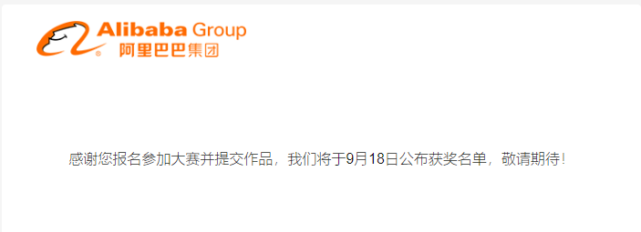

本次大赛由阿里云开放平台&阿里云开发者社区&阿里云内容设计部联合举办。

## 大赛简介

阿里云开放平台携手开发者社区、内容设计部，联合举办“OpenAPI 开发者挑战赛第三期—— CodeSample 全民赛码 ”，面向数万开发者，招募阿里云 OpenAPI 示例代码（CodeSample）。无论您是入门开发，或是运维大神，无论是利用 OpenAPI 解决一个轻量场景，或是满足一个小功能，通通到碗里来！现报名通道火热开启，欢迎抢先报名！

### [大赛详情](https://developer.aliyun.com/topic/codesample/active1)

## 赛事安排

大赛报名： 2020.08.12—2020.09.11
作品提交截止日：2020.09.13
作品评审：2020.09.17
获奖公布：2020.09.18

## 奖项设置

**一等奖：**1 名，樱桃机械键盘 + 内推资格 + 开放平台天使用户资格 + 参赛奖牌；
**二等奖：**3 名，大疆特洛（Tello）航拍无人机 + 内推资格 + 参赛奖牌；
**三等奖：**5 名，Alibaba双肩背包 + 参赛奖牌；
**参与奖：**20 名，大赛专属奖牌。

## 参赛规则 

1、大赛报名：提交参赛作品前，请先进行 **[大赛报名](https://survey.aliyun.com/apps/zhiliao/YScU_6Lty?spm=a2c6h.17640777.J_1935739830.1.7b0b54e1ceHGoF)**，未完成大赛报名的选手，提交的参赛作品视为无效；

2、作品提交：**[进入作品提交页面](https://api.aliyun.com/?spm=a2c6h.17640777.J_6252052100.1.7b0b54e1CI5grf#/codesample)**，点击“开始编辑”即可编辑和预览 CodeSample，同时可直接提交作品（本次活动唯一作品提交入口），请按照页面上的指南操作。

## 作品选题参考

## 实例 demo 参考

- **[获取 ECS 实例配置](https://developer.aliyun.com/codesample/9?spm=a2c6h.17640777.J_7225173660.1.7b0b54e1wmvdkP)**
- **[创建 HTTP 监听](https://developer.aliyun.com/codesample/6?spm=a2c6h.17640777.J_7225173660.2.7b0b54e1wmvdkP)**
- **[创建 NAT 网关](https://developer.aliyun.com/codesample/111?spm=a2c6h.17640777.J_7225173660.3.7b0b54e1wmvdkP)**

## 面向对象

本次大赛面向所有的开发者，招募阿里云 OpenAPI 示例代码（CodeSample），无论您是入门开发，或是运维大神，只要您对阿里云OpenAPI 感兴趣，就可报名参赛并且提交作品。

1、报名方式：登录比赛官网，点击报名链接，完成个人信息登记后报名成功；

2、选手以个人形式参与，并确保报名信息准确有效；

3、选手交流官方钉钉群：

## 大赛组织

主办方：阿里云开放平台 | 阿里云开发者社区 | 阿里云内容设计部

---

# 大宝报名

