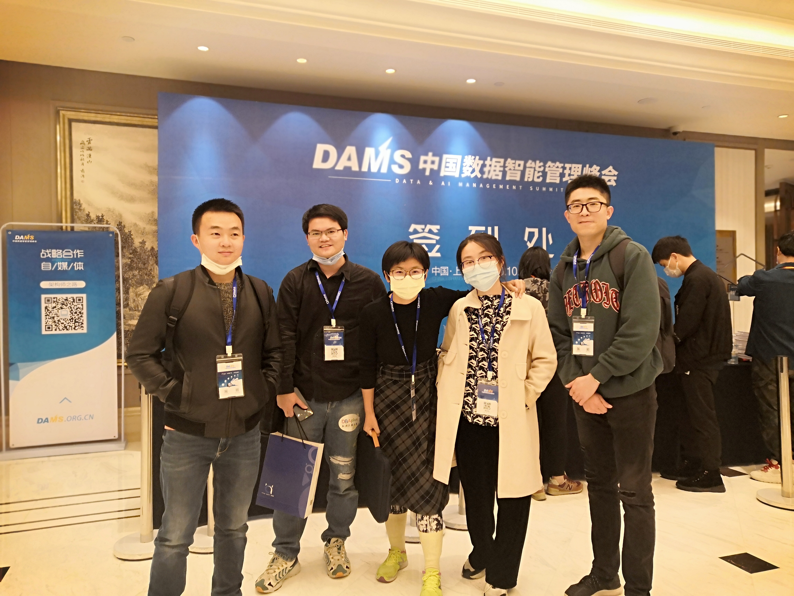
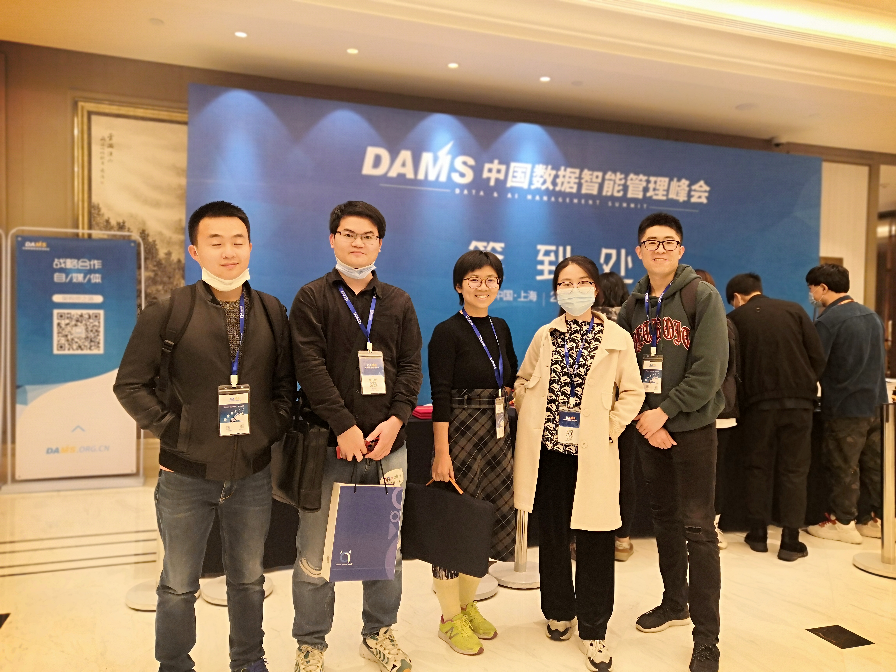

# 开源数据库 MySQL 在民生银行的应用实践

> 明生银行 项目经理 徐春阳

1. 为什么要用? 国家安全要求
2. 怎么用？ 自主
3. 经历总结 "平头哥"的精神、用于尝试、乐观时谨慎、"谨慎"时乐观、持续学习与研究
4. 开源收获： 资源、自主、效率、经验、能力、也收获了沉甸甸的责任
5. 使用与运维MySQL的模式

  - 利用及其有限的资源维护总行MySQL数据库系统；
  - 抓大放小，抓主要重要放次要，协同管理
  - 建设必要的运维工具/系统辅助运维
  - 制定使用规范、指导手册、知识库

6. "人工"智能

  - 标准监控频率漏掉间歇性/抖动性的现象
  - 再智能的监控难以分辨。。
  - 提高"人工"智能的方法就是持续学习与研究，透析数据库内部机制

# 如何构建数据库容器化PaaS

> 爱可生 资深架构师 徐阳

思考： 为何现在还有企业一点云数据库都不碰，选择使用这样PaaS平台去实现使用数据库的需求呢？

# 腾讯游戏大数据资产管理实践

> 腾讯游戏 大数据管理负责人 陈林荣

《数据资产管理实践白皮书4.0》

- 数据资产管理 DAM，Data Asset Management
- 元数据管理成熟度（IBM）

> 目前接触到的项目中，深切体会到"治理"的难度和重要性。

# 一个万亿规模数据库核心存储引擎的实现与应用

> 南京录信软件 CTO 母延年

# 从自研演进看分布式数据库

> 中国银联云计算中心 云组件总监 周家晶

# 字节跳动数据治理实践

> 今日头条 数据BP/数据治理负责人 任长延

给我比较大的触动是，字节跳动没有成立自己的大数据团队，而是将组件了一个虚拟的数据治理委员会，这种方式非常好。

之前参与到大数据团队的项目，更多的是做SQL工程师，如果完全去做其实就丢下自己原先的数据库管理技术了。他们的这种方式我喜欢，而且他们很高效率。
