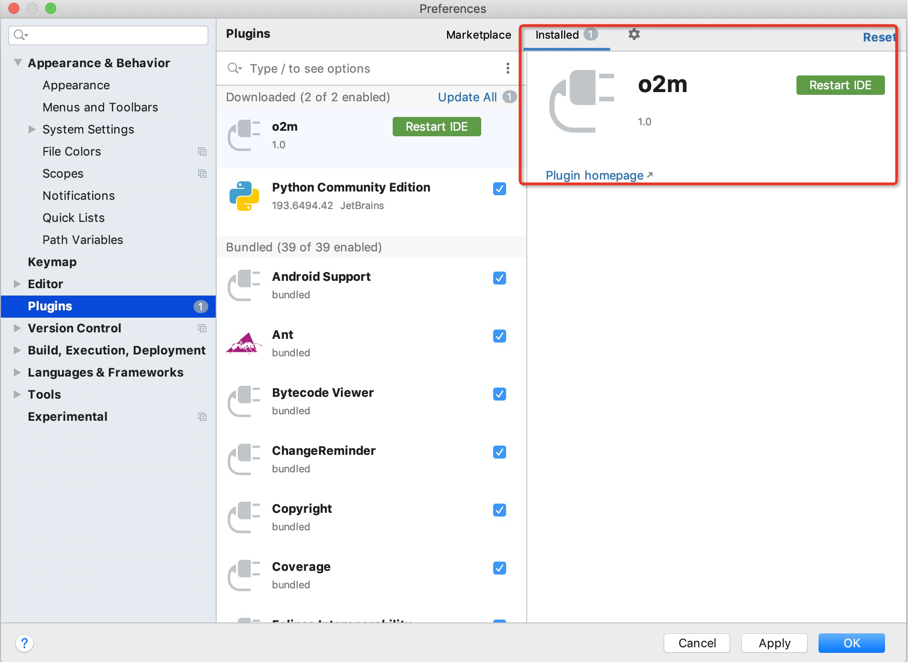
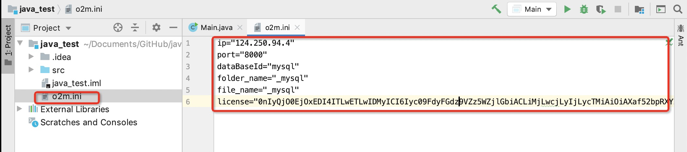
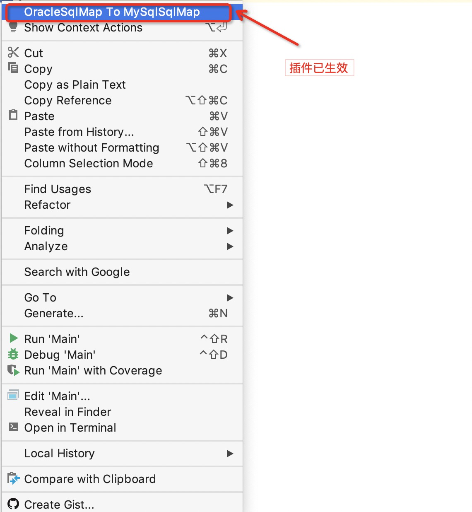

> [deeplus直播](https://v.zmengzhu.com/play/10164598?i=9042907)

很多企业都会依赖于云厂商或者其它已经去 Oracle 成功企业的帮助，真正凭借自己力量去 Oracle 的企业并不多，而陆金所恰恰就是凭借自己力量去 Oracle 的一家企业。

陆金所去 Oracle 实践历时 18 个月，将全站 90% 的数据库、数千张表从 Oracle 无缝切换至 MySQL，并且将在 6 月底前下线最后一台 Oracle。InfoQ 记者为此独家采访陆金所去 Oracle 实践的负责人王英杰，试图还原全过程。

# 陆金所的业务场景与去 Oracle 节奏

陆金所的去 Oracle 从 2018 年年中开始启动，涉及大几百个子系统，总数据量超过 PB 级。据王英杰介绍，“陆金所全部的研发和技术运营部门都参与了全站去 Oracle，至少有 500 人以上的开发、测试和运维工程师参与其中。”

如果从整个实践过程来看，陆金所去 Oracle 实践有三个比较关键的阶段：

* 一是通过边缘系统进行方案验证阶段；

* 二是去“O”自动化工具平台构建和优化阶段；

* 三是全自动化标准化去“O”落地阶段。

# 去 Oracle 方案的选择

与大多数企业去 Oracle 的原因相同，陆金所选择去 Oracle 也是因为原有的 Oracle 数据库架构扩展性很差，并且 Oracle 软件授权费用太高，无法支撑陆金所从 2013 年到现在交易量井喷式暴增下的业务需求。

替代方案选定了 MySQL，同时因为 MySQL 无法支撑 Oracle 的所有场景，还引入了 Elasticsearch、Redis、TiDB、HBase 等多种存储引擎。陆金所现在的数据库架构图如下：

陆金所对于去 Oracle 的核心诉求是在外部用户不感知的情况下，更换掉核心数据库。因此，陆金所研发了一套数据同步工具，以表为粒度，把 MySQL 作为 Oracle 的备库，实时同步 Oracle 的 DDL 和 DML 变更。同时在应用层实现 Oracle 和 MySQL 两套访问数据库的 DAO 层，以及开关模式的动态数据源，便于流量在 Oracle 和 MySQL 之间快速切换，在确保流量切换到 MySQL 之后，数据还能够反向向 Oracle 同步，保证数据一致性。

# 去 Oracle 的准备工作：按域拆分

为了顺利完成去 Oracle 工作，陆金所在 2016 年到 2018 年期间进行了数据库的按域拆分。其主要目的有三个，分别是：

细粒度拆分数据库、分片化，实现数据库容量的水平扩展；

应用解耦、服务化，让应用访问数据库的调用更加清晰和规范；

严禁应用跨域访问数据库，严禁数据库之间产生数据交互，从业务角度呈现出一个更加完善的数据库架构。

整个按域拆分过程中比较大的难点是大事务拆分和多表关联复杂查询。王英杰表示：“单库上原有的大事务拆分后是通过应用层的分布式事务机制在多库上实现，而单库上原有的多表关联复杂查询在拆分之后，是在应用层实现或在特殊场景中通过分布式存储引擎来支持。”

据了解，陆金所的数据库按域拆分主要有四个关键阶段：

第一阶段，应用改造实现逻辑拆分。按表为粒度对大库的数据库对象进行梳理，把每张表归属于不同的应用域。在应用层根据梳理的结果对操作表的代码进行改造，包括：拆分复杂的大查询、拆分庞大的事务以及将操作表的代码全部封装在属主应用的代码中，非属主应用无法直接操作表，通过调用服务接口的方式实现非常规范的应用访问数据库的调用链。

第二阶段，逻辑拆分完成后，以数据库的角度对应用改造的结果进行验证。在同一个物理库，使用逻辑 schema 的方式对数据库对象的授权进行调整，验证应用改造符合预期。

第三阶段是数据库迁移和实时同步。逻辑层拆分验证完成后，通过实时同步把待拆分的数据库对象实时同步到另外一个物理库。上述所有改造步骤对应用层无感知。

第四阶段是物理拆分和切换流量。源端和目标端保持实时同步后，在某个时间点推送配置并切换流量。整个过程最好有一套完善的自动化运维确保各个细节工作的无缝落地。流量切换操作，必须确保可以随时前滚和回滚。

以上就是陆金所去 Oracle 实践过程中的方案选择与准备工作。

# 去 Oracle 的准备工作：优化逻辑

在去 Oracle 之前，陆金所全站的金融 OLTP 业务场景都是由 Oracle 支撑的，而完成之后，全部的金融场景是由 MySQL 支撑，部分 Oracle 上的大事务也被优化成为了 MySQL 上的小事务。

值得注意的是，去 Oracle 完成之后，陆金所中 85% 的数据库查询请求都是简单的单表查询，15% 的关联查询都是比较简单的关联查询，而原先 Oracle 数据库中包含的复杂业务逻辑的多表关联也做了以下的优化：

* 被拆解成简单查询，在代码层实现部分复杂的关联逻辑；

* 通过陆金所的数据总线平台，把数据实时同步到 Elasticsearch 里，再实现复杂且高效的关联搜索；

* 部分在 Oracle 读库上支撑的复杂业务逻辑查询，通过数据总线平台同步到 TiDB ，在 TiDB 里实现复杂的关联查询。

# 去 Oracle 的落地工作：实时同步

在真正去 Oracle 之前，陆金所先把 MySQL 作为对外提供服务的 Oracle 备库挂在了 Oracle 后面。从 Oracle 到 MySQL 的异构数据库备库，不需要实例级的数据同步，可以按表为粒度进行数据的实时同步。

陆金所整个去 Oracle 实践主要是依赖于其内部的去 Oracle 平台来落地的，在去 Oracle 平台上勾选需要同步的 Oracle 表，数据迁移工作就会自动完成。据介绍，陆金所智能化去 O 平台横跨代码改造到上线切换以及后期运维的全流程自动化保障和落地，其中主要包含的工具有：

* Oracle SQL 代码自动转 MySQL SQL 代码工具

* O to M 数据字典转化和管理工具

* O to M 数据自动迁移和双写工具

* 去 O 流量一键切换

* 跨机房一键切换去 O 自愈工具

据王英杰介绍，在陆金所去 Oracle 平台中完成数据迁移的主要过程如下：

* 首先去 Oracle 平台会解析 Oracle 表结构，并转化成 MySQL 表结构部署到 MySQL 上。之后，Oracle 有任何数据字典变更，去 Oracle 平台都会对 MySQL 进行同步；

* 将 Oracle 的数据全量同步至 MySQL，因为 Oracle 库还在对外提供服务，所以会记录同步开始时间点，发生过变更的 Oracle 数据；

* 在全量同步完成后，解析 Oracle 的 redo log，把同步期间发生过变更的数据进行增量追平；

* 增量追平后，比对 Oracle 和 MySQL 每一笔记录和每一个字段的数据一致性，因为 Oracle 还处在不断更新中，去 Oracle 平台会使用增量补偿重试的方式不断对记录进行一致性校验；

* 数据完全追平且校验一致后，去 Oracle 平台会开始尝试解析 MySQL binlog，建立从 MySQL 到 Oracle 的数据同步通道；

* 因为 Oracle to MySQL 和 MySQL to Oracle 的双向数据同步链路都会被自动建立起来，为了防止数据回流，必须区分好是应用层写入的数据还是同步框架写入的数据，确保一份数据无论在 Oracle 还是 MySQL 提交，都会同步到对端，且仅写入一次。

据悉，陆金所核心业务去 Oracle 的时间大约是 6 个月，期间会出现应用中部分表读写流量在 Oracle、部分表读写在 MySQL 的中间状态，而这时陆金所的业务系统还会有大量的功能版本不断上线，如何平衡业务系统的版本上线和去 Oracle 的数据迁移呢？

王英杰表示：“为了降低业务功能改造和去 Oracle 架构改造之间高频交叉上线的风险，陆金所自研的 Bettle 系统实现了业务版本和去 Oracle 版本并行推进，且互相透明的重要功能。”

迁移完成之后，陆金所每 3 个月会通过数据库一键切换平台把全站数据库写库更换一次，一键切换平台在 180 秒完成全站数百套数据库的跨机房切换后，数千张表的 O 和 M 双写同步会自动重建，并确保数据一致性和完整性。

作为去 Oracle 的实践者，王英杰也分享了他在整个实践过程中获得的感悟和经验，希望能对之后想要去 Oracle 的企业有所帮助。

对于严苛的金融系统来说，去 Oracle 是个非常复杂的系统工程，涉及到开发、测试、架构和 DBA 等几乎全部技术部门的通力合作；

整个去 Oracle 改造过程需要在各个阶段都总结出一套完善的方法论，确保各个细节改造工作能稳妥落地；

需要有一套完善的去 Oracle 工具平台来落地整套方法论，让开发、测试和 DBA 在上面开展去 Oracle 工作，通过工具无缝衔接好这些团队在去 Oracle 改造中的协同工作，通过工具确保从代码改造、压测到数据迁移、流量切换等横跨多个团队、长周期的工作风险可控，效果如期。

以上就是今天的内容，希望对你有所帮助。

# 我的笔记

## SQL装换工具测试

> [SQL转换工具](https://www.lufaxholding.com/zh-cn/solution/detail/solution/luDBGate/sqlmapo2m/index.html) ：SQL转换是陆金所去商业数据库的过程中，用于应用开发的异构数据库间的SQL转换的工具。

### 安装

在官网下载后，打开《O2M SQL智能转化工具插件使用说明_v1.3.pdf》帮助文档，根据帮助进行安装。

Mac 下插件安装

1. 打开 IDEA，选择 perferences – Plugins - Install Plugin from Disk
2. 选择下载的文件 sqlreview.zip
3. 安装完成后，重启 IDEA 即可
4. 复制配置文件到项目更目录下

### 使用说明

1. 打开 IDEA，选择并打开具体某个 Mybatis 的 SQL Mapper 的配置文件 XML
2. 在打开的 XML 内，点击右键，选择“OracleSqlMap to MysqlSqlMap”
3. 等待数秒后，会获得转换后的 SQL Mapper 的 XML 文件

### 什么是 [MyBatis](https://mybatis.org/mybatis-3/zh/index.html)？

MyBatis 是一款优秀的持久层框架，它支持自定义 SQL、存储过程以及高级映射。MyBatis 免除了几乎所有的 JDBC 代码以及设置参数和获取结果集的工作。MyBatis 可以通过简单的 XML 或注解来配置和映射原始类型、接口和 Java POJO（Plain Old Java Objects，普通老式 Java 对象）为数据库中的记录。

