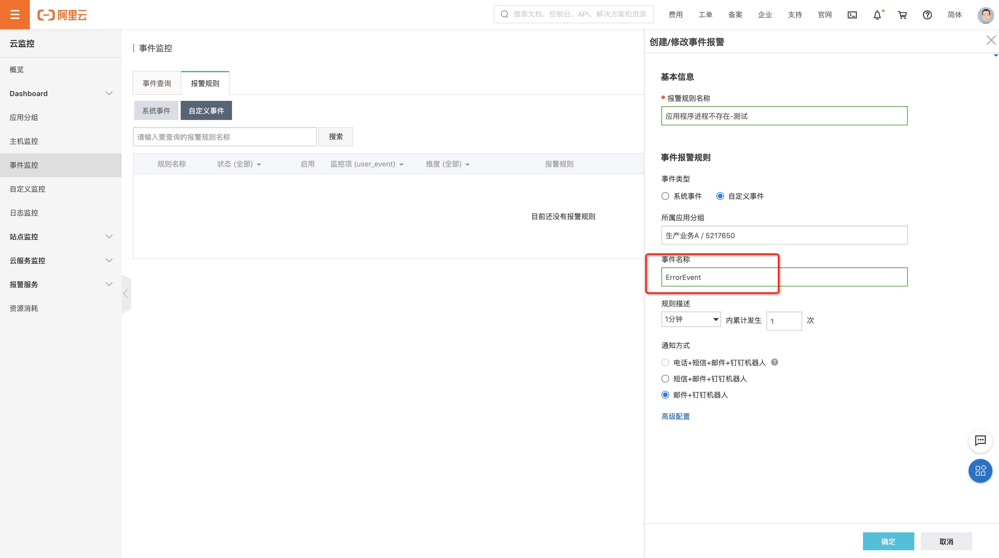
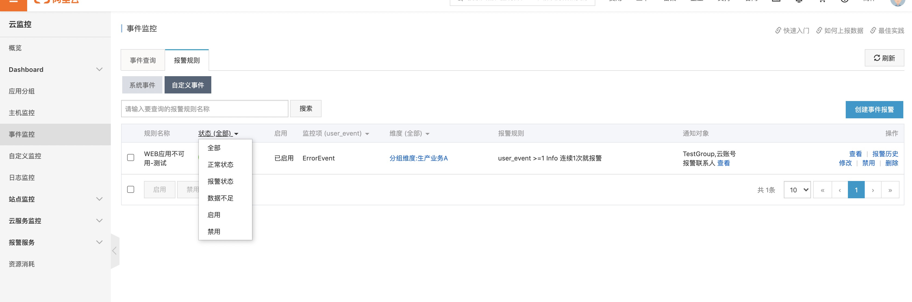
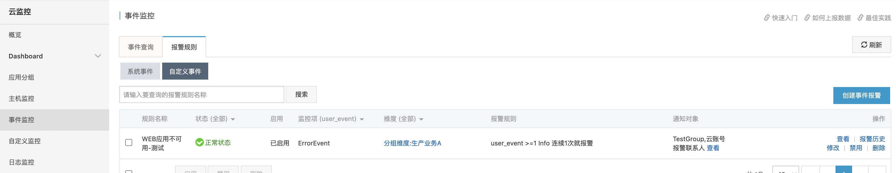

# 功能概览

本文编写时，阿里云的该功能更新时间：2020-07-01 17:59:01

事件监控功能为您提供上报自定义事件的接口，方便您将业务产生的异常事件采集上报到云监控，通过对上报的事件配置报警规则来接收报警通知。

## 使用限制

```
上报自定义事件监控数据的使用限制如下：
```

- 单个阿里云账号的QPS限制为20。
- 单次最多上报100个事件。
- 单次最多上报500KB数据。

## 上报方式

```
云监控为您提供的自定义事件监控数据的上报方式如下：
```

- [通过Java SDK上报事件监控数据（推荐）](https://help.aliyun.com/document_detail/171419.html#concept-2538347)
- [通过HTTP上报事件监控数据](https://help.aliyun.com/document_detail/171420.html#concept-2538351)
- [通过命令行（CLI）上报事件监控数据](https://help.aliyun.com/document_detail/171421.html#concept-2538353)

# 授权

云监控支持使用阿里云账号或RAM用户上报事件监控数据。当RAM用户使用AccessKey上报监控数据时，需要授权云监控的管理权限。操作方法如下：

1. 使用阿里云账号登录[RAM控制台](https://ram.console.aliyun.com/)。

2. 创建RAM用户。

   操作方法请参见[创建RAM用户](https://help.aliyun.com/document_detail/93720.html#task-187540)。

3. 为RAM用户创建访问密钥。

   操作方法请参见[为RAM用户创建访问密钥](https://help.aliyun.com/document_detail/116401.html#task-188766)。

4. 为RAM用户授权（AliyunCloudMonitorFullAccess）。

   操作方法请参见[为RAM用户授权](https://help.aliyun.com/document_detail/116146.html#task-187800)。

## 阿里云命令行工具

安装和配置阿里云命令行（CLI）工具，操作方法请参见[阿里云CLI](https://help.aliyun.com/document_detail/110244.html?spm=a2c4g.11186623.2.18.2dae19b8EGun5J)。

```bash
wget https://aliyuncli.alicdn.com/aliyun-cli-linux-latest-amd64.tgz?spm=a2c4g.11186623.2.12.35cc7dbf1kFtRY&file=aliyun-cli-linux-latest-amd64.tgz
tar xf aliyun-cli-linux-latest-amd64.tgz?spm=a2c4g.11186623.2.12.35cc7dbf1kFtRY
cp aliyun /usr/local/bin
```

## 上报监控数据

使用PutCustomEvent接口上报事件监控数据，请参见[PutCustomEvent](https://help.aliyun.com/document_detail/115012.html#doc-api-Cms-PutCustomEvent)。

示例如下：

```
aliyun --region cn-shanghai --access-key-``id` `xxx --access-key-secret xxx cms PutCustomEvent --EventInfo.1.EventName ErrorEvent --EventInfo.1.Content helloworld --EventInfo.1.Time ``"20171013T170923.456+0800"` `--EventInfo.1.GroupId 0
```

## 命令参数详解

| 参数                      | 解释               |
| :------------------------ | :----------------- |
| 参数                      | 解释               |
| `--region`                | 地域               |
| `--access-key-id`         | AccessKey ID       |
| `--access-key-secret`     | AccessKey Secret   |
| `cms`                     | CMS 云监控         |
| `PutCustomEvent`          | 上传自定义事件     |
| `--EventInfo.1.EventName` | 事件名称           |
| `--EventInfo.1.Content`   | 事件描述           |
| `--EventInfo.1.Time`      | 事件发生的时间     |
| `--EventInfo.1.GroupId`   | 事件所在应用分组ID |

特别注意：

```
1. accesskey和secretkey用于身份识别，一定注意RAM的权限是否已经授予了AliyunCloudMonitorFullAccess权限；为了更安全，此处可以改为使用 RAM role。
2. EventInfo.Num.xxxx: N的含义：可以一次上报多个事件
3. GroupId:云监控的应用分组ID，可以从应用的角度来对事件进行归类, 可以在云监控的应用分组列表中查看分组ID。
4. 上报事件：每一个事件都包含事件的名称与事件的内容，名称用于识别事件，内容是事件的详细信息，支持全文搜索。
上报事件监控数据成功后，返回状态码200。
{
	"Code": "200",
	"Message": "success",
	"RequestId": "45A8F6E2-F8B6-4EB4-AC9A-45A6D15D43BC"
}

```

## 错误码说明

当通过命令行上报事件监控数据时，返回的错误码如下表所示。

| 错误码 | 描述                       |
| :----- | :------------------------- |
| 400    | 客户端请求中的语法错误。   |
| 403    | 校验失败、限速、没有授权。 |
| 500    | 服务器内部错误。           |

# 操作明细





```bash
[root@fms ~]# wget https://aliyuncli.alicdn.com/aliyun-cli-linux-latest-amd64.tgz?spm=a2c4g.11186623.2.12.35cc7dbf1kFtRY&file=aliyun-cli-linux-latest-amd64.tgz
[1] 2422
[root@fms ~]# --2020-08-03 10:30:34--  https://aliyuncli.alicdn.com/aliyun-cli-linux-latest-amd64.tgz?spm=a2c4g.11186623.2.12.35cc7dbf1kFtRY
正在解析主机 aliyuncli.alicdn.com (aliyuncli.alicdn.com)... 101.37.183.187, 101.37.183.186
正在连接 aliyuncli.alicdn.com (aliyuncli.alicdn.com)|101.37.183.187|:443... 已连接。
已发出 HTTP 请求，正在等待回应... 200 OK
长度：14313391 (14M) [application/x-gtar-compressed]
正在保存至: “aliyun-cli-linux-latest-amd64.tgz?spm=a2c4g.11186623.2.12.35cc7dbf1kFtRY”
 
100%[================================================================================================================================================>] 14,313,391  20.6MB/s 用时 0.7s
 
2020-08-03 10:30:36 (20.6 MB/s) - 已保存 “aliyun-cli-linux-latest-amd64.tgz?spm=a2c4g.11186623.2.12.35cc7dbf1kFtRY” [14313391/14313391])
 
 
[1]+  完成                  wget https://aliyuncli.alicdn.com/aliyun-cli-linux-latest-amd64.tgz?spm=a2c4g.11186623.2.12.35cc7dbf1kFtRY
[root@fms ~]# ll
总用量 28748
-rw-r--r-- 1 root root 14313391 7月  29 12:25 aliyun-cli-linux-latest-amd64.tgz?spm=a2c4g.11186623.2.12.35cc7dbf1kFtRY
drwxr-xr-x 2 root root     4096 6月   5 2019 dingding
drwxr-xr-x 7 root root     4096 4月  14 2019 flask-admin
-rw-r--r-- 1 root root 15108729 5月  13 2019 grafana-6.1.6-1.x86_64.rpm
drwxr-xr-x 2 root root     4096 5月  17 2019 jinxue
[root@fms ~]# tar xf aliyun-cli-linux-latest-amd64.tgz?spm=a2c4g.11186623.2.12.35cc7dbf1kFtRY
[root@fms ~]# ll
总用量 60812
-rwxr-xr-x 1 root root 32830753 7月  29 12:24 aliyun
-rw-r--r-- 1 root root 14313391 7月  29 12:25 aliyun-cli-linux-latest-amd64.tgz?spm=a2c4g.11186623.2.12.35cc7dbf1kFtRY
drwxr-xr-x 2 root root     4096 6月   5 2019 dingding
drwxr-xr-x 7 root root     4096 4月  14 2019 flask-admin
-rw-r--r-- 1 root root 15108729 5月  13 2019 grafana-6.1.6-1.x86_64.rpm
drwxr-xr-x 2 root root     4096 5月  17 2019 jinxue
[root@fms ~]# cd aliyun
-bash: cd: aliyun: 不是目录
[root@fms ~]# cp aliyun /usr/local/bin
[root@fms ~]# aliyun --region cn-shanghai --access-key-id xx --access-key-secret xx cms PutCustomEvent --EventInfo.1.EventName ErrorEvent  --EventInfo.1.Content 我的应用不可用-测试  --EventInfo.1.Time `date "+%Y%m%dT%H%M%S.000+0800"`  --EventInfo.1.GroupId 5217650
{
    "Code": "200",
    "Message": "success",
    "RequestId": "76335521-0F92-4EF1-989F-889478E63D98"
}

[root@fms monitor]# cat web_monitor.sh
#!/bin/bash
 
accessid=xx
accesssecret=xxx
region=cn-shanghai
EventName=大宝的进程监控测试
Content=我的应用不可用-测试
GroupId=5217650
 
a=`ps -ef|grep "[p]ython /alidata/fms/app.py"`
if [[ $? -eq 0 ]];then
    exit
else
    aliyun --region ${region} --access-key-id ${accessid} --access-key-secret ${accesssecret} cms PutCustomEvent --EventInfo.1.EventName ${EventName} --EventInfo.1.Content ${Content} --EventInfo.1.Time `date "+%Y%m%dT%H%M%S.000+0800"`  --EventInfo.1.GroupId ${GroupId}
fi
 
[root@fms monitor]# bash -x web_monitor.sh
+ accessid=LTAIjptFuxvL0wUF
+ accesssecret=MQ25zOIocyHx9jo7UCMqCSmb9qmTh7
+ region=cn-shanghai
+ EventName=大宝的进程监控测试
+ Content=我的应用不可用-测试
+ GroupId=5217650
++ ps -ef
++ grep '[p]ython /alidata/fms/app.py'
+ a='root     27810 19071  1 6月22 ?       16:20:17 /usr/bin/python /alidata/fms/app.py'
+ [[ 0 -eq 0 ]]
+ exit
 
 
[root@fms monitor]# crontab -l
*/1 * * * * /usr/bin/bash /alidata/monitor/web_monitor.sh
```

# 实战总结



有利于运维侧的方法应该是使用aliyun-cli工具来上报事件。

第一步：阿里云CMS控制台——“事件监控”——“告警规则”——“自定义事件”，创建用于进程丢失后的上报事件名称和告警触发的规则；

第二步：登陆服务器，准备监控上报的Bash脚本，模版参考如下：

Demo

```bash
#!/bin/bash
 
accessid=xx
accesssecret=xxx
region=地域
EventName=事件名称-要与第一步中创建的事件名一致
Content=事件内容描述
GroupId=自定义事件归属的业务分组ID
 
a=`ps -ef|grep "[p]ython /alidata/fms/app.py"`
if [[ $? -eq 0 ]];then
    exit
else
    aliyun --region ${region} --access-key-id ${accessid} --access-key-secret ${accesssecret} cms PutCustomEvent --EventInfo.1.EventName ${EventName} --EventInfo.1.Content ${Content} --EventInfo.1.Time `date "+%Y%m%dT%H%M%S.000+0800"`  --EventInfo.1.GroupId ${GroupId}
fi
```


