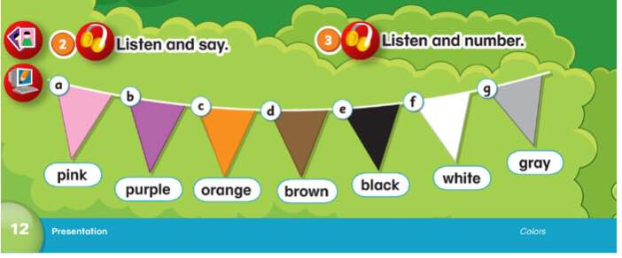
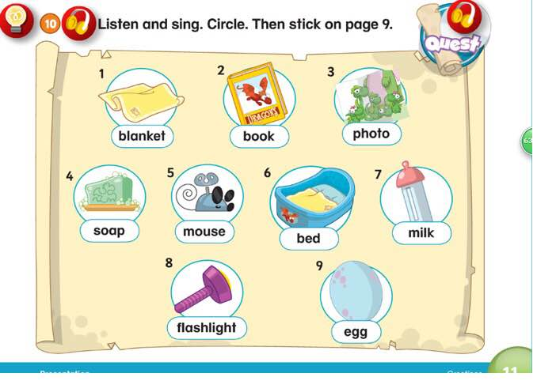
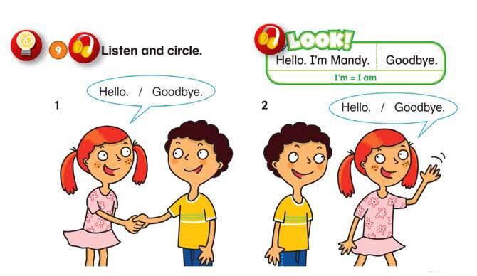
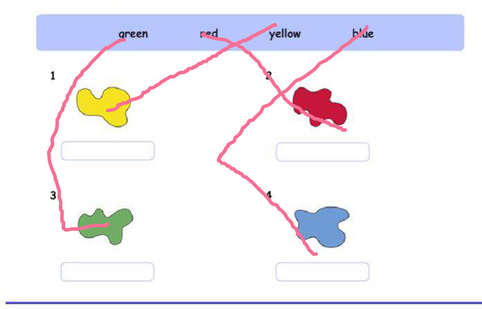

# 课程内容

Dear all parents ：
    今天复习了上次课的主要内容，从复习结果来看 是要比上次好很多的！家长在家带孩子复习是可以取得明显的进步哒
  新学了更多的颜色以及词汇，对话，同样在家做好复习！
需要孩子们掌握
-What's your name？
1- My name is ____.
2- I am ____.
3- I'm____.
4-____.
孩子们对第一种回答还是比较熟悉的，后面的也要知道喔

# 课后作业

* [x] 让孩子将颜色和对应的单词连线起来
* [x]  完成字母A的书写作业✍️ 
* [x] 拍摄孩子在家练习新学颜色和单词的视频发到群里
* [x] 完成配音并发送到群里《[14 What Color is It?](https://open.weixin.qq.com/connect/oauth2/authorize?appid=wx2a1c1b5d965c76d6&redirect_uri=https%3A%2F%2Fchildren2.qupeiyin.com%2Findex.php%3Fm%3Dhome%26c%3DActivity%26a%3Dchildshare_video%26course%3DMDAwMDAwMDAwMLCtyGOBsciX%26uid%3DMDAwMDAwMDAwMLCHrqyCe76Ur6eacg&response_type=code&scope=snsapi_base&state=37f20d1b587de38d8cdd989f772245e2#wechat_redirect)》

