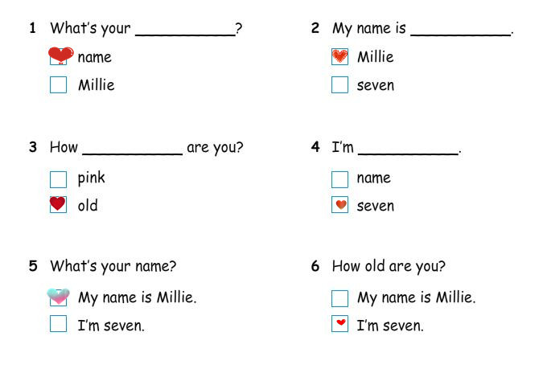
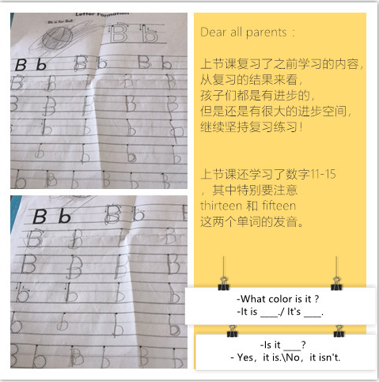

# 课程内容

```bash
Dear all parents ： 
    上节课复习了之前学习的内容，从复习的结果来看，孩子们都是有进步的，但是还是有很大的进步空间，继续坚持复习练习！
    上节课还学习了数字11-15，其中特别要注意 thirteen 和 fifteen 这两个单词的发音。另外还练习了

-What color is it ？
-It is ____./ It's ____. 

-Is it ____？
Yes，it is./ No，it isn't.

下节课还是会复习上节课的主要内容并且完成第一单元的全部学习内容！
```

# 课后作业

* [x] 让孩子们勾选出正确的答案，对他们来说有一点点难度
* [x] 完成字母B的书写作业✍️ 
* [x] 拍摄孩子在家练习新学颜色和单词的视频发到群里
* [x] 完成配音并发送到群里 [会说话的鸟](https://open.weixin.qq.com/connect/oauth2/authorize?appid=wx28c200a5717bd714&redirect_uri=https%3A%2F%2Fchildren.qupeiyin.com%2Findex.php%3Fm%3Dhome%26c%3DActivity%26a%3Dchildshare_video%26course%3DMDAwMDAwMDAwMLGdzGaCi9Ch%26uid%3DMDAwMDAwMDAwMLCHrqyCe76Ur6eacg&response_type=code&scope=snsapi_base&state=e38fc1131b92797628e3190c8eedb4f2#wechat_redirect)




