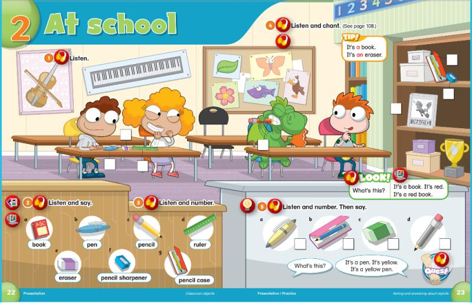
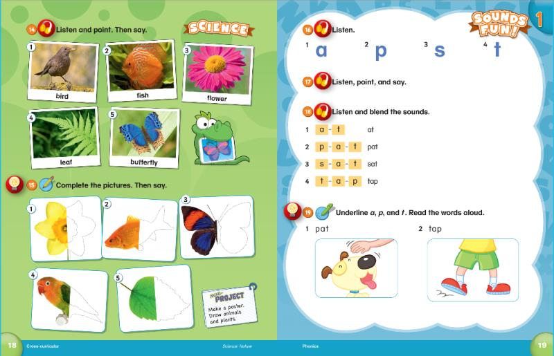
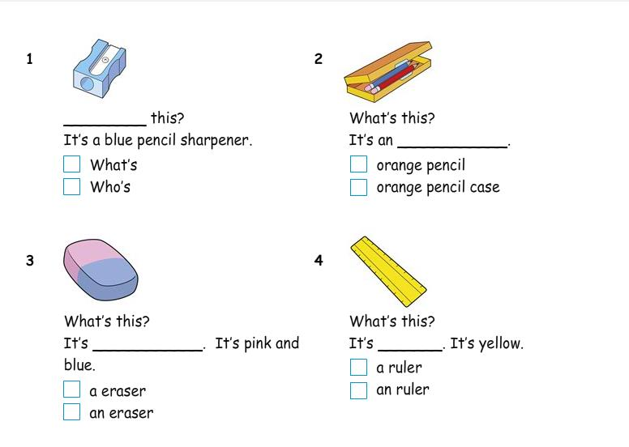
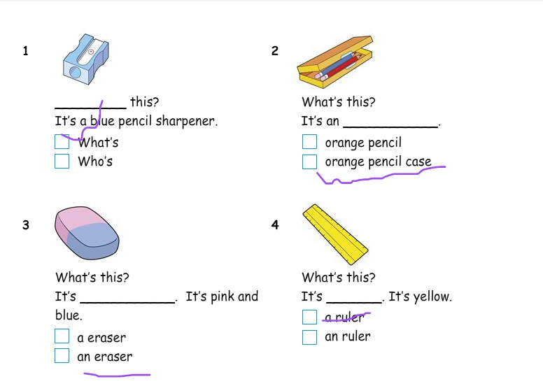

# 课程内容

```bash
Dear all parents：
    上节课我们结束了第一单元的学习，进入了第二单元的学习！
单词要花点时间记一下哈！
练习对话
-What’s this？
-It's a/an____. 
```




<iframe height=498 width=510 src='https://player.youku.com/embed/XNDgxMTIyMjgxMg==' frameborder=0 'allowfullscreen'></iframe>

# 课后作业

* [x] 让孩子们勾选出正确的答案
* [x] 完成字母C的书写作业✍️ 
* [x] 记录下孩子练习第二单元的视频周日前分享到群
* [x] 完成配音并发送到群里《[2 What's this](https://open.weixin.qq.com/connect/oauth2/authorize?appid=wx2a1c1b5d965c76d6&redirect_uri=https%3A%2F%2Fchildren2.qupeiyin.com%2Findex.php%3Fm%3Dhome%26c%3Dshow%26a%3Dshare%26sharefrom%3Doneself%26id%3DMDAwMDAwMDAwMLCduqyAsdCUsN2EZw&response_type=code&scope=snsapi_base&state=b0437f671cc62c3b77861f9e6cab4967#wechat_redirect）




