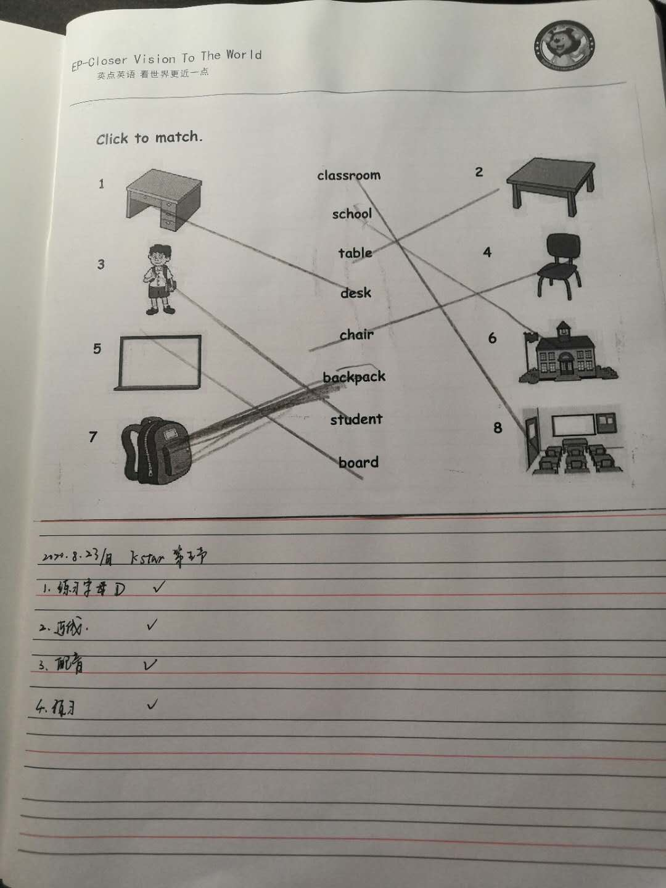

# 课程内容

```bash
Dear all parents：
    上节课我们结束了第一单元的学习，进入了第二单元的学习！
单词要花点时间记一下哈！
练习对话
-Are they blue？
-Yes,They are.
-No,they aren't.

-What color are they?
-They're white. 
```
# 课后作业

* [x] 连线
* [x] 完成字母D的书写作业✍️ 
* [x] 记录下孩子练习第二单元的视频周日前分享到群
* [x] 完成配音并发送到群里 [1 school](https://children2.qupeiyin.com/index.php?m=home&c=show&a=share&sharefrom=oneself&id=MDAwMDAwMDAwMLCdumKAsciZsM2irg）




