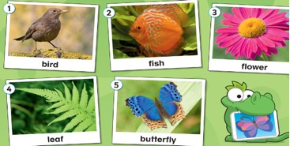
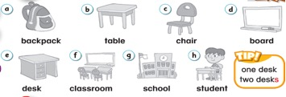
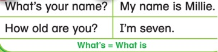
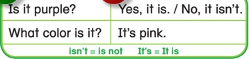
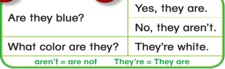
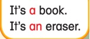

# 课程内容

```bash
Dear all parents ：
  我们总体复习了第一第二单元主要内容，
  大部分孩子表现还是非常棒哒，个别同学要加强复习哈！
  下节课也就是本周日考试哈[抱拳]
```

# 课后作业

- [x] 完成配音作业[]()

## 复习内容


# K-Star考试复习资料



考试时间:

- 9月6日 周日 9:00 -11:00

考试形式:

- 口试-- 外教一对一测试单词阅读和对话。
- 笔试-- 完成试卷。
- 听力-- 完成听力试卷。

分值: 口试100分，笔试100分，听力100分 总分300分。



## 1.26个英文字母大小写的区分

> 提示：笔试会有字母大小写连线题。

## 2.课本第一第二单元重点词汇认读

### 颜色


### 数字


### 动植物



### 学校



### 乐器


## 3.课本第一第二单元重点语法

### 打招呼




### 颜色





### 学校




## 4.Daily talk 口语对话练习

```sample
1)
What’s your name?
My name is ______. / I am_____.

2)
How old are you?
I am _____ years old.

3)
How are you?
I’m good/ great/ wonderful, ... thank you.

4)
What’s this?/ What’s that?
It’s a/an _____.

5)  
What color is it?
It is/ It’s _____.

6)   
Is it _____?
Yes, it is./ No, it isn’t.

7)   
What color are they?
They are/ They’re _____.

8)  
Are they _____?
Yes, they are./ No, they aren’t.
```
