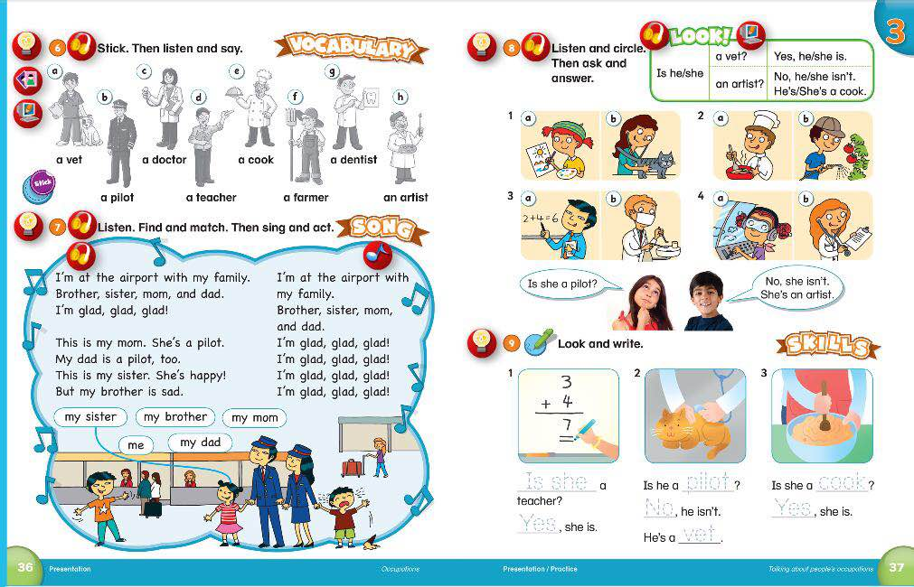
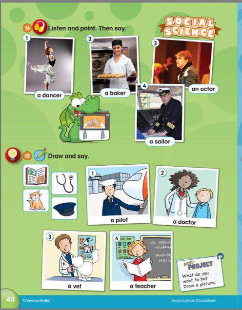

# 课程内容

```bash
Dear all parents：
  昨天我们复习了36-37页，新学了40页内容！
  单词对孩子们来说越来越难了，如果不多复习练习，很难全都掌握。
  语法内容我们对a/an 的用法区别进行了复习练习，我们班10个同学 目前有3位同学不能掌握这个语法知识点。
  发的练习试卷一定要让孩子自己完成哈！

  随着课程的深入后面会有更多的语法内容，一定要复习单词语法功课，不然后面很难跟上！大家一起加油
```

# 课后作业

- [x] 完成课本配套Workbook第三单元练习作业
- [x] 完成字母书写✍️作业`G`；
- [x] 完成练习试卷;
- [x] 完成配音作业[Unit12 Job](https://children.qupeiyin.com/index.php?m=home&c=show&a=share&sharefrom=oneself&id=MDAwMDAwMDAwMLCdumeBe67csbeQaQ)

## 复习内容




