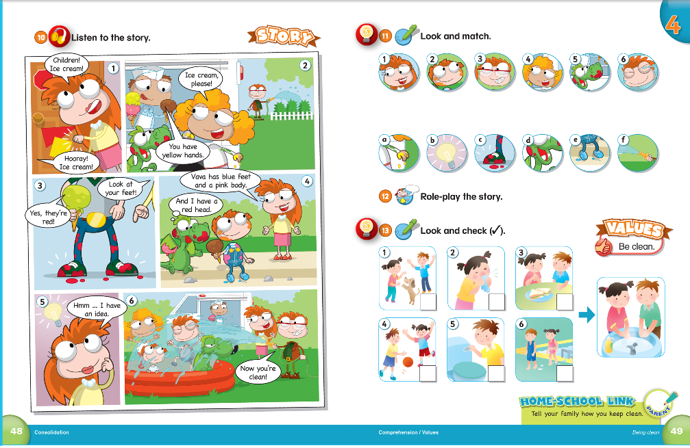
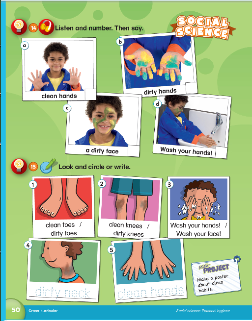

# 课程内容

```bash
Dear all parents：
  我们复习了第四单元44-45页，新学了第46-47页内容。
  第四单元的单词孩们记的还是不错的，新学的词汇在家也要做好复习。

除此之外还需要了解 Have 和 Has 都表示“有”
要清楚Have 和 Has 的基本用法区别。

🌟 have用于👇 I We You They
第一人称 I （我）
I have a dog.

we （我们）
We have a good day.

第二人称 you （你）
You have a nice sister.

第三人称复数 they（他/她们）
They have many pets.


🌟has 用于👇 He She It
第三人称单数 he，she，it

He has an eraser.

She has a little brother.

It has four legs.

口诀；
你有   我有  用have
You have /  I have

我们有   他们有  用have
we have/  they have

她他它有  用has
She/ He/ It   has
```

# 课后作业

- [x] 完成第46页单词复习视频作业；
- [x] 完成字母书写✍️作业 `J`；
- [x] 完成试卷练习作业；
- [x] 完成配音作业[U10 She has a green dress](https://children.qupeiyin.com/index.php?m=home&c=show&a=share&sharefrom=oneself&id=MDAwMDAwMDAwMLCdxKqBoabdsLeArQ)

## 复习内容





