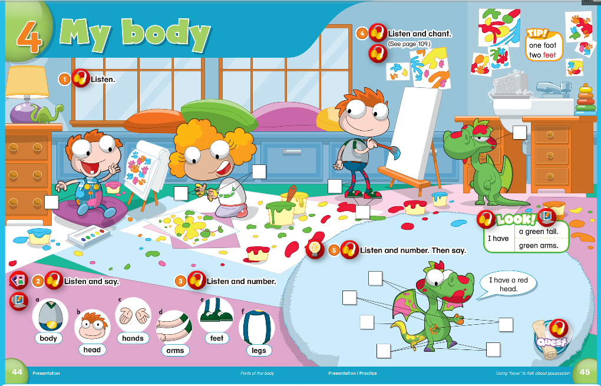
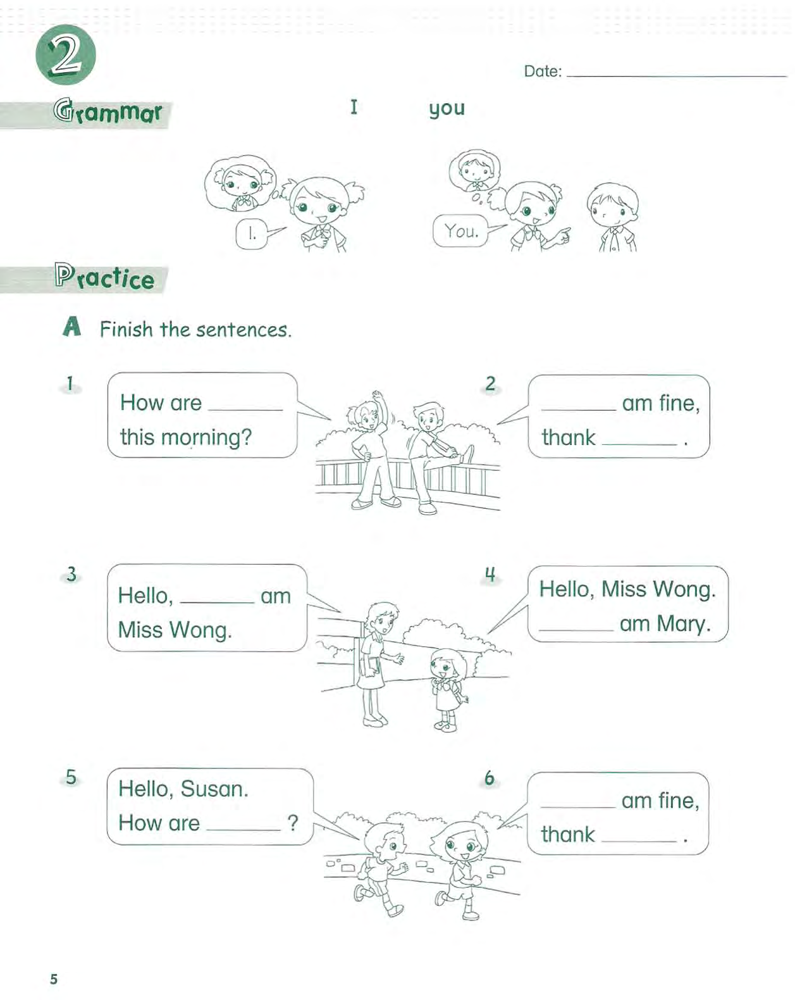
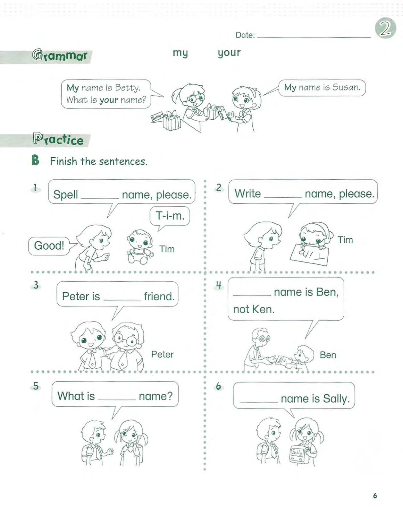
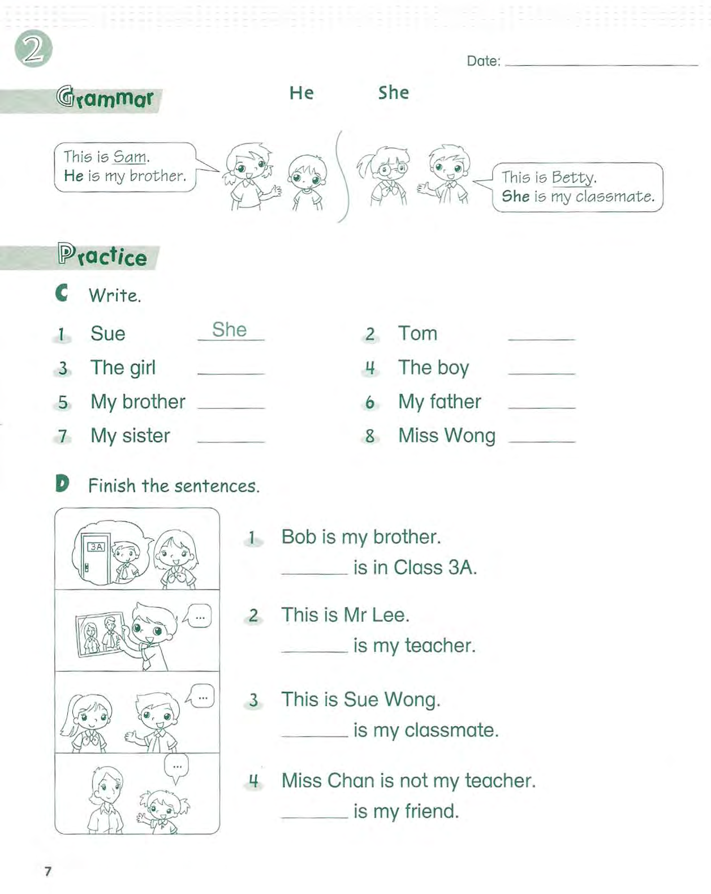

# 课程内容

```bash
Dear all parents：
我们复习了第三、第四单元，从复习结果来看，孩子们的词汇和语法是有进步哒！
下节课周日就要考试咯，在家将三四单元的内容好好看看，加油！
```

# 课后作业

- [x] 模拟考试第三、第四单元
- [x] 完成试卷练习作业P5-7
- [x] 拍摄复习视频P
- [x] 完成配音作业[who's in a family](https://children.qupeiyin.com/index.php?m=home&c=Activity&a=childshare_video&course=MDAwMDAwMDAwMLCdrmKCi7qW&uid=MDAwMDAwMDAwMLCHrqyCe76Ur6eacg)

## 复习内容





## 试卷内容







