# 君君老师

    最近我们孩子的角色游戏慢慢进入状态了，但也有几个孩子沉迷于积木游戏无法自拔，我们希望家长们在家里也可以和孩子们一起玩角色扮演游戏，
    和孩子多互动，也可以拓宽思路，可以做现实生活中不能做的，比如仙女啊，公主啊，小士兵等等

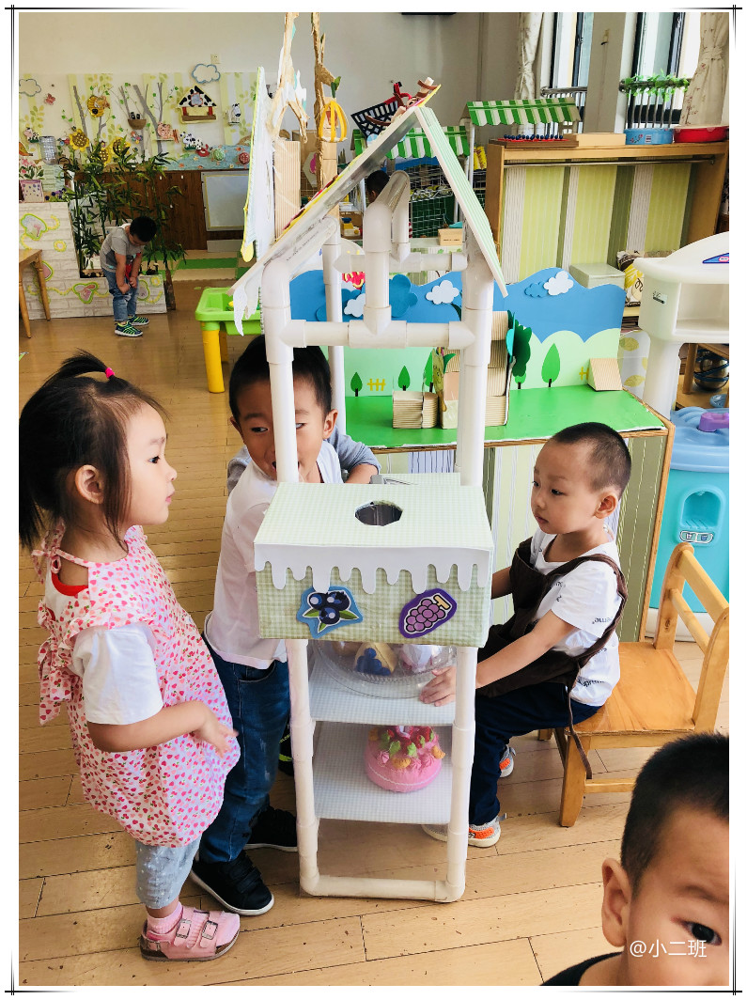

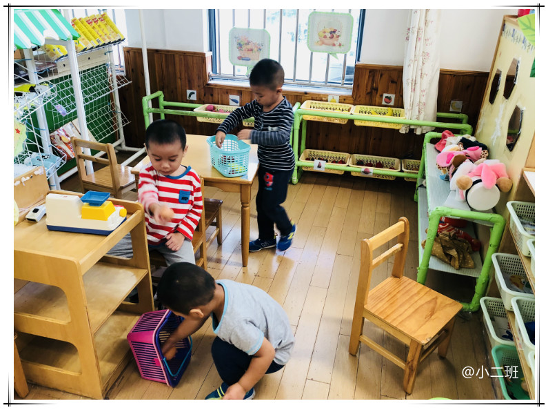
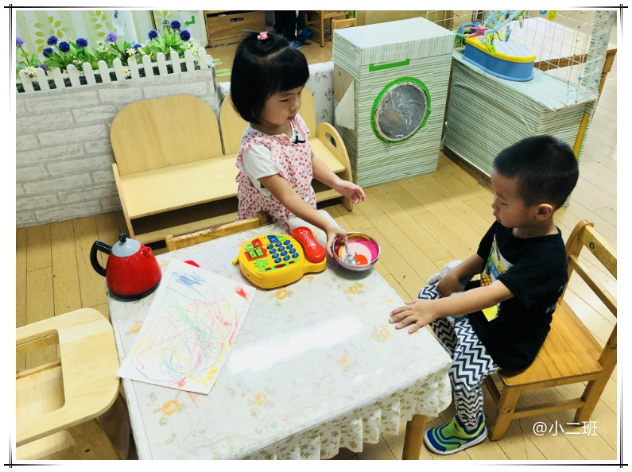
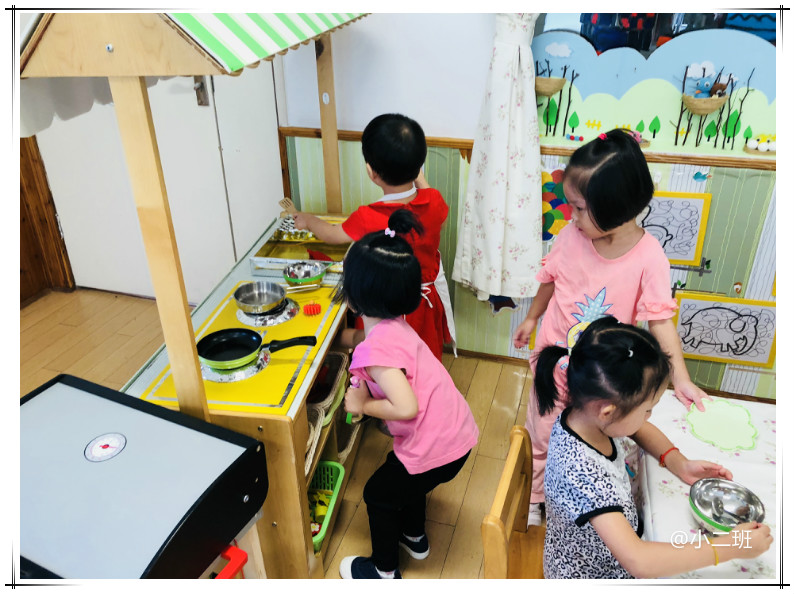
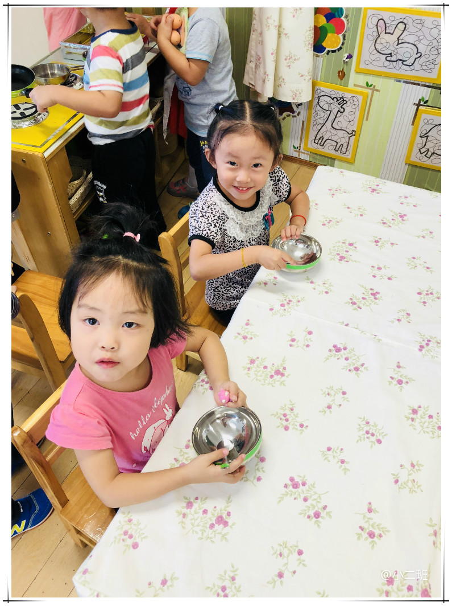
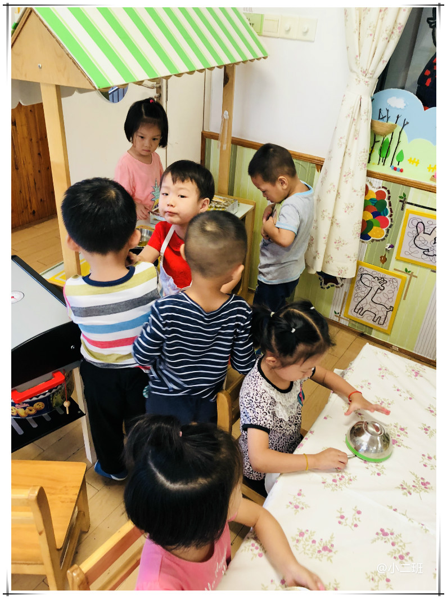
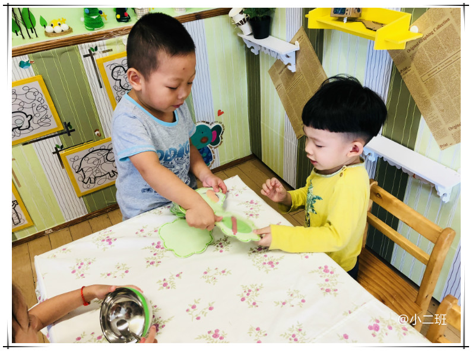
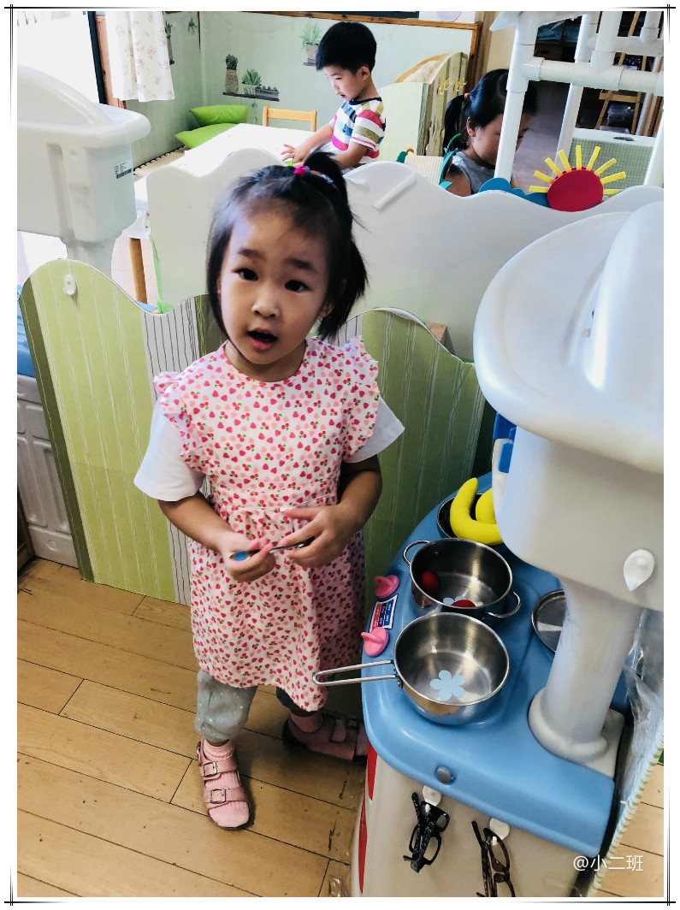
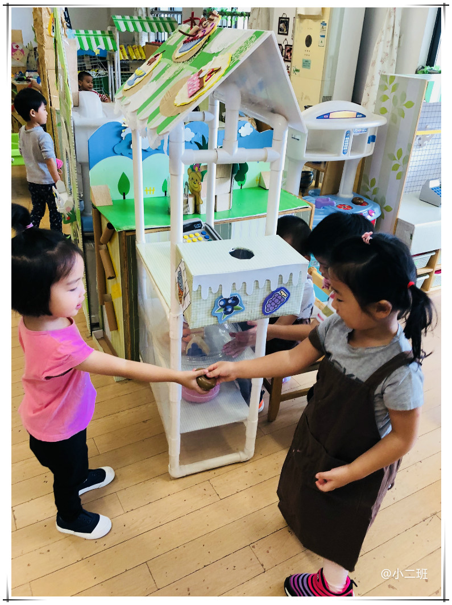
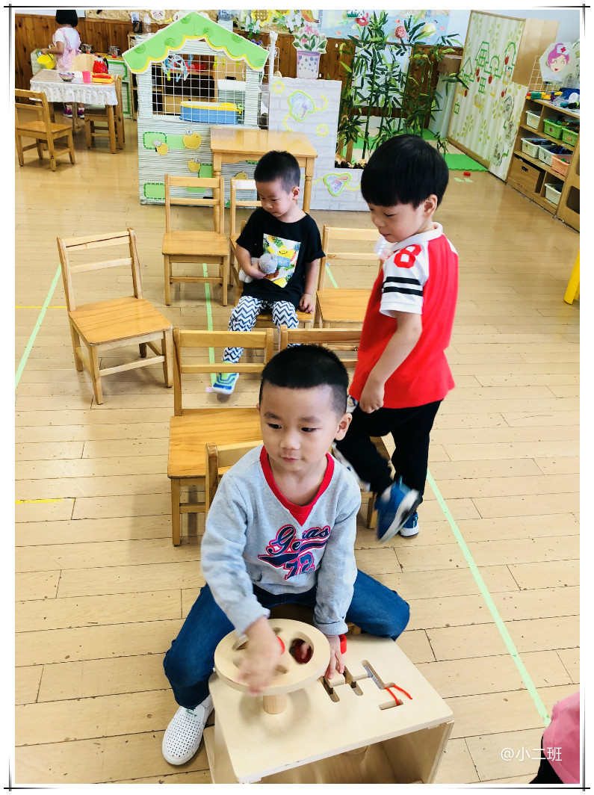
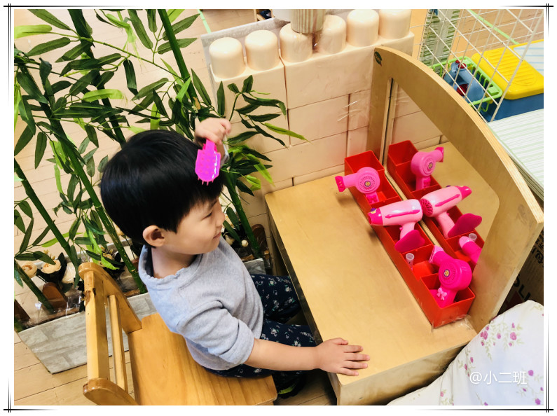
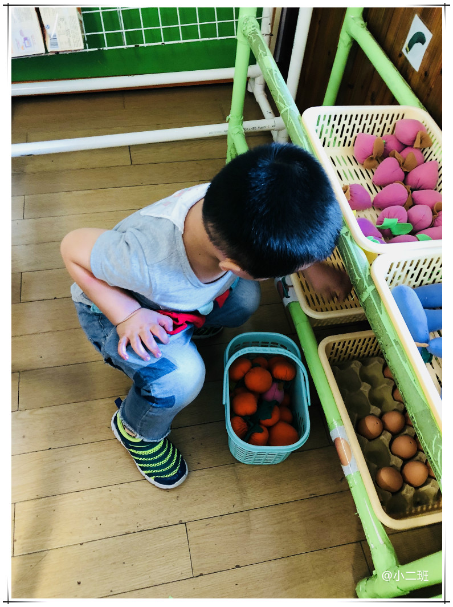

# 君君老师

今天我们还认识了五星红旗，知道自己是一个中国人，我告诉他们过几天要给祖国妈妈过生日了，要休息七天，有孩子还反驳说不行，休息三天就够了，哈哈我还告诉他们祖国妈妈会请他们吃生日蛋糕的

午餐前还额外学了一首歌，送给我们的祖国妈妈

[儿歌-祖国祖国我爱你](https://music.163.com/#/song?id=498555737&market=baiduqk)
