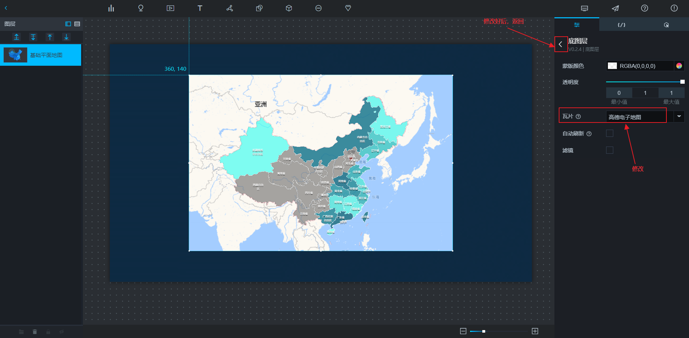
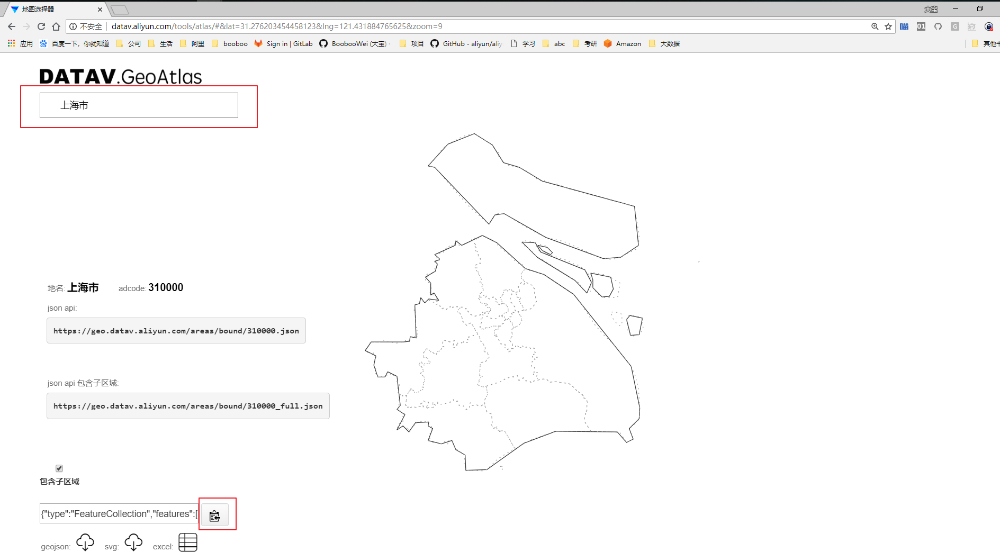
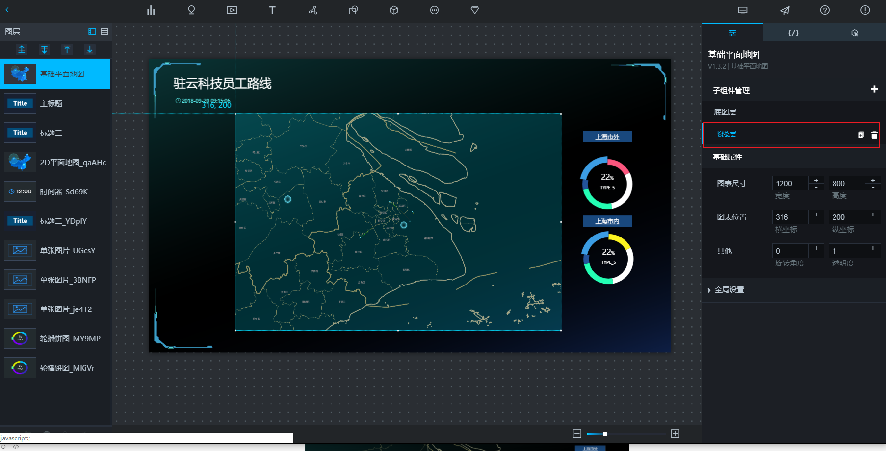

## 学习目标

通过基础平面图显示：
1. 上海市
2. 上海某公司
3. 驻云某公司员工路线
4. 从公司到每一位员工住址的路线

## 操作步骤

### 第一步 选择基础平面地图组件


### 第二步 修改底图层的瓦片属性——高德电子地图




### 第三步 对基础平面地图进行数据配置——显示上海市

为了让地图显示上海，我们需要获取上海市的坐标位置。可以通过[**高德地图开发者工具——坐标拾取器**](https://lbs.amap.com/api/) 来获取。

登陆https://lbs.amap.com/api/ 选择 "坐标拾取器"


坐标拾取器：详细地址与精准坐标之间的相互转化。如下图，输入上海，右侧坐标获取结果即可显示对应的坐标信息。


```shell
[
  {
    "zoom" : 10,
    "lng": 121.473658,
    "lat": 31.230378
  }
]
```


### 第四步 配置区域热力图——实现上海市分区县显示

[区域热力图使用教程](https://help.aliyun.com/document_detail/84544.html?spm=a2c4g.11186623.6.647.237b20b6wMmWlT)




这个功能在这里做演示学习，但是最终没有用。

### 第五步 添加飞线层——从驻云到家的路线

通过[**高德地图开发者工具——坐标拾取器**](https://lbs.amap.com/api/) 来获取 驻云科技 的位置`121.590433,31.204561`


```shell
[
  {
    "from": "121.590433,31.204561",
    "to": "121.602724,31.264731"
  },
  {
    "from": "121.590433,31.204561",
    "to": "121.229686,31.104097"
  },
  {
    "from": "121.590433,31.204561",
    "to": "120.710584,31.341098"
  },
  {
    "from": "121.590433,31.204561",
    "to": "121.541226,31.183463"
  },
  {
    "from": "121.590433,31.204561",
    "to": "121.422777,31.264651"
  },
   {
    "from": "121.590433,31.204561",
    "to": "121.455739,31.249563"
  }
  
]
```



## 总结

添加一些其他效果变成下面：


配置分为：
* 参数配置
* 数据配置
* 组件交互
