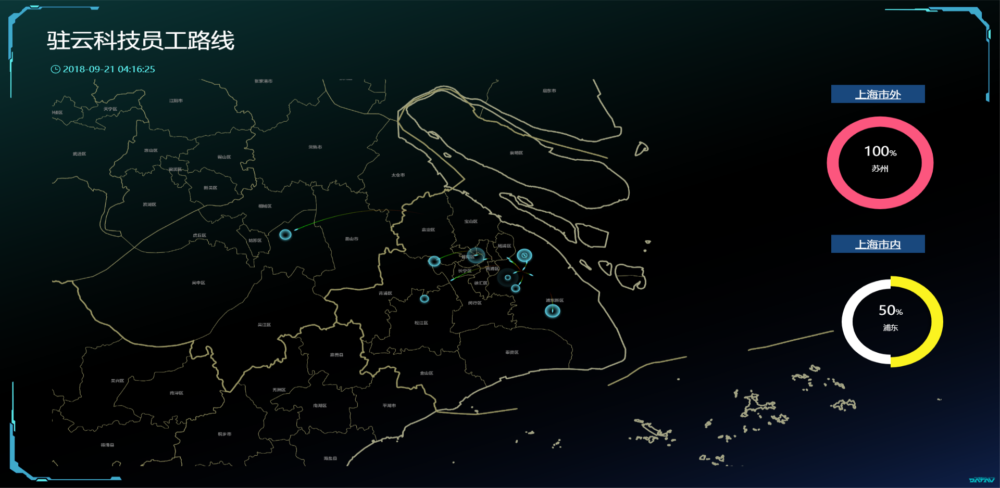

## 指标要求

1. 展示每个员工从驻云到家的路线
2. 统计市内浦东和浦西员工人数比例
3. 统计市外员工人数比例

## 准备工作

### 工具准备

* [坐标拾取器](https://lbs.amap.com/api/ )

* [区域热力图使用教程](https://help.aliyun.com/document_detail/84544.html?spm=a2c4g.11186623.6.647.237b20b6wMmWlT)

### 数据准备

#### 上海市坐标

```shell
121.473658, 31.230378
```

#### 驻云科技坐标

```shell
121.590433,31.204561
```

#### 员工家庭住址坐标

| 编号 | 员工 | 性别 | 地址             | 坐标                   |
| ---- | ---- | ---- | ---------------- | ---------------------- |
| 1    | 鹏   | 男   | 景绣路           | `121.541226,31.183463` |
| 2    | 萍   | 女   | 浦东新区长岛花苑 | `121.602724,31.264731` |
| 3    | 涛   | 男   | 新村路、岚皋路   | `121.422777,31.264651` |
| 4    | 义   | 男   | 上海火车站       | `121.455739,31.249563` |
| 5    | 红   | 男   | 南六公路399号    | `121.707167,31.058938` |
| 6    | 行   | 男   | 苏州园区站       | `120.710584,31.341098` |
| 7    | 航   | 男   | 闵行区纪王镇     | `121.266974,31.242546` |
| 8    | 楚   | 女   | 佘山地铁站       | 121.229686,31.104097   |
| 9    | 雪   | 女   | 康桥             | `121.569136,31.142536` |

### 地区分类统计

| 按照市统计 | 占比 | 细分 | 占比 |
| ---------- | ---- | ---- | ---- |
| 上海市     | 8/9  | 浦东 | 1/2  |
|            |      | 浦西 | 1/2  |
| 非上海市   | 1/9  | 苏州 | 1    |

### 性别分类

| 按照性别统计 | 占比 |
| ------------ | ---- |
| 男           | 2/3  |
| 女           | 1/3  |

#### 图片准备


## DataV配置

### 数据配置准备

```shell
# 地图大小和中心
[
  {
    "zoom" : 10,
    "lng": 121.473658,
    "lat": 31.230378
  }
]

# 飞线层地点映射
[
  {
    "from": "121.590433,31.204561",
    "to": "121.541226,31.183463"
  },
  {
    "from": "121.590433,31.204561",
    "to": "121.602724,31.264731"
  },
  {
    "from": "121.590433,31.204561",
    "to": "121.422777,31.264651"
  },
  {
    "from": "121.590433,31.204561",
    "to": "121.455739,31.249563"
  },
  {
    "from": "121.590433,31.204561",
    "to": "121.602724,31.264731"
  },
  {
    "from": "121.590433,31.204561",
    "to": "121.707167,31.058938"
  },
  {
    "from": "121.590433,31.204561",
    "to": "120.710584,31.341098"
  },
  {
    "from": "121.590433,31.204561",
    "to": "121.266974,31.242546"
  },
  {
    "from": "121.590433,31.204561",
    "to": "121.229686,31.104097"
  },
  {
    "from": "121.590433,31.204561",
    "to": "121.569136,31.142536"
  }
]
```

### 组件配置


## 展现




