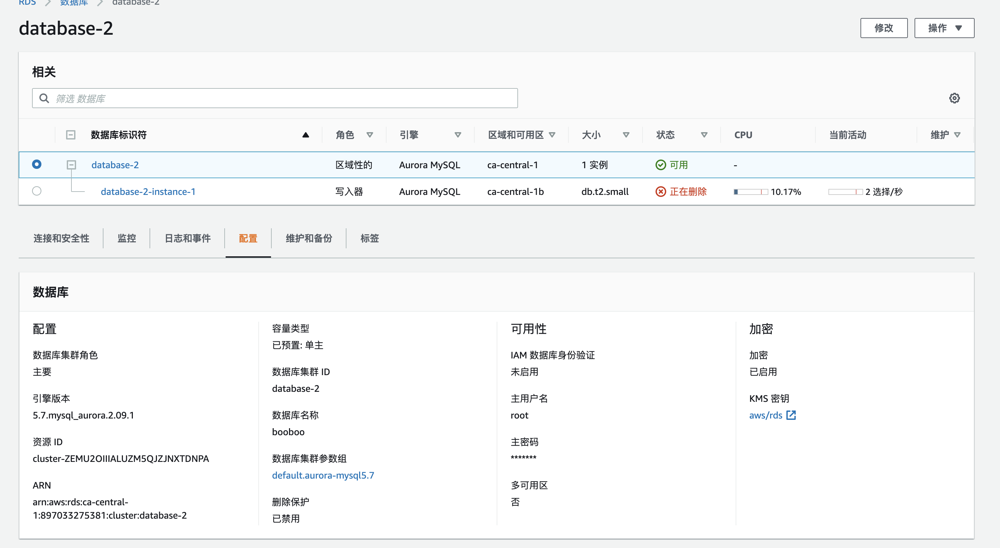
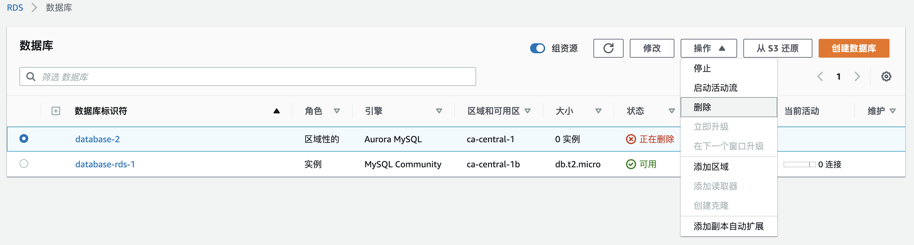

1. 查看帮助文档[删除数据库实例或 Aurora 数据库集群](https://docs.aws.amazon.com/zh_cn/AmazonRDS/latest/AuroraUserGuide/USER_DeleteInstance.html)
2. 选择cli命令行 

```bash
aws rds delete-db-instance --db-instance-identifier database-2-instance-1
```



执行返回结果：

```json
{
    "DBInstance": {
        "DBInstanceIdentifier": "database-2-instance-1",
        "DBInstanceClass": "db.t2.small",
        "Engine": "aurora-mysql",
        "DBInstanceStatus": "deleting",
        "MasterUsername": "root",
        "DBName": "booboo",
        "Endpoint": {
            "Address": "database-2-instance-1.c0myg12194sq.ca-central-1.rds.amazonaws.com",
            "Port": 3306,
            "HostedZoneId": "Z1JG78A3UK1DU3"
        },
        "AllocatedStorage": 1,
        "InstanceCreateTime": "2020-12-10T02:58:22.583Z",
        "PreferredBackupWindow": "03:12-03:42",
        "BackupRetentionPeriod": 1,
        "DBSecurityGroups": [],
        "VpcSecurityGroups": [
            {
                "VpcSecurityGroupId": "sg-ac1aa6cb",
                "Status": "active"
            }
        ],
        "DBParameterGroups": [
            {
                "DBParameterGroupName": "default.aurora-mysql5.7",
                "ParameterApplyStatus": "pending-reboot"
            }
        ],
        "AvailabilityZone": "ca-central-1b",
        "DBSubnetGroup": {
            "DBSubnetGroupName": "default-vpc-c391b0ab",
            "DBSubnetGroupDescription": "Created from the RDS Management Console",
            "VpcId": "vpc-c391b0ab",
            "SubnetGroupStatus": "Complete",
            "Subnets": [
                {
                    "SubnetIdentifier": "subnet-8304e8dc",
                    "SubnetAvailabilityZone": {
                        "Name": "ca-central-1d"
                    },
                    "SubnetOutpost": {},
                    "SubnetStatus": "Active"
                },
                {
                    "SubnetIdentifier": "subnet-d4f89bae",
                    "SubnetAvailabilityZone": {
                        "Name": "ca-central-1b"
                    },
                    "SubnetOutpost": {},
                    "SubnetStatus": "Active"
                },
                {
                    "SubnetIdentifier": "subnet-87580eef",
                    "SubnetAvailabilityZone": {
                        "Name": "ca-central-1a"
                    },
                    "SubnetOutpost": {},
                    "SubnetStatus": "Active"
                }
            ]
        },
        "PreferredMaintenanceWindow": "sat:03:17-sat:03:47",
        "PendingModifiedValues": {},
        "MultiAZ": false,
        "EngineVersion": "5.7.mysql_aurora.2.09.1",
        "AutoMinorVersionUpgrade": true,
        "ReadReplicaDBInstanceIdentifiers": [],
        "LicenseModel": "general-public-license",
        "OptionGroupMemberships": [
            {
                "OptionGroupName": "default:aurora-mysql-5-7",
                "Status": "in-sync"
            }
        ],
        "PubliclyAccessible": false,
        "StorageType": "aurora",
        "DbInstancePort": 0,
        "DBClusterIdentifier": "database-2",
        "StorageEncrypted": true,
        "KmsKeyId": "arn:aws:kms:ca-central-1:897033275381:key/eabe7a37-9d6f-41cd-a458-66bd3053be48",
        "DbiResourceId": "db-Q5PHUD6JIJIKOZHJEX26JGNNXM",
        "CACertificateIdentifier": "",
        "DomainMemberships": [],
        "CopyTagsToSnapshot": false,
        "MonitoringInterval": 60,
        "EnhancedMonitoringResourceArn": "arn:aws:logs:ca-central-1:897033275381:log-group:RDSOSMetrics:log-stream:db-Q5PHUD6JIJIKOZHJEX26JGNNXM",
        "MonitoringRoleArn": "arn:aws:iam::897033275381:role/rds-monitoring-role",
        "PromotionTier": 1,
        "DBInstanceArn": "arn:aws:rds:ca-central-1:897033275381:db:database-2-instance-1",
        "IAMDatabaseAuthenticationEnabled": false,
        "PerformanceInsightsEnabled": false,
        "DeletionProtection": false,
        "AssociatedRoles": [],
        "TagList": []
    }
}
```
