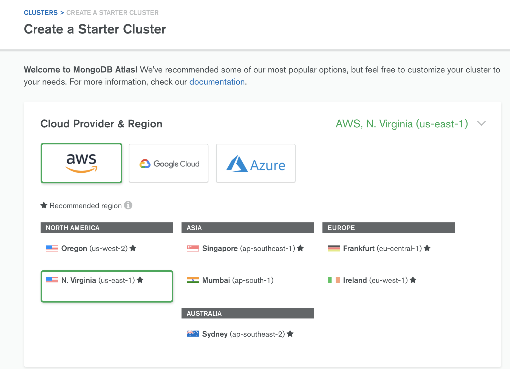
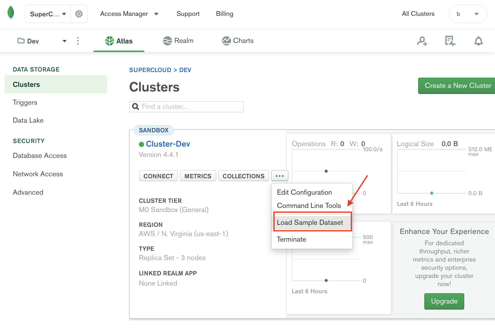
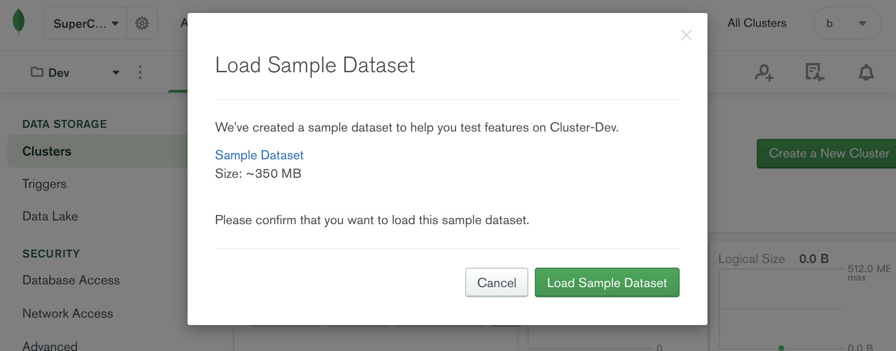
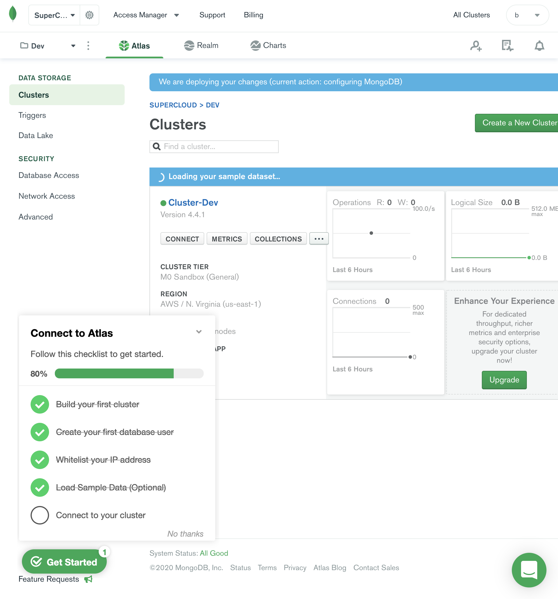
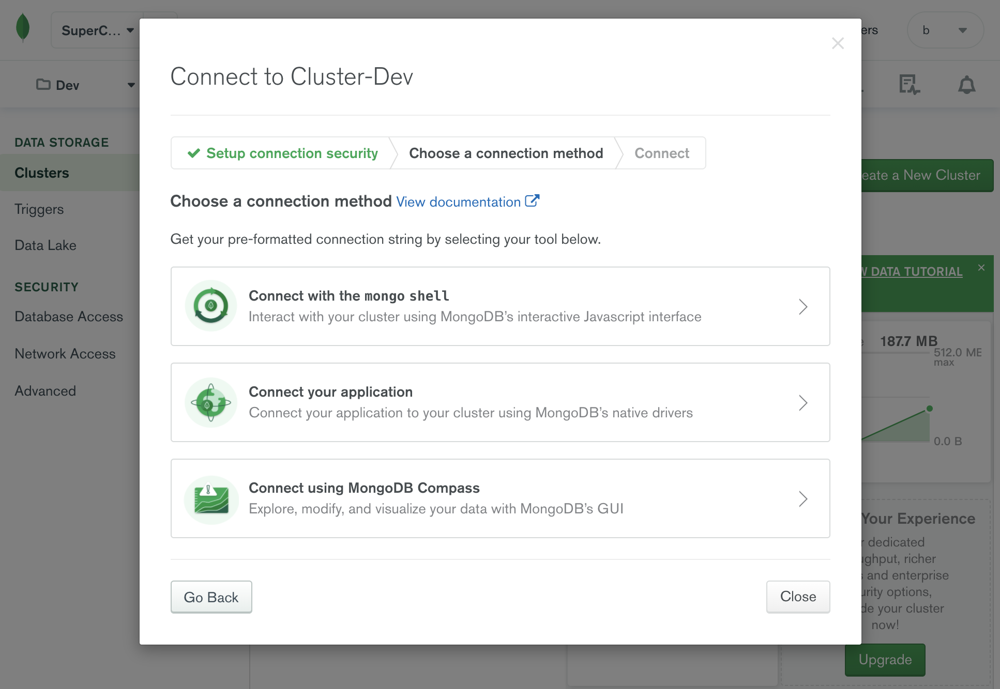

## Overview

MongoDB Atlas provides an easy way to host and manage your data in the cloud. This tutorial guides you through creating an Atlas cluster, connecting to it, inserting data, and querying data.

## Table of Contents

- **Part 1:** [Create an Atlas Account](https://docs.atlas.mongodb.com/tutorial/create-atlas-account).
- **Part 2:** [Deploy a Free Tier Cluster](https://docs.atlas.mongodb.com/tutorial/deploy-free-tier-cluster).
- **Part 3:** [Add Your Connection IP Address to Your IP Access List](https://docs.atlas.mongodb.com/security/add-ip-address-to-list).
- **Part 4:** [Create a Database User for Your Cluster](https://docs.atlas.mongodb.com/tutorial/create-mongodb-user-for-cluster).
- **Part 5:** [Connect to Your Cluster](https://docs.atlas.mongodb.com/tutorial/connect-to-your-cluster).
- **Part 6:** [Insert and View Data in Your Cluster](https://docs.atlas.mongodb.com/tutorial/insert-data-into-your-cluster).

## Practice

### 创建免费的集群




### 创建账号


### 创建白名单


### 导入测试数据







### 连接集群



```bash
user@B01202010002-33 ~ % brew install mongodb/brew/mongodb-community-shell
Updating Homebrew...
==> Downloading https://homebrew.bintray.com/bottles-portable-ruby/portable-ruby-2.6.3_2.yosemite.bottle.tar.gz
################################################################################################################################################# 100.0%
==> Pouring portable-ruby-2.6.3_2.yosemite.bottle.tar.gz
==> Auto-updated Homebrew!
Updated 1 tap (homebrew/core).
==> New Formulae
attr          aws-console   duf           heppdt2       inframap      kubevela      oakc          terracognita  vc            wayland       xcinfo
==> Updated Formulae
Updated 998 formulae.
==> Deleted Formulae
dtrx                                                                         unrar

==> Tapping mongodb/brew
Cloning into '/usr/local/Homebrew/Library/Taps/mongodb/homebrew-brew'...
remote: Enumerating objects: 130, done.
remote: Counting objects: 100% (130/130), done.
remote: Compressing objects: 100% (107/107), done.
remote: Total 495 (delta 53), reused 57 (delta 23), pack-reused 365
Receiving objects: 100% (495/495), 108.38 KiB | 221.00 KiB/s, done.
Resolving deltas: 100% (222/222), done.
Tapped 11 formulae (39 files, 180.8KB).
==> Installing mongodb-community-shell from mongodb/brew
==> Downloading https://fastdl.mongodb.org/osx/mongodb-shell-macos-x86_64-4.2.0.tgz
######################################################################## 100.0%
🍺  /usr/local/Cellar/mongodb-community-shell/4.2.0: 8 files, 45MB, built in 2 seconds
user@B01202010002-33 ~ % which mongo
/usr/local/bin/mongo
user@B01202010002-33 ~ % mongo --version
MongoDB shell version v4.2.0
git version: a4b751dcf51dd249c5865812b390cfd1c0129c30
allocator: system
modules: none
build environment:
    distarch: x86_64
    target_arch: x86_64
user@B01202010002-33 ~ % mongo "mongodb+srv://xxx/admin" --username booboo
MongoDB shell version v4.2.0
Enter password: 
MongoDB Enterprise atlas-7vhhkd-shard-0:PRIMARY> db
admin
MongoDB Enterprise atlas-7vhhkd-shard-0:PRIMARY> show dbs
admin               0.000GB
local               4.063GB
sample_airbnb       0.051GB
sample_analytics    0.009GB
sample_geospatial   0.001GB
sample_mflix        0.040GB
sample_restaurants  0.007GB
sample_supplies     0.001GB
sample_training     0.043GB
sample_weatherdata  0.002GB
```


# 拓展阅读

* Connect via `mongo` Shell[¶](https://docs.atlas.mongodb.com/mongo-shell-connection#connect-via-mongo-shell)

* Load Sample Data into Your Atlas Cluster[¶](https://docs.atlas.mongodb.com/sample-data#load-sample-data-into-your-atlas-cluster)

