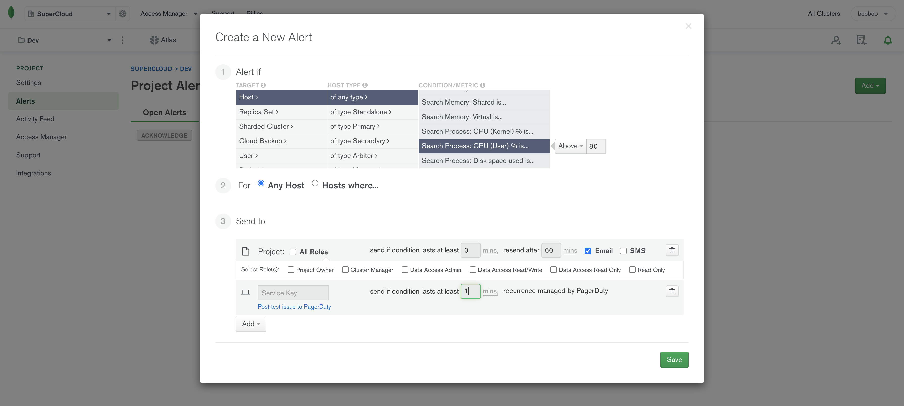

# Configure and Resolve Alerts[¶](https://docs.atlas.mongodb.com/alerts#configure-and-resolve-alerts)

Atlas issues alerts for the database and server conditions configured in your [alert settings](https://docs.atlas.mongodb.com/configure-alerts). When a condition triggers an alert, Atlas displays a warning symbol on the cluster and sends alert notifications. Your alert settings determine the notification methods. Atlas continues sending notifications at regular intervals until the condition resolves or you delete or disable the alert.

- [Alert Conditions](https://docs.atlas.mongodb.com/reference/alert-conditions#std-label-alert-conditions)

  View possible conditions for which you can trigger alerts related to your clusters.

- [Configure Alert Settings](https://docs.atlas.mongodb.com/configure-alerts)

  Set which conditions trigger alerts and how users are notified.

- [Resolve Alerts](https://docs.atlas.mongodb.com/alert-resolutions)

  Learn how to resolve alerts and prevent certain alerts from occurring in the future.

# Integrate with Third-Party Monitoring Services [¶](https://docs.atlas.mongodb.com/tutorial/third-party-service-integrations#integrate-with-third-party-monitoring-services)

You can integrate Atlas with third-party monitoring services to receive Atlas alerts in various external monitoring services.

