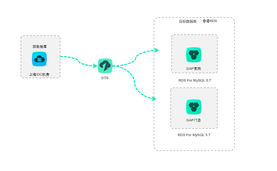

# 项目上云评估

## 项目背景

随着业务的发展，之前部署上海电信IDC机房的系统业务的发展速度以及结合云端的优势(低成本、 便捷性、敏捷性等优势)，现计划将上海电信机房内数据迁移到云上，以更好地满足业务的发展需求

## 前提条件

要能完成上海电信IDC机房迁移至公共云香港专有网络 ，需要注意一下几个迁移条件：

- 上海电信IDC机房防火墙开放DTS网段
- 源数据库实例创建拉取数据用户
- 目标RDS实例已经创建完成
- 待迁移的实例正常使用中

## 迁移对象

IDC机房生产库实例，数据量未知。

*注：为了避免对生产库主实例资源造成影响，建议采用从备库中拉取数据。*

### xx业务数据库

| 源库规格         | 上海电信IDC机房                                     |
| ---------------- | --------------------------------------------------- |
| 目标库规格       | 公有云 VPC 香港 RDS for  MySQL5.7 4C16G 存储(GB)500 |
| 数据量           |                                                     |
| DTS规格          | Large                                               |
| 迁移时间         | *（后期完善）*                                      |
| 迁移速度         | *（后期完善）*                                      |
| 源库IOPS上涨比例 | *（后期完善）*                                      |

### xx业务数据库

| 源库规格         | 上海电信IDC机房                                    |
| ---------------- | -------------------------------------------------- |
| 目标库规格       | 公有云 VPC 香港 RDS for  MySQL5.7 4C8G 存储(GB)200 |
| 数据量           |                                                    |
| DTS规格          | Large                                              |
| 迁移时间         | *全量迁移5min*                                     |
| 迁移速度         | *（后期完善）*                                     |
| 源库IOPS上涨比例 | *（后期完善）*                                     |

## 迁移方案

DTS提供了数据迁移功能，用户可以创建DTS迁移任务，同步类型选择：结构+全量+增量迁移。

在迁移的过程中，源数据库继续提供服务，迁移过程中的业务更新在增量迁移阶段会被同步到目标数据库。最终会有一个时间点，增量同步达到无延迟状态，即目标数据库追上源数据库的数据，两边数据完全一致，持续同步。

数据库架构：

上海IDC机房通过DTS数据迁移至香港RDS，由于跨地域会有延迟发生：

- 建议添加专线
- 建议上海IDC机房数据迁移至上海RDS，通过DTS数据同步至香港RDS

注：

数据同步支持跨地区迁移走私网，只支持RDS for MySQL 至 RDS for MySQL
 数据迁移跨地区要求源端有公网

香港RDS配置只读实例：

数据库迁移演示图：

建议在业务非高峰期时间（如晚上），创建迁移任务。

| 步骤 | 说明             | 实施人员   | 其他                                       |
| ---- | ---------------- | ---------- | ------------------------------------------ |
| 1    | 新建DTS迁移任务A | DBA        | 自建MySQL数据与RDS for  MySQL5.7的数据迁移 |
| 2    | 释放迁移任务A    | DBA        |                                            |
| 3    | 联调测试         | 业务负责人 | 驻云协助                                   |
| 6    | 确认正式切割时间 | 业务负责人 |                                            |
| 7    | 业务割接         | 业务负责人 | DTS迁移状态无延迟进行                      |

### 源实例监控

| 监控事项     | 源实例(正常阈值)                          | 负责人     | 处理（DBA）          |
| ------------ | ----------------------------------------- | ---------- | -------------------- |
| CPU          | < 70%                                     | 业务负责人 | 超过70%立刻暂停任务  |
| 内存         | < 70%                                     | 业务负责人 | 超过70%立刻暂停任务  |
| IOPS         | < 8000                                    | 业务负责人 | 超过8000立刻暂停任务 |
| 连接数       | < 1000                                    | 业务负责人 | 超过1000立刻暂停任务 |
| 重点监控时段 | 1. 迁移启动的最初2小时   2. 业务高峰期 |            |                      |
| 监控报告     | 针对重点监控时段， 提供监控报告。      |            |                      |

### 上云可行性评估阶段

1. 新建DTS迁移任务A：创建一个DTS迁移任务，通过DTS迁移工具中的全量+增量功能实现自建数据MySQL与RDS For MySQL的数据迁移
2. 释放迁移任务A：释放迁移任务A，不影响原有自建MySQL
3. 联调测试：业务负责人将新环境中的WEB应用与数据库联调测试
4. 通过DTS迁移（结构+全量+增量）实现数据库迁移

### 正式迁移阶段

## 模板

### 迁移任务监控

1. 启动时间： 

2. 成功时间： 

3. 监控时间段：  － 

4. 对源库的影响

| 监控时间   | 实例规格   | 8核        | 16GB       | 8000           | 4000     |                         |      |      |
| ---------- | ---------- | ---------- | ---------- | -------------- | -------- | ----------------------- | ---- | ---- |
| 监控指标   | CPU利用率  | 内存使用率 | IOPS使用量 | 当前活跃连接数 | 总连接数 | 网络流量  （输入/输出） |      |      |
| 2018-06-20 |            | 同步之前   |            |                |          |                         |      |      |
|            | 同步5min   |            |            |                |          |                         |      |      |
|            | 同步10min  |            |            |                |          |                         |      |      |
|            | 同步结束后 |            |            |                |          |                         |      |      |

### 迁移任务速度

| 源库规格     | 公有云 VPC 华东1可用区E 8核\64G mysql5.5              |
| ------------ | ----------------------------------------------------- |
| 目标库规格   | 公有云 VPC 华东1可用区B VPC 8核/32G/1000G/12000  IOPS |
| 数据量       | 450G                                                  |
| DTS规格      | Large                                                 |
| 迁移时间     | *（后期完善）*                                        |
| 迁移速度     | *（后期完善）*                                        |
| 源库IOPS变化 | *（后期完善）*                                        |
| 源库CPU变化  | *（后期完善）*                                        |

