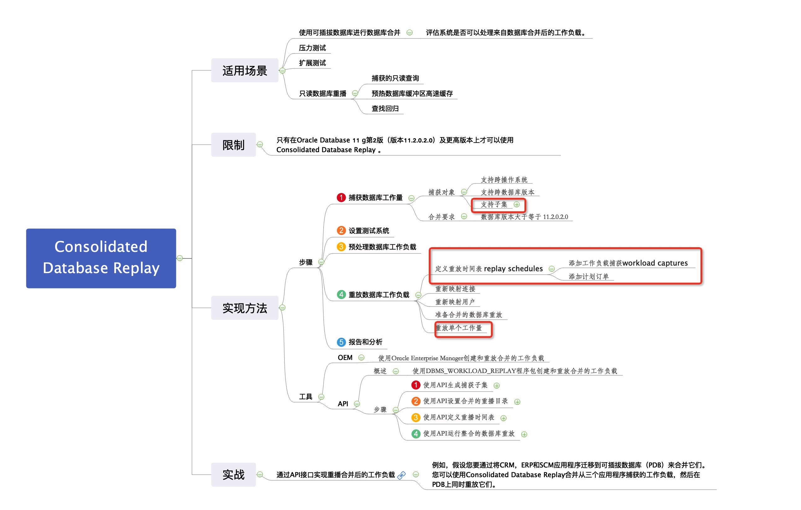

# 1Z0-063 题目概览

# 1Z0-063 考点

- [Oracle数据库12c：高级管理1Z0-063](https://education.oracle.com/oracle-database-12c-advanced-administration/pexam_1Z0-063)

考试价格：¥1077 | 时长：120分钟| 及格分数：60％| 80题

#### 备份与恢复

##### Oracle数据保护解决方案

- 说明Oracle备份和恢复解决方案
  - 描述数据库故障的类型
  - 描述可用于备份和恢复任务的工具
  - 描述RMAN和最大可用性架构
  - 使用SYSBACK特权
  - 使用RMAN独立命令和作业命令

##### 执行基本备份和恢复

- 备份并恢复NOARCHIVELOG数据库 Back up and recover a NOARCHIVELOG database
- 以NOARCHIVELOG模式执行备份和恢复 Perform backup and recovery in NOARCHIVELOG mode
- 在RMAN中使用SQL Use SQL in RMAN

##### 配置可恢复性

- 配置和管理RMAN设置
  - 配置RMAN的持久设置 Configure persistent settings for RMAN
  - 查看永久设置 View persistent settings
  - 指定保留政策 Specify a retention policy
- 配置快速恢复区域
  - 解释快速恢复区 Explain the Fast Recovery Area
  - 配置快速恢复区域 Configure the Fast Recovery Area
- 配置控制文件和重做日志文件以实现可恢复性
  - 多重控制文件 Multiplex control files
  - 多重重做日志文件 Multiplex redo log files
  
##### 使用RMAN恢复目录

- 创建和使用RMAN恢复目录
  - 配置恢复目录 Configure a recovery catalog
  - 在恢复目录中注册目标数据库 Register target databases in a recovery catalog
  - 编目其他备份文件 Catalog additional backup files
  - 重新同步恢复目录 Resynchronize a recovery catalog
  - 使用和维护RMAN存储的脚本 Use and maintain RMAN stored scripts
  - 升级和删除恢复目录 Upgrade and drop a recovery catalog
- 保护RMAN恢复目录
  - 备份恢复目录 Back up the recovery catalog
  - 重新创建不可恢复的恢复目录 Re-create an unrecoverable recovery catalog
  - 导出和导入恢复目录 Export and import the recovery catalog


##### 实施备份策略

- 使用各种RMAN备份类型和策略
  - 启用ARCHIVELOG模式 Enable ARCHIVELOG mode
  - 创建基于磁带和磁盘的备份 Create tape and disk based backups
  - 创建整个数据库备份 Create whole database backups
  - 创建一致和不一致的备份 Create consistent and inconsistent backups
  - 创建备份集和映像副本 Create backup sets and image copies
  - 创建只读表空间的备份 Create backups of read-only tablespaces
  - 采用最佳实践进行数据仓库备份 Employ best practices for data warehouse backups

##### 执行备份

- 执行完整和增量备份
  - 创建完整和增量备份 Create full and incremental backups
  - 使用Oracle建议的备份策略 Use the Oracle-suggested backup strategy
- 管理备份
  - 配置和监视块更改跟踪 Configure and monitor block change tracking
  - 使用LIST，REPORT命令报告备份 Report on backups using LIST, REPORT commands
  - 使用CROSSCHECK，DELETE命令管理备份 Manage backups using CROSSCHECK, DELETE commands


##### 配置RMAN备份选项并创建非数据库文件的备份

- 使用技巧来改善备份
  - 创建压缩备份 Create compressed backups
  - 创建非常大的文件的多部分备份 Create multi-section backups of very large file
  - 创建代理副本 Create proxy copies
  - 创建多重备份集 Create duplexed backup sets
  - 创建备份集的备份 Create backups of backup sets
  - 创建档案备份 Create archival backups
- 执行非数据库文件的备份
  - 备份控制文件以进行跟踪 Back up a control file to trace
  - 备份存档的重做日志文件 Back up archived redo log files
  - 备份ASM磁盘组元数据 Back up ASM diskgroup metadata


##### 使用RMAN加密的备份

- 创建RMAN加密的备份
  - 使用透明模式加密 Use transparent-mode encryption
  - 使用密码模式加密 Use password-mode encryption
  - 使用双模式加密 Use dual-mode encryption
  - 恢复加密的备份 Restore encrypted backups


##### 诊断故障

- 描述自动诊断工作流程
  - 使用自动诊断存储库 Use the Automatic Diagnostic Repository
  - 使用ADRCI Use ADRCI
  - 查找和解释消息输出和错误堆栈 Find and interpret message output and error stacks
  - 使用数据恢复顾问 Use the Data Recovery Advisor
- 处理块损坏
  - 使用RMAN检测块损坏 Detect block corruption using RMAN
  - 使用RMAN执行块恢复 Perform block recovery using RMAN
  
  
##### 执行还原和恢复操作

- 描述和调整实例恢复 Describe and tune instance recovery
- 执行完整和不完整的恢复 Perform complete and incomplete recovery
  - 使用RMAN RESTORE和RECOVER命令 Use RMAN RESTORE and RECOVER commands
  - 还原ASM磁盘组  Restore ASM disk groups
  - 从介质故障中恢复 Recover from media failures
  - 使用RMAN执行完整和不完整或“时间点”恢复 Perform complete and incomplete or “point-in-time” recoveries using RMAN


##### 使用RMAN恢复文件

- 对spfile，控制文件，重做日志文件执行恢复
- 从备份执行表恢复
- 执行索引和只读表空间，临时文件的恢复
- 将数据库还原到新主机


##### 使用Oracle安全备份

- 配置和使用Oracle安全备份

##### 使用闪回技术

- 描述闪回技术
  - 配置数据库以使用闪回技术
  - 保证撤消保留
- 使用闪回查询数据
  - 使用闪回查询 Use Flashback Query
  - 使用闪回版本查询 Use Flashback Version Query
  - 使用闪回事务查询 Use Flashback Transaction Query
  - 闪回事务 Flash back a transaction
- 执行闪回表操作
  - 执行闪回表 Perform Flashback Table
  - 从回收站还原表 Restore tables from the recycle bin
- 描述和使用闪回数据存档
  - 使用闪回数据存档 Use Flashback Data Archive
  - 使用DBMS_FLASHBACK_ARCHIVE包 Use DBMS_FLASHBACK_ARCHIVE package


##### 使用闪回数据库

- 执行闪回数据库
  - 配置闪回数据库 Configure Flashback Database
  - 执行闪回数据库 Perform Flashback Database
  
  
##### 传输资料

- 描述和使用可移动表空间和数据库
  - 使用映像副本或备份集在数据库之间传输表空间 Transport tablespaces between databases using image copies or backup sets
  - 使用数据文件或备份集传输数据库 Transport databases using data files or backup sets
  - 跨平台传输数据 Transport data across platforms
  
  
##### 复制数据库

- 选择一种复制数据库的技术
  - 从活动数据库连接到目标实例和辅助实例 From an active database, connected to the target and auxiliary instances
  - 从备份，连接到目标和辅助实例 From backup, connected to the target and auxiliary instances
  - 从备份，连接到辅助实例，未连接到目标，但具有恢复目录连接 From backup, connected to the auxiliary instance, not connected to the target, but with recovery catalog connection
  - 从备份，连接到辅助实例，未连接到目标和恢复目录 From backup, connected to the auxiliary instance, not connected to the target and the recovery catalog
  - 用RMAN复制数据库 Duplicate a database with RMAN
- 创建基于备份的重复数据库 Create a backup-up based duplicate database
- 根据正在运行的实例复制数据库 Duplicate a database based on a running instance


##### 监视和调整RMAN操作

- 调整RMAN性能
  - 解释RMAN错误堆栈 Interpret RMAN error stacks
  - 诊断性能瓶颈 Diagnose performance bottlenecks
  - 调整RMAN备份性能 Tune RMAN backup performance


#### 管理可插拔和容器数据库

##### 多租户容器和可插拔数据库体系结构

- 描述多租户容器数据库架构 Describe the multitenant container database architecture
- 解释可插拔数据库配置 Explain pluggable database provisioning

##### 创建多租户容器和可插入数据库

- 配置和创建CDB Configure and create a CDB
- 使用不同的方法创建PDB Create a PDB using different methods
- 拔出并删除PDB Unplug and drop a PDB
- 将非CDB数据库迁移到PDB Migrate a non-CDB database to PDB

##### 管理CDB和PDB

- 建立与CDB/PDB的连接 Establish connections to CDB/PDB
- 启动和关闭CDB并打开和关闭PDB Start up and shut down a CDB and open and close PDBs
- 评估参数值更改的影响 Evaluate the impact of parameter value changes


##### 管理CDB和PDB中的存储

- 管理CDB和PDB中的永久和临时表空间

##### 管理CDB和PDB中的安全性

- 管理普通和本地用户 Manage common and local users
- 管理公共和本地特权 Manage common and local privileges
- 管理共同和本地角色 Manage common and local roles
- 使普通用户可以访问特定PDB中的数据 Enable common users to access data in specific PDBs

##### 管理可用性

- 执行CDB和PDB的备份 Perform backups of a CDB and PDBs
- 从PDB数据文件丢失中恢复PDB Recover PDB from PDB datafiles loss
- 使用数据恢复顾问 Use Data Recovery Advisor
- 使用RMAN复制PDB Duplicate PDBs using RMAN

##### 管理绩效

- 监视CDB和PDB中的操作和性能 Monitor operations and performance in a CDB and PDBs
- 管理PDB之间以及PDB内部的资源分配 Manage allocation of resources between PDBs and within a PDB
- 执行数据库重播 Perform Database Replay

##### 移动数据，执行安全性操作并与其他Oracle产品进行交互

- 使用数据泵 Use Data Pump
- 使用SQL * Loader
- 审计运作 Audit operations
- 将其他产品与CDB和PDB一起使用-Database Vault，Data Guard，LogMiner


# 1Z0-063 实践

## 数据库操作监视概念

该`DBMS_SQL_MONITOR`软件包是数据库操作体系结构的关键组件。

[关于监视数据库操作](https://docs.oracle.com/en/database/oracle/oracle-database/12.2/tgsql/monitoring-database-operations.html#GUID-007E5BAE-B07D-4BD1-9485-DE8D260BF862)

- [关于实时SQL监视的体系结构实时](https://docs.oracle.com/en/database/oracle/oracle-database/12.2/tgsql/monitoring-database-operations.html#GUID-CEED2A89-51DE-42AC-B2BD-CAD3D6E25807)
  SQL监视是内置的数据库基础结构，可帮助您使用长时间运行的并行SQL语句来识别性能问题。
- [当数据库监视操作时操作](https://docs.oracle.com/en/database/oracle/oracle-database/12.2/tgsql/monitoring-database-operations.html#GUID-5D853CB9-D65C-44DF-BB43-058DA861B42D)
  监视取决于数据库操作是简单操作还是组合操作。
- [复合数据库操作](https://docs.oracle.com/en/database/oracle/oracle-database/12.2/tgsql/monitoring-database-operations.html#GUID-EC276737-148A-4ED7-AA7D-F125AD1B8859)
  的[属性](https://docs.oracle.com/en/database/oracle/oracle-database/12.2/tgsql/monitoring-database-operations.html#GUID-EC276737-148A-4ED7-AA7D-F125AD1B8859)该`DBMS_SQL_MONITOR.BEGIN_OPERATION`函数定义数据库操作。

## 管理多租户

> ## Managing a Multitenant Environment

- [36 管理多租户环境概述](https://docs.oracle.com/en/database/oracle/oracle-database/12.2/admin/overview-of-managing-a-multitenant-environment.html#GUID-528FBE02-2B84-4E97-BD87-36AEF9EA524D)

- [37 创建和配置CDB](https://docs.oracle.com/en/database/oracle/oracle-database/12.2/admin/creating-and-configuring-a-cdb.html#GUID-77D4BBA7-2A64-46D9-A2B8-C56060772215)

- [38 使用SQL * Plus创建和删除PDB](https://docs.oracle.com/en/database/oracle/oracle-database/12.2/admin/creating-and-removing-pdbs-with-sql-plus.html#GUID-9A250D93-5B3B-4643-BE85-F32CC7B0E413)

- [39 使用云控制创建和删除PDB](https://docs.oracle.com/en/database/oracle/oracle-database/12.2/admin/creating-and-removing-pdbs-with-cloud-control.html#GUID-D5D84283-0428-4C2A-B307-62B4F51D1F69)

- [40 使用SQL * Plus创建和删除应用程序容器和种子](https://docs.oracle.com/en/database/oracle/oracle-database/12.2/admin/creating-removing-application-containers-seeds-with-sql-plus.html#GUID-E2B95068-D16D-438D-9A0B-974540988990)

- [41 使用SQL * Plus管理CDB](https://docs.oracle.com/en/database/oracle/oracle-database/12.2/admin/administering-a-cdb-with-sql-plus.html#GUID-2E5025EE-BED3-45A4-9EAA-B05C8DA66F97)

- [42 使用云控制管理CDB和PDB](https://docs.oracle.com/en/database/oracle/oracle-database/12.2/admin/administering-cdbs-and-pdbs-with-cloud-control.html#GUID-71402CFE-BD65-45BF-BC9B-1F095D88AF5C)

- [43 使用SQL * Plus管理PDB](https://docs.oracle.com/en/database/oracle/oracle-database/12.2/admin/administering-pdbs-with-sql-plus.html#GUID-702231AB-ABDA-42F4-918C-4539BF8135D6)

- [44 使用SQL * Plus管理应用程序容器](https://docs.oracle.com/en/database/oracle/oracle-database/12.2/admin/administering-application-containers-with-sql-plus.html#GUID-1AFD0268-6A2B-4F84-BB4D-4D36976DE53B)

- [45 使用SQL * Plus查看有关CDB和PDB的信息](https://docs.oracle.com/en/database/oracle/oracle-database/12.2/admin/viewing-information-about-cdbs-and-pdbs-with-sql-plus.html#GUID-208C0C35-D105-443B-B788-381F090B1D11)

- [46 将Oracle Resource Manager for PDB与SQL * Plus一起使用](https://docs.oracle.com/en/database/oracle/oracle-database/12.2/admin/using-oracle-resource-manager-for-pdbs-with-sql-plus.html#GUID-2708E76D-E18B-4586-920A-BD4B904AE14D)

- [47 将Oracle Resource Manager for PDB与Cloud Control结合使用](https://docs.oracle.com/en/database/oracle/oracle-database/12.2/admin/using-oracle-resource-manager-for-pdbs-with-cloud-control.html#GUID-D9A5EBE6-6E45-463A-92E0-B9FEBAD50A54)

- [48 将Oracle Scheduler与CDB一起使用](https://docs.oracle.com/en/database/oracle/oracle-database/12.2/admin/using-oracle-scheduler-with-a-cdb.html#GUID-5BD1ACC9-D10D-4573-860F-5F8A65AE8554)


## 数据库重放

> Database Replay 

- [数据库重播简介](https://docs.oracle.com/en/database/oracle/oracle-database/12.2/ratug/introduction-to-database-replay.html#GUID-5AA30327-74FB-4406-8F7C-5D442F307534)
- [捕获数据库工作负载](https://docs.oracle.com/en/database/oracle/oracle-database/12.2/ratug/capturing-a-database-workload.html#GUID-E774C161-98C0-43EF-8B78-DD74E2A2A219)
- [预处理数据库工作量](https://docs.oracle.com/en/database/oracle/oracle-database/12.2/ratug/preprocessing-a-database-workload.html#GUID-4CEE2F79-F5A7-4EBA-9018-0CB99AB51C0A)
- [重播数据库工作负载](https://docs.oracle.com/en/database/oracle/oracle-database/12.2/ratug/replaying-a-database-workload.html#GUID-1F638D8F-7168-492D-BAD6-39F4F36EAD9B)
- [分析捕获和重放的工作量](https://docs.oracle.com/en/database/oracle/oracle-database/12.2/ratug/analyzing-captured-and-replayed-workloads.html#GUID-3E9AA9F2-B37B-4E03-9E00-FEB0A141631E)
- [使用工作量智能](https://docs.oracle.com/en/database/oracle/oracle-database/12.2/ratug/using-workload-intelligence.html#GUID-2A70BED3-9A0A-4C0C-9B84-910B139EF6A0)
- [使用统一数据库重播](https://docs.oracle.com/en/database/oracle/oracle-database/12.2/ratug/using-consolidated-database-replay.html#GUID-62AAF505-1DD4-414A-9F1D-4386B59B7138)
- [使用工作负载放大](https://docs.oracle.com/en/database/oracle/oracle-database/12.2/ratug/using-workload-scale-up.html#GUID-6EE876DA-F6E0-435A-8728-CFDA1AFD1FF0)



## 管理恢复目录

这个 本章介绍了如何管理RMAN恢复目录。目录是一种数据库模式，其中包含一个或多个目标数据库的RMAN存储库数据。本章包含以下主题：

- [RMAN恢复目录概述](https://docs.oracle.com/en/database/oracle/oracle-database/12.2/bradv/managing-recovery-catalog.html#GUID-2491887B-D9AC-48BE-914D-CB0341A77057)

- [创建恢复目录](https://docs.oracle.com/en/database/oracle/oracle-database/12.2/bradv/managing-recovery-catalog.html#GUID-6BEEEF19-C8B6-43CA-B416-C01720070AC8)

- [在恢复目录中注册数据库](https://docs.oracle.com/en/database/oracle/oracle-database/12.2/bradv/managing-recovery-catalog.html#GUID-AD52E63A-F367-46E5-8033-5C56C43BE4DC)

- [在恢复目录中对备份进行分类](https://docs.oracle.com/en/database/oracle/oracle-database/12.2/bradv/managing-recovery-catalog.html#GUID-C2DE2E5D-DCDA-4A85-BA4D-A783180C4F51)

- [创建和管理虚拟专用目录](https://docs.oracle.com/en/database/oracle/oracle-database/12.2/bradv/managing-recovery-catalog.html#GUID-B3238BE0-F52D-4773-A277-D3627AE28D57)

- [保护恢复目录](https://docs.oracle.com/en/database/oracle/oracle-database/12.2/bradv/managing-recovery-catalog.html#GUID-6F052177-3BEE-44DD-9136-0A576EF3F010)

- [管理存储的脚本](https://docs.oracle.com/en/database/oracle/oracle-database/12.2/bradv/managing-recovery-catalog.html#GUID-14E5B168-8033-4831-A02A-6003212988D7)

- [维护恢复目录](https://docs.oracle.com/en/database/oracle/oracle-database/12.2/bradv/managing-recovery-catalog.html#GUID-5FC1C46A-748D-4DAF-9EF4-62781ACBE319)

- [删除恢复目录](https://docs.oracle.com/en/database/oracle/oracle-database/12.2/bradv/managing-recovery-catalog.html#GUID-F9345920-0731-40FA-B44A-CE8F50E09B40)

  也可以看看：

  - [维护RMAN备份和存储库记录，](https://docs.oracle.com/en/database/oracle/oracle-database/12.2/bradv/maintaining-rman-backups.html#GUID-F5C3D045-279B-4AB3-8A91-3231A716402C)以了解如何在没有恢复目录的情况下管理存储在控制文件中的RMAN存储库
  - 《[*Oracle数据库备份和恢复参考*](https://www.oracle.com/pls/topic/lookup?ctx=en/database/oracle/oracle-database/12.2/bradv&id=RCMRF005)》中的兼容性矩阵，用于描述受支持的互操作性方案


## Secure Backup Administrator's Guide

- [Secure Backup Administrator's Guide](https://docs.oracle.com/cd/E26569_01/doc.104/e21476/osb_rman_backup.htm#OBADM183)
- [关于Recovery Manager和Oracle Secure Backup](https://docs.oracle.com/cd/E26569_01/doc.104/e21476/osb_rman_backup.htm#BDCGHBHE)
- [配置Oracle安全备份以用于RMAN](https://docs.oracle.com/cd/E26569_01/doc.104/e21476/osb_rman_backup.htm#BDCBGJBF)
- [主要和从属RMAN备份作业](https://docs.oracle.com/cd/E26569_01/doc.104/e21476/osb_rman_backup.htm#CHDJADCC)
- [使用RMAN和Oracle Secure Backup执行备份](https://docs.oracle.com/cd/E26569_01/doc.104/e21476/osb_rman_backup.htm#BDCEAADE)
- [使用RMAN和Oracle Secure Backup执行恢复](https://docs.oracle.com/cd/E26569_01/doc.104/e21476/osb_rman_backup.htm#BDCDJHII)
- [RMAN和Oracle安全备份加密](https://docs.oracle.com/cd/E26569_01/doc.104/e21476/osb_rman_backup.htm#CHDJEHFA)
- [Oracle Secure Backup中的RMAN备份元数据](https://docs.oracle.com/cd/E26569_01/doc.104/e21476/osb_rman_backup.htm#BDCFFDGJ)
- [在Oracle RAC环境中使用RMAN和Oracle Secure Backup](https://docs.oracle.com/cd/E26569_01/doc.104/e21476/osb_rman_backup.htm#BDCEFJCB)

## 考点练习

### 非归档模式下RMAN可以备份offline的表空间吗？

```bash
[oracle@oracle01 ~]$ rman target /

Recovery Manager: Release 12.2.0.1.0 - Production on Sun Nov 29 17:28:35 2020

Copyright (c) 1982, 2017, Oracle and/or its affiliates.  All rights reserved.

connected to target database: BOOBOO (DBID=3416647573)

RMAN> backup tablespace users;

Starting backup at 2020-11-29:17:30:30
using target database control file instead of recovery catalog
allocated channel: ORA_DISK_1
channel ORA_DISK_1: SID=34 device type=DISK
channel ORA_DISK_1: starting full datafile backup set
channel ORA_DISK_1: specifying datafile(s) in backup set
RMAN-00571: ===========================================================
RMAN-00569: =============== ERROR MESSAGE STACK FOLLOWS ===============
RMAN-00571: ===========================================================
RMAN-03009: failure of backup command on ORA_DISK_1 channel at 11/29/2020 17:30:31
ORA-19602: cannot backup or copy active file in NOARCHIVELOG mode


RMAN> alter tablespace users offline;

Statement processed

RMAN> backup tablespace users;

Starting backup at 2020-11-29:17:31:06
using channel ORA_DISK_1
channel ORA_DISK_1: starting full datafile backup set
channel ORA_DISK_1: specifying datafile(s) in backup set
input datafile file number=00007 name=/u01/app/oracle/oradata/booboo/users01.dbf
channel ORA_DISK_1: starting piece 1 at 2020-11-29:17:31:06
channel ORA_DISK_1: finished piece 1 at 2020-11-29:17:31:07
piece handle=/u01/app/oracle/product/12.2.0/db_1/dbs/19vgokaq_1_1 tag=TAG20201129T173106 comment=NONE
channel ORA_DISK_1: backup set complete, elapsed time: 00:00:01
Finished backup at 2020-11-29:17:31:07

Starting Control File and SPFILE Autobackup at 2020-11-29:17:31:07
piece handle=/u01/app/oracle/product/12.2.0/db_1/dbs/c-3416647573-20201129-02 comment=NONE
Finished Control File and SPFILE Autobackup at 2020-11-29:17:31:08

RMAN> exit


Recovery Manager complete.
[oracle@oracle01 ~]$ sqlplus -S / as sysdba << ENDF
> archive log list
> ENDF
Database log mode              No Archive Mode
Automatic archival             Disabled
Archive destination            /u01/software/arc_booboo_dest1
Oldest online log sequence     41
Current log sequence           43
```

### RMAN创建脚本需要连接到哪里？

```bash
[oracle@oracle01 ~]$ rman target /

Recovery Manager: Release 12.2.0.1.0 - Production on Sun Nov 29 16:42:33 2020

Copyright (c) 1982, 2017, Oracle and/or its affiliates.  All rights reserved.

connected to target database: BOOBOO (DBID=3416647573)

RMAN> create script db_full_backup{
2> backup incremental level 1 tag backup_full database; }

using target database control file instead of recovery catalog
RMAN-00571: ===========================================================
RMAN-00569: =============== ERROR MESSAGE STACK FOLLOWS ===============
RMAN-00571: ===========================================================
RMAN-03002: failure of create script command at 11/29/2020 16:43:17
RMAN-06002: command not allowed when not connected to a recovery catalog
```


### 恢复目录数据库中有两个版本的数据库时能将低版本导入高版本吗？

```sql
--12c PDB数据库中 创建 rc12c
sqlplus -S dba1/oracle_4U@booboopdb1 as sysdba << ENDF
create tablespace rcatbs datafile '/u01/backup/booboo/rcat01.dbf' SIZE 15M REUSE;
CREATE USER rc12c IDENTIFIED BY "oracle_4U" DEFAULT
TABLESPACE rcatbs
QUOTA unlimited on rcatbs;
GRANT recovery_catalog_owner to rc12c;
exit
ENDF

rman catalog rc12c/oracle_4U@booboopdb1
create catalog;

rman target "'/ as sysbackup'" catalog rc12c/oracle_4U@booboopdb1
register database;
report schema;

--11g 数据库中  创建 rc11g
sqlplus -S / as sysdba << ENDF
create tablespace rcatbs datafile '/u01/rcat01.dbf' SIZE 15M REUSE;
CREATE USER rc11g IDENTIFIED BY "oracle_4U" DEFAULT
TABLESPACE rcatbs
QUOTA unlimited on rcatbs;
GRANT recovery_catalog_owner to rc11g;
exit
ENDF

rman catalog rc11g/oracle_4U@oratest
create catelog;

rman target "'/ as sysbackup'" catalog rc11g/oracle_4U@oratest
register database;
report schema;

--12c的rman 连接12c的catalog后 执行import 11g
rman catalog rc12c/oracle_4U@booboopdb1
import catalog rc11g/oracle_4U@oratest dbid=3420951115;

--12C 升级11g 的catalog
rman catalog rc11g/oracle_4U@oratest
upgrade catalog
upgrade catalog

--删除 rc12c
rman catalog rc12c/oracle_4U@booboopdb1
drop catalog
drop catalog
exit
sqlplus dba1/oracle_4U@booboopdb1 as sysdba
drop user rc12c;
drop tablespace rcatbs;
exit
--删除 rc11g
rman catalog rc11g/oracle_4U@oratest
drop catalog
drop catalog
exit
sqlplus sys/oracle_4U@oratest as sysdba
drop user rc11g;
drop tablespace rcatbs;
exit
```


明细
```bash
# 12c 
[oracle@oracle01 ~]$ rman catalog rc12c/oracle_4U@booboopdb1

Recovery Manager: Release 12.2.0.1.0 - Production on Sun Nov 29 15:35:04 2020

Copyright (c) 1982, 2017, Oracle and/or its affiliates.  All rights reserved.

connected to recovery catalog database

RMAN> create catalog

recovery catalog created

RMAN> exit


Recovery Manager complete.
[oracle@oracle01 ~]$ echo $ORACLE_SID
booboo
[oracle@oracle01 ~]$ rman target "'/ as sysbackup'" catalog rc12c/oracle_4U@booboopdb1

Recovery Manager: Release 12.2.0.1.0 - Production on Sun Nov 29 15:36:15 2020

Copyright (c) 1982, 2017, Oracle and/or its affiliates.  All rights reserved.

connected to target database: BOOBOO (DBID=3416647573)
connected to recovery catalog database

RMAN> register database;

database registered in recovery catalog
starting full resync of recovery catalog
full resync complete

RMAN> report schema;

Report of database schema for database with db_unique_name BOOBOO

List of Permanent Datafiles
===========================
File Size(MB) Tablespace           RB segs Datafile Name
---- -------- -------------------- ------- ------------------------
1    820      SYSTEM               YES     /u01/app/oracle/oradata/booboo/system01.dbf
3    670      SYSAUX               NO      /u01/app/oracle/oradata/booboo/sysaux01.dbf
4    65       UNDOTBS1             YES     /u01/app/oracle/oradata/booboo/undotbs01.dbf
5    250      PDB$SEED:SYSTEM      NO      /u01/app/oracle/oradata/booboo/pdbseed/system01.dbf
6    350      PDB$SEED:SYSAUX      NO      /u01/app/oracle/oradata/booboo/pdbseed/sysaux01.dbf
7    5        USERS                NO      /u01/app/oracle/oradata/booboo/users01.dbf
8    100      PDB$SEED:UNDOTBS1    NO      /u01/app/oracle/oradata/booboo/pdbseed/undotbs01.dbf
9    300      BOOBOOPDB1:SYSTEM    YES     /u01/app/oracle/oradata/booboo/booboopdb1/system01.dbf
10   400      BOOBOOPDB1:SYSAUX    NO      /u01/app/oracle/oradata/booboo/booboopdb1/sysaux01.dbf
11   100      BOOBOOPDB1:UNDOTBS1  YES     /u01/app/oracle/oradata/booboo/booboopdb1/undotbs01.dbf
12   5        BOOBOOPDB1:USERS     NO      /u01/app/oracle/oradata/booboo/booboopdb1/users01.dbf
13   250      BOOBOOPDB2:SYSTEM    NO      /u01/app/oracle/oradata/booboo/booboopdb2/system01.dbf
14   350      BOOBOOPDB2:SYSAUX    NO      /u01/app/oracle/oradata/booboo/booboopdb2/sysaux01.dbf
15   100      BOOBOOPDB2:UNDOTBS1  NO      /u01/app/oracle/oradata/booboo/booboopdb2/undotbs01.dbf
16   5        BOOBOOPDB2:USERS     NO      /u01/app/oracle/oradata/booboo/booboopdb2/users01.dbf
17   250      BOOBOOPDB3:SYSTEM    NO      /u01/app/oracle/oradata/booboo/booboopdb3/system01.dbf
18   350      BOOBOOPDB3:SYSAUX    NO      /u01/app/oracle/oradata/booboo/booboopdb3/sysaux01.dbf
19   100      BOOBOOPDB3:UNDOTBS1  NO      /u01/app/oracle/oradata/booboo/booboopdb3/undotbs01.dbf
20   5        BOOBOOPDB3:USERS     NO      /u01/app/oracle/oradata/booboo/booboopdb3/users01.dbf
21   250      BOOBOOPDB4:SYSTEM    NO      /u01/app/oracle/oradata/booboo/booboopdb4/system01.dbf
22   350      BOOBOOPDB4:SYSAUX    NO      /u01/app/oracle/oradata/booboo/booboopdb4/sysaux01.dbf
23   100      BOOBOOPDB4:UNDOTBS1  NO      /u01/app/oracle/oradata/booboo/booboopdb4/undotbs01.dbf
24   5        BOOBOOPDB4:USERS     NO      /u01/app/oracle/oradata/booboo/booboopdb4/users01.dbf
25   200      BOOBOOPDB1:EXAMPLE   NO      /u01/app/oracle/oradata/booboo/booboopdb1/example.dbf
26   40       BOOBOOPDB1:INVENTORY NO      /u01/app/oracle/oradata/booboo/booboopdb1/inventory01.dbf
27   30       BOOBOOPDB1:INVENTORY NO      /u01/app/oracle/oradata/booboo/booboopdb1/inventory02.dbf
28   120      BOOBOOPDB1:TBSALERT  NO      /u01/app/oracle/oradata/booboo/booboopdb1/tbsalert.dbf
29   810      DB01:SYSTEM          NO      /u01/app/oracle/oradata/DB01/datafile/o1_mf_system_h4prxzws_.dbf
30   480      DB01:SYSAUX          NO      /u01/app/oracle/oradata/DB01/datafile/o1_mf_sysaux_h4przqtb_.dbf
31   850      DB01:UNDOTBS1        NO      /u01/app/oracle/oradata/DB01/datafile/o1_mf_undotbs1_h4ps0kld_.dbf
32   5        DB01:USERS           NO      /u01/app/oracle/oradata/DB01/datafile/o1_mf_users_h4ps0lnz_.dbf
33   60       DB01:UNDOTB01        NO      /u01/app/oracle/oradata/DB01/datafile/undotb01.dbf
37   15       BOOBOOPDB1:RCATBS    NO      /u01/backup/booboo/rcat01.dbf

List of Temporary Files
=======================
File Size(MB) Tablespace           Maxsize(MB) Tempfile Name
---- -------- -------------------- ----------- --------------------
1    33       TEMP                 32767       /u01/app/oracle/oradata/booboo/temp01.dbf
2    64       PDB$SEED:TEMP        32767       /u01/app/oracle/oradata/booboo/pdbseed/temp012019-09-22_02-06-21-856-AM.dbf
3    64       BOOBOOPDB1:TEMP      32767       /u01/app/oracle/oradata/booboo/booboopdb1/temp01.dbf
4    64       BOOBOOPDB2:TEMP      32767       /u01/app/oracle/oradata/booboo/booboopdb2/temp01.dbf
5    64       BOOBOOPDB3:TEMP      32767       /u01/app/oracle/oradata/booboo/booboopdb3/temp01.dbf
6    64       BOOBOOPDB4:TEMP      32767       /u01/app/oracle/oradata/booboo/booboopdb4/temp01.dbf
7    129      DB01:TEMP            32767       /u01/app/oracle/oradata/DB01/datafile/o1_mf_temp_h4ps2bw7_.tmp

# 11g
[oracle@oratest ~]$ rman target / catalog rc11g/oracle_4U@oratest

Recovery Manager: Release 11.2.0.4.0 - Production on Sun Nov 29 15:40:01 2020

Copyright (c) 1982, 2011, Oracle and/or its affiliates.  All rights reserved.

connected to target database: BOOBOO (DBID=3420951115)
connected to recovery catalog database

RMAN> register database;

database registered in recovery catalog
starting full resync of recovery catalog
full resync complete

RMAN> report schema;

Report of database schema for database with db_unique_name BOOBOO

List of Permanent Datafiles
===========================
File Size(MB) Tablespace           RB segs Datafile Name
---- -------- -------------------- ------- ------------------------
1    325      SYSTEM               YES     /u01/app/oracle/oradata/BOOBOO/system01.dbf
2    325      SYSAUX               NO      /u01/app/oracle/oradata/BOOBOO/sysaux01.dbf
3    200      UNDOTBS1             YES     /u01/app/oracle/oradata/BOOBOO/undotbs01.dbf
4    500      USERS                NO      /u01/app/oracle/oradata/BOOBOO/users01.dbf
5    15       RCATBS               NO      /u01/rcat01.dbf

List of Temporary Files
=======================
File Size(MB) Tablespace           Maxsize(MB) Tempfile Name
---- -------- -------------------- ----------- --------------------
1    20       TEMP                 20          /u01/app/oracle/oradata/BOOBOO/temp01.dbf

# 12c rman 导入11g catalog 报错

[oracle@oracle01 ~]$ rman catalog rc12c/oracle_4U@booboopdb1

Recovery Manager: Release 12.2.0.1.0 - Production on Sun Nov 29 15:42:55 2020

Copyright (c) 1982, 2017, Oracle and/or its affiliates.  All rights reserved.

connected to recovery catalog database

RMAN> import catalog rc11g/oracle_4U@oratest dbid=3420951115;

Starting import catalog at 2020-11-29:15:43:02
connected to source recovery catalog database
PL/SQL package RC11G.DBMS_RCVCAT version 11.02.00.04 in IMPCAT database is too old
RMAN-00571: ===========================================================
RMAN-00569: =============== ERROR MESSAGE STACK FOLLOWS ===============
RMAN-00571: ===========================================================
RMAN-03002: failure of import catalog command at 11/29/2020 15:43:02
RMAN-06429: IMPCAT database is not compatible with this version of RMAN

RMAN> exit
Recovery Manager complete.

# 12c rman 升级11g catalog 后再导入
[oracle@oracle01 ~]$ rman catalog rc11g/oracle_4U@oratest

Recovery Manager: Release 12.2.0.1.0 - Production on Sun Nov 29 15:44:50 2020

Copyright (c) 1982, 2017, Oracle and/or its affiliates.  All rights reserved.

connected to recovery catalog database
PL/SQL package RC11G.DBMS_RCVCAT version 11.02.00.04 in RCVCAT database is too old

RMAN> upgrade catalog

recovery catalog owner is RC11G
enter UPGRADE CATALOG command again to confirm catalog upgrade

RMAN> upgrade catalog

recovery catalog upgraded to version 12.02.00.01
DBMS_RCVMAN package upgraded to version 12.02.00.01
DBMS_RCVCAT package upgraded to version 12.02.00.01.

RMAN> exit


Recovery Manager complete.


# 12c 重新导入 11g
[oracle@oracle01 ~]$ rman catalog rc12c/oracle_4U@booboopdb1

Recovery Manager: Release 12.2.0.1.0 - Production on Sun Nov 29 15:45:40 2020

Copyright (c) 1982, 2017, Oracle and/or its affiliates.  All rights reserved.

connected to recovery catalog database

RMAN> import catalog rc11g/oracle_4U@oratest dbid=3420951115;

Starting import catalog at 2020-11-29:15:45:42
connected to source recovery catalog database
import validation complete
database unregistered from the source recovery catalog
Finished import catalog at 2020-11-29:15:45:44
```

### pdb中执行shutdown immediate会怎样？

```bash
SYS@booboo>show pdbs

    CON_ID CON_NAME                       OPEN MODE  RESTRICTED
---------- ------------------------------ ---------- ----------
         2 PDB$SEED                       READ ONLY  NO
         3 BOOBOOPDB1                     READ WRITE NO
         4 BOOBOOPDB2                     MOUNTED
         5 BOOBOOPDB3                     MOUNTED
         6 BOOBOOPDB4                     MOUNTED
         8 DB01                           MOUNTED
SYS@booboo>alter session set container = booboopdb1;

Session altered.

SYS@booboo>shutdown immediate
Pluggable Database closed.
SYS@booboo>show pdbs;

    CON_ID CON_NAME                       OPEN MODE  RESTRICTED
---------- ------------------------------ ---------- ----------
         3 BOOBOOPDB1                     MOUNTED
SYS@booboo>startup
Pluggable Database opened.
SYS@booboo>show pdbs;

    CON_ID CON_NAME                       OPEN MODE  RESTRICTED
---------- ------------------------------ ---------- ----------
         3 BOOBOOPDB1                     READ WRITE NO
```

### 开启`THREADED_EXECUTION`会造成什么影响？

`THREADED_EXECUTION` 指定是否启用多线程Oracle模型。

| 属性              | 描述                                 |
| :---------------- | :----------------------------------- |
| **参数类型**      | 布尔型                               |
| **默认值**        | `false`                              |
| **可修改的**      | 没有                                 |
| **可在PDB中修改** | 没有                                 |
| **取值范围**      | `true | false`                       |
| **基本的**        | 没有                                 |
| **甲骨文RAC**     | 如果指定，则所有实例必须使用相同的值 |

从Oracle数据库12 *c开始*，多线程Oracle模型使UNIX和Linux上的Oracle进程能够作为操作系统线程在单独的地址空间中运行。

默认情况下，UNIX和Linux上的某些后台进程始终使用线程执行。其余的Oracle进程作为操作系统进程运行。因此，“ Oracle进程”并不总是等同于“操作系统进程”。

**注意：**

When this initialization parameter is set to `TRUE`, which enables the multithreaded Oracle model, operating system authentication is not supported. Attempts to connect to the database using operating system authentication (for example, `CONNECT / AS SYSDBA` or `CONNECT /` ) when this initialization parameter is set to `TRUE` receive an `ORA-01031 "insufficient privileges"` error.

如果将此初始化参数设置为`TRUE`，则启用多线程Oracle模型，则不支持操作系统身份验证。当将此初始化参数设置为接收错误时，尝试使用操作系统身份验证（例如`CONNECT / AS SYSDBA`或`CONNECT /`）连接到数据库。 `TRUE``ORA-01031 "insufficient privileges"`

解决此错误的方法是在连接数据库时始终使用密码。

另外，当此初始化参数设置为时`TRUE`，`DEDICATED_THROUGH_BROKER_listener-name``=ON`应将参数添加到listener.ora文件中，其中*`listener-name`*Oracle Net监听器的名称为，`LOCAL_LISTENER`初始化参数应设置为与您的实例服务相对应的TNS名称条目。这样，当通过侦听器请求与数据库的连接时，服务器就可以生成线程。