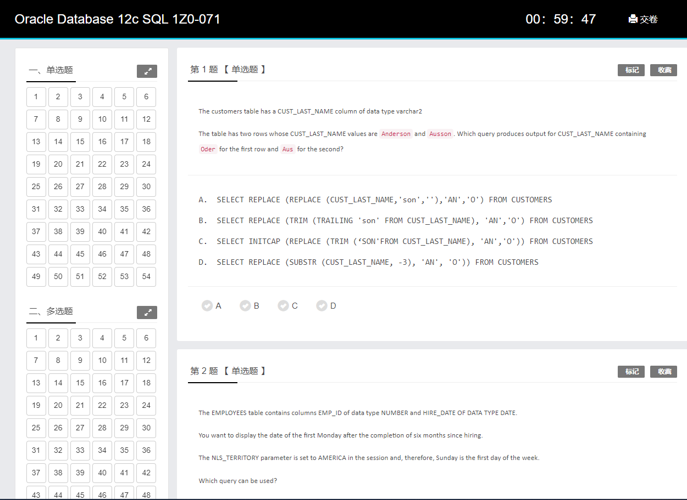
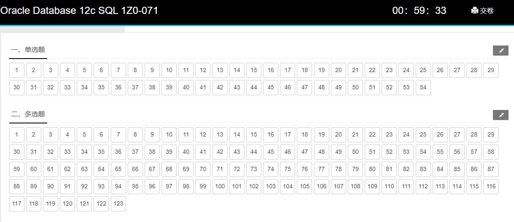

# 1Z0-071 题目概览

| 编号 | 知识点       | 题目数量 |
| ---- | -------------- | ---- |
| 1   | [单行函数](#单行函数)       | 25   |
| 2    | [组函数](#组函数)          | 4    |
| 3    | [多表连接](#多表连接)       | 13   |
|4    | [子查询](#子查询)         | 11   |
| 5    | [SQLPlus和变量](#sqlplus和变量)  | 4    |
| 6    | [DML语句的使用](#dml语句的使用)  | 14   |
| 7    | [DDL管理5大对象](#ddl管理5大对象) | 40   |
| 8    | [DCL管理用户](#dcl管理用户)    | 10   |
| 9    | [DQL语句的使用](#dql语句的使用)  | 46   |
| 10    | [事务和锁机制](#事务和锁机制)   | 11   |
|      |                | 178  |

# 1Z0-071 考点

- [Oracle数据库12c SQL 1Z0-071](https://education.oracle.com/products/pexam_1Z0-071)

考试价格：¥1077 | 时长：120分钟| 及格分数：63％| 78题

## 关系数据库的概念

- 解释关系数据库的理论和物理方面
- SQL Select语句中与ERD组件相关的子句
- 解释数据库和SQL之间的关系

## 限制和排序数据

- 在表达式中为运算符应用优先规则
- 限制SQL语句中返回的行
- 使用替代变量
- 使用DEFINE和VERIFY命令
- 排序资料

## 使用转换函数和条件表达式

- 将NVL，NULLIF和COALESCE函数应用于数据
- 了解隐式和显式数据类型转换
- 使用TO_CHAR，TO_NUMBER和TO_DATE转换函数
- 嵌套多个功能

## 显示来自多个表的数据

- 使用自联接
- 使用各种类型的联接
- 使用非等值连接
- 使用外部联接
- 了解和使用笛卡尔积

## 使用SET运算符

- 匹配SELECT语句
- 在设置操作中使用ORDER BY子句
- 使用INTERSECT运算符
- 使用MINUS运算符
- 使用UNION和UNION ALL运算符

## 管理索引同义词和序列

- 管理索引
- 管理同义词
- 管理序列

## 管理视图

- 管理视图

## 使用数据字典视图管理对象

- 使用数据字典视图

## 使用SQL SELECT语句检索数据

- 使用列别名
- 使用SQL SELECT语句
- 使用串联运算符，文字字符串，替代引号运算符和DISTINCT关键字
- 在SELECT语句中使用算术表达式和NULL值

## 使用单行功能自定义输出

- 在SQL SELECT和WHERE子句中使用字符函数处理字符串
- 用日期数据执行算术
- 使用ROUND，TRUNC和MOD功能处理数字
- 使用日期函数处理日期

## 使用组函数报告汇总数据

- 限制小组结果
- 创建数据组
- 使用群组功能

## 使用子查询解决查询

- 使用单行子查询
- 使用多个行子查询
- 使用相关子查询更新和删除行

## 使用DML语句管理表

- 管理数据库事务
- 控制交易
- 执行插入，更新和删除操作
- 执行多表插入
- 执行合并语句

## 使用DDL管理表及其关系

- 描述和使用表
- 描述和使用列和数据类型
- 建立表格
- 删除列并设置列UNUSED
- 截台
- 创建和使用临时表
- 创建和使用外部表
- 管理约束

## 控制用户访问

- 区分系统特权和对象特权
- 授予表权限
- 区分授予特权和角色

## 在不同时区管理数据

- 使用CURRENT_DATE，CURRENT_TIMESTAMP和LOCALTIMESTAMP
- 使用INTERVAL数据类型

# 单行函数

[OCP在线模拟考试系统](http://exam.toberoot.com)                                                                                                                                                                                                                                                                                                                                                                                                                                                                                                            				

自己搭建的LAMP架构的考试系统，有需要的邮件联系我。

部分考题

## 第 1 题 【 单选题 】

The customers table has a CUST_LAST_NAME column of data type varchar2

The table has two rows whose CUST_LAST_NAME values are `Anderson` and `Ausson`. Which query produces output for CUST_LAST_NAME containing `Oder` for the first row and `Aus` for the second?

---

A.  SELECT REPLACE (REPLACE (CUST_LAST_NAME,'son',''),'AN','O') FROM CUSTOMERS
B.  SELECT REPLACE (TRIM (TRAILING 'son' FROM CUST_LAST_NAME), 'AN','O') FROM CUSTOMERS
C.  SELECT INITCAP (REPLACE (TRIM (‘SON'FROM CUST_LAST_NAME), 'AN','O')) FROM CUSTOMERS
D.  SELECT REPLACE (SUBSTR (CUST_LAST_NAME, -3), 'AN', 'O')) FROM CUSTOMERS

---

**正确答案**

**A**

---

**试题解析**

考点：单行函数 字符串函数

Anderson and Ausson 转变为

Oder and Aus

观察后，

An 替换为'O'

son 替换为 ''

## 第 2 题 【 单选题 】

The EMPLOYEES table contains columns EMP_ID of data type NUMBER and HIRE_DATE OF DATA TYPE DATE.

You want to display the date of the first Monday after the completion of six months since hiring.

The NLS_TERRITORY parameter is set to AMERICA in the session and, therefore, Sunday is the first day of the week.

Which query can be used?

---

A.  SELECT EMP_ID, NEXT_DAY (ADD_MONTHS (HIRE_DATE, 6),’MONDAY’) FROM EMPLOYEES

B.  SELECT EMP_ID, ADD_MONTHS (HIRE_DATE, 6) NEXT_DAY (’MONDAY’) FROM EMPLOYEES

C.SELECT EMP_ID, NEXT_DAY (MONTHS_BETWEEN (HIRE_DATE, SYSDATE), 6) FROM EMPLOYEES

D.  SELECT EMP_ID, NEXT_DAY（ADD_MONTHS (HIRE_DATE, 6), 1) FROM EMPLOYEES

---

**正确答案**

**A**

---

**试题解析**

考点：单行函数 日期函数

题意 求六个月后的第一个星期一，时区设定一个星期第一天是星期天。

Next_day 指定日期的下一天

分析：A 对 指定 monday

B 错 格式错，不是内嵌函数

C 错 months_between 得出负数

D 错 没有指定星期一
