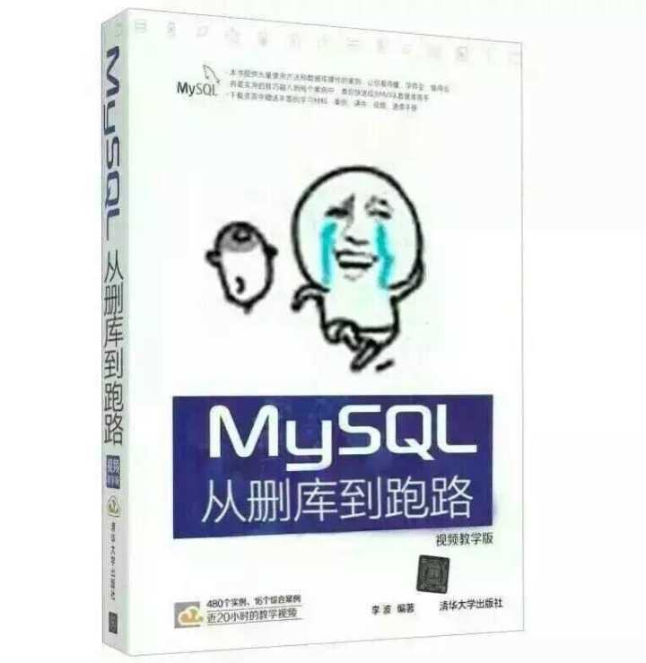

> 2019.11.17 BoobooWei

[TOC]

---
### 为什么要备份

服务器维护的工作永远都有一个不变的主题,那就是备份。正所谓,手里有粮,心里不慌。从事数据库相关工作一样永远都不要忘记一个重点:备份。因为,有了备份,我们就什么都不怕。出了任何问题(当然,我们善意的希望永远不要出什么问题),只要我们手上有完整的备份,那就有机会恢复回来。

2017年 1 月 31 日晚上恐怕是知名程序源码代管服务网站 GitLab 最长的一夜，因为一位工程师的疏忽造成大量资料流失，而又发现所有备份方案都无效而崩溃。

300GB 的资料被删到只剩下 4.5GB。而最后一个潜在可用的备份是 6 小时前手动操作的，一时之间连网站都连不进去了。根据该公司 Google docs 的维护纪录在最新的讯息提到：“这个事件影响了网站数据库（包括 issue 问题和 merge requests 合并请求），但不影响 git repos（git 版本管控档案库和 wiki 服务）。”

由于不是所有资料都遗失了，所以对用户来说还是稍感安慰，但是该文件在“遇到的问题”（Problems Encountered）小节里，最后总结：

“因此，换句话说，部署的 5 个不同备份／还原技术中，没有一个能可靠地工作或第一时间还原回来，我们只能从 6 小时前有效的备份还原。”

亡羊补牢为时不晚，GitLab 展现诚意以 YouTube 直播与 Twitter 将讯息公诸于网络，但是看来 GitLab 必须非常努力，才能挽回客户与投资者对该公司的信心。对其他依赖资讯科技的公司而言，相信这也是很好的借镜。

 2017-01-14 炉石传说罕见数据库事故！丢失30%数据，时间经纬如下：

* 1月14日15:20开始，数据库由于供电异常中断，数据损坏。 
*  接着数据库带病工作2天。 
*  1月16日凌晨开始进行修复维护。 
*  1月17日下午，维护时间超过30小时，数据“修复”失败，丢失数据超过30%，接着发出故障公告。 

**真实的原因到底是什么？**

嗯。其实你肯定看不到真实原因了，我只是在告诉你架构和维护的基本知识。

我们从几个不同的角度来解读这个问题。

老杨是运维界的老司机，而据了解涉及的库可能是Oracle，我们来看看从这个角度来分析，问题可能在哪些地方。

同时有双机热备+异地容灾，当然还应该有备份（哦，公告里说，备份数据也损坏了！），数据还是丢了30%，这又中了墨菲定律！

**那么这个架构的问题在哪里？**

从我的经验来看，这本身的架构有问题：

1. 备份几乎应该是假的！別懵，难道你家的所有数据库最近3个月做过恢复演练么？没有做过，就有可能是假的！书到用时方恨少，数据要恢复时方恨没有做演练！
2. 双机热备（或者是RAC）+异地容灾，对于一个想当然的情况来说，是可以的。但是，在16年的Salesforce文章中我就提过，你还是图样图森破了。你至少应该再搭建个DG，延时应用。如果你真做了就不可能丢失30%数据！

绝大部分的供电突然中断，导致的数据库故障，都是相对容易能解决的。极端情况下，可能要丢一部分数据，但绝不至于30%。

那么，唯一的可能原因，就是人为误操作了！

炉石传说这样的数据库架构，在银行、在运营商、在保险公司，并不少见。但是，如果这样的30%数据丢失，在任何一个这样的公司里，恐怕不只是DBA、运维负责人会没有年终奖，公司总裁都得下课吧！

———摘自《 [漫谈程序员(二十)炉石传说罕见数据库事故！丢失30%数据，疑似误操作？](https://blog.csdn.net/sunhuaqiang1/article/details/54628834) 》

### 备份的分类

1. 分类：冷备（俗称备份）、热备（俗称冗余）、异地灾备
2. 冷备（俗称备份）的分类：
	- 物理备份、逻辑备份
	- 完全备份、增量备份、差异备份
  - 在线（热）备份、温备份、离线（冷）备份

#### 什么是俗称的“备份”

> 俗称的备份，在学术分类上称为“冷备”
>
> 俗称的冗余，在学术分类上称为“热备”，例如双机热备

备份已经成为所有DBA的必修科目，到底什么是备份恢复呢？简单的讲：备份，就是把数据保存一份备用；恢复，就是把保存的数据还原回去。

当服务器出现故障需要修复，或者数据破坏需要恢复，又比如系统宕机、硬件损坏、用户错误删除数据等场景，都是需要借用备份才能执行恢复。

备份是备份，冗余是冗余。概念不一样，备份是将数据以隔离的方式保存，将备份的数据放在其他地方，原来的数据被上修改，备份的数据不会变更。也就是说备份出来的数据不会因为原数据的改变而改变，这样就比较安全。但是备份的缺点是，他不是瞬间还原，备份在还原过程中是有耗时的，他不是瞬间还原，例如，我们有几百个G的文件要还原回去，慢慢拷吧，几个小时。冗余不一样，他是热备，能够瞬间恢复。主服务器/从服务器，主服务器坏掉，从服务器就顶上工作，所以冗余在可用性上来讲，恢复的速度上来讲，比备份来的快，但是冗余有他的缺点，备份有他的优点，比如我们作主从同步，主服务器和从服务器数据都一样的，如果主服务器上有人错删了一个表，我们把这种操作称为误操作，那么从服务器也会发生误操作，所以呢，冗余不能解决人为的误操作，而备份可以解决。冗余他能解决硬件故障，但是误操作无法解决，备份不是瞬间还原，但是既可以解决硬件故障又能解决误操作，他们各有优劣点，而真实的线上生产环境是两种方法一起使用，既有冗余环境，又有周期性备份，管理员要周期性地进行备份，同时有多台服务器作冗余。

| 备份         | 定义                                                         | 优点                 | 缺点                         |
| :----------- | :----------------------------------------------------------- | :------------------- | :--------------------------- |
| 备份（冷备） | 将数据以隔离的方式保存                                       | 解决硬件故障，误操作 | 不是瞬间还原                 |
| 冗余（热备） | 人为地增加重复部分，其目的是用来对原本的单一部分进行备份，以达到增强其安全性的目的,构建冗余的环境 | 恢复速度快           | 解决硬件故障，误操作无法解决 |

##### 冷备的两大要素

实际上有两类一致性需要考虑：数据一致性和文件一致性。

- 数据一致性：备份数据在指定时间点一致
- 文件一致性：确保文件在磁盘上一致
- 服务可用性：数据库是否可以读写，既能读也能写才是服务可用。

当我们在备份数据的时候，如果有人在修改表的内容，那么我们备份出来的数据可能就会有问题，备份出来的数据可能不是我们要的时间点。比如我需要将4点这个状态的数据备份，从4点开始备份一直到5点结束，在这个过程中，有人在4.30修改一个数据，假设是将A员工的工资从4000改为5000，那么我们最后备份出来的数据到底是几点的状态就未知了。如果4.30的时候已经备份过A员工了，那么我们备份出来的A员工的工资就还是4000；如果4.30的时候还没有备份到A员工，那么我们最后备份出来的A员工的工资就变成5000了。这就是数据不一致的情况，那么我们如何来保证数据一致呢？

#### 逻辑备份和物理备份 

逻辑备份包含逻辑数据，例如表和存储过程。您可以使用Oracle数据泵将逻辑数据导出到二进制文件，然后可以将其导入数据库。数据泵命令行客户端，`expdp`并`impdp`使用`DBMS_DATAPUMP`和`DBMS_METADATA`PL/SQL包。 

 物理备份是用于存储和恢复数据库的物理文件的副本。这些文件包括数据文件，控制文件和存档的重做日志。最终，每个物理备份都是将数据库信息存储到另一个位置的文件副本，无论是在磁盘上还是在磁带等脱机存储介质上。 

物理备份是任何合理的备份和恢复策略的基础。在许多情况下，逻辑备份是对物理备份的有用补充，但如果没有物理备份，逻辑备份不足以防止数据丢失。 

#### 完全备份、增量备份、差异备份

当数据量很庞大时，一个常见的策略是做定期的增量或差异备份。他们之间的区别有点容易让人混淆，所以先来澄清这两个术语：

差异备份，是对自上次全备份后所有改变的部分而做的备份；
增量备份，是从任意类型的上次备份后所有修改做的备份；

例如，假设每周日做一个全备份。在周一，对自周日以来所有的改变做一个差异备份。在周二，就有两个选择：备份自周日以来所有的改变（差异），或只别分自周一后所有的改变（增量）。

增量和差异备份都是部分备份：它们一般不包含完整的数据集，因为某些数据几乎肯定没有改变。部分备份对减少服务器开销、备份时间及备份空间而言都很合适。尽管某些部分备份并不会真正减少服务器的开销。例如Percona XtraBackup和MySQL Enterprise Backup，仍然会扫描服务器上的所有数据块，因而并不会节约太多的开销，但它们确实会减少一定量的备份时间和大量用于压缩的CPU时间，当然也会减少磁盘空间使用。

不要因为会用高级备份技术而自负，解决方案越复杂，面临的风险也越大。要注意分析隐藏的危险，如果多次迭代备份紧密地耦合在一起，则只要其中的一次迭代备份有损坏，就可能导致所有的备份都无效。

增量备份的缺点包括增加恢复复杂性，额外的风险，以及更长的恢复时间。如果可以做全备，考虑到简便性，我们建议尽量做全备。

不管如何，还是需要经常做全备份——建议至少一周一次。你肯定不希望使用一个月的所有增量备份来进行恢复。即使一周也还是有很多的工作和风险的。

#### 在线（热）备份、温备份、离线（冷）备份

如果可能，关闭Oracle做备份是最简单最安全的，也是所有获取一致性副本的方法中最好的，而且损坏或不一致的风险最小。

尽管如此，让服务器停机的代价可能比看起来要更昂贵。即使能最小化停机时间，在高负载和高数据量下关闭和重启Oracle也可能要花很长一段时间。因此，必须要设计不需要生产服务器停机的备份。即便如此，由于一致性的需要，对服务器进行在线备份仍然会有明显的服务中断。

- 离线（冷）备份:备份过程中，服务中断
- 温备份：备份过程中，只能读不能写
- 在线（热）备份：备份过程中，服务正常使用

### 冷备和恢复的工具

* exp/imp
* expdp/impdp
* RMAN

### 热备的架构

### 异地灾备的架构

