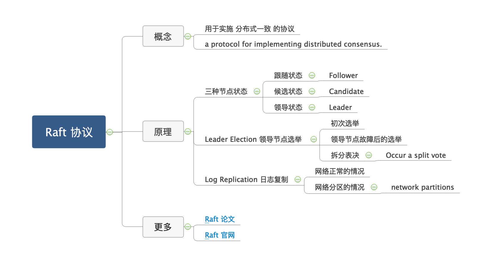
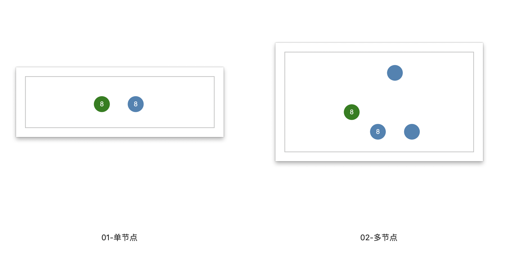
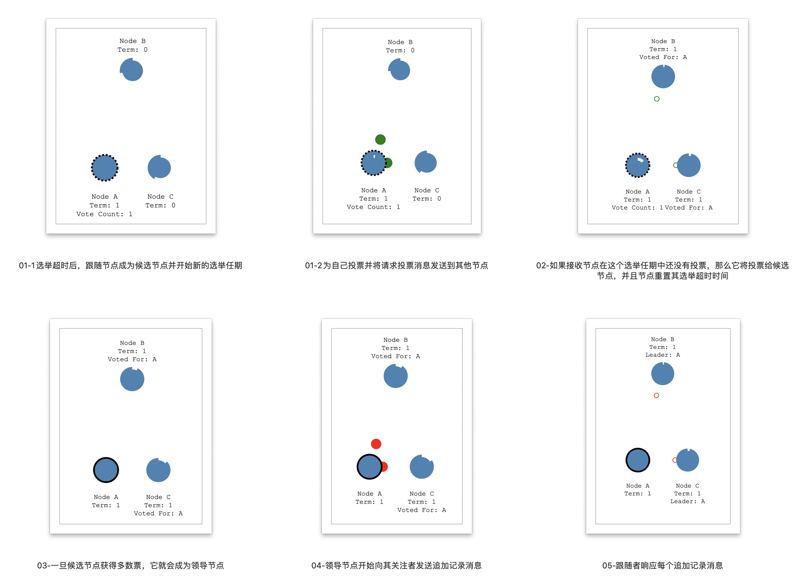
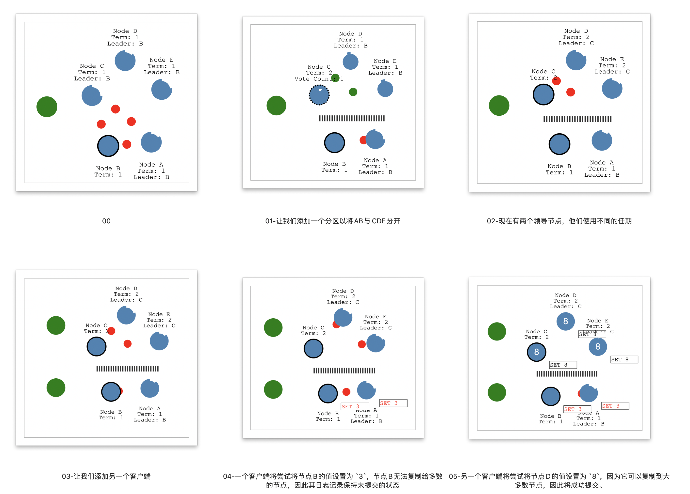
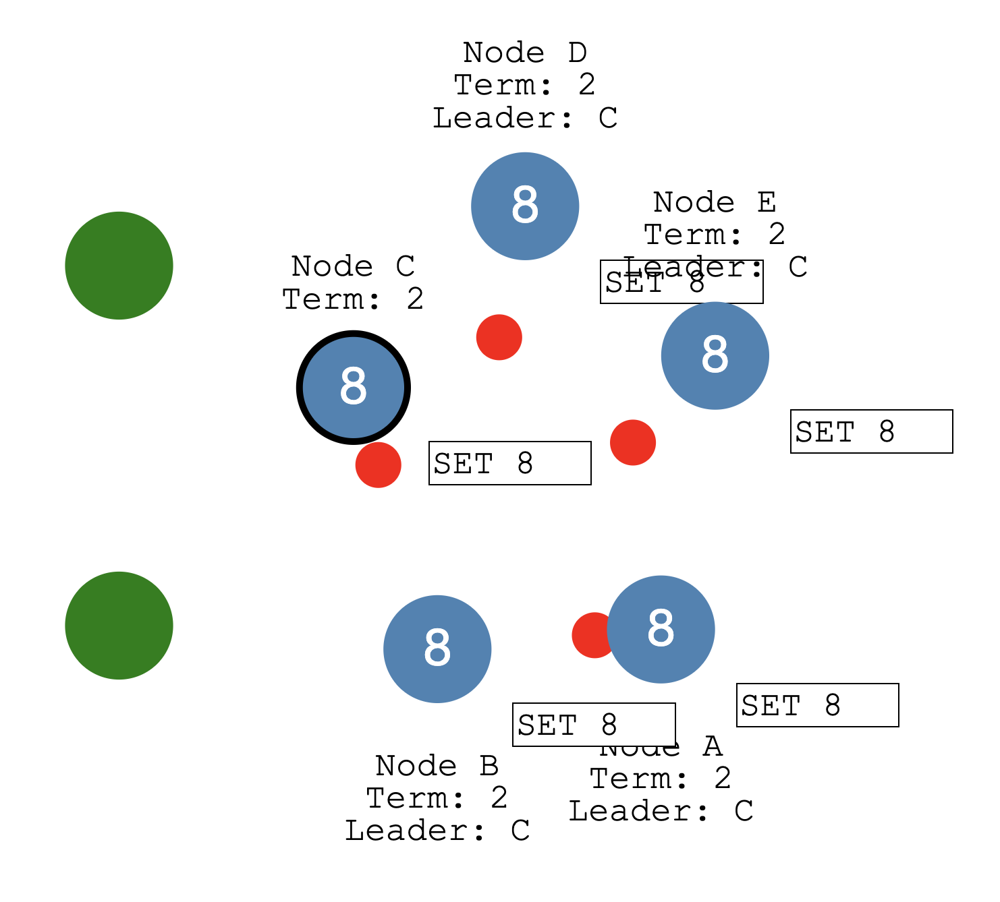

# English

## What is Distributed Consensus?

### an example

Let's start with an example...

Let's say we have a single node system.For this example, you can think of our node as a database server that stores a single value. We also have a client that can send a value to the server. Coming to agreement, or *consensus*, on that value is easy with one node. But how do we come to consensus if we have multiple nodes? That's the problem of **distributed consensus**.

**Raft** is a protocol for implementing distributed consensus.

### how it works

Let's look at a high level overview of how it works.

#### 3 states

A node can be in 1 of 3 states:

* The *Follower* state

* The *Candidate* state

* The *Leader* state

All our nodes start in the follower state. If followers don't hear from a leader then they can become a candidate. The candidate then requests votes from other nodes. Nodes will reply with their vote. The candidate becomes the leader if it gets votes from a majority of nodes. This process is called **Leader Election**.

All changes to the system now go through the leader. Each change is added as an entry in the node's log. This log entry is currently uncommitted so it won't update the node's value. To commit the entry the node first replicates it to the follower nodes then the leader waits until a majority of nodes have written the entry.

The entry is now committed on the leader node and the node state is "5". The leader then notifies the followers that the entry is committed. 

The cluster has now come to consensus about the system state. This process is called **Log Replication**.

#### Leader Election

In Raft there are two timeout settings which control elections.

* **the election timeout**

* **the heartbeat timeout**

##### Leader Election process

Leader Election process：

* The election timeout is the amount of time a follower waits until becoming a candidate.
* The election timeout is randomized to be between 150ms and 300ms.
* After the election timeout the follower becomes a candidate and starts a new *election term*...and sends out *Request Vote* messages to other nodes.
* If the receiving node hasn't voted yet in this term then it votes for the candidate and the node resets its election timeout.
* Once a candidate has a majority of votes it becomes leader.
* The leader begins sending out *Append Entries* messages to its followers.
* These messages are sent in intervals specified by the heartbeat timeout.
* Followers then respond to each *Append Entries* message.
* This election term will continue until a follower stops receiving heartbeats and becomes a candidate.

##### Stop Leader Node

让我们停止领导节点，观察重新选举的过程。

* Node B is now leader of term 2.

* Requiring a majority of votes guarantees that only one leader can be elected per term.

##### Occur a split vote

If two nodes become candidates at the same time then a split vote can occur. Let's take a look at a split vote example...

* Two nodes both start an election for the same term and each reaches a single follower node before the other.

* Now each candidate has 2 votes and can receive no more for this term.

* The nodes will wait for a new election and try again.

* Node A received a majority of votes in term 5 so it becomes leader.

#### Log Replication

Once we have a leader elected we need to replicate all changes to our system to all nodes.

This is done by using the same *Append Entries* message that was used for heartbeats.

##### Log Replication process

Let's walk through the process.

* First a client sends a change to the leader.
* The change is appended to the leader's log, then the change is sent to the followers on the next heartbeat.
* An entry is committed once a majority of followers acknowledge it and a response is sent to the client.
* Now let's send a command to increment the value by "2". 
* Our system value is now updated to "7".

##### network partitions

Raft can even stay consistent in the face of network partitions.

* Let's add a partition to separate A & B from C, D & E.
* Because of our partition we now have two leaders in different terms.
* Let's add another client and try to update both leaders.
* One client will try to set the value of node B to "3".
* Node B cannot replicate to a majority so its log entry stays uncommitted.
* The other client will try to set the value of node D to "8".
* This will succeed because it can replicate to a majority.

Now let's heal the network partition.

* Node B will see the higher election term and step down.
* Both nodes A & B will roll back their uncommitted entries and match the new leader's log.
* Our log is now consistent across our cluster.
## For more information

### [The Raft Paper](https://raft.github.io/raft.pdf)

### [Raft Web Site](http://raftconsensus.github.io/)

# 中文

## 什么是分布式一致？

### 一个例子

让我们从一个例子开始学习。

假设我们有一个单节点系统，在此示例中，我们可以将节点看成存储单个值的数据库服务器，我们还有一个可以将值发送到服务器的客户端。一个节点就很容易就该值达成协议或*一致*。但是，如果我们有多个节点，我们如何达成一致？这就是**分布式一致**的问题。

**Raft** 是用于实施 **分布式一致** 的**协议**。

### 工作原理

让我们看一下它的工作原理。

#### 三种节点状态

* 跟随状态
* 候选状态
* 领导状态

所有的节点都以跟随状态开始；如果跟随节点没有收到领导节点的信息，那么他们可以成为候选节点；然后候选节点向其他节点请求投票，其他节点将投票表决；如果候选节点从多数节点中获得选票，它将成为领导节点；这个过程称为 **领导节点选举**。

系统的所有变更都是通过领导节点进行；当前的变更是未提交的状态，因此不会更新节点的值；领导节点将每次的变更记录到节点日志中，并同步给跟随节点；领导节点开始等待跟随节点的反馈，直到大多数节点都写了该记录并反馈给领导节点；领导节点收到反馈后提交变更，并通知跟随节点；跟随节点收到领导节点的提交信息后，也进行提交；此时集群已就系统状态达成一致。这个过程称为 **日志复制**。

> ① 接收客户端变更请求 --> 记录日志 --> 同步日志 --> 等待反馈 -->与随节点达成一致 --> 提交变更并通知跟随节点 --> 反馈客户端
>
> ② 接收客户端变更请求 --> 记录日志 --> 同步日志 --> 等待反馈 --> 未与随节点达成一致 --> 回滚变更并通知跟随节点 --> 反馈客户端

#### 领导节点选举

在 Raft 协议中，有两个超时设置可控制选举过程：

* **选举超时**：跟随节点成为候选节点之前要等待的时间，被随机分配在150毫秒至300毫秒之间。
* **心跳超时**

##### 初次选举的情况

选举过程如下：

① 选举超时后，跟随节点成为候选节点并开始新的**选举任期** ，为自己投票并将**请求投票**消息发送到其他节点。

② 如果接收节点在这个选举任期中还没有投票，那么它将投票给候选节点，并且节点重置其选举超时时间。

③ 一旦候选节点获得多数票，它就会成为领导节点。

④ 领导节点开始向其关注者发送 **追加记录** 消息。这些消息以 **心跳超时** 指定的时间间隔发送。

⑤ 跟随者响应每个**追加记录** 消息。

⑥ 此选举任期将持续到追随者停止接收心跳并成为候选人为止。

##### 领导节点故障后的情况

让我们停止领导节点A，继续观察选举的过程。

① 节点B现在是任期2的候选节点。

② 候选节点需要获得多数节点的投票，才可以保证每个任期内只选出一位领导节点。

③ 此时节点B获得自己和节点C的投票，成为新的领导节点。

##### 拆分表决的情况

如果两个节点同时成为候选节点，则可能发生拆分表决的情况。让我们一起来看一个例子：

* 两个节点都开始以相同的任期4进行选举
* 每个都先到达一个跟随者节点。
* 现在，每位候选人都有2票，并且在这个任期中将无法获得更多选票
* 开启新一轮的选举
* 节点B在第5届中获得了多数选票，因此成为领导节点。

#### 日志复制

##### 网络正常的情况

一旦我们开始选举领导节点，就需要将系统所有的变化复制到所有节点。通过使用与心跳相同的 **追加记录**消息来完成此操作。

让我们逐步完成该过程：

* 首先，客户将请求 `set 5` 发送给领导节点。
* 然后在下一次心跳时将变更记录发送给跟随节点。
* 一旦大多数追随节点认可，领导节点便提交该记录。
* 然后将响应发送给客户端。
* 现在，让我们发送一条命令，将值增加 **2** `add 2`。
* 我们的系统值现在更新为`7`。

##### 网络分区的情况

面对网络分区，Raft 也可以保持一致。

构建不一致场景：

* 让我们添加一个分区以将	A＆B 与 C，D＆E 分开。
* 由于我们的分区，我们现在有两个领导节点，他们使用不同的任期，分别是 `Term 1` 和 `Term 3`。
* 让我们添加另一个客户端，并尝试更新两个领导节点。
* 一个客户端将尝试将节点B的值设置为 `3`，节点B无法复制给多数的节点，因此其日志记录保持未提交的状态。
* 另一个客户端将尝试将节点D的值设置为 `8`，因为它可以复制到大多数节点，因此将成功提交。

修复网络分区：

* 节点B将看到比自己高的选举任期编号`Term 3`，因此退出领导状态。
* 节点A和B都将回滚其未提交的记录并匹配新领导节点的日志。
* 现在，我们的日志在整个集群中恢复一致了。

## 更多的信息

### [Raft 论文](https://raft.github.io/raft.pdf)

### [Raft 官网](http://raftconsensus.github.io/)

