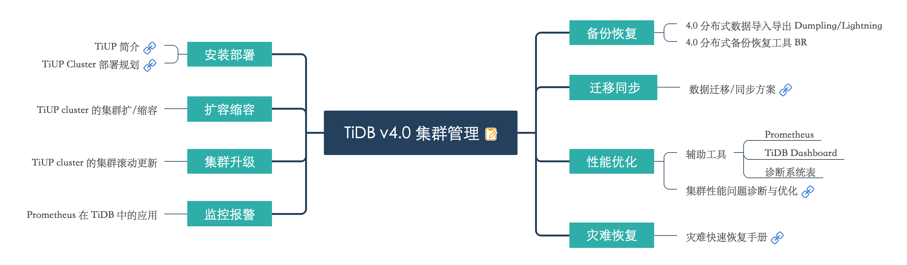

> 生产管理实践积累

# 概览



## 安装部署

* [A-01-TiUP简介](/database/tidb/tidb_cluster/A-01-TiUP简介.html)
* [A-02-TiUPCluster部署规划](/database/tidb/tidb_cluster/A-02-TiUPCluster部署规划.html)
* [A-03-AWS跨AZ部署TiDB](/database/tidb/tidb_cluster/A-03-AWS跨AZ部署TiDB.html)


## 扩容缩容

## 集群升级

## 监控告警

## 备份恢复

## 迁移同步

## 性能优化

## 灾难恢复


```bash
ll *.md | awk '{print "* ["$9"](/database/tidb/tidb_cluster/"$9")"}' | sed 's/.md//'|sed 's/.md/.html/g'
```
