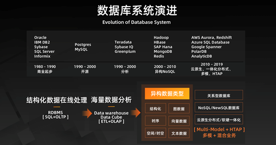

## 学习时长

10min

## 课程收获

了解分布式数据库的发展历史

## 课程内容

> 本课程简要介绍了从 20 世纪到 21 世纪分布式数据库的发展历史。

### 数据库系统演进

数据库已经发展了 40 年，可以说是一个传统又古老的领域，回顾数据库的发展历史：
* 1980 年到 1990 年属于商业起步阶段，此时 Oracle、IBM DB2、Sybase 以及 SQL Server 和 Informix 等开始出现。
* 1990 年至 2000 年，开源数据库开始展露头角，出现了 PostgreSQL 和 MySQL 等。与此同时，出现了一些分析型数据库，因为之前出现的都是 OLTP，而现在随着大量数据的出现，需要对于这些数据进行分析，因此出现了 OLAP，而为了避免读写冲突，就需要建立分析型数据库系统，Teradata、Sybase IQ、Greenplum 等就快速成长起来。
* 2000 年到 2010 年期间，以谷歌为代表的互联网公司逐渐推出了 NoSQL 数据库。尤其是谷歌的 GFS（Google File System）、Google Bigtable、Google MapReduce 三大件。Google File System 解决了分布式文件系统问题，Google Bigtable 解决了分布式 KV（Key-Value）存储的问题，Google MapReduce 解决了在分布式文件系统和分布式 KV 存储上面如何做分布式计算和分析的问题。之所以产生了这三大件，是因为数据强一致性对系统的水平拓展以及海量数据爆发式增长的分析能力出现了断层。因此就需要解决这个问题，把这种数据的强一致性需求弱化，换来能够使用用分布式的集群做水平拓展处理。谷歌三大件在业界诞生以后，很快的衍生了一个新的领域叫 NoSQL（Not Only SQL），就是针对非结构化、半结构化的海量数据处理系统。现在也有很多很好的商业公司基于 NoSQL 发展，比如说文档数据（MongoDB）、缓存（Redis）等大家平常应用开发都会用到的 NoSQL 系统。
* 而在 2010 年以后，AWS Aurora、Redshift、Azure SQL Database、Google Spanner 以及阿里云的 POLARDB 和 AnalyticDB 等都发展起来了，它们的特点就是云原生、一体化分布式、多模和 HTAP 的能力。

总结而言，数据库的演进经历了从结构化数据在线处理到海量数据分析，从 SQL+OLAP 的 RDBMS 到 ETL+OLAP 的 Data Warehouse 和 Data Cube，再到今天异构多源的数据类型的发展历程。

### 数据库发展：业务视角

大家知道，数据库可以分为几类：

* 最经典的是传统关系型 OLTP 数据库，其主要用于事务处理的结构化数据库，典型例子是银行的转账记账、淘宝下单、订单以及商品库存管理等。其面临的核心挑战是高并发、高可用以及高性能下的数据正确性和一致性。
* 其次是 NoSQL 数据库及专用型数据库，其主要用于存储和处理非结构化或半结构化数据（如文档，图，时序、时空，K-V），不强制数据的一致性，以此换来系统的水平拓展、吞吐能力的提升。
* 再次是分析型数据库 (On-Line Analytic Processing， OLAP)，其应用场景就是海量的数据、数据类型复杂以及分析条件复杂的情况，能够支持深度智能化分析。其面临的挑战主要是高性能、分析深度、与 TP 数据库的联动，以及与 NoSQL 数据库的联动。
* 除了数据的核心引擎之外，还有数据库外围的服务和管理类工具，比如数据传输、数据备份以及数据管理等。
* 最后就是数据库的管控平台，无论是私有云、专有云、混合云还是自己的 IDC 机房内进行部署，总要有一套数据库管控系统来管理数据库实例的产生和消亡、实例的资源消费等，能够以简单的形式提供给 DBA 以及数据库开发者。

### TiDB的定位

TiDB 是一款定位于在线事务处理/在线分析处理（ HTAP: Hybrid Transactional/Analytical Processing）的融合型数据库产品，实现了一键水平伸缩，强一致性的多副本数据安全，分布式事务，实时 OLAP 等重要特性。同时兼容 MySQL 协议和生态，迁移便捷，运维成本极低。

## 学习过程中参考的其他资料

- [李飞飞：如何看待数据库的未来？](https://www.infoq.cn/article/it7eibufvj2lpy4bdrgy)
- [视频教程-1.1 A Brief History of Distributed Database （分布式数据库发展简史）](https://university.pingcap.com/courses/TiDB%204.0%20%E6%96%B0%E6%89%8B%E6%8C%87%E5%8D%97/chapter/101-%E7%AB%A0%E8%8A%82/lesson/A-Brief-History-of-Distributed-Database)

