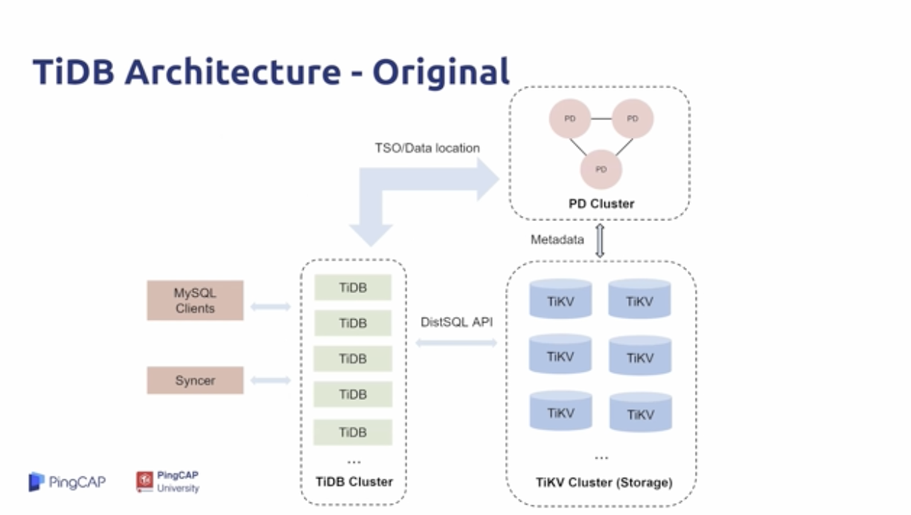
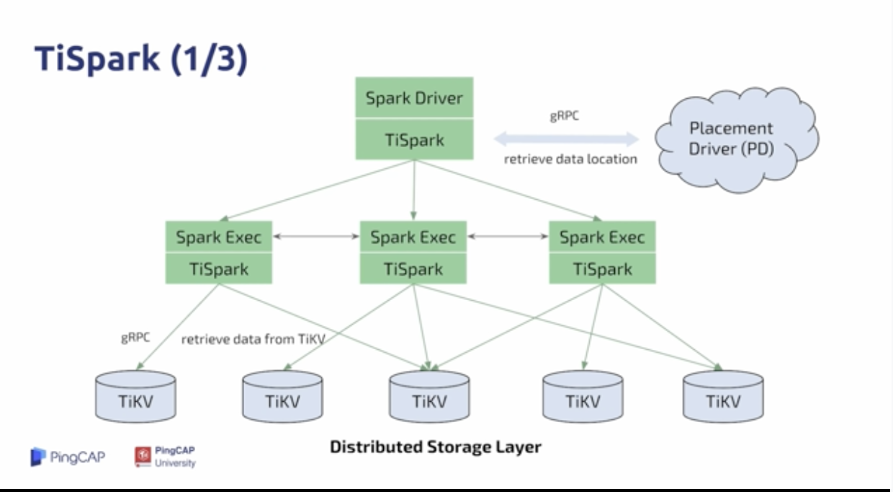
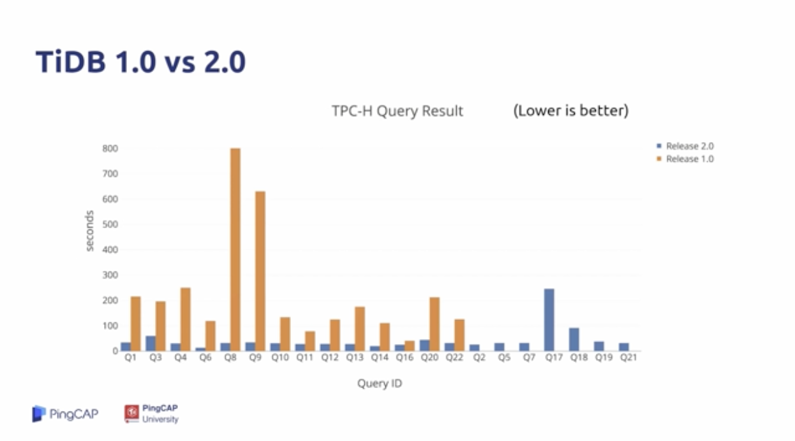
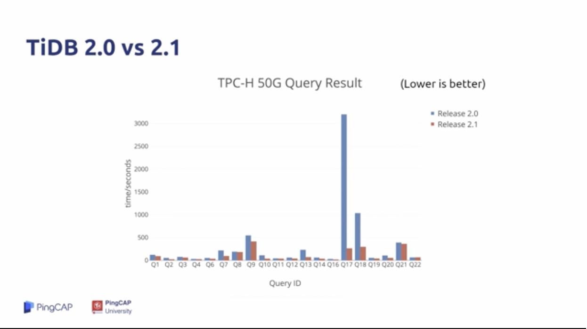
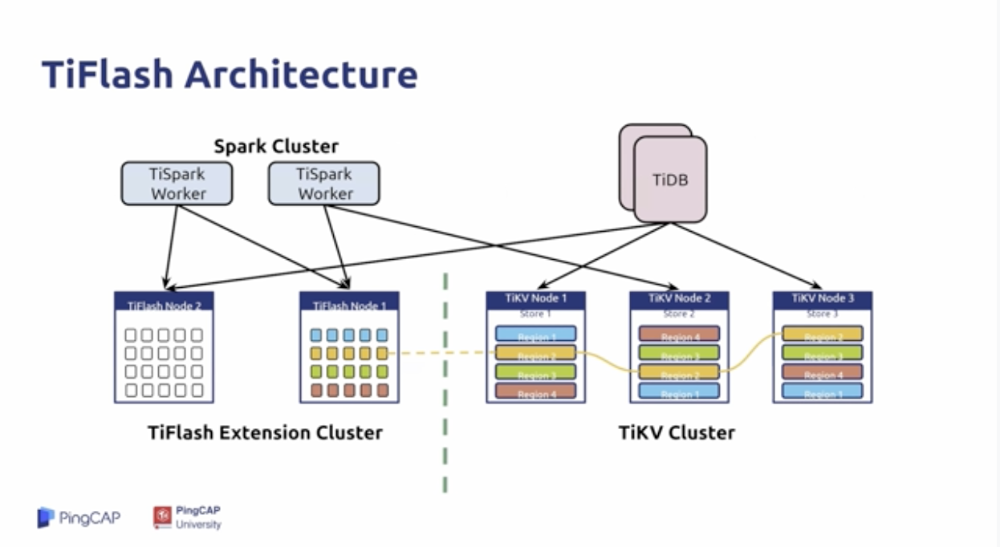
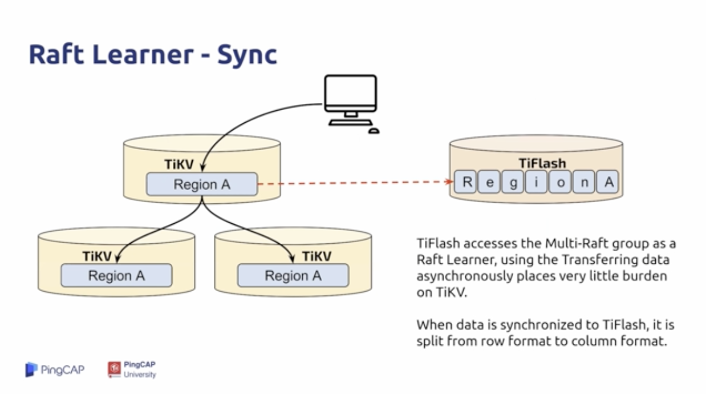
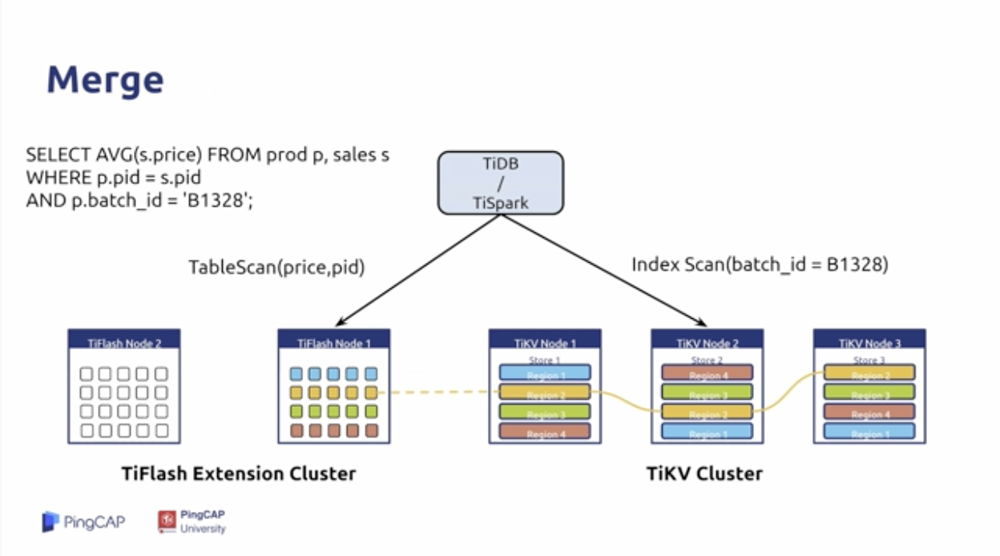
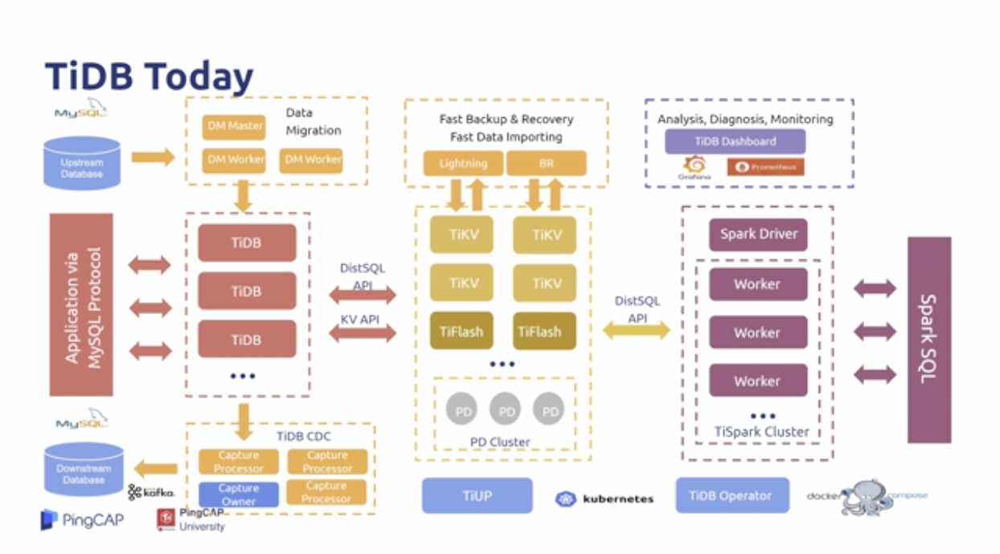

## 学习时长：

30min

## 课程收获：

了解 TiDB 的发展历史

## 课程内容：

> 本课程简要介绍了 TiDB 的发展历史。自从 v1.0.0 GA 开始，TiDB 做到了：可以从计算和存储两个层面的无限扩展，兼容了 MySQL 的语法和协议，强一致的真分布式事务。到今天，TiDB 可以称为一个真正的 HTAP 系统，不需要 ETL 工具进行数据转换，在系统运行 OLTP 业务时，也可以方便的进行报表查询。

A Brief History of the TiDb Database Platform

时间线：早期的TiDB，TiSpak TiDB，TiFlash TiDB

### 早期的TiDB

 

* Google Spanner
* 1.0.0 GA 兼容 MySQL 协议
* TiDB Cluster _ TiDB * N
* TiKV Cluster _ TiKV * N
* PD Cluster _ PD * N
* 作为数据中台，汇聚数据的应用较多
* 问题：TP场景的问题较多；AP场景下复杂查询较慢、总是OMM；无法与大数据平台集成

### TiSpak TiDB

 

* 为了解决上面的问题，TiSpark诞生了，分布式计算框架
* 将单点的计算能力拓展成多节点的并行计算能力
* 同时无缝地接入大数据平台，像 R语言、Python、Apache Zeppelin、Hadoop
* 缺点：并发低、消耗大量的计算资源、用户希望使用高并发的同时进行一些中等程度的AP查询

在这一点上TiDB 要比 TiSpark适合很多：
1. 复杂计算消耗的资源更少
2. TiDB 的维护成本更低

引入TiSpark的同时，对TiDB的优化：
1. 优化器的优化：简单的优化器 ==> RBO + CBO ==> Cascades Optimizer (WIP)
2. 执行器的优化：经典火山模型 ==> 并发执行 ==>  向量化执行；以及更好的并发控制
3. 其他的新特性：分区表、Index Merge等

这些都对复杂计算有巨大的提升。

 
 

两个核心矛盾未解决：
1. 行存不适合做分析
2. 没有资源隔离

### TiFlash TiDB

通过Raft Learner独立同步一组列存储:
* Raft Learner提供极低消耗的副本同步
* Raft Learner读协议可与MVCC配合使用，以提供强一致读

通过标签 Label 进行物理资源隔离：
* AP/TP 工作负载不会互相影响

 

* TiFlash 作为只读节点，可以处理来自TiSpark 和 TiDB 的读请求；
* TiFlash 的数据是通过 Raft Learner 同步过来，通过列存的形式保存下来

 
 

将不同的SQL发送到不同的搜索引擎中：
* 通过TiKV进行索引的扫描
* 通过TiFlash进行某两列的扫描

### Till Now

* TiDB 不需要你去选择 TP/AP 
* 一个平台，既有行存又有列存 row and column storage 无需ETL工具进行同步
* 在系统运行TP业务时也可以方便进行报表查询

 

* 同步上游数据：DM
* 同步下游数据：TiDB CDC
* 监控告警：TiDB Dashboard——Prometheus
* 安装部署：TiUP \ TiDB Operator 分别对应TiDB 虚拟和物理部署

## 学习过程中参考的其他资料

- [视频教程-1.3 A Brief History About the TiDB database platform（TiDB 发展简史）](https://university.pingcap.com/courses/TiDB%204.0%20%E6%96%B0%E6%89%8B%E6%8C%87%E5%8D%97/chapter/101-%E7%AB%A0%E8%8A%82/lesson/A-Brief-History-About-the-TiDB-database-platform)
- [ TiDB 的现在和未来](https://pingcap.com/blog-cn/the-future-and-past-of-tidb/)
- [Google Spanner](https://en.wikipedia.org/wiki/Spanner_(database))
- [ TiDB 生态工具功能概览](https://docs.pingcap.com/zh/tidb/stable/ecosystem-tool-user-guide)
