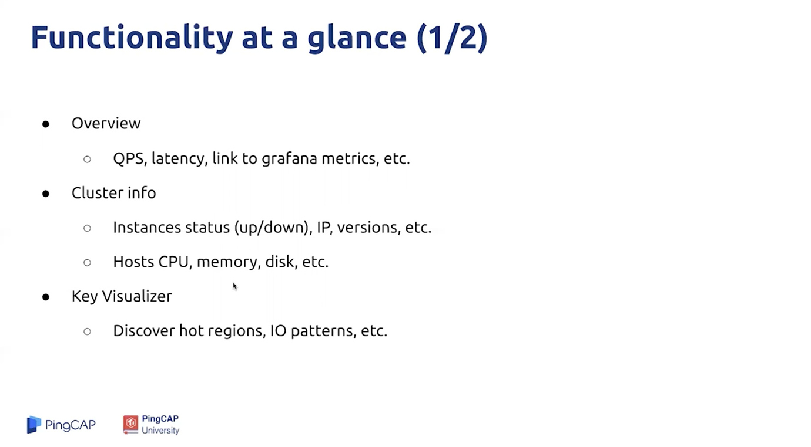
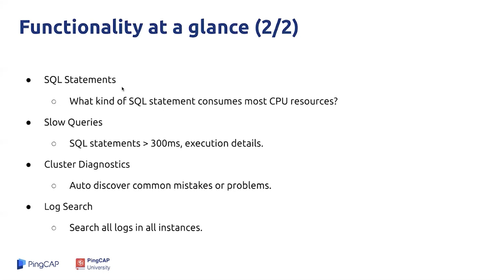
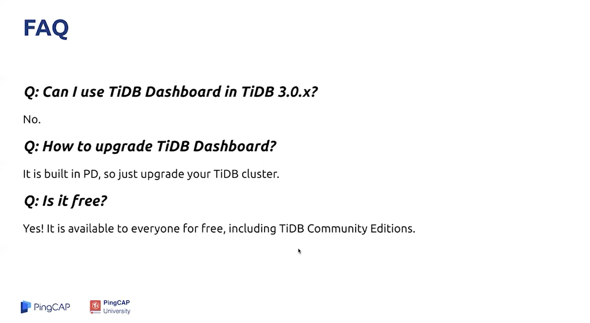

## 学习时长：

30min

## 课程收获：

* 了解如何访问 TiDB Dashboard
* 了解如何通过 TiDB Dashboard 进行问题诊断

## 课程内容：

本课程介绍了 TiDB Dashboard 的部署、访问和基本功能。

### TiDB Dashboard 

从4.0版本开始，TiDB 提供了一个新的 Dashboard 运维管理工具，集成在 PD 组件上，默认地址为 `http://pd-url:pd_port/dashboard` 。不同于 Grafana 监控是从数据库的监控视角出发，TiDB Dashboard 从 DBA 管理员角度出发，最大限度的简化管理员对 TiDB 数据库的运维，可在一个界面查看到整个分布式数据库集群的运行状况，包括：
* 数据热点
* SQL 运行情况
* 集群信息
* 日志搜索
* 实时性能分析

更多内容：

* [识别集群热点和业务访问模](https://book.tidb.io/session3/chapter2/key-vis.html)
* [分析 SQL 执行性](https://book.tidb.io/session3/chapter2/statements.html)
* [生成集群诊断报告](https://book.tidb.io/session3/chapter2/diagnosis-report.html)
* [日志搜索和导](https://book.tidb.io/session3/chapter2/log-export.html)
* [分析组件 CPU 消耗情](https://book.tidb.io/session3/chapter2/profiling.html)

 

 

## 学习过程中参考的其他资料

- [视频教程-2.3.6 How to use TiDB Dashboard（如何使用 TiDB Dashboard）](https://university.pingcap.com/courses/TiDB%204.0%20%E5%BA%94%E7%94%A8%E5%BC%80%E5%8F%91%E6%8C%87%E5%8D%97/chapter/201-%E7%AB%A0%E8%8A%82/lesson/How-to-use-TiDB-Dashboard)
- [ 第 2 章 TiDB Dashboard 介绍](https://book.tidb.io/session3/chapter2/tidb-dashboard-intro.html)

