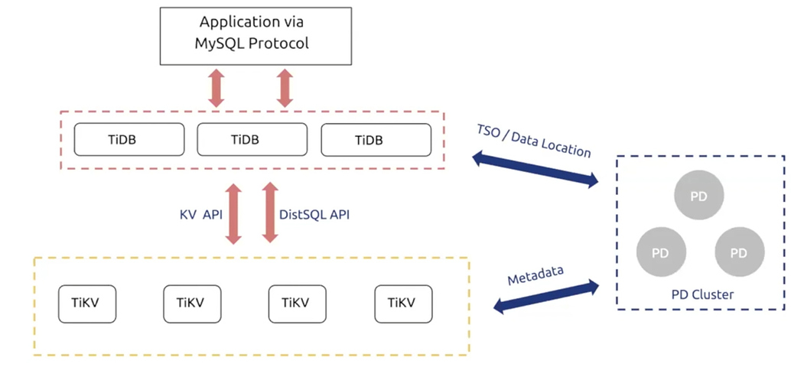
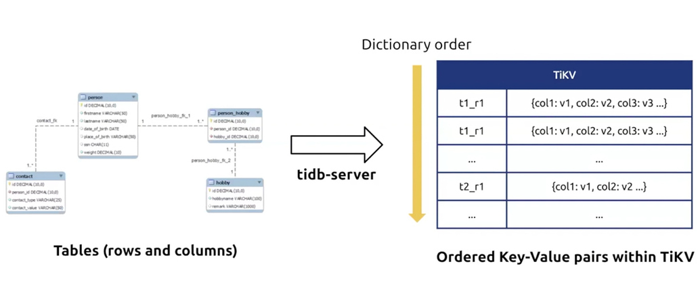
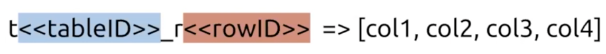
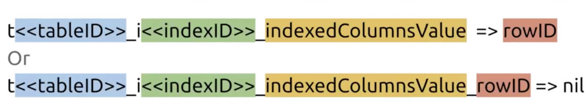
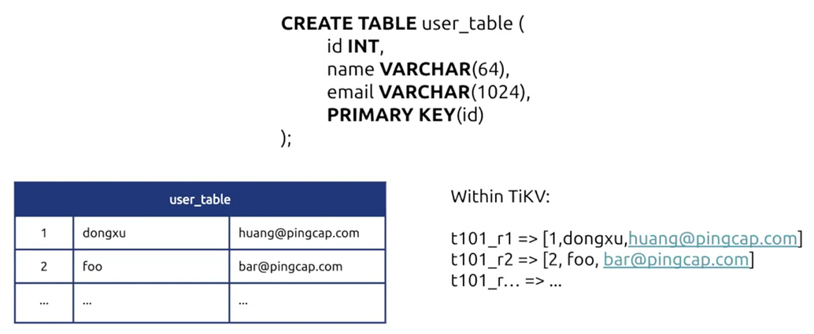
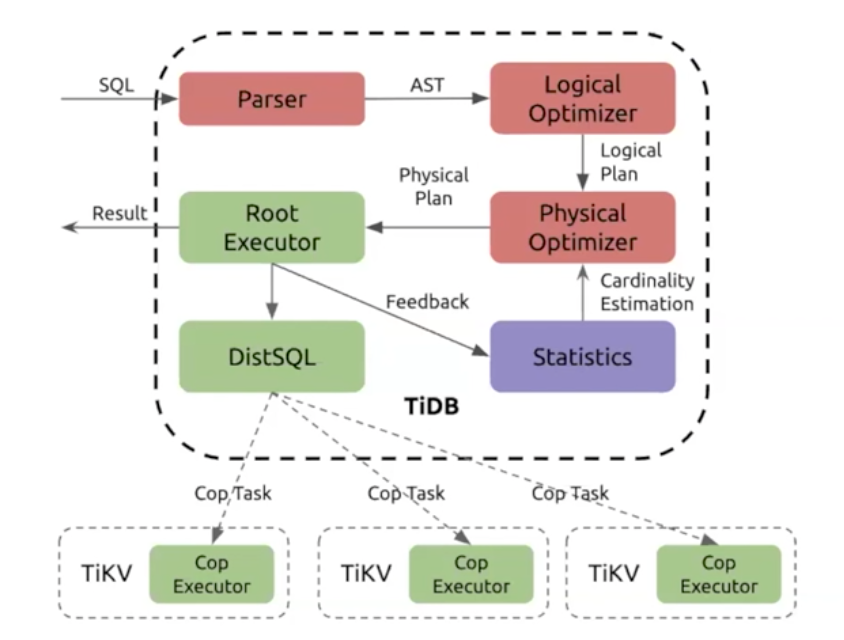
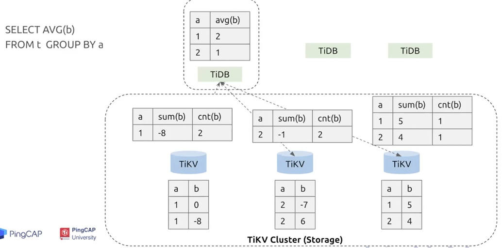

## 学习时长：

130min

## 课程收获：

了解 TiDB 的基本架构及它是怎么处理 SQL 的

## 课程内容：

> 本课程简要介绍 TiDB 的基本架构，并以一条查询 SQL 为例，介绍 TiDB 是怎么把关系型数据变换为 KV 数据存储在 TiKV 中，同时介绍 SQL 会怎么被 TiDB 执行。

### TiDB 的基本架构

    

#### PD Cluster

PD的两个作用:

  - 分配全局唯一时间戳TSO，作为事务的ID
  - 为TiDB提供数据位置信息

### TiKV架构

  

- 数据被划分为多个region，每个region有多个副本，保证高可用
- 多通过raft算法实现一致性
- 数据组织

     
    * 对于表中的行数据进行如下转换：     

      
    * 如果表中存在二级索引的列，则进行如下转换：

      

* 转换例子

  

### 一条SQL的生命周期

仅介绍查询类SQL

  
    

  - 查询优化

    - SQL解析器=>AST
    - 逻辑优化器
    - 物理优化器
    - 统计信息

  - 查询执行

    - Root executor
    - DistSQL
    - Coprocessor executor（计算下推）

  - 举例说明

    - 

### TiDB 源码阅读

- [TiDB 源码阅读系列文章（一）序](https://pingcap.com/blog-cn/tidb-source-code-reading-1/)
- [TiDB 源码阅读系列文章（二）初识 TiDB 源码](https://pingcap.com/blog-cn/tidb-source-code-reading-2/)
- [TiDB 源码阅读系列文章（三）SQL 的一生](https://pingcap.com/blog-cn/tidb-source-code-reading-3/)
- [TiDB 源码阅读系列文章（四）Insert 语句概览](https://pingcap.com/blog-cn/tidb-source-code-reading-4/)
- [TiDB 源码阅读系列文章（五）TiDB SQL Parser 的实现](https://pingcap.com/blog-cn/tidb-source-code-reading-5/)
- [TiDB 源码阅读系列文章（六）Select 语句概览](https://pingcap.com/blog-cn/tidb-source-code-reading-6/)
- [TiDB 源码阅读系列文章（七）基于规则的优化](https://pingcap.com/blog-cn/tidb-source-code-reading-7/)
- [TiDB 源码阅读系列文章（八）基于代价的优化](https://pingcap.com/blog-cn/tidb-source-code-reading-8/)
- [TiDB 源码阅读系列文章（九）Hash Join](https://pingcap.com/blog-cn/tidb-source-code-reading-9/)
- [TiDB 源码阅读系列文章（十）Chunk 和执行框架简介](https://pingcap.com/blog-cn/tidb-source-code-reading-10/)
- [TiDB 源码阅读系列文章（十一）Index Lookup Join](https://pingcap.com/blog-cn/tidb-source-code-reading-11/)
- [TiDB 源码阅读系列文章（十二）统计信息(上)](https://pingcap.com/blog-cn/tidb-source-code-reading-12/)
- [TiDB 源码阅读系列文章（十三）索引范围计算简介](https://pingcap.com/blog-cn/tidb-source-code-reading-13/)
- [TiDB 源码阅读系列文章（十四）统计信息（下）](https://pingcap.com/blog-cn/tidb-source-code-reading-14/)
- [TiDB 源码阅读系列文章（十五）Sort Merge Join](https://pingcap.com/blog-cn/tidb-source-code-reading-15/)
- [TiDB 源码阅读系列文章（十六）INSERT 语句详解](https://pingcap.com/blog-cn/tidb-source-code-reading-16/)
- [TiDB 源码阅读系列文章（十七）DDL 源码解析](https://pingcap.com/blog-cn/tidb-source-code-reading-17/)
- [TiDB 源码阅读系列文章（十八）tikv-client（上）](https://pingcap.com/blog-cn/tidb-source-code-reading-18/)
- [TiDB 源码阅读系列文章（十九）tikv-client（下）](https://pingcap.com/blog-cn/tidb-source-code-reading-19/)
- [TiDB 源码阅读系列文章（二十）Table Partition](https://pingcap.com/blog-cn/tidb-source-code-reading-20/)
- [TiDB 源码阅读系列文章（二十一）基于规则的优化 II](https://pingcap.com/blog-cn/tidb-source-code-reading-21/)
- [TiDB 源码阅读系列文章（二十二）Hash Aggregation](https://pingcap.com/blog-cn/tidb-source-code-reading-22/)
- [TiDB 源码阅读系列文章（二十三）Prepare/Execute 请求处理](https://pingcap.com/blog-cn/tidb-source-code-reading-23/)
- [TiDB 源码阅读系列文章（二十四）TiDB Binlog 源码解析](https://pingcap.com/blog-cn/tidb-source-code-reading-24/)

### TiKV 源码阅读

- [TiKV 源码解析系列文章（一）序](https://pingcap.com/blog-cn/tikv-source-code-reading-1/)
- [TiKV 源码解析系列文章（二）raft-rs proposal 示例情景分析](https://pingcap.com/blog-cn/tikv-source-code-reading-2/)
- [TiKV 源码解析系列文章（三）Prometheus（上）](https://pingcap.com/blog-cn/tikv-source-code-reading-3/)
- [TiKV 源码解析系列文章（四）Prometheus（下）](https://pingcap.com/blog-cn/tikv-source-code-reading-4/)
- [TiKV 源码解析系列文章（五）fail-rs 介绍](https://pingcap.com/blog-cn/tikv-source-code-reading-5/)
- [TiKV 源码解析系列文章（六）raft-rs 日志复制过程分析](https://pingcap.com/blog-cn/tikv-source-code-reading-6/)
- [TiKV 源码解析系列文章（七）gRPC Server 的初始化和启动流程](https://pingcap.com/blog-cn/tikv-source-code-reading-7/)
- [TiKV 源码解析系列文章（八）grpc-rs 的封装与实现](https://pingcap.com/blog-cn/tikv-source-code-reading-8/)
- [TiKV 源码解析系列文章（九）Service 层处理流程解析](https://pingcap.com/blog-cn/tikv-source-code-reading-9/)
- [TiKV 源码解析系列文章（十）Snapshot 的发送和接收](https://pingcap.com/blog-cn/tikv-source-code-reading-10/)
- [TiKV 源码解析系列文章（十一）Storage - 事务控制层](https://pingcap.com/blog-cn/tikv-source-code-reading-11/)
- [TiKV 源码解析系列文章（十二）分布式事务](https://pingcap.com/blog-cn/tikv-source-code-reading-12/)
- [TiKV 源码解析系列文章（十三）MVCC 数据读取](https://pingcap.com/blog-cn/tikv-source-code-reading-13/)
- [TiKV 源码解析系列文章（十四）Coprocessor 概览](https://pingcap.com/blog-cn/tikv-source-code-reading-14/)
- [TiKV 源码解析系列文章（十五）表达式计算框架](https://pingcap.com/blog-cn/tikv-source-code-reading-15/)
- [TiKV 源码解析系列文章（十六）TiKV Coprocessor Executor 源码解析](https://pingcap.com/blog-cn/tikv-source-code-reading-16/)
- [TiKV 源码解析系列文章（十七）raftstore 概览](https://pingcap.com/blog-cn/tikv-source-code-reading-17/)
- [TiKV 源码解析系列文章（十八）Raft Propose 的 Commit 和 Apply 情景分析](https://pingcap.com/blog-cn/tikv-source-code-reading-18/)
- [TiKV 源码解析系列文章（二十）Region Split 源码解析](https://pingcap.com/blog-cn/tikv-source-code-reading-20/)
- [TiKV 源码解析系列文章（十九）read index 和 local read 情景分析](https://pingcap.com/blog-cn/tikv-source-code-reading-19/)

## 学习过程中参考的其他资料

- [视频教程-2.5.1 The Lifecycle of a SQL Statement（在 TiDB 中一条 SQL 的生命周期）](https://university.pingcap.com/courses/TiDB%204.0%20%E5%BA%94%E7%94%A8%E5%BC%80%E5%8F%91%E6%8C%87%E5%8D%97/chapter/201-%E7%AB%A0%E8%8A%82/lesson/The-Lifecycle-of-a-SQL-Statement)

