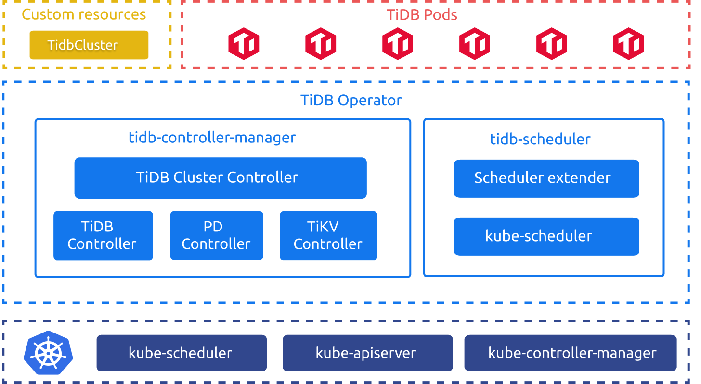
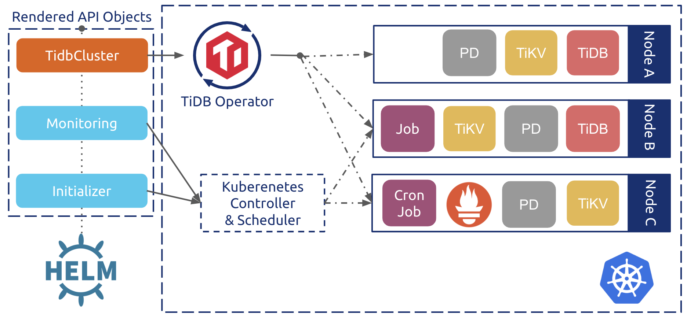

## 学习时长：

120min

## 课程收获：

* 了解 Kubernetes 基本概念
* 理解 TiDB Operator 原理
* 了解如何部署 TiDB 集群

## 课程内容：

> 本课程简要介绍了 Kubernetes 的基本概念，详细描述了 TiDB Operator 的实现原理以及如何在 Kubernetes 集群上部署 TiDB 集群。

### 简介

> TiDB Operator 是 Kubernetes 上的 TiDB 集群自动运维系统，提供包括部署、升级、扩缩容、备份恢复、配置变更的 TiDB 全生命周期管理。借助 TiDB Operator，TiDB 可以无缝运行在公有云或私有部署的 Kubernetes 集群上。
> ​ ——来自 PingCAP 官方定义

#### TiDB Operator 架构



TiDB Operator 像“牧羊人”一样，持续的监督并管理着 TiDB 各组件“羊群”以恰当的状态运行在主机集群“牧场”上。现在运维人员只要告诉 Operator “What to do“，而由 Operator 来决定 “How to do”。在最新版本 TiDB Operator 甚至可以根据实际情况来决定 "What to do"，比如：auto-scaler。真正实现了自动化运维，减轻运维人员维护压力，提高服务能力。

#### TiDB Operator 组件

* TiDB Cluster 定义：CRD（ `CustomResourceDefinition` ）定义了  `TidbCluster`  等自定义资源，使得 Kubernetes 世界认识 TiDB Cluster 并让其与  `Deployment` 、 `StatefulSet`  一同享受 Kubernetes 的头等公民待遇。目前 TiDB Operator v1.1.0 版本包含的 CRD 有： `TidbCluster` 、 `Backup` 、 `Restore` 、 `BackupSchedule` 、 `TidbMonitor` 、 `TidbInitializer`  以及  `TidbClusterAutoScaler` 。
* 控制器： `tidb-controller-manager`  包含了一组自定义控制器，控制器通过循环不断比对被控制对象的期望状态与实际状态，并通过自定义的逻辑驱动被控制对象达到期望状态。
* 调度器： `tidb-scheduler`  是一个 Kubernetes 调度器扩展，它为 Kubernetes 调度器注入 TiDB 集群特有的调度逻辑，比如：为保证高可用，任一 Node 不能调度超过 TiDB 集群半数以上的 TiKV 实例。

#### 自定义资源

* TiDB Cluster 资源：CR（ `CustomResource` ）声明了 TiDB Cluster 自定义资源对象，它声明了  `TidbCluster`  对象的期望状态，并被控制器逻辑不断进行处理，同时将实际运行状态记录下来。

#### Kubernetes 控制平面

* `kube-apiserver` ：Kubernetes 控制平面的前端，所有组件通过 API Server 获取或更新对象信息。
* `kube-controller-manager` ： `TidbCluster`  等 CR 封装了  `StatefulSet` 、 `Deployment` 、 `CronJob`  等原生对象，所以依然需要 K8s 原生控制器来进行控制逻辑。
* `kube-scheduler` ：调度 TiDB Cluster 的 Pod， `filtering`  阶段，kube-scheduler 筛选出的节点会再经过  `tidb-scheduler`  筛选一次，然后 kube-scheduler 再进行  `scoring`  选择最合适的节点进行 Pod 调度。

#### 原理浅析



TiDB Operator 中使用 Helm Chart 封装了 TiDB 集群定义。整体的控制流程如下：

1. 用户通过 Helm 创建  `TidbCluster`  对象和相应的一系列 Kubernetes 原生对象，比如执行定时备份的  `CronJob` ；
2. TiDB Operator 会通过 Kubernetes API Server watch  `TidbCluster`  以及其它相关对象，基于集群的实际状态不断调整 PD、TiKV、TiDB 的  `StatefulSet`  和  `Service`  对象；
3. Kubernetes 的原生控制器根据  `StatefulSet` 、 `Deployment` 、 `CronJob`  等对象创建更新或删除对应的  `Pod` ；
4. PD、TiKV、TiDB 的  `Pod`  声明中会指定使用  `tidb-scheduler`  调度器， `tidb-scheduler`  会在调度对应  `Pod`  时应用 TiDB 的特定调度逻辑。

基于上述的声明式控制流程，TiDB Operator 能够自动进行集群节点健康检查和故障恢复。部署、升级、扩缩容等操作也可以通过修改  `TidbCluster`  对象声明“一键”完成。

### 操作实践

> TiDB-Operator 部署本地测试环境

```bash
# 通过 kind 部署 K8s 集群
cd /root & git clone --depth=1 https://github.com/pingcap/tidb-operator && cd tidb-operator
cd /root/tidb-operator && hack/kind-cluster-build.sh
export PATH=$PATH:/root/tidb-operator/output/bin/
kubectl cluster-info
helm version
# 在 K8s 集群上部署 TiDB Operator
kubectl apply -f https://raw.githubusercontent.com/pingcap/tidb-operator/master/manifests/crd.yaml && kubectl get crd tidbclusters.pingcap.com
mkdir -p /root/chart/
# 从 https://github.com/pingcap/tidb-operator/releases 下载 tidb-operator-chart-v1.0.6.tgz 文件放到 /root/chart/ 路径下
cd /root/chart/ && tar xvf tidb-operator-chart-v1.0.6.tgz
# 将 /root/tidb-operator/charts/tidb-operator/values.yaml 文件内的 scheduler.kubeSchedulerImageName 值修改为 registry.cn-hangzhou.aliyuncs.com/google_containers/kube-scheduler 以加快镜像拉取速度。
helm install --namespace=tidb-admin  --name=tidb-operator /root/tidb-operator/charts/tidb-operator -f /root/tidb-operator/charts/tidb-operator/values.yaml
kubectl get pods -n tidb-admin
# 在 K8s 集群中部署 TiDB 集群
mkdir -p /root/chart/
# 从 https://github.com/pingcap/tidb-operator/releases 下载 tidb-cluster-chart-v1.0.6.tgz 文件放到 /root/chart/ 路径下
cd /root/chart/ && tar xvf tidb-cluster-chart-v1.0.6.tgz
helm install --namespace dba-test --name=test /root/tidb-operator/charts/tidb-cluster -f /root/tidb-operator/charts/tidb-cluster/values.yaml
kubectl get pods -n dba-test
# 访问 TiDB 集群
nohup kubectl port-forward svc/test-tidb 4000:4000 --namespace=dba-test &
yum install -y mysql
mysql -h 127.0.0.1 -uroot -P4000
```

1. 观察 TiDB 的 POD 状态

   ```
    # kubectl get pods -n dba-test
    NAME                              READY   STATUS    RESTARTS   AGE
    test-discovery-668b48577c-lqqbz   1/1     Running   0          7m37s
    test-monitor-5b586d8cb-227qx      3/3     Running   0          7m37s
    test-pd-0                         1/1     Running   0          7m37s
    test-pd-1                         1/1     Running   0          7m37s
    test-pd-2                         1/1     Running   1          7m37s
    test-tidb-0                       2/2     Running   0          6m18s
    test-tidb-1                       2/2     Running   0          6m18s
    test-tikv-0                       1/1     Running   0          6m58s
    test-tikv-1                       1/1     Running   0          6m58s
    test-tikv-2                       1/1     Running   0          6m58s
   ```

   以上信息显示 TiDB Cluster 所有 Pod 全部运行正常。

2. 访问 TiDB 集群

   ```
    # nohup kubectl port-forward svc/test-tidb 4000:4000 --namespace=dba-test &
    # yum install -y mysql
    # mysql -h 127.0.0.1 -uroot -P4000
    mysql -h 127.0.0.1 -P 4000 -uroot
    Welcome to the MariaDB monitor.  Commands end with ; or \g.
    Your MySQL connection id is 1
    Server version: 5.7.25-TiDB-v3.0.5 MySQL Community Server (Apache License 2.0)
    Copyright (c) 2000, 2018, Oracle, MariaDB Corporation Ab and others.
    Type 'help;' or '\h' for help. Type '\c' to clear the current input statement.
    MySQL [(none)]>
   ```

   显示以上输出显示 TiDB 集群部署成功。


## 学习过程中参考的其他资料

- [视频教程-2.3.2 Deploy TiDB in Kubernetes（在 Kubernetes 上部署 TiDB 集群）
](https://university.pingcap.com/courses/TiDB%204.0%20%E5%BA%94%E7%94%A8%E5%BC%80%E5%8F%91%E6%8C%87%E5%8D%97/chapter/201-%E7%AB%A0%E8%8A%82/lesson/Deploy-TiDB-in-Kubernetes)
- [ 1.2 TiDB on Kubernetes](https://book.tidb.io/session2/chapter1/tidb-on-k8s.html)

