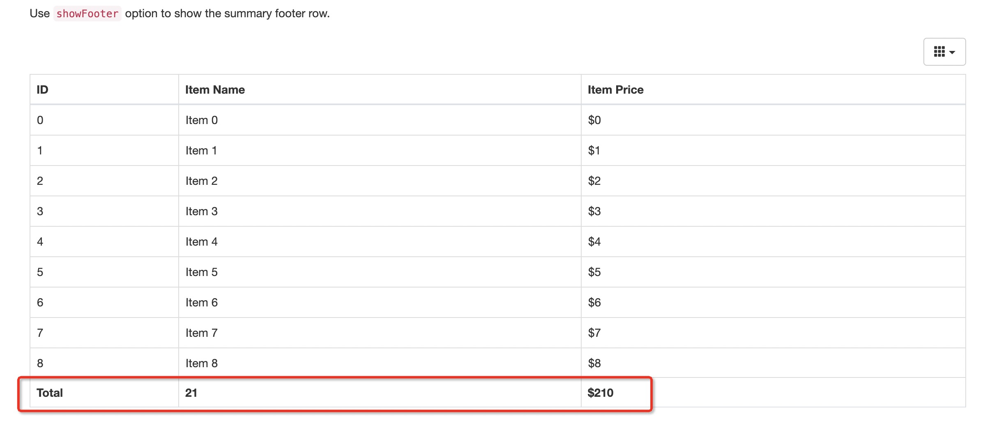

## 效果图



## 代码说明

[bootstrap-table](https://www.bootstrap-table.com.cn/)


## 操作指南

```html
<!doctype html>
<html lang="en">
<head>
    <title>Bootstrap Table Examples</title>
    <meta charset="utf-8">
    <meta http-equiv="X-UA-Compatible" content="IE=edge">
    <meta name="description"
          content="An extended Bootstrap table with radio, checkbox, sort, pagination, and other added features.">
    <meta name="keywords"
          content="table, bootstrap, bootstrap plugin, bootstrap resources, bootstrap table, jQuery plugin">
    <meta name="author" content="Zhixin Wen, and Bootstrap table contributors">
    <!-- <meta name="viewport" content="width=device-width, initial-scale=1, shrink-to-fit=no"> -->

    <link rel="stylesheet" href="https://cdnjs.cloudflare.com/ajax/libs/twitter-bootstrap/3.4.1/css/bootstrap.min.css">

    <link rel="stylesheet" href="https://unpkg.com/@fortawesome/fontawesome-free@5.12.1/css/all.min.css">
    <link rel="stylesheet" href="https://cdnjs.cloudflare.com/ajax/libs/highlight.js/9.13.1/styles/default.min.css">
    <link rel="stylesheet" href="https://cdnjs.cloudflare.com/ajax/libs/hint.css/2.5.1/hint.min.css">
    <link rel="stylesheet" href="assets/css/docs.min.css">
    <link rel="stylesheet" href="assets/css/template.css?v=131">

    <script type="text/javascript" async="" src="https://www.google-analytics.com/analytics.js"></script>
    <script src="https://cdnjs.cloudflare.com/ajax/libs/jquery/3.5.1/jquery.min.js"
            integrity="sha512-bLT0Qm9VnAYZDflyKcBaQ2gg0hSYNQrJ8RilYldYQ1FxQYoCLtUjuuRuZo+fjqhx/qtq/1itJ0C2ejDxltZVFg=="
            crossorigin="anonymous"></script>
    <script src="https://cdnjs.cloudflare.com/ajax/libs/twitter-bootstrap/3.4.1/js/bootstrap.min.js"></script>
    <script src="https://cdnjs.cloudflare.com/ajax/libs/sprintf/1.1.2/sprintf.min.js"></script>
    <script src="https://cdnjs.cloudflare.com/ajax/libs/highlight.js/9.13.1/highlight.min.js"></script>
    <script src="https://cdn.jsdelivr.net/npm/marked/marked.min.js"></script>
    <script src="https://unpkg.com/flexibility@2.0.1/flexibility.js"></script>
    <script src="assets/js/template.js?v=131"></script>

    <!-- Global site tag (gtag.js) - Google Analytics -->
    <script async="" src="https://www.googletagmanager.com/gtag/js?id=UA-132747866-1"></script>
    <script>
    window.dataLayer = window.dataLayer || []
    function gtag() {window.dataLayer.push(arguments)}
    gtag('js', new Date())
    gtag('config', 'UA-132747866-1')


    </script>
    <link href="https://unpkg.com/bootstrap-table@1.18.0/dist/bootstrap-table.min.css" rel="stylesheet">
    <script src="https://unpkg.com/bootstrap-table@1.18.0/dist/bootstrap-table.min.js"></script>
    <script id="_carbonads_projs" type="text/javascript"
            src="https://srv.carbonads.net/ads/CK7DL2J7.json?segment=placement:bootstrap-tablecom&amp;callback=_carbonads_go"></script>
</head>
<body>
<div class="container">
    <div class="header-wrapper">
        <div class="title-desc">

            <p class="bd-lead">
            <p>Use <code>showFooter</code> option to show the summary footer row.</p>
            </p>
        </div>

        <div id="example">
            <script>
              init({
                title: 'Show Footer',
                desc: 'Use `showFooter` option to show the summary footer row.',
                links: ['bootstrap-table.min.css'],
                scripts: ['bootstrap-table.min.js']
              })


            </script>

            <table
                    id="table"
                    data-toggle="table"
                    data-height="460"
                    data-show-columns="true"
                    data-show-footer="true"
                    data-url="json/data1.json">
                <thead>
                <tr>
                    <th data-field="id" data-footer-formatter="idFormatter">ID</th>
                    <th data-field="name" data-footer-formatter="nameFormatter">Item Name</th>
                    <th data-field="price" data-footer-formatter="priceFormatter">Item Price</th>
                </tr>
                </thead>
            </table>

            <script>
  function idFormatter() {
    return 'Total'
  }

  function nameFormatter(data) {
    return data.length
  }

  function priceFormatter(data) {
    var field = this.field
    return '$' + data.map(function (row) {
      return +row[field].substring(1)
    }).reduce(function (sum, i) {
      return sum + i
    }, 0)
  }

            </script>
        </div>

        <script src="https://cdnjs.cloudflare.com/ajax/libs/jquery/3.5.1/jquery.min.js"
                integrity="sha512-bLT0Qm9VnAYZDflyKcBaQ2gg0hSYNQrJ8RilYldYQ1FxQYoCLtUjuuRuZo+fjqhx/qtq/1itJ0C2ejDxltZVFg=="
                crossorigin="anonymous"></script>
        <script src="https://cdn.jsdelivr.net/npm/popper.js@1.16.0/dist/umd/popper.min.js"
                integrity="sha384-Q6E9RHvbIyZFJoft+2mJbHaEWldlvI9IOYy5n3zV9zzTtmI3UksdQRVvoxMfooAo"
                crossorigin="anonymous"></script>
        <script src="https://stackpath.bootstrapcdn.com/bootstrap/4.5.0/js/bootstrap.min.js"
                integrity="sha384-OgVRvuATP1z7JjHLkuOU7Xw704+h835Lr+6QL9UvYjZE3Ipu6Tp75j7Bh/kR0JKI"
                crossorigin="anonymous"></script>
        <script>$.browser = {}</script>
        <script src="https://cdn.jsdelivr.net/npm/jquery-hashchange@2.0.0/jquery.ba-hashchange.min.js"></script>
        <script src="https://cdn.jsdelivr.net/npm/algoliasearch@3.32.0/dist/algoliasearchLite.min.js"></script>
        <script src="https://cdn.jsdelivr.net/npm/instantsearch.js@3.0.0/dist/instantsearch.production.min.js"></script>
        <script src="assets/js/docs.min.js"></script>
        <script src="assets/js/index.js?v=131"></script>
    </div>
</div>
</body>
</html>

```
