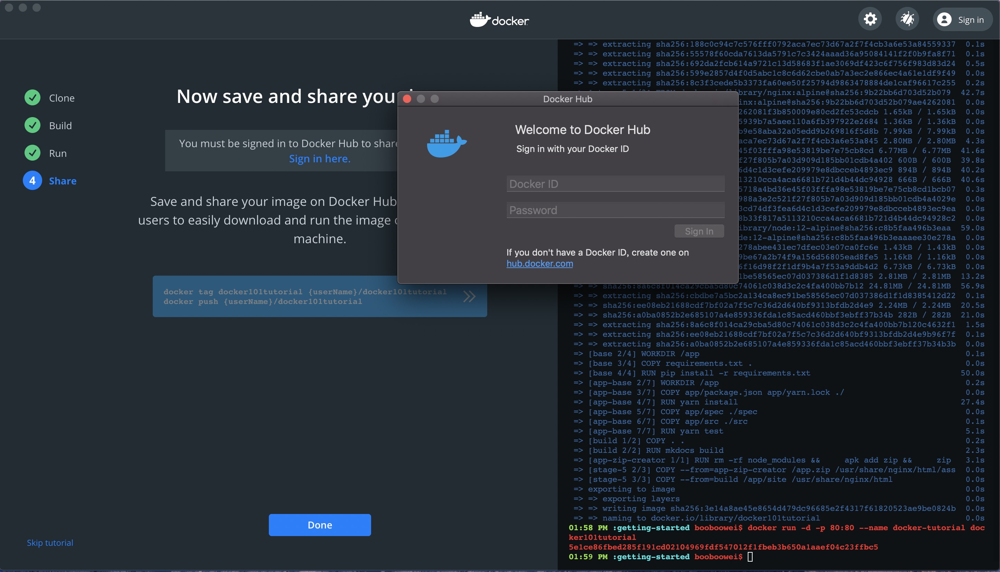
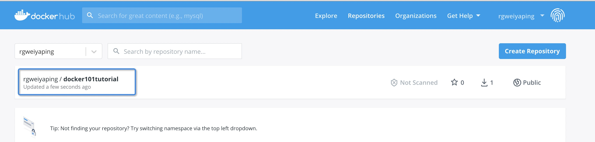
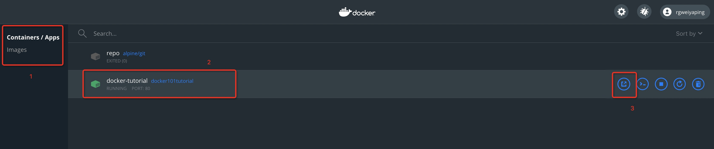
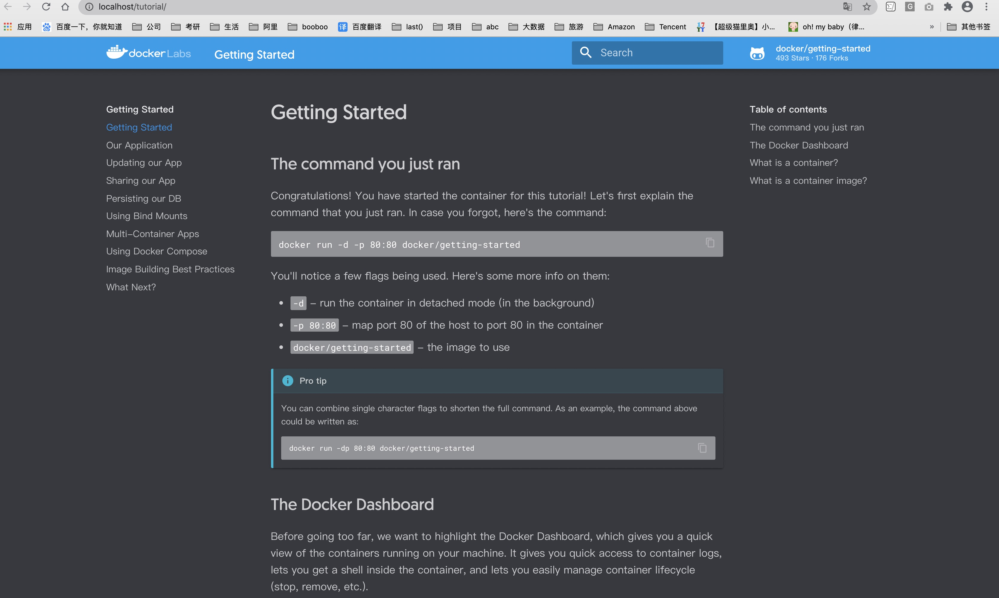

 # 是什么

## Mac版Docker桌面

Docker Desktop for Mac是易于安装的桌面应用程序，用于在Mac上构建，调试和测试Dockerized应用程序。Docker Desktop for Mac是与Mac OS Hypervisor框架，网络和文件系统深度集成的完整开发环境。Docker桌面-Mac是在Mac上运行Docker的最快，最可靠的方法。

## 特点和优点

- 轻松安装和设置适用于Mac的完整Docker开发环境。
- 集成的Docker平台和工具[Docker命令行](https://docs.docker.com/engine/reference/commandline/cli/)，[Docker Compose](https://docs.docker.com/compose/reference/overview/)和[Docker Notary](https://docs.docker.com/notary/getting_started/)命令行。
- 使用每月的Edge和季度稳定版本的Docker的通道进行自动更新。
- 通过运行自定义的最小Linux发行版的本地macOS虚拟化，可实现快速可靠的性能。
- 无缝地批量安装代码和数据，包括解锁快速编辑测试周期的文件更改通知。
- 支持Mac OS X沙箱安全模型的本机Mac安全性。
- 企业网络支持允许Mac版Docker Desktop与VPN和代理一起使用。
- 使用支持的IDE进行容器开发和调试。

# 怎么用

## 主要系统要求

- Docker Desktop-macOS必须为10.14或更高版本，即Mojave（10.14）或Catalina（10.15）。
- Mac硬件必须是2010或更高版本。
- [在此处](https://docs.docker.com/docker-for-mac/install/#system-requirements)查看所有macOS系统要求。

## 获取Docker

稳定                                                                        | 边缘
------------------------------------------------------------------------- | -----------------------------------------------------------------------------------------------------------------------------------------------------------------------------------------
Stable版本经过全面烘焙和测试，并随附有最新的Docker GA版本。                                     | Edge版本提供了最先进的功能，并[启用](https://docs.docker.com/docker-for-mac/faqs/#what-is-an-experimental-feature)了[实验功能](https://docs.docker.com/docker-for-mac/faqs/#what-is-an-experimental-feature)。
[获取适用于Mac的Docker桌面（稳定）](https://desktop.docker.com/mac/stable/Docker.dmg) | [获取适用于Mac的Docker桌面（Edge）](https://desktop.docker.com/mac/edge/Docker.dmg)

## 安装它

双击`Docker.dmg`以开始安装过程。

安装完成并启动Docker后，顶部状态栏中的鲸鱼显示Docker正在运行，并且可以从终端进行访问。

## 运行

打开命令行终端，并尝试一些Docker命令。

- 运行`docker version`以检查您是否安装了最新版本。
- 运行`docker run hello-world`以验证Docker正在提取映像并按预期运行。

## 好好享受

Docker Desktop-Mac在桌面和命令行上都能很好地运行。您将获得完整的Docker工具集，其中包括可通过UI配置的许多选项。

# 使用记录

## Tutorial 指导

1. 指导洁面非常简洁，我个人很喜欢，而且分成三个区域，最左侧是展示整个指导的4个步骤；中间是具体做什么；最右侧是命令行终端。
2. 令我惊喜的是，指导的命令无需复制粘贴，一键点击后自动发送到右侧终端中执行。大爱啊！
3. 注册后填写 Docker ID 和 Password 后登陆，将自己的镜像分享到 Docker Hub。

## 容器 docker101tutorial

[入门](http://localhost/tutorial/)

1. 该容器在上面一节已经运行，其作用就是一个web应用。
2. 通过对该容器的操作来熟悉 Docker 桌面 对容器的的启动关闭等操作。

# 文献资料

要了解更多信息，请阅读[Docker Desktop for Mac文档](https://docs.docker.com/docker-for-mac/)。

请务必查看"[下一步](https://docs.docker.com/docker-for-mac/#where-to-go-next)操作"以获取指向实验和示例的链接，以及如何开始使用群体模式。

<https://www.docker.com/play-with-docker>
