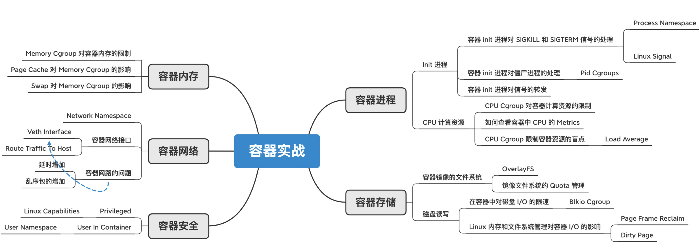

> 容器问题虽然有很多类型，既有基本功能问题，也有性能问题，还有不少稳定性问题。但大部分问题，最终都会归结到 Linux 操作系统上。

我们都知道，Linux 操作系统不外乎是:

- 进程管理
- 内存管理
- 文件系统
- 网络协议栈
- 安全管理

当然了，容器还有自己的特殊性，Linux 内核原来的特性加上:

- Namespace
- Cgroups

我们可以结合 Linux 操作系统的主要模块，把容器的知识结构系统地串联起来，同时看到 Namespace 和 Cgroups 带来的特殊性。

先掌握知识体系，再结合实践。这么学看似慢了，但其实只有这样，我们走的才是捷径。
