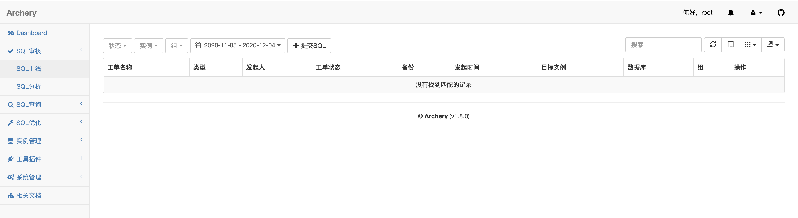

# 什么是Archery？

Archery是[archer](https://github.com/jly8866/archer)的分支项目，定位于SQL审核查询平台，旨在提升DBA的工作效率，支持多数据库的SQL上线和查询，同时支持丰富的MySQL运维功能，所有功能都兼容手机端操作。

## [Archery 官网](https://archerydms.com/)

[](https://gitee.com/rtttte/Archery) [](https://travis-ci.org/hhyo/Archery) [](https://github.com/hhyo/archery/releases/) [](https://codecov.io/gh/hhyo/archery) [](https://app.codacy.com/app/hhyo/Archery?utm_source=github.com&utm_medium=referral&utm_content=hhyo/Archery&utm_campaign=Badge_Grade_Dashboard) [](https://img.shields.io/pypi/pyversions/django/) [](https://docs.djangoproject.com/zh-hans/3.1/) [](https://hub.docker.com/r/hhyo/archery/) [](http://hits.dwyl.io/hhyo/hhyo/Archery) [](http://github.com/hhyo/archery/blob/master/LICENSE) [](https://996.icu/)

[文档](https://archerydms.com/) | [FAQ](https://github.com/hhyo/archery/wiki/FAQ) | [Releases](https://github.com/hhyo/archery/releases/)

## 系统体验

[在线体验](https://demo.archerydms.com/)

| 账号   | 密码   |
| ------ | ------ |
| archer | archer |

# 安装 Archery

## 安装 Docker

CentOS 7 (使用yum进行安装)

> step 1: 安装必要的一些系统工具

```bash
sudo yum install -y yum-utils device-mapper-persistent-data lvm2
```

> Step 2: 添加软件源信息

```bash
sudo yum-config-manager --add-repo http://mirrors.aliyun.com/docker-ce/linux/centos/docker-ce.repo
cat /etc/yum.repos.d/centos.repo
[centos7]
name='centos'
baseurl='http://mirror.centos.org/centos/7/os/x86_64/'
enabled=1
gpgcheck=0

[centos7-extra]
name='centos extra'
baseurl='http://mirror.centos.org/centos/7/extras/x86_64/'
enabled=1
gpgcheck=0
```

> Step 3: 更新并安装Docker-CE

```
sudo yum makecache fast
sudo yum list docker-ce --showduplicates | sort -r
sudo yum -y install pigz container-selinux
sudo yum -y install docker-ce
```

> Step 4: 开启Docker服务

```bash
sudo systemctl  start docker
docker run hello-world
```

## 安装 docker-compose

Compose 是用于定义和运行多容器 Docker 应用程序的工具。通过 Compose，您可以使用 YML 文件来配置应用程序需要的所有服务。然后，使用一个命令，就可以从 YML 文件配置中创建并启动所有服务。

```bash
curl -L "https://github.com/docker/compose/releases/download/1.24.1/docker-compose-$(uname -s)-$(uname -m)" -o /usr/local/bin/docker-compose
chmod +x /usr/local/bin/docker-compose
ln -s /usr/local/bin/docker-compose /usr/bin/docker-compose
docker-compose --version
```

## docker 部署 Archery

下载 [Releases](https://github.com/hhyo/archery/releases/)文件，解压后进入docker-compose文件夹


```bash
# 启动
docker-compose -f docker-compose.yml up -d

# 表结构初始化
docker exec -ti archery /bin/bash
cd /opt/archery
source /opt/venv4archery/bin/activate
python3 manage.py makemigrations sql  
python3 manage.py migrate

# 数据初始化
python3 manage.py dbshell<sql/fixtures/auth_group.sql
python3 manage.py dbshell<src/init_sql/mysql_slow_query_review.sql

# 创建管理用户
python3 manage.py createsuperuser

# 重启服务
# docker restart archery

# 日志查看和问题排查
# docker logs archery -f --tail=10
# logs/archery.log
```

## 登陆 Archery

http://127.0.0.1:9123/



