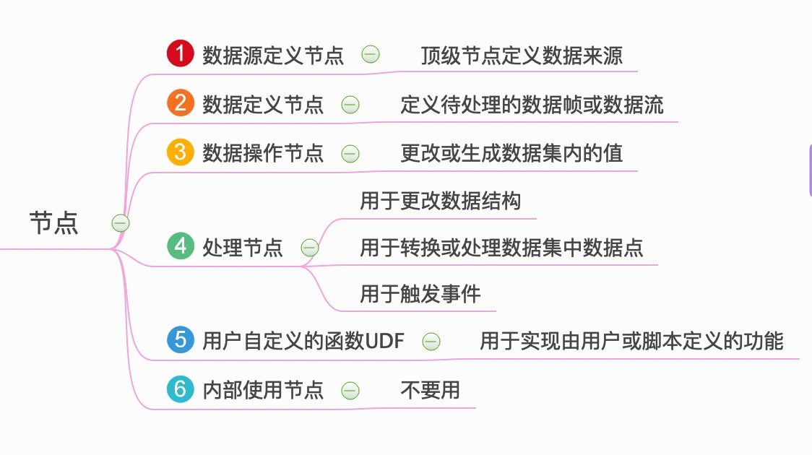

<!-- TOC depthFrom:1 depthTo:6 withLinks:1 updateOnSave:1 orderedList:0 -->

- [TICKscript节点](#tickscript节点)
	- [节点分类](#节点分类)

<!-- /TOC -->
# TICKscript节点

## 节点分类

* A 定义数据获取方式：批、流
* B、C 确定待处理的数据集
* D、E 用于处理数据

|NO.|节点分类|节点|含义|
|:--|:--|:--|:--|
|A|数据源定义节点|**顶级节点定义数据来源**||
|A|数据源定义节点|`BatchNode`|顶级节点，定义了：批处理模式|
|A|数据源定义节点|`StreamNode`|顶级节点，定义了：流处理模式|
|B|数据定义节点|**定义待处理的数据帧或数据流**||
|B|数据定义节点|`QueryNode`|只能跟着`BatchNode`|
|B|数据定义节点|`FromNode`|只能跟着`StreamNode`|
|B|数据定义节点|`SideloadNode`| 基于来自各种源的分层数据向点添加字段和标签 |
|C|数据操作节点|**更改或生成数据集内的值**||
|C|数据操作节点|`DefaultNode`|用于为数据系列中的tag和field设置默认值|
|C|数据操作节点|`ShiftNode`|用于移动数据点时间戳|
|C|数据操作节点|`WhereNode`|用于过滤|
|C|数据操作节点|`WindowNode`|用于在移动时间范围内缓存数据|
|D|处理节点|**用于更改数据结构**||
|D|处理节点|`CombineNode`|用于将来自单个节点的数据与自身组合在一起|
|D|处理节点|`EvalNode`|用于对表达式命名|
|D|处理节点|`GroupByNode`|按照标签`Tag`对传如数据进行分组|
|D|处理节点|`JoinNode`|根据匹配的`时间戳`连接来自任意数量管道的数据|
|D|处理节点|`UnionNode`|可以将任意数量的管道进行联合|
|D|处理节点|**用于转换或处理数据集中数据点**||
|D|处理节点|`DeleteNode`|从数据点删除字段Field和标记Tag|
|D|处理节点|`DerivativeNode`|求导数|
|D|处理节点|`FattenNode`|在特定维度上展平一组点|
|D|处理节点|`InfluxQLNode`|提供对InfluxQL功能的访问|
|D|处理节点|`StateDurationNode`|计算给定状态持续时间|
|D|处理节点|`StatsNode`|给定时间间隔发出有关另一个节点内部统计信息|
|D|处理节点|`BarrierNode`        | 可以在没有数据流量的情况下执行管道|
|D|处理节点|`ChangeDetectNode`   | 如果字段值发生变化则创建节点|
|D|处理节点|`StateCountNode`     | 计算连续点的在一个给定的状态的数目|
|D|处理节点|**用于触发事件**||
|D|处理节点|`AlertNode`|配置警报发射|
|D|处理节点|`DeadmanNode`|实际上是辅助函数，它是alert当数据流低于指定阈值时触发的别名|
|D|处理节点|`HTTPOutNode`|为其收到的每个组缓存最新数据，使用字符串参数作为最终定位器上下文，使其可通过Kapicator http服务器使用|
|D|处理节点|`HTTPPostNode`|将数据发布到字符串数组中指定的HTTP端点|
|D|处理节点|`InfluxDBOutNode`|在收到数据时将数据写入InfluxDB|
|D|处理节点|`K8sAutoscaleNode`|触发Kubernetes™资源的自动缩放|
|D|处理节点|`KapacitorLoopback`|将数据写回kapacitor流|
|D|处理节点|`SwarmAutoscaleNode` | 触发Docker Swarm模式集群上的服务的自动调度事件。该节点还输出触发事件的点|
|D|处理节点|`EC2AutoscaleNode`   | 触发AWS Autoscaling组上的组的自动调度事件|
|D|处理节点|`LogNode`|记录通过它的所有数据|
|E|用户自定义的函数UDF|`UDFNode`|**用于实现由用户或脚本定义的功能**|
|F|内部使用节点|`NoOpNode`|**不要用**|

## 节点属性方法

[Nodes官方文档](https://docs.influxdata.com/kapacitor/v1.5/nodes/)

### 数据源定义节点

**batch or stream？**

使用哪个取决于系统资源和正在进行的计算类型。

|          | Batch                          | Stream                                           |
| -------- | ------------------------------ | ------------------------------------------------ |
| 适应场景 | 时间段长，数据量大             | 时间段较小                                       |
| 特点     | 触发查询时将导致InfluxDB负载高 | 降低了InfluxDB的查询负载，将数据全部缓存在内存中 |

* 在长时间内使用大量数据时`batch`首选，它会将数据保留在磁盘上，直到需要它为止，但触发时查询将导致数据库突然出现高负载。

* 使用较小的时间帧时 `stream`是首选。这意味着不必要地将数十亿个数据点保存在内存中，它降低了InfluxDB的查询负载。

### 数据定义节点

### 数据操作节点

### 处理节点-用于更改数据结构

### 处理节点-用于转换或处理数据集中数据点

### 处理节点-用于触发事件
