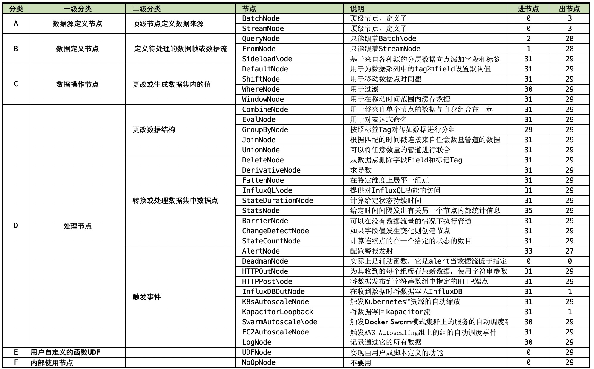

# TICKscript节点链接方法

##  链接方法概览

| 节点               | 说明                                                         | 进节点 | 出节点 |
| ------------------ | ------------------------------------------------------------ | ------ | ------ |
| BatchNode          | 顶级节点，定义了批数据源                                     | 0      | 3      |
| StreamNode         | 顶级节点，定义了流数据源                                     | 0      | 3      |
| QueryNode          | 只能跟着BatchNode                                            | 2      | 28     |
| FromNode           | 只能跟着StreamNode                                           | 1      | 28     |
| SideloadNode       | 基于来自各种源的分层数据向点添加字段和标签                   | 31     | 29     |
| DefaultNode        | 用于为数据系列中的tag和field设置默认值                       | 31     | 29     |
| ShiftNode          | 用于移动数据点时间戳                                         | 31     | 29     |
| WhereNode          | 用于过滤                                                     | 30     | 29     |
| WindowNode         | 用于在移动时间范围内缓存数据                                 | 31     | 29     |
| CombineNode        | 用于将来自单个节点的数据与自身组合在一起                     | 31     | 29     |
| EvalNode           | 用于对表达式命名                                             | 31     | 29     |
| GroupByNode        | 按照标签Tag对传如数据进行分组                                | 29     | 29     |
| JoinNode           | 根据匹配的时间戳连接来自任意数量管道的数据                   | 31     | 29     |
| UnionNode          | 可以将任意数量的管道进行联合                                 | 31     | 29     |
| DeleteNode         | 从数据点删除字段Field和标记Tag                               | 31     | 29     |
| DerivativeNode     | 求导数                                                       | 31     | 29     |
| FattenNode         | 在特定维度上展平一组点                                       | 31     | 29     |
| InfluxQLNode       | 提供对InfluxQL功能的访问                                     | 31     | 29     |
| StateDurationNode  | 计算给定状态持续时间                                         | 31     | 29     |
| StatsNode          | 给定时间间隔发出有关另一个节点内部统计信息                   | 35     | 29     |
| BarrierNode        | 可以在没有数据流量的情况下执行管道                           | 31     | 29     |
| ChangeDetectNode   | 如果字段值发生变化则创建节点                                 | 31     | 29     |
| StateCountNode     | 计算连续点的在一个给定的状态的数目                           | 31     | 29     |
| AlertNode          | 配置警报发射                                                 | 33     | 27     |
| DeadmanNode        | 实际上是辅助函数，它是alert当数据流低于指定阈值时触发的别名  | 0      | 0      |
| HTTPOutNode        | 为其收到的每个组缓存最新数据，使用字符串参数作为最终定位器上下文，使其可通过Kapicator http服务器使用 | 31     | 29     |
| HTTPPostNode       | 将数据发布到字符串数组中指定的HTTP端点                       | 31     | 29     |
| InfluxDBOutNode    | 在收到数据时将数据写入InfluxDB                               | 31     | 1      |
| K8sAutoscaleNode   | 触发Kubernetes™资源的自动缩放                                | 31     | 29     |
| KapacitorLoopback  | 将数据写回kapacitor流                                        | 31     | 1      |
| SwarmAutoscaleNode | 触发Docker Swarm模式集群上的服务的自动调度事件。该节点还输出触发事件的点 | 30     | 29     |
| EC2AutoscaleNode   | 触发AWS Autoscaling组上的组的自动调度事件                    | 31     | 29     |
| LogNode            | 记录通过它的所有数据                                         | 30     | 29     |
| UDFNode            | 实现由用户或脚本定义的功能                                   | 0      | 29     |
| NoOpNode           | 不要用                                                       | 0      | 29     |

## 管道流速查

参见[速查excel表格](https://github.com/BoobooWei/booboo_TimeSeriesDBMS/blob/master/Kapacitor/02_TICKscript%E8%AF%AD%E8%A8%80/pic/kapacitor_nodes.xlsx)
