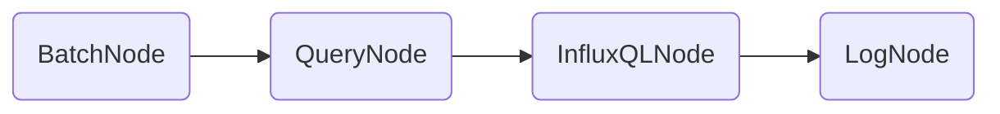

<!-- TOC depthFrom:1 depthTo:6 withLinks:1 updateOnSave:1 orderedList:0 -->

- [CPU Alert](#cpu-alert)
	- [开始之前](#开始之前)
		- [示范数据](#示范数据)
		- [Tickscript 语言](#tickscript-语言)
		- [基础命令](#基础命令)
	- [创建一个最简单的 Stream Task](#创建一个最简单的-stream-task)
		- [Stream Task 要求](#stream-task-要求)
		- [解题过程](#解题过程)
			- [1. 画出DAG图](#1-画出dag图)
			- [2. 编写 TICKscript](#2-编写-tickscript)
			- [3. 声明脚本](#3-声明脚本)
			- [4. 查看Task](#4-查看task)
	- [创建一个包含数据库声明的 Stream Task](#创建一个包含数据库声明的-stream-task)
		- [Stream Task 要求](#stream-task-要求)
		- [解题过程](#解题过程)
			- [1. 画出DAG图](#1-画出dag图)
			- [2. 编写 TICKscript](#2-编写-tickscript)
			- [3. 声明脚本](#3-声明脚本)
			- [4. 查看Task](#4-查看task)
	- [启动 CPU Task 任务](#启动-cpu-task-任务)
		- [任务说明](#任务说明)
		- [课堂练习](#课堂练习)
	- [停止 CPU Task 任务](#停止-cpu-task-任务)
		- [任务说明](#任务说明)
		- [课堂练习](#课堂练习)
	- [创建一个带时间窗口的 Stream Task](#创建一个带时间窗口的-stream-task)
		- [Stream Task 要求](#stream-task-要求)
		- [解题过程](#解题过程)
			- [1. 画出DAG图](#1-画出dag图)
			- [2. 编写 TICKscript](#2-编写-tickscript)
			- [3. 声明脚本](#3-声明脚本)
			- [4. 启动Task](#4-启动task)
			- [5. 查看Task列表](#5-查看task列表)
			- [6. 查看Task任务明细](#6-查看task任务明细)
			- [7. 查看Task日志](#7-查看task日志)
	- [创建一个带过滤条件的 Stream Task](#创建一个带过滤条件的-stream-task)
		- [Stream Task 要求](#stream-task-要求)
		- [解题过程](#解题过程)
			- [第一种解法](#第一种解法)
			- [第二种解法](#第二种解法)
	- [创建一个可以触发告警的 Stream Task](#创建一个可以触发告警的-stream-task)
		- [Stream Task 要求](#stream-task-要求)
		- [解题过程](#解题过程)
			- [1. 画出DAG图](#1-画出dag图)
			- [2. 编写 TICKscript](#2-编写-tickscript)
			- [3. 启动后查看日志](#3-启动后查看日志)
	- [创建一个批处理的CPU任务](#创建一个批处理的cpu任务)
		- [Batch Task  要求](#batch-task-要求)
		- [解题过程](#解题过程)
			- [1. 画出DAG图](#1-画出dag图)
			- [2. 编写 TICKscript](#2-编写-tickscript)
			- [3. 启动后查看日志](#3-启动后查看日志)
	- [总结](#总结)
		- [创建一个生产环境中设定的告警规则](#创建一个生产环境中设定的告警规则)

<!-- /TOC -->
# 从一个最基本的CPU Alert开始

## 开始之前

### 示范数据

InfluxDB 数据库中`telegraf.autogen.cpu`的数据点示范

```bash
[root@tick:/var/lib/kapacitor/task]# zy_influx -format 'csv' -database telegraf -execute 'select * from cpu limit 1'
name,time,cpu,host,usage_guest,usage_guest_nice,usage_idle,usage_iowait,usage_irq,usage_nice,usage_softirq,usage_steal,usage_system,usage_user
cpu,1564963200000000000,cpu-total,influxdb,0,0,99.03894367190544,0.158783219116127,0,0,0.008357011532397735,0,0.2757813805708354,0.5181347150052392
cpu,1564963260000000000,cpu-total,influxdb,0,0,98.7377748073443,0.20061857394411767,0,0,0.00835910724767157,0,0.3092869681602368,0.7439605450429597
```

**Tag keys**

```bash
[root@tick:/var/lib/kapacitor/task]# zy_influx -format 'csv' -database telegraf -execute 'show tag keys from cpu'
name,tagKey
cpu,cpu
cpu,host
```

**Field keys**

```bash
[root@tick:/var/lib/kapacitor/task]# zy_influx -format 'csv' -database telegraf -execute 'show field keys from cpu'
name,fieldKey,fieldType
cpu,usage_guest,float
cpu,usage_guest_nice,float
cpu,usage_idle,float
cpu,usage_iowait,float
cpu,usage_irq,float
cpu,usage_nice,float
cpu,usage_softirq,float
cpu,usage_steal,float
cpu,usage_system,float
cpu,usage_user,float
```

### Tickscript 语言

[学习教程]([https://github.com/BoobooWei/booboo_TimeSeriesDBMS/tree/master/Kapacitor/02_TICKscript%E8%AF%AD%E8%A8%80](https://github.com/BoobooWei/booboo_TimeSeriesDBMS/tree/master/Kapacitor/02_TICKscript语言))

### 基础命令

[官方帮助](https://docs.influxdata.com/kapacitor/v1.5/working/cli_client/)

## 创建一个最简单的 Stream Task

### Stream Task 要求

流式获取 Influxdb数据库中

* 库名`database`：`telegraf`.`autogen`
* 测量名`measurement`：`cpu`

的数据点，输出到日志中。

### 解题过程

#### 1. 画出DAG图


#### 2. 编写 TICKscript

```js
//cpu.tick
stream
  |from()
    .measurement('cpu')
  |log()
```

#### 3. 声明脚本

```bash
kapacitor define cpu -tick cpu.tick -dbrp telegraf.autogen
```

#### 4. 查看Task

```bash
kapacitor list tasks
```

## 创建一个包含数据库声明的 Stream Task

### Stream Task 要求

流式获取 Influxdb数据库中

* 库名`database`：`telegraf`.`autogen`
* 测量名`measurement`：`cpu`

的数据点，输出到日志中。

### 解题过程

#### 1. 画出DAG图


#### 2. 编写 TICKscript

```js
//cpu.tick
dbrp "telegraf"."autogen"

stream
  |from()
		.measurement('cpu')
	|log()
```

#### 3. 声明脚本

```bash
kapacitor define cpu -tick cpu.tick
```

#### 4. 查看Task

```bash
kapacitor list tasks
```

## 启动 CPU Task 任务

### 任务说明

通过执行`kapacitor enable <TASK_ID> <TASK_ID>.. `命令启动 `cpu`任务。

```bash
kapacitor enable cpu
```

执行`kapacitor show <TASK_ID> ` 查看任务状态。

```bash
kapacitor show cpu
```

### 课堂练习

```bash
[root@tick:/var/lib/kapacitor/task]# kapacitor enable cpu
[root@tick:/var/lib/kapacitor/task]# kapacitor list cpu
cannot list 'cpu' did you mean 'tasks', 'recordings', 'replays', 'topics', 'topic-handlers' or 'service-tests'?
[root@tick:/var/lib/kapacitor/task]# kapacitor show cpu
ID: cpu
Error:
Template:
Type: stream
Status: enabled
Executing: true
Created: 08 Sep 19 20:43 CST
Modified: 08 Sep 19 20:43 CST
LastEnabled: 08 Sep 19 20:43 CST
Databases Retention Policies: ["telegraf"."autogen"]
TICKscript:
dbrp "telegraf"."autogen"

stream
    |from()
        .measurement('cpu')
    |log()

DOT:
digraph cpu {
graph [throughput="0.00 points/s"];

stream0 [avg_exec_time_ns="0s" errors="0" working_cardinality="0" ];
stream0 -> from1 [processed="2"];

from1 [avg_exec_time_ns="0s" errors="0" working_cardinality="0" ];
from1 -> log2 [processed="2"];

log2 [avg_exec_time_ns="0s" errors="0" working_cardinality="0" ];
}
```

## 停止 CPU Task 任务

### 任务说明

通过执行`kapacitor disable <TASK_ID> <TASK_ID>.. `命令停止 `cpu`任务。

```bash
kapacitor disable cpu
```

执行`kapacitor show <TASK_ID> ` 查看任务状态。

```bash
kapacitor show cpu
```

### 课堂练习

```bash
[root@tick:/var/lib/kapacitor/task]# kapacitor disable cpu
[root@tick:/var/lib/kapacitor/task]# kapacitor show cpu
ID: cpu
Error:
Template:
Type: stream
Status: disabled
Executing: false
Created: 08 Sep 19 20:43 CST
Modified: 08 Sep 19 20:46 CST
LastEnabled: 08 Sep 19 20:43 CST
Databases Retention Policies: ["telegraf"."autogen"]
TICKscript:
dbrp "telegraf"."autogen"

stream
    |from()
        .measurement('cpu')
    |log()

DOT:
digraph cpu {
stream0 -> from1;
from1 -> log2;
}
```

## 创建一个带时间窗口的 Stream Task

### Stream Task 要求

流式获取 Influxdb数据库中

* 库名`database`：`telegraf`.`autogen`
* 测量名`measurement`：`cpu`

* 时间窗口为：`10min`

* 计算`usage_user`每5分钟的平均值

输出到日志中。

### 解题过程

#### 1. 画出DAG图


#### 2. 编写 TICKscript

```js
//cpu.tick
dbrp "telegraf"."autogen"

stream
  |from()
    .measurement('cpu')
  |window()
    .period(10m)
    .every(5m)
  |mean('usage_user')
    .as('mean_usage_user')
  |log()
```

`10 minute` 的时间窗口，每5分钟计算一次5分钟的平均值。

#### 3. 声明脚本

```bash
kapacitor define cpu -tick cpu.tick
```

#### 4. 启动Task

```bash
kapacitor enable cpu
```

#### 5. 查看Task列表

```bash
kapacitor list tasks
```

#### 6. 查看Task任务明细

```bash
kapacitor show cpu
```

#### 7. 查看Task日志

`kapacitor watch <TASK_ID>`命令遵循与**任务**关联的日志

```bash
[root@tick:/var/lib/kapacitor]# kapacitor show cpu
ID: cpu
Error:
Template:
Type: stream
Status: enabled
Executing: true
Created: 08 Sep 19 20:43 CST
Modified: 08 Sep 19 21:00 CST
LastEnabled: 08 Sep 19 21:00 CST
Databases Retention Policies: ["telegraf"."autogen"]
TICKscript:
// cpu.tick
dbrp "telegraf"."autogen"

stream
    |from()
        .measurement('cpu')
    |window()
        .period(5m)
        .every(1m)
    |mean('usage_user')
        .as('mean_usage_user')
    |log()

DOT:
digraph cpu {
graph [throughput="0.00 points/s"];

stream0 [avg_exec_time_ns="0s" errors="0" working_cardinality="0" ];
stream0 -> from1 [processed="7"];

from1 [avg_exec_time_ns="0s" errors="0" working_cardinality="0" ];
from1 -> window2 [processed="7"];

window2 [avg_exec_time_ns="9.195µs" errors="0" working_cardinality="1" ];
window2 -> mean3 [processed="6"];

mean3 [avg_exec_time_ns="0s" errors="0" working_cardinality="1" ];
mean3 -> log4 [processed="6"];

log4 [avg_exec_time_ns="0s" errors="0" working_cardinality="0" ];
}
[root@tick:/var/lib/kapacitor]# kapacitor watch cpu
ts=2019-09-08T21:14:10.014+08:00 lvl=info msg=point service=kapacitor task_master=main task=cpu node=log4 prefix= name=cpu db= rp= group=   field_mean_usage_user=1.172135513652473 time=2019-09-08T13:14:00Z
ts=2019-09-08T21:15:10.014+08:00 lvl=info msg=point service=kapacitor task_master=main task=cpu node=log4 prefix= name=cpu db= rp= group=   field_mean_usage_user=1.0886898609303208 time=2019-09-08T13:15:00Z
[root@tick:/var/lib/kapacitor]# kapacitor disable cpu
```

## 创建一个带过滤条件的 Stream Task

### Stream Task 要求

在之前`cpu`任务的基础上，过滤`tag`，`cpu = cpu-total`的值

### 解题过程

过滤有两种解法：

1. 使用`WhereNode`过滤；
2. 使用`FromNode`的节点方法`where()`过滤

#### 第一种解法

```js
//cpu.tick
dbrp "telegraf"."autogen"

stream
  |from()
    .measurement('cpu')
  |where(lambda: "cpu" == 'cpu-total')
  |window()
    .period(10m)
    .every(5m)
  |mean('usage_user')
    .as('mean_usage_user')
    |log()
```

DAG图


该解法，一共有6个节点。

#### 第二种解法

```js
//cpu.tick
dbrp "telegraf"."autogen"

stream
  |from()
    .measurement('cpu')
    .where(lambda: "cpu" == 'cpu-total')
  |window()
    .period(10m)
    .every(5m)
  |mean('usage_user')
    .as('mean_usage_user')
  |log()
```

DAG图


该解法保持5个节点。

## 创建一个可以触发告警的 Stream Task

### Stream Task 要求

在之前`cpu`任务的基础上，如果`mean_usage_user > 80`则发出严重告警。

### 解题过程

#### 1. 画出DAG图

DAG图


#### 2. 编写 TICKscript

```js
//cpu.tick
dbrp "telegraf"."autogen"

stream
  |from()
    .measurement('cpu')
    .where(lambda: "cpu" == 'cpu-total')
    .groupBy(*)
  |window()
    .period(10m)
    .every(5m)
  |mean('usage_user')
    .as('mean_usage_user')
  |log()
  |alert()
    .crit(lambda: "mean_usage_user" > 80)
    .message('CPU is to high!')
    .email('rgweiyaping@hotmail.com')
```

#### 3. 启动后查看日志

```bash
[root@tick:/var/lib/kapacitor/task]# kapacitor watch cpu
ts=2019-09-08T22:23:10.011+08:00 lvl=info msg=point service=kapacitor task_master=main task=cpu node=alert5 prefix= name=cpu db= rp= group=cpu=cpu-total,host=influxdb dimension_0=cpu dimension_1=host tag_cpu=cpu-total tag_host=influxdb field_mean_usage_user=1.212475959527466 time=2019-09-08T14:23:00Z
ts=2019-09-08T22:23:10.011+08:00 lvl=debug msg="alert triggered" service=kapacitor task_master=main task=cpu node=alert5 level=CRITICAL id=cpu:cpu=cpu-total,host=influxdb event_message="CPU is to high!" data="&{cpu map[host:influxdb cpu:cpu-total] [time mean_usage_user] [[2019-09-08 14:23:00 +0000 UTC 1.212475959527466]]}"
ts=2019-09-08T22:23:10.012+08:00 lvl=error msg="failed to send email" service=smtp task=cpu err="service is not enabled"
```

从日志中可以看到`data="&{cpu map[host:influxdb cpu:cpu-total] [time mean_usage_user] [[2019-09-08 14:23:00 +0000 UTC 1.212475959527466]]}"`

`groupBy()`方法分组后可以将Tag输出到data中。


## 创建一个批处理的CPU任务

### Batch Task  要求

批量获取 Influxdb数据库中

- 库名`database`：`telegraf`.`autogen`
- 测量名`measurement`：`cpu`
- 时间窗口为：`2min`
- 计算`usage_user`近1分钟的平均值

输出到日志中；

### 解题过程

#### 1. 画出DAG图



#### 2. 编写 TICKscript

```js
// cpu.tick
dbrp "telegraf"."autogen"

batch
    |query('''select mean(usage_user) as mean_usage_user from telegraf.autogen.cpu where cpu = 'cpu-total'
         ''')
        .period(2m)
        .every(1m)
    |log()
```

#### 3. 启动后查看日志

```bash
[root@tick:/var/lib/kapacitor/task]# kapacitor watch cpu
ts=2019-09-08T22:07:29.562+08:00 lvl=debug msg="starting next batch query" service=kapacitor task_master=main task=cpu node=log2 query="SELECT mean(usage_user) AS mean_usage_user FROM telegraf.autogen.cpu WHERE cpu = 'cpu-total' AND time >= '2019-09-08T14:05:29.562830856Z' AND time < '2019-09-08T14:07:29.562830856Z'"
ts=2019-09-08T22:07:29.564+08:00 lvl=info msg="begin batch" service=kapacitor task_master=main task=cpu node=log2 prefix= name=cpu group=  time=2019-09-08T22:07:29.562830856+08:00
ts=2019-09-08T22:07:29.564+08:00 lvl=info msg="batch point" service=kapacitor task_master=main task=cpu node=log2 prefix= name=cpu group=  field_mean_usage_user=1.1829510136651877 time=2019-09-08T14:05:29.562830856Z
ts=2019-09-08T22:07:29.564+08:00 lvl=info msg="end batch" service=kapacitor task_master=main task=cpu node=log2 prefix= name=cpu group=  time=2019-09-08T22:07:29.562830856+08:00
ts=2019-09-08T22:08:29.562+08:00 lvl=debug msg="starting next batch query" service=kapacitor task_master=main task=cpu node=log2 query="SELECT mean(usage_user) AS mean_usage_user FROM telegraf.autogen.cpu WHERE cpu = 'cpu-total' AND time >= '2019-09-08T14:06:29.562830788Z' AND time < '2019-09-08T14:08:29.562830788Z'"
ts=2019-09-08T22:08:29.564+08:00 lvl=info msg="begin batch" service=kapacitor task_master=main task=cpu node=log2 prefix= name=cpu group=  time=2019-09-08T22:08:29.562830788+08:00
ts=2019-09-08T22:08:29.564+08:00 lvl=info msg="batch point" service=kapacitor task_master=main task=cpu node=log2 prefix= name=cpu group=  field_mean_usage_user=1.1247909374907248 time=2019-09-08T14:06:29.562830788Z
ts=2019-09-08T22:08:29.564+08:00 lvl=info msg="end batch" service=kapacitor task_master=main task=cpu node=log2 prefix= name=cpu group=  time=2019-09-08T22:08:29.562830788+08:00
```

## 总结

### 创建一个生产环境中设定的告警规则

cpu的指标是1分钟采集一次，告警规则为：

每分钟检测一次，获取近五分钟的cpu空闲平均值，

如果使用率超过90%，且持续5分钟，则告警。


```js
//cpu_alert_stream.tick
dbrp "telegraf"."autogen"

stream
    |from()
      .measurement('cpu')
      .groupBy(*)
    |window()
      .period(5m)
      .every(1m)            
    |mean('usage_idle')
      .as('mean_usage_idle')
    |eval(lambda: 100.0 - float("mean_usage_idle"))
      .as('cpu_usage')
      .keep()
    |log()
    |alert()
      .crit(lambda: float("cpu_usage") > 90.0)
      .stateChangesOnly() //发送状态更改的事件。每个不同的警报级别OK，INFO，WARNING和CRITICAL都被视为不同的状态。
      .message('{                                                                                                 
      "type": "cpu_usage",
      "id": "主机 CPU 使用率大于90%",
      "host": "{{ index .Tags "host" }}",                                                                           
      "description": "主机{{ index .Tags "host" }} CPU使用率{{ index .Fields "cpu_usage" | printf "%0.2f" }}%,CPU负载过高会导致服务器运行缓慢，应用无法正常使用等问题。请查看CPU使用率高的进程/应用是否为异常导致"
    }')
```

Debug 该脚本时，将大于90.0改为0.0

```bash
[root@tick:/var/lib/kapacitor/task]# kapacitor watch cpu_alert_stream
ts=2019-09-08T22:45:10.018+08:00 lvl=info msg=point service=kapacitor task_master=main task=cpu_alert_stream node=alert6 prefix= name=cpu db= rp= group=cpu=cpu-total,host=influxdb dimension_0=cpu dimension_1=host tag_cpu=cpu-total tag_host=influxdb field_mean_usage_idle=97.94331577862968 field_cpu_usage=2.0566842213703183 time=2019-09-08T14:45:00Z
ts=2019-09-08T22:45:10.019+08:00 lvl=debug msg="alert triggered" service=kapacitor task_master=main task=cpu_alert_stream node=alert6 level=CRITICAL id=cpu:cpu=cpu-total,host=influxdb event_message="{                                                                                                 \n      \"type\": \"cpu_usage\",\n      \"id\": \"主机 CPU 使用率大于90%\",\n      \"host\": \"influxdb\",                                                                           \n      \"description\": \"主机influxdb CPU使用率2.06%,CPU负载过高会导致服务器运行缓慢，应用无法正常使用等问题。请查看CPU使用率高的进程/应用是否为异常导致\"\n    }" data="&{cpu map[cpu:cpu-total host:influxdb] [time cpu_usage mean_usage_idle] [[2019-09-08 14:45:00 +0000 UTC 2.0566842213703183 97.94331577862968]]}"
```
