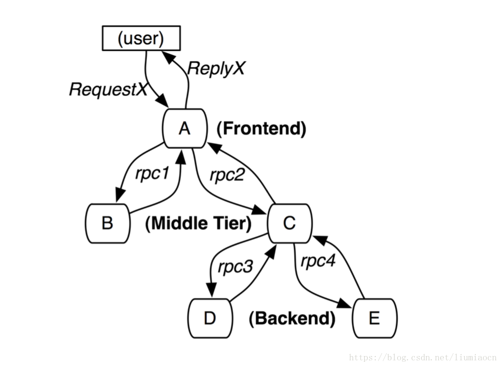
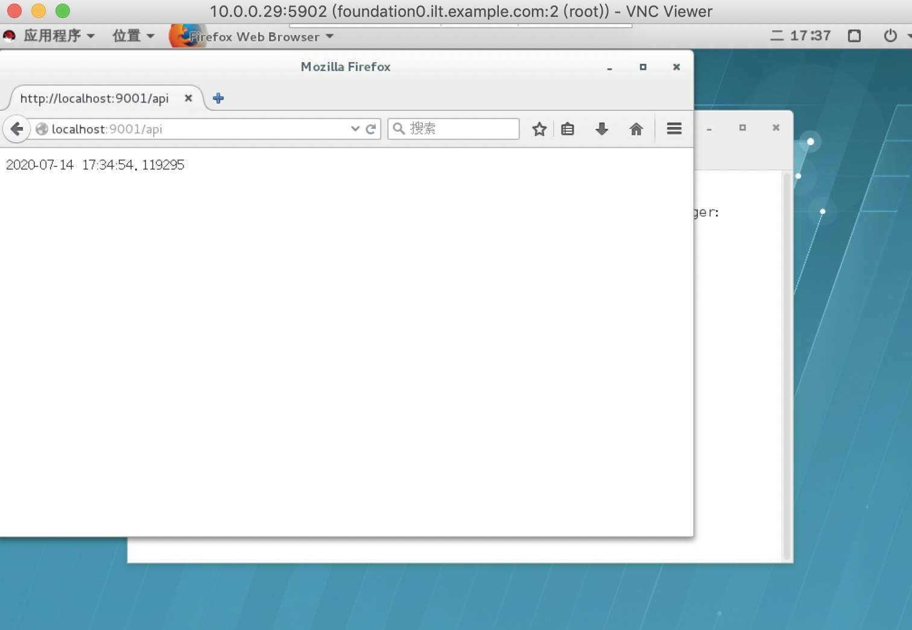
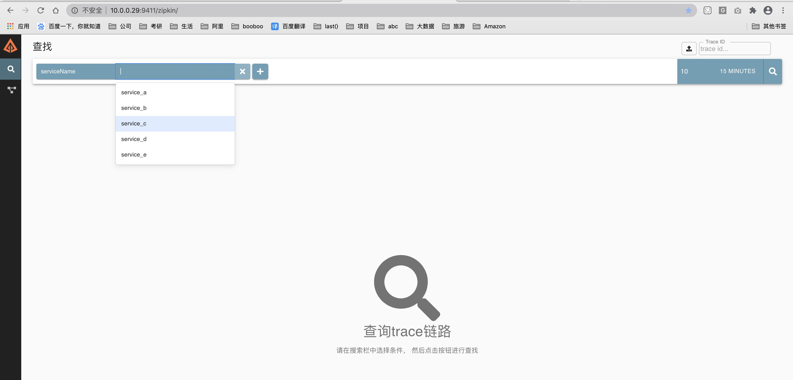
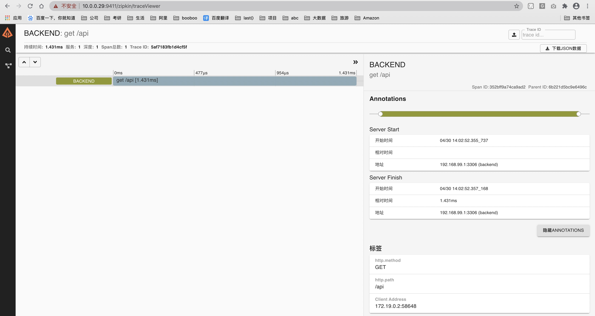
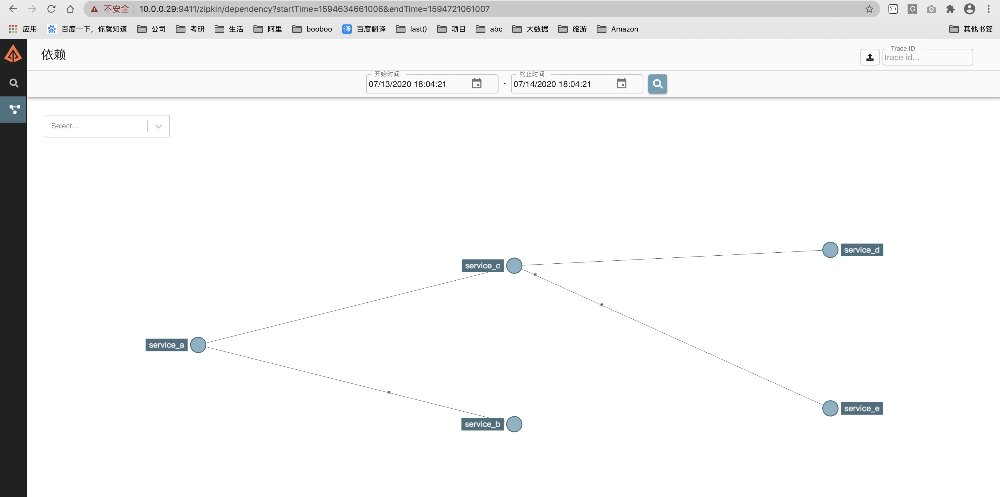
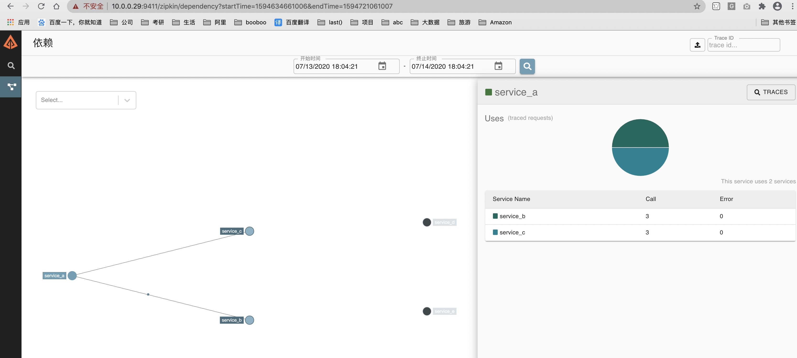

# Zipkin简介

|项目|	说明|
|:--|:--|
|官方网站|	https://zipkin.io/|
|开源/闭源|	开源|
|License类别|	Apache License 2.0|
|代码管理地址|	https://github.com/openzipkin/zipkin/|
|开发语言|	Java，Javascript|
|支持平台|	可运行于Linux/Windows/MacOS等多种操作系统，并提供docker标准镜像|
|当前版本|	2.9.1 （2018/06/11）|
|更新频度|	平均每月数次|

## Zipkin是什么

 Zipkin的官方介绍：https://zipkin.io/

 Zipkin是一款开源的分布式实时数据追踪系统（Distributed Tracking System），基于 Google Dapper的论文设计而来，由 Twitter 公司开发贡献。其主要功能是聚集来自各个异构系统的实时监控数据。分布式跟踪系统还有其他比较成熟的实现，例如：Naver的Pinpoint、Apache的HTrace、阿里的鹰眼Tracing、京东的Hydra、新浪的Watchman，美团点评的CAT，skywalking等。

## 为什么用Zipkin

 随着业务越来越复杂，系统也随之进行各种拆分，特别是随着微服务架构和容器技术的兴起，看似简单的一个应用，后台可能有几十个甚至几百个服务在支撑；一个前端的请求可能需要多次的服务调用最后才能完成；当请求变慢或者不可用时，我们无法得知是哪个后台服务引起的，这时就需要解决如何快速定位服务故障点，Zipkin分布式跟踪系统就能很好的解决这样的问题。

Zipkin的一些基本概念？

### Brave

Brave 是用来装备 Java 程序的类库，提供了面向 Standard Servlet、Spring MVC、Http Client、JAX RS、Jersey、Resteasy 和 MySQL 等接口的装备能力，可以通过编写简单的配置和代码，让基于这些框架构建的应用可以向 Zipkin报告数据。同时 Brave 也提供了非常简单且标准化的接口，在以上封装无法满足要求的时候可以方便扩展与定制。

如下图是 Brave 的结构图。Brave 利用 reporter 向 Zipkin的 Collector 发送 trace 信息。


Brave 主要是利用拦截器在请求前和请求后分别埋点。例如 Spingmvc 监控使用 Interceptors，Mysql 监控使用 statementInterceptors。同理 Dubbo 的监控是利用 com.alibaba.dubbo.rpc.Filter 来过滤生产者和消费者的请求。

### traceId
一次请求全局只有一个traceId。用来在海量的请求中找到同一链路的几次请求。比如servlet服务器接收到用户请求，调用dubbo服务，然后将结果返回给用户，整条链路只有一个traceId。开始于用户请求，结束于用户收到结果。

### spanId
一个链路中每次请求都会有一个spanId。例如一次rpc，一次sql都会有一个单独的spanId从属于traceId。

### cs
Clent Sent 客户端发起请求的时间，比如 dubbo 调用端开始执行远程调用之前。

### cr
Client Receive 客户端收到处理完请求的时间。

### ss
Server Receive 服务端处理完逻辑的时间。

### sr
Server Receive 服务端收到调用端请求的时间。

```
sr - cs = 请求在网络上的耗时
ss - sr = 服务端处理请求的耗时
cr - ss = 回应在网络上的耗时
cr - cs = 一次调用的整体耗时
```

## Zipkin的工作过程

当用户发起一次调用时，Zipkin 的客户端会在入口处为整条调用链路生成一个全局唯一的 trace id，并为这条链路中的每一次分布式调用生成一个 span id。span 与 span 之间可以有父子嵌套关系，代表分布式调用中的上下游关系。span 和 span 之间可以是兄弟关系，代表当前调用下的两次子调用。一个 trace 由一组 span 组成，可以看成是由 trace 为根节点，span 为若干个子节点的一棵树。

Zipkin 会将 trace 相关的信息在调用链路上传递，并在每个调用边界结束时异步的把当前调用的耗时信息上报给 Zipkin Server。Zipkin Server 在收到 trace 信息后，将其存储起来。随后 Zipkin 的 Web UI 会通过 API 访问的方式从存储中将 trace 信息提取出来分析并展示。


# 安装Zipkin

Zipkin的 github 地址：https://github.com/apache/incubator-zipkin

## 安装Docker

CentOS 7 (使用yum进行安装)

> step 1: 安装必要的一些系统工具

```bash
sudo yum install -y yum-utils device-mapper-persistent-data lvm2
```

> Step 2: 添加软件源信息

```bash
sudo yum-config-manager --add-repo http://mirrors.aliyun.com/docker-ce/linux/centos/docker-ce.repo
cat /etc/yum.repos.d/centos.repo
[centos7]
name='centos'
baseurl='http://mirror.centos.org/centos/7/os/x86_64/'
enabled=1
gpgcheck=0

[centos7-extra]
name='centos extra'
baseurl='http://mirror.centos.org/centos/7/extras/x86_64/'
enabled=1
gpgcheck=0
```

> Step 3: 更新并安装Docker-CE

```bash
sudo yum makecache fast
sudo yum list docker-ce --showduplicates | sort -r
sudo yum -y install pigz container-selinux
sudo yum -y install docker-ce
```

> Step 4: 开启Docker服务

```bash
sudo systemctl  start docker
docker run hello-world
```

## docker-compose

Compose 是用于定义和运行多容器 Docker 应用程序的工具。通过 Compose，您可以使用 YML 文件来配置应用程序需要的所有服务。然后，使用一个命令，就可以从 YML 文件配置中创建并启动所有服务。

```bash
curl -L "https://github.com/docker/compose/releases/download/1.24.1/docker-compose-$(uname -s)-$(uname -m)" -o /usr/local/bin/docker-compose
chmod +x /usr/local/bin/docker-compose
ln -s /usr/local/bin/docker-compose /usr/bin/docker-compose
docker-compose --version
```

## docker部署zipkin

```bash
docker run -d -p 9411:9411 openzipkin/zipkin 
```

运行结果

```bash
[root@foundation0 ~]# docker pull openzipkin/zipkin
Using default tag: latest
latest: Pulling from openzipkin/zipkin
Digest: sha256:096200b68b0c56ab3446622a94c8d1a64c849b36d068c3bcf0799c73435d2e48
Status: Image is up to date for openzipkin/zipkin:latest
docker.io/openzipkin/zipkin:latest
[root@foundation0 ~]# docker images
REPOSITORY          TAG                 IMAGE ID            CREATED             SIZE
openzipkin/zipkin   latest              40f2f21f6707        9 days ago          158MB
hello-world         latest              bf756fb1ae65        6 months ago        13.3kB

[root@foundation0 ~]# docker run -d --restart always -p 9411:9411 --name zipkin openzipkin/zipkin
f0887b77042cdd151f9366f9830111e69446e860ff8c276802bea3b50f6c5efc
[root@foundation0 ~]# ps -ef|grep 9411
root     25957  6391  0 17:01 ?        00:00:00 /usr/bin/docker-proxy -proto tcp -host-ip 0.0.0.0 -host-port 9411 -container-ip 172.17.0.2 -container-port 9411
root     26054  5611  0 17:01 pts/1    00:00:00 grep --color=auto 9411
[root@foundation0 ~]# docker ps -a
CONTAINER ID        IMAGE               COMMAND                CREATED             STATUS                         PORTS                              NAMES
f0887b77042c        openzipkin/zipkin   "/busybox/sh run.sh"   16 seconds ago      Up 14 seconds                  9410/tcp, 0.0.0.0:9411->9411/tcp   zipkin
9856b62b0130        hello-world         "/hello"               About an hour ago   Exited (0) About an hour ago                                      clever_engelbart
```


```bash
# 10.200.6.53
grant all on ziplin.* to 'ziplin'@'%' identified by 'Zyadmin@123';
#服务器任意目录创建zipkinDocker文件夹
#新建以下文件
vi docker-compose.yml
#编写内容
#注意mysql数据库版本最好是5.6-5.7的，我用mysql8.0连接不成功
version: '2'

services:
  # The zipkin process services the UI, and also exposes a POST endpoint that
  # instrumentation can send trace data to. Scribe is disabled by default.
  zipkin:
    image: openzipkin/zipkin
    container_name: zipkin
    environment:
      - STORAGE_TYPE=mysql
      # Point the zipkin at the storage backend
      - MYSQL_DB=zipkin
      - MYSQL_USER=zipkin
      - MYSQL_PASS=Zyadmin#123
      - MYSQL_HOST=你的数据库IP地址
      - MYSQL_TCP_PORT=3306
      # Uncomment to enable scribe
      # - SCRIBE_ENABLED=true
      # Uncomment to enable self-tracing
      # - SELF_TRACING_ENABLED=true
      # Uncomment to enable debug logging
      # - JAVA_OPTS=-Dlogging.level.zipkin=DEBUG -Dlogging.level.zipkin2=DEBUG
    network_mode: host
    ports:
      # Port used for the Zipkin UI and HTTP Api
      - 9411:9411
      # Uncomment if you set SCRIBE_ENABLED=true
      # - 9410:9410
    #networks: 
    #  - default 
    #  - my_net #创建网路 docker network create my_net 删除网络 docker network rm my_net
#networks: 
  #my_net: 
    #external: true

create database zipkin;

CREATE TABLE IF NOT EXISTS zipkin_spans
(
    trace_id_high BIGINT       NOT NULL DEFAULT 0 COMMENT 'If non zero, this means the trace uses 128 bit traceIds instead of 64 bit',
    `trace_id`    BIGINT       NOT NULL,
    `id`          BIGINT       NOT NULL,
    `name`        VARCHAR(255) NOT NULL,
    `parent_id`   BIGINT,
    `debug`       BIT(1),
    `start_ts`    BIGINT COMMENT 'Span.timestamp(): epoch micros used for endTs query and to implement TTL',
    `duration`    BIGINT COMMENT 'Span.duration(): micros used for minDuration and maxDuration query'
) ENGINE = InnoDB
  ROW_FORMAT = COMPRESSED
  CHARACTER SET = utf8
  COLLATE utf8_general_ci;
ALTER TABLE zipkin_spans
    ADD UNIQUE KEY (`trace_id_high`, `trace_id`, `id`) COMMENT 'ignore insert on duplicate';
ALTER TABLE zipkin_spans
    ADD INDEX (`trace_id_high`, `trace_id`, `id`) COMMENT 'for joining with zipkin_annotations';
ALTER TABLE zipkin_spans
    ADD INDEX (`trace_id_high`, `trace_id`) COMMENT 'for getTracesByIds';
ALTER TABLE zipkin_spans
    ADD INDEX (`name`) COMMENT 'for getTraces and getSpanNames';
ALTER TABLE zipkin_spans
    ADD INDEX (`start_ts`) COMMENT 'for getTraces ordering and range';
CREATE TABLE IF NOT EXISTS zipkin_annotations
(
    `trace_id_high`         BIGINT       NOT NULL DEFAULT 0 COMMENT 'If non zero, this means the trace uses 128 bit traceIds instead of 64 bit',
    `trace_id`              BIGINT       NOT NULL COMMENT 'coincides with zipkin_spans.trace_id',
    `span_id`               BIGINT       NOT NULL COMMENT 'coincides with zipkin_spans.id',
    `a_key`                 VARCHAR(255) NOT NULL COMMENT 'BinaryAnnotation.key or Annotation.value if type == -1',
    `a_value`               BLOB COMMENT 'BinaryAnnotation.value(), which must be smaller than 64KB',
    `a_type`                INT          NOT NULL COMMENT 'BinaryAnnotation.type() or -1 if Annotation',
    `a_timestamp`           BIGINT COMMENT 'Used to implement TTL; Annotation.timestamp or zipkin_spans.timestamp',
    `endpoint_ipv4`         INT COMMENT 'Null when Binary/Annotation.endpoint is null',
    `endpoint_ipv6`         BINARY(16) COMMENT 'Null when Binary/Annotation.endpoint is null, or no IPv6 address',
    `endpoint_port`         SMALLINT COMMENT 'Null when Binary/Annotation.endpoint is null',
    `endpoint_service_name` VARCHAR(255) COMMENT 'Null when Binary/Annotation.endpoint is null'
) ENGINE = InnoDB
  ROW_FORMAT = COMPRESSED
  CHARACTER SET = utf8
  COLLATE utf8_general_ci;
ALTER TABLE zipkin_annotations
    ADD UNIQUE KEY (`trace_id_high`, `trace_id`, `span_id`, `a_key`, `a_timestamp`) COMMENT 'Ignore insert on duplicate';
ALTER TABLE zipkin_annotations
    ADD INDEX (`trace_id_high`, `trace_id`, `span_id`) COMMENT 'for joining with zipkin_spans';
ALTER TABLE zipkin_annotations
    ADD INDEX (`trace_id_high`, `trace_id`) COMMENT 'for getTraces/ByIds';
ALTER TABLE zipkin_annotations
    ADD INDEX (`endpoint_service_name`) COMMENT 'for getTraces and getServiceNames';
ALTER TABLE zipkin_annotations
    ADD INDEX (`a_type`) COMMENT 'for getTraces and autocomplete values';
ALTER TABLE zipkin_annotations
    ADD INDEX (`a_key`) COMMENT 'for getTraces and autocomplete values';
ALTER TABLE zipkin_annotations
    ADD INDEX (`trace_id`, `span_id`, `a_key`) COMMENT 'for dependencies job';
CREATE TABLE IF NOT EXISTS zipkin_dependencies
(
    `day`         DATE         NOT NULL,
    `parent`      VARCHAR(255) NOT NULL,
    `child`       VARCHAR(255) NOT NULL,
    `call_count`  BIGINT,
    `error_count` BIGINT
) ENGINE = InnoDB
  ROW_FORMAT = COMPRESSED
  CHARACTER SET = utf8
  COLLATE utf8_general_ci;
ALTER TABLE zipkin_dependencies
    ADD UNIQUE KEY (`day`, `parent`, `child`);


root@MySQL-01 17:39:  [zipkin]> show tables;
+---------------------+
| Tables_in_zipkin    |
+---------------------+
| zipkin_annotations  |
| zipkin_dependencies |
| zipkin_spans        |
+---------------------+
3 rows in set (0.00 sec)


#启动服务编排，在docker-compose.yml所在文件目录执行
docker-compose up -d
Creating zipkin ... done
#查看服务日志
docker-compose logs

[root@foundation0 docker_booboo]# docker-compose up -d
Creating zipkin ... done
[root@foundation0 docker_booboo]# docker-compose logs
Attaching to zipkin
zipkin    | MySQL host: 10.200.6.53
zipkin    |
zipkin    |                   oo
zipkin    |                  oooo
zipkin    |                 oooooo
zipkin    |                oooooooo
zipkin    |               oooooooooo
zipkin    |              oooooooooooo
zipkin    |            ooooooo  ooooooo
zipkin    |           oooooo     ooooooo
zipkin    |          oooooo       ooooooo
zipkin    |         oooooo   o  o   oooooo
zipkin    |        oooooo   oo  oo   oooooo
zipkin    |      ooooooo  oooo  oooo  ooooooo
zipkin    |     oooooo   ooooo  ooooo  ooooooo
zipkin    |    oooooo   oooooo  oooooo  ooooooo
zipkin    |   oooooooo      oo  oo      oooooooo
zipkin    |   ooooooooooooo oo  oo ooooooooooooo
zipkin    |       oooooooooooo  oooooooooooo
zipkin    |           oooooooo  oooooooo
zipkin    |               oooo  oooo
zipkin    |
zipkin    |      ________ ____  _  _____ _   _
zipkin    |     |__  /_ _|  _ \| |/ /_ _| \ | |
zipkin    |       / / | || |_) | ' / | ||  \| |
zipkin    |      / /_ | ||  __/| . \ | || |\  |
zipkin    |     |____|___|_|   |_|\_\___|_| \_|
zipkin    |
zipkin    | :: version 2.21.5 :: commit 7f4f274 ::
zipkin    |
zipkin    | 2020-07-13 09:44:25.300  INFO 1 --- [           main] z.s.ZipkinServer                         : Starting ZipkinServer on foundation0.ilt.example.com with PID 1 (/zipkin/BOOT-INF/classes started by zipkin in /zipkin)
zipkin    | 2020-07-13 09:44:25.304  INFO 1 --- [           main] z.s.ZipkinServer                         : The following profiles are active: shared
zipkin    | 2020-07-13 09:44:26.161  INFO 1 --- [           main] o.s.s.c.ThreadPoolTaskExecutor           : Initializing ExecutorService
zipkin    | 2020-07-13 09:44:26.163  INFO 1 --- [           main] o.s.s.c.ThreadPoolTaskExecutor           : Initializing ExecutorService 'mysqlExecutor'
zipkin    | 2020-07-13 09:44:26.591  INFO 1 --- [           main] c.l.a.c.u.SystemInfo                     : hostname: foundation0.ilt.example.com (from /proc/sys/kernel/hostname)
zipkin    | 2020-07-13 09:44:26.994  INFO 1 --- [oss-http-*:9411] c.l.a.s.Server                           : Serving HTTP at /[0:0:0:0:0:0:0:0%0]:9411 - http://127.0.0.1:9411/
zipkin    | 2020-07-13 09:44:26.997  INFO 1 --- [           main] c.l.a.s.ArmeriaAutoConfiguration         : Armeria server started at ports: {/[0:0:0:0:0:0:0:0%0]:9411=ServerPort(/[0:0:0:0:0:0:0:0%0]:9411, [http])}
zipkin    | 2020-07-13 09:44:27.029  INFO 1 --- [           main] z.s.ZipkinServer                         : Started ZipkinServer in 2.658 seconds (JVM running for 3.605)
```


# zipkin跟踪Python项目

参考：https://blog.csdn.net/liumiaocn/article/details/80657943

## Python项目依赖

> python 2.7

为了在Python项目中使用zipkin，需要py_zipkin/pyramid/pyramid_zipkin 。在CentOS系Linux发行版上命令如下：


```
yum install python-virtualenv python-devel
mkdir python_project_zipkin
cd python_project_zipkin
virtualenv venv
source venv/bin/activate
pip install --upgrade pip
pip install --trusted-host pypi.org --trusted-host files.pythonhosted.org py_zipkin pyramid pyramid_zipkin requests
```

操作记录:

```bash
[root@foundation0 docker_booboo]# mkdir python_project_zipkin;cd python_project_zipkin
[root@foundation0 docker_booboo]# /usr/bin/virtualenv venv
New python executable in /alidata/docker_booboo/python_project_zipkin/venv/bin/python
Installing setuptools, pip, wheel...done.
[root@foundation0 docker_booboo]# ll
总用量 4
-rw-r--r--. 1 root root 1161 7月  13 17:58 docker-compose.yml
drwxr-xr-x. 5 root root   52 7月  14 17:02 python_project_zipkin
[root@foundation0 docker_booboo]# cd python_project_zipkin/venv
[root@foundation0 venv]# ll
总用量 4
drwxr-xr-x. 2 root root 4096 7月  14 17:02 bin
drwxr-xr-x. 2 root root   22 7月  14 17:02 include
drwxr-xr-x. 3 root root   22 7月  14 17:02 lib
lrwxrwxrwx. 1 root root    3 7月  14 17:02 lib64 -> lib
[root@foundation0 venv]# source bin/
activate          activate.fish     easy_install      pip               pip2.7            python2           python-config
activate.csh      activate_this.py  easy_install-2.7  pip2              python            python2.7         wheel
[root@foundation0 python_project_zipkin]# source bin/activate
(venv) [root@foundation0 python_project_zipkin]# which pip
/alidata/docker_booboo/python_project_zipkin/venv/bin/pip
(python_project_zipkin) [root@foundation0 python_project_zipkin]# pip install –trusted-host pypi.org –trusted-host files.pythonhosted.org py_zipkin pyramid pyramid_zipkin
Invalid requirement: '–trusted-host'
Traceback (most recent call last):
  File "/alidata/docker_booboo/python_project_zipkin/lib/python2.7/site-packages/pip/req/req_install.py", line 82, in __init__
    req = Requirement(req)
  File "/alidata/docker_booboo/python_project_zipkin/lib/python2.7/site-packages/pip/_vendor/packaging/requirements.py", line 96, in __init__
    requirement_string[e.loc:e.loc + 8]))
InvalidRequirement: Invalid requirement, parse error at "'\xe2\x80\x93trust'"

You are using pip version 9.0.1, however version 20.1.1 is available.
You should consider upgrading via the 'pip install --upgrade pip' command.
(python_project_zipkin) [root@foundation0 python_project_zipkin]# pip install --upgrade pip
Collecting pip
  Downloading http://mirrors.aliyun.com/pypi/packages/43/84/23ed6a1796480a6f1a2d38f2802901d078266bda38388954d01d3f2e821d/pip-20.1.1-py2.py3-none-any.whl (1.5MB)
    100% |████████████████████████████████| 1.5MB 61.9MB/s
Installing collected packages: pip
  Found existing installation: pip 9.0.1
    Uninstalling pip-9.0.1:
      Successfully uninstalled pip-9.0.1
Successfully installed pip-20.1.1
(python_project_zipkin) [root@foundation0 python_project_zipkin]# pip install --trusted-host pypi.org --trusted-host files.pythonhosted.org py_zipkin pyramid pyramid_zipkin
DEPRECATION: Python 2.7 reached the end of its life on January 1st, 2020. Please upgrade your Python as Python 2.7 is no longer maintained. pip 21.0 will drop support for Python 2.7 in January 2021. More details about Python 2 support in pip, can be found at https://pip.pypa.io/en/latest/development/release-process/#python-2-support
Looking in indexes: http://mirrors.aliyun.com/pypi/simple/
Collecting py_zipkin
  Downloading http://mirrors.aliyun.com/pypi/packages/08/fe/02e113bb7720d4ec04f03a9e0902e2fa221c703d00b66cc453b242fcf383/py_zipkin-0.20.0-py2.py3-none-any.whl (52 kB)
     |████████████████████████████████| 52 kB 10.7 MB/s
Collecting pyramid
  Downloading http://mirrors.aliyun.com/pypi/packages/4e/4f/6fe39af43fadc6d6c12f4cff9ed438f4fed20245614170959b38fe9f762d/pyramid-1.10.4-py2.py3-none-any.whl (325 kB)
     |████████████████████████████████| 325 kB 65.5 MB/s
Collecting pyramid_zipkin
  Downloading http://mirrors.aliyun.com/pypi/packages/de/70/62892aa6f6b80f83e8ba2a2b83bada1aef2854f4a51385c3344050d7828c/pyramid_zipkin-0.27.0-py2.py3-none-any.whl (11 kB)
Collecting enum34; python_version == "2.7"
  Downloading http://mirrors.aliyun.com/pypi/packages/6f/2c/a9386903ece2ea85e9807e0e062174dc26fdce8b05f216d00491be29fad5/enum34-1.1.10-py2-none-any.whl (11 kB)
Collecting thriftpy2>=0.4.0
  Downloading http://mirrors.aliyun.com/pypi/packages/a9/f0/9bf08e6b5983aa6a6103818da21eadfaea1ad99ec9882be3e75a30e8e9ff/thriftpy2-0.4.11.tar.gz (498 kB)
     |████████████████████████████████| 498 kB 67.2 MB/s
Collecting six
  Downloading http://mirrors.aliyun.com/pypi/packages/ee/ff/48bde5c0f013094d729fe4b0316ba2a24774b3ff1c52d924a8a4cb04078a/six-1.15.0-py2.py3-none-any.whl (10 kB)
Collecting hupper>=1.5
  Downloading http://mirrors.aliyun.com/pypi/packages/48/7f/06ace28143b2cb3a4b14c9d9e5165741d2d133ef331b616acf47ab5c3517/hupper-1.10.2-py2.py3-none-any.whl (26 kB)
Collecting venusian>=1.0
  Downloading http://mirrors.aliyun.com/pypi/packages/72/46/ffe45f3b4a99309387551f4a06ed7e6c06fb163226e63b09aa5d6a21a280/venusian-2.1.0-py2.py3-none-any.whl (33 kB)
Collecting zope.interface>=3.8.0
  Downloading http://mirrors.aliyun.com/pypi/packages/bb/79/6840e9ca1a68717d36248eb15bc4c01a56d252c66f03abc0202cb9ff4cbb/zope.interface-5.1.0-cp27-cp27mu-manylinux2010_x86_64.whl (230 kB)
     |████████████████████████████████| 230 kB 71.3 MB/s
Collecting zope.deprecation>=3.5.0
  Downloading http://mirrors.aliyun.com/pypi/packages/f9/26/b935bbf9d27e898b87d80e7873a0200cebf239253d0afe7a59f82fe90fff/zope.deprecation-4.4.0-py2.py3-none-any.whl (10 kB)
Requirement already satisfied: setuptools in ./lib/python2.7/site-packages (from pyramid) (28.8.0)
Collecting plaster-pastedeploy
  Downloading http://mirrors.aliyun.com/pypi/packages/11/c4/0470056ea324c7a420c22647be512dec1b5e32b1b6e77e27c61838d2811c/plaster_pastedeploy-0.7-py2.py3-none-any.whl (7.8 kB)
Collecting repoze.lru>=0.4; python_version < "3.2"
  Downloading http://mirrors.aliyun.com/pypi/packages/12/bc/595a77c4b5e204847fdf19268314ef59c85193a9dc9f83630fc459c0fee5/repoze.lru-0.7.tar.gz (19 kB)
Collecting translationstring>=0.4
  Downloading http://mirrors.aliyun.com/pypi/packages/3b/98/36187601a15e3d37e9bfcf0e0e1055532b39d044353b06861c3a519737a9/translationstring-1.4-py2.py3-none-any.whl (15 kB)
Collecting plaster
  Downloading http://mirrors.aliyun.com/pypi/packages/61/29/3ac8a5d03b2d9e6b876385066676472ba4acf93677acfc7360b035503d49/plaster-1.0-py2.py3-none-any.whl (14 kB)
Collecting webob>=1.8.3
  Downloading http://mirrors.aliyun.com/pypi/packages/18/3c/de37900faff3c95c7d55dd557aa71bd77477950048983dcd4b53f96fde40/WebOb-1.8.6-py2.py3-none-any.whl (114 kB)
     |████████████████████████████████| 114 kB 79.8 MB/s
Collecting ply<4.0,>=3.4
  Downloading http://mirrors.aliyun.com/pypi/packages/a3/58/35da89ee790598a0700ea49b2a66594140f44dec458c07e8e3d4979137fc/ply-3.11-py2.py3-none-any.whl (49 kB)
     |████████████████████████████████| 49 kB 68.0 MB/s
Collecting PasteDeploy>=2.0
  Downloading http://mirrors.aliyun.com/pypi/packages/fb/18/196e5070ced83bb81edd83c79545232d1d2ec55e3a099a146a3333244a6b/PasteDeploy-2.1.0-py2.py3-none-any.whl (17 kB)
Building wheels for collected packages: thriftpy2, repoze.lru
  Building wheel for thriftpy2 (setup.py) ... done
  Created wheel for thriftpy2: filename=thriftpy2-0.4.11-cp27-cp27mu-linux_x86_64.whl size=832256 sha256=55e3a0d96f87598662b3ed7b16d81536e48768185ade7cc6074a006182d595f9
  Stored in directory: /root/.cache/pip/wheels/3c/95/1f/eae02a041591574267b5216814814a804226c32061d9471b58
  Building wheel for repoze.lru (setup.py) ... done
  Created wheel for repoze.lru: filename=repoze.lru-0.7-py2-none-any.whl size=10931 sha256=fc0e76d5fbca10afcfc65253655d7a7aa63d875f73cb83ffbb8535ce1ee73b55
  Stored in directory: /root/.cache/pip/wheels/1c/6e/0b/047aab9e3fd851dc1be351cb286f45513f812376baa966ac18
Successfully built thriftpy2 repoze.lru
Installing collected packages: enum34, ply, thriftpy2, six, py-zipkin, hupper, venusian, zope.interface, zope.deprecation, PasteDeploy, plaster, plaster-pastedeploy, repoze.lru, translationstring, webob, pyramid, pyramid-zipkin
Successfully installed PasteDeploy-2.1.0 enum34-1.1.10 hupper-1.10.2 plaster-1.0 plaster-pastedeploy-0.7 ply-3.11 py-zipkin-0.20.0 pyramid-1.10.4 pyramid-zipkin-0.27.0 repoze.lru-0.7 six-1.15.0 thriftpy2-0.4.11 translationstring-1.4 venusian-2.1.0 webob-1.8.6 zope.deprecation-4.4.0 zope.interface-5.1.0

```

## 模拟dapper论文的调用链


在这篇文章中我们将会模拟在Python项目中如何跟中dapper论文中的三层架构的例子：

|层次|	服务名称|	父span|	调用顺序|
|:--|:--|:--|:--|
|前端|	Frontend：A|	无|	1|
|中间|	MiddleTier：B|	A|	2|
|中间|	MiddleTier：C|	A|	3|
|后端|	Backend：D|	C|	4|
|后端|	Backend：E	|C	|5|




## 模拟五个服务

代码上传到了github上，可参看：https://github.com/liumiaocn/easypack/tree/master/zipkin/python

使用python简单地模拟如上地A-E等五个服务，其中A和C为调用节点，而B/D/E为终端节点，A会调用B和C，其示例代码如下，C与之类似：

```bash
(venv) [root@foundation0 python_project_zipkin]# ll
总用量 24
-rw-r--r--. 1 root root 2109 7月  14 17:09 A.py
-rw-r--r--. 1 root root 1767 7月  14 17:13 B.py
-rw-r--r--. 1 root root 2155 7月  14 17:14 C.py
-rw-r--r--. 1 root root 1812 7月  14 17:14 D.py
-rw-r--r--. 1 root root 1812 7月  14 17:15 E.py
-rw-r--r--. 1 root root 1246 7月  14 17:15 test_zipkin.sh
drwxr-xr-x. 5 root root   52 7月  14 17:11 venv
```

再次确认zipkin镜像已pull在本地，如果本地开启了就先关闭并删除容器。

```bash
[root@foundation0 ~]# docker ps
CONTAINER ID        IMAGE               COMMAND                CREATED             STATUS              PORTS               NAMES
cc6c1ec08693        openzipkin/zipkin   "/busybox/sh run.sh"   23 hours ago        Up 23 hours                             zipkin
[root@foundation0 ~]# ss -luntp|grep docker
[root@foundation0 ~]# ss -luntp|grep 9411
tcp    LISTEN     0      128      :::9411                 :::*                   users:(("java",pid=5141,fd=163))
[root@foundation0 ~]# docker stop cc6c1ec08693
[root@foundation0 ~]# docker rm cc6c1ec08693
```

开始运行测试脚本

```bash 
(venv) [root@foundation0 python_project_zipkin]# bash test_zipkin.sh start

## Operation: start
## start begins ...
## start zipkin service
bdb9f0f3cf304385fddf3fb2d3b4e73f2286a54e88b9b0ded7ea1483f7a42eb6
## before start action

## Operation: status
## status begins ...
demo process: A.py
demo process: B.py
demo process: C.py
demo process: D.py
demo process: E.py
## status ends...
service Service_B listening : http://localhost:9002
service Service_D listening : http://localhost:9004
service Service_E listening : http://localhost:9005
service Service_A listening : http://localhost:9001
service Service_C listening : http://localhost:9003
## after start action

## Operation: status
## status begins ...
demo process: A.py
root     15567 15398 19 17:33 pts/0    00:00:00 python A.py
demo process: B.py
root     15569 15398 19 17:33 pts/0    00:00:00 python B.py
demo process: C.py
root     15570 15398 19 17:33 pts/0    00:00:00 python C.py
demo process: D.py
root     15572 15398 18 17:33 pts/0    00:00:00 python D.py
demo process: E.py
root     15573 15398 19 17:33 pts/0    00:00:00 python E.py
## status ends...
## start ends...
```


我的环境比较特殊，直接启动docker无法访问，所以还是使用以下方法启动

```bash 
[root@foundation0 python_project_zipkin]# docker ps
CONTAINER ID        IMAGE               COMMAND                CREATED             STATUS              PORTS                              NAMES
bdb9f0f3cf30        openzipkin/zipkin   "/busybox/sh run.sh"   15 minutes ago      Up 15 minutes       9410/tcp, 0.0.0.0:9411->9411/tcp   zipkin
[root@foundation0 python_project_zipkin]# docker stop bdb9f0f3cf30
bdb9f0f3cf30
[root@foundation0 python_project_zipkin]# docker rm bdb9f0f3cf30
bdb9f0f3cf30

[root@foundation0 python_project_zipkin]# docker-compose up -d
Creating zipkin ... done
[root@foundation0 python_project_zipkin]# docker inspect
"docker inspect" requires at least 1 argument.
See 'docker inspect --help'.

Usage:  docker inspect [OPTIONS] NAME|ID [NAME|ID...]

Return low-level information on Docker objects
[root@foundation0 python_project_zipkin]# docker ps
CONTAINER ID        IMAGE               COMMAND                CREATED             STATUS              PORTS               NAMES
daeab8b02ac8        openzipkin/zipkin   "/busybox/sh run.sh"   22 seconds ago      Up 20 seconds                           zipkin
[root@foundation0 python_project_zipkin]# ss -luntp|grep docker
[root@foundation0 python_project_zipkin]# ss -luntp|grep 9411
tcp    LISTEN     0      128      :::9411                 :::*                   users:(("java",pid=19120,fd=163))
```


## 访问入口服务

1. 通过命令行发起请求`curl http://localhost:9001/api`
2. 通过浏览器发起请求`http://localhost:9001/api`


```bash 
(venv) [root@foundation0 python_project_zipkin]# curl http://localhost:9001/api
127.0.0.1 - - [14/Jul/2020 17:52:52] "GET /apib HTTP/1.1" 200 26
127.0.0.1 - - [14/Jul/2020 17:52:52] "GET /api HTTP/1.1" 200 26
127.0.0.1 - - [14/Jul/2020 17:52:52] "GET /api HTTP/1.1" 200 26
127.0.0.1 - - [14/Jul/2020 17:52:52] "GET /api HTTP/1.1" 200 26
127.0.0.1 - - [14/Jul/2020 17:52:52] "GET /api HTTP/1.1" 200 26
```



## 观察Zipkin Web

### 确认服务个数

再次刷新zipkin，即可看到service name发生变化



### 确认trace信息

```bash 
(venv) [root@foundation0 docker_booboo]# curl http://localhost:9001/api
127.0.0.1 - - [14/Jul/2020 18:02:48] "GET /apib HTTP/1.1" 200 26
127.0.0.1 - - [14/Jul/2020 18:02:48] "GET /api HTTP/1.1" 200 26
127.0.0.1 - - [14/Jul/2020 18:02:48] "GET /api HTTP/1.1" 200 26
127.0.0.1 - - [14/Jul/2020 18:02:48] "GET /api HTTP/1.1" 200 26
127.0.0.1 - - [14/Jul/2020 18:02:48] "GET /api HTTP/1.1" 200 26
2020-07-14 18:02:48.687811(venv) [root@foundation0 docker_booboo]# curl http://localhost:9002/apib
127.0.0.1 - - [14/Jul/2020 18:02:52] "GET /apib HTTP/1.1" 200 26
2020-07-14 18:02:52.543569(venv) [root@foundation0 docker_booboo]# curl http://localhost:9003/api
127.0.0.1 - - [14/Jul/2020 18:02:57] "GET /api HTTP/1.1" 200 26
127.0.0.1 - - [14/Jul/2020 18:02:57] "GET /api HTTP/1.1" 200 26
127.0.0.1 - - [14/Jul/2020 18:02:57] "GET /api HTTP/1.1" 200 26
2020-07-14 18:02:57.220548(venv) [root@foundation0 docker_booboo]# curl http://localhost:9004/api
127.0.0.1 - - [14/Jul/2020 18:02:59] "GET /api HTTP/1.1" 200 26
2020-07-14 18:02:59.585916(venv) [root@foundation0 docker_booboo]# curl http://localhost:9005/api
127.0.0.1 - - [14/Jul/2020 18:03:01] "GET /api HTTP/1.1" 200 26
2020-07-14 18:03:01.635659(venv) [root@foundation0 docker_booboo]# curl http://localhost:9001/api
127.0.0.1 - - [14/Jul/2020 18:03:04] "GET /apib HTTP/1.1" 200 26
127.0.0.1 - - [14/Jul/2020 18:03:04] "GET /api HTTP/1.1" 200 26
127.0.0.1 - - [14/Jul/2020 18:03:04] "GET /api HTTP/1.1" 200 26
127.0.0.1 - - [14/Jul/2020 18:03:04] "GET /api HTTP/1.1" 200 26
127.0.0.1 - - [14/Jul/2020 18:03:04] "GET /api HTTP/1.1" 200 26
```

没有显示出trace信息，手动导入了json




### 依赖关系

点击find trace即可看到含有5个span的如下信息






