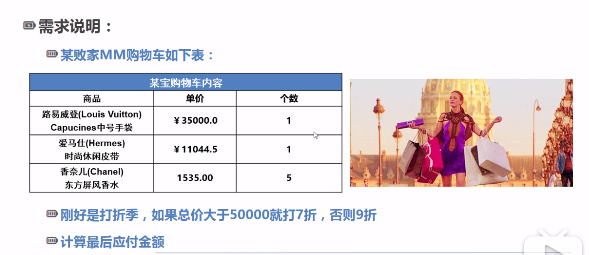

# 判断

## 流程图

判断结构要求程序员指定一个或多个要评估或测试的条件，以及条件为真时要执行的语句（必需的）和条件为假时要执行的语句（可选的）。

下面是大多数编程语言中典型的判断结构的一般形式：


## 判断语句

C++ 编程语言提供了以下类型的判断语句。点击链接查看每个语句的细节。

| 语句                                                         | 描述                                                         |
| :----------------------------------------------------------- | :----------------------------------------------------------- |
| [if 语句](https://www.runoob.com/cplusplus/cpp-if.html)      | 一个 **if 语句** 由一个布尔表达式后跟一个或多个语句组成。    |
| [if...else 语句](https://www.runoob.com/cplusplus/cpp-if-else.html) | 一个 **if 语句** 后可跟一个可选的 **else 语句**，else 语句在布尔表达式为假时执行。 |
| [嵌套 if 语句](https://www.runoob.com/cplusplus/cpp-nested-if.html) | 您可以在一个 **if** 或 **else if** 语句内使用另一个 **if** 或 **else if** 语句。 |
| [switch 语句](https://www.runoob.com/cplusplus/cpp-switch.html) | 一个 **switch** 语句允许测试一个变量等于多个值时的情况。     |
| [嵌套 switch 语句](https://www.runoob.com/cplusplus/cpp-nested-switch.html) | 您可以在一个 **switch** 语句内使用另一个 **switch** 语句。   |

## 判断语法

```c++
// if 语句的语法
if(boolean_expression)
{
   // 如果布尔表达式为真将执行的语句
}

// if...else 语句的语法
if(boolean_expression)
{
   // 如果布尔表达式为真将执行的语句
}
else
{
   // 如果布尔表达式为假将执行的语句
}

// 嵌套 if 语句的语法
if( boolean_expression 1)
{
   // 当布尔表达式 1 为真时执行
   if(boolean_expression 2)
   {
      // 当布尔表达式 2 为真时执行
   }
}

// switch 语句的语法
switch(expression){
    case constant-expression  :
       statement(s);
       break; // 可选的
    case constant-expression  :
       statement(s);
       break; // 可选的
  
    // 您可以有任意数量的 case 语句
    default : // 可选的
       statement(s);
}

// 嵌套 switch 语句的语法
switch(ch1) {
   case 'A': 
      cout << "这个 A 是外部 switch 的一部分";
      switch(ch2) {
         case 'A':
            cout << "这个 A 是内部 switch 的一部分";
            break;
         case 'B': // 内部 B case 代码
      }
      break;
   case 'B': // 外部 B case 代码
}
```


## ? : 运算符

我们已经在前面的章节中讲解了 [**条件运算符 ? :**](https://www.runoob.com/cplusplus/cpp-conditional-operator.html)，可以用来替代 **if...else** 语句。它的一般形式如下：

```
Exp1 ? Exp2 : Exp3;
```

其中，Exp1、Exp2 和 Exp3 是表达式。请注意，冒号的使用和位置。

? 表达式的值是由 Exp1 决定的。如果 Exp1 为真，则计算 Exp2 的值，结果即为整个 ? 表达式的值。如果 Exp1 为假，则计算 Exp3 的值，结果即为整个 ? 表达式的值。

# 循环

## 流程图

有的时候，可能需要多次执行同一块代码。一般情况下，语句是顺序执行的：函数中的第一个语句先执行，接着是第二个语句，依此类推。

编程语言提供了允许更为复杂的执行路径的多种控制结构。

循环语句允许我们多次执行一个语句或语句组，下面是大多数编程语言中循环语句的一般形式：


## 循环类型

C++ 编程语言提供了以下几种循环类型。点击链接查看每个类型的细节。

| 循环类型                                                     | 描述                                                         |
| :----------------------------------------------------------- | :----------------------------------------------------------- |
| [while 循环](https://www.runoob.com/cplusplus/cpp-while-loop.html) | 当给定条件为真时，重复语句或语句组。它会在执行循环主体之前测试条件。 |
| [for 循环](https://www.runoob.com/cplusplus/cpp-for-loop.html) | 多次执行一个语句序列，简化管理循环变量的代码。               |
| [do...while 循环](https://www.runoob.com/cplusplus/cpp-do-while-loop.html) | 除了它是在循环主体结尾测试条件外，其他与 while 语句类似。    |
| [嵌套循环](https://www.runoob.com/cplusplus/cpp-nested-loops.html) | 您可以在 while、for 或 do..while 循环内使用一个或多个循环。  |

## 循环语法

```c++
// while 循环的语法
while(condition)
{
   statement(s);
}

// for 循环的语法
for ( init; condition; increment )
{
   statement(s);
}

// do...while 循环的语法
do
{
   statement(s);

}while( condition );

// 嵌套 for 循环 语句的语法
for ( init; condition; increment )
{
   for ( init; condition; increment )
   {
      statement(s);
   }
   statement(s); // 可以放置更多的语句
}

// 嵌套 while 循环 语句的语法
while(condition)
{
   while(condition)
   {
      statement(s);
   }
   statement(s); // 可以放置更多的语句
}

// 嵌套 do...while 循环 语句的语法
do
{
   statement(s); // 可以放置更多的语句
   do
   {
      statement(s);
   }while( condition );
 
}while( condition );

// break 语句的语法：
break;

// continue 语句的语法：
continue;

// goto 语句的语法：
goto label;
..
.
label: statement;
```


## 循环控制

循环控制语句更改执行的正常序列。当执行离开一个范围时，所有在该范围中创建的自动对象都会被销毁。

C++ 提供了下列的控制语句。点击链接查看每个语句的细节。

| 控制语句                                                     | 描述                                                         |
| :----------------------------------------------------------- | :----------------------------------------------------------- |
| [break 语句](https://www.runoob.com/cplusplus/cpp-break-statement.html) | 终止 **loop** 或 **switch** 语句，程序流将继续执行紧接着 loop 或 switch 的下一条语句。 |
| [continue 语句](https://www.runoob.com/cplusplus/cpp-continue-statement.html) | 引起循环跳过主体的剩余部分，立即重新开始测试条件。           |
| [goto 语句](https://www.runoob.com/cplusplus/cpp-goto-statement.html) | 将控制转移到被标记的语句。但是不建议在程序中使用 goto 语句。 |

## 无限循环

如果条件永远不为假，则循环将变成无限循环。**for** 循环在传统意义上可用于实现无限循环。由于构成循环的三个表达式中任何一个都不是必需的，您可以将某些条件表达式留空来构成一个无限循环。

```c++
#include <iostream>
using namespace std;
 
int main ()
{
 
   for( ; ; )
   {
      printf("This loop will run forever.\n");
   }
 
   return 0;
}
```

当条件表达式不存在时，它被假设为真。您也可以设置一个初始值和增量表达式，但是一般情况下，C++ 程序员偏向于使用 for(;;) 结构来表示一个无限循环。

**注意：**您可以按 Ctrl + C 键终止一个无限循环。

# 课堂练习

## 购物小应用



需求说明：

1. 某败家MM购物车如下:

   | 商品               | 单价    | 个数 |
   | ------------------ | ------- | ---- |
   | 路易斯威登中号手袋 | 35000.0 | 1    |
   | 爱马仕时尚休闲皮带 | 11044.5 | 1    |
   | 香奈儿东方屏风香水 | 1535.00 | 5    |

2. 刚好是打折季，如果总价大于50000 就打折7折，否则9折

3. 计算最后应付金额

```c++
#include <iostream>
#include <cmath>
#include <iomanip>

using namespace std;

int main()
{
    // 某败家MM购物车
    double handbag = 35000.0 * 1;
    double belt = 11044.5 * 1;
    double perfume = 1535.00 * 5;
    double sum_pre = handbag + belt + perfume;
    string info;
    double sum_after;
    // 刚好是打折季，如果总价大于50000 就打折7折，否则9折
    if( sum_pre > 500000 )
    {
        sum_after = sum_pre * 0.7;
        info = "7折";
    }
    else
    {
        sum_after = sum_pre * 0.9;
        info = "9折";
    }
    

    cout << fixed; // 让浮点型固定以数字的方式显示
    cout << setprecision(2); // 控制显示的小数位数
    cout << "打折之前的价格为：\t" << sum_pre << endl;
    cout << info << "的价格为：\t\t" << sum_after << endl;
    return 0;
}
```

运行结果：

```bash
打折之前的价格为：      53719.50
9折的价格为：          48347.55
```

## 循环计算1-100的累加和

```c++
#include <iostream>

using namespace std;

int main()
{
    int sum;
    const int N = 10;
    for(int i = 1; i <= N; i = i + 1){
        sum = sum + i;
    }
    cout << sum << endl;
    return 0;
}
```

运行结果：

```bash
55
```

通过好的算法减少复杂度

```c++
#include <iostream>

using namespace std;

int main()
{
    int sum;
    const int N = 10;
    sum = N * ( N + 1 ) / 2;
    cout << sum << endl;
    return 0;
}
```

## 幸运53猜商品价格游戏

要求：

1. 根据猜的次数给予不同的奖励
2. 1次：iPhone8S Plus 土豪金
3. 2-3次：小米移动电源
4. 5次以内：VR眼镜

```c++
#include <iostream>

using namespace std;

int main()
{
    // 设定商品的价格
    int product_price = 5000;
    // 设定奖品
    string a_prize = "iPhone8S Plus 土豪金";
    string b_prize = "小米移动电源";
    string c_prize = "VR眼镜";
    // 次数决定奖品类型
    int answer;
    int status;
    int i = 0;
    while(true){
        i = i + 1;
        if(i <= 5){
            cout << "神秘商品的价格是（第" << i << "次）:"  << endl;
            cin >> answer;

            if(answer > product_price ){
                cout << "猜大了! " << endl;
                status = 0;
            }
            else if(answer < product_price){
                cout << "猜小了! " << endl;
                status = 0;
            }
            else{
                cout << "恭喜！猜对了!" << endl;
                status = 1;
                break;
            }
        }
        else{
            // cout << "5次机会已经用完，下次再接再厉！" << endl;
            break;
        }
    }

    if(status == 0){
        cout << "5次机会已经用完，下次再接再厉！" << endl;
    }
    else if(status == 1 && i == 1){
        cout << "恭喜您中了头奖" << a_prize << endl;
    }
    else if(status == 1 && (i == 2 || i == 3)){
        cout << "恭喜您中了二等奖" << b_prize << endl;
    }
    else if (status == 1 && (i == 4 || i == 5)){
        cout << "恭喜您中了三等奖" << c_prize << endl;
    }
    else{
        cout << "error" << endl;
    }
    return 0;
}
```


