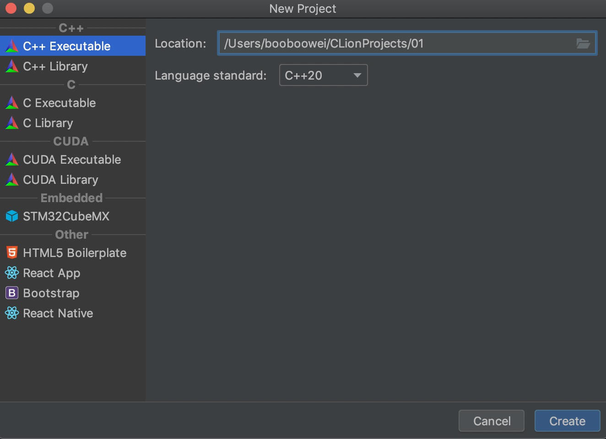

## 本地环境设置

> 我的环境为Mac，最终选择了 Visual Studio

[在Visual Studio中使用C ++进行Linux开发](https://devblogs.microsoft.com/cppblog/linux-development-with-c-in-visual-studio/)


如果您想要设置 C++ 语言环境，您需要确保电脑上有以下两款可用的软件，文本编辑器和 C++ 编译器。

### 文本编辑器


[Jetbrains官网](https://www.jetbrains.com/)
CLion是Jetbrains公司旗下新推出的一款专为开发C/C++所设计的跨平台IDE，它是以IntelliJ为基础设计的，同时还包含了许多智能功能来提高开发人员的生产力。


这将用于输入您的程序。文本编辑器包括 Windows Notepad、OS Edit command、Brief、Epsilon、EMACS 和 vim/vi。

文本编辑器的名称和版本在不同的操作系统上可能会有所不同。例如，Notepad 通常用于 Windows 操作系统上，vim/vi 可用于 Windows 和 Linux/UNIX 操作系统上。

通过编辑器创建的文件通常称为源文件，源文件包含程序源代码。C++ 程序的源文件通常使用扩展名 `.cpp`、`.cp` 或 `.c`。

在开始编程之前，请确保您有一个文本编辑器，且有足够的经验来编写一个计算机程序，然后把它保存在一个文件中，编译并执行它。




### C++ 编译器

写在源文件中的源代码是人类可读的源。它需要"编译"，转为机器语言，这样 CPU 可以按给定指令执行程序。

C++ 编译器用于把源代码编译成最终的可执行程序。

大多数的 C++ 编译器并不在乎源文件的扩展名，但是如果您未指定扩展名，则默认使用 `.cpp`。

最常用的免费可用的编译器是 GNU 的 C/C++ 编译器，如果您使用的是 HP 或 Solaris，则可以使用各自操作系统上的编译器。



Mac电脑自带已经按照了gcc


若想使用更高版本的，可以按照下面的步骤安装

```bash
01:12 下午 :~ booboowei$ brew search gcc
==> Formulae
gcc                  gcc@4.9              gcc@5                gcc@6                gcc@7                gcc@8                x86_64-elf-gcc
==> Casks
01:12 下午 :~ booboowei$ brew install gcc@8
==> Installing gcc@8
==> Pouring gcc@8-8.4.0_1.mojave.bottle.tar.gz
🍺  /usr/local/Cellar/gcc@8/8.4.0_1: 1,415 files, 286.3MB

01:24 下午 :~ booboowei$ c++-8 -v
Using built-in specs.
COLLECT_GCC=c++-8
COLLECT_LTO_WRAPPER=/usr/local/Cellar/gcc@8/8.4.0_1/libexec/gcc/x86_64-apple-darwin18/8.4.0/lto-wrapper
Target: x86_64-apple-darwin18
Configured with: ../configure --build=x86_64-apple-darwin18 --prefix=/usr/local/Cellar/gcc@8/8.4.0_1 --libdir=/usr/local/Cellar/gcc@8/8.4.0_1/lib/gcc/8 --disable-nls --enable-checking=release --enable-languages=c,c++,objc,obj-c++,fortran --program-suffix=-8 --with-gmp=/usr/local/opt/gmp --with-mpfr=/usr/local/opt/mpfr --with-mpc=/usr/local/opt/libmpc --with-isl=/usr/local/opt/isl --with-system-zlib --with-pkgversion='Homebrew GCC 8.4.0_1' --with-bugurl=https://github.com/Homebrew/homebrew-core/issues --disable-multilib --with-native-system-header-dir=/usr/include --with-sysroot=/Library/Developer/CommandLineTools/SDKs/MacOSX10.14.sdk SED=/usr/bin/sed
Thread model: posix
gcc version 8.4.0 (Homebrew GCC 8.4.0_1)
```
mac下编写c/c++代码所需的标准库和头文件
* 标准c++的库的头文件都是标准化了的，在mac上同样可以找到,但是在编译cpp文件时，必须要加上`-lstdc++`，告诉gcc使用c++标准库，这样才能找到相应的头文件。
* 编译标准c程序不需要


```bash
01:28 下午 :~ booboowei$ mkdir c++_project
01:28 下午 :~ booboowei$ cd c++_project/
01:28 下午 :c++_project booboowei$ vim main.cpp
01:28 下午 :c++_project booboowei$ cat main.cpp
#include <iostream>
using namespace std;
int main()
{
    cout << "Hello, world!" << endl;
    return 0;
}
01:28 下午 :c++_project booboowei$ which gcc
/usr/bin/gcc
01:28 下午 :c++_project booboowei$ gcc -v
Configured with: --prefix=/Library/Developer/CommandLineTools/usr --with-gxx-include-dir=/Library/Developer/CommandLineTools/SDKs/MacOSX10.14.sdk/usr/include/c++/4.2.1
Apple LLVM version 10.0.1 (clang-1001.0.46.4)
Target: x86_64-apple-darwin18.2.0
Thread model: posix
InstalledDir: /Library/Developer/CommandLineTools/usr/bin
01:28 下午 :c++_project booboowei$ gcc main.cpp -lstdc++ -o main
01:28 下午 :c++_project booboowei$ ll
total 48
-rwxr-xr-x  1 booboowei  staff    18K  6  8 13:28 main
-rw-r--r--  1 booboowei  staff   107B  6  8 13:28 main.cpp
01:29 下午 :c++_project booboowei$ ./main
Hello, world!
```


### g++ 常用命令


gcc a1.cpp -lstdc++ -o a
g++ a1.cpp -o a
g++ a1.cpp a2.cpp -o a



| 选项         | 解释                                                         |
| :----------- | :----------------------------------------------------------- |
| -ansi        | 只支持 ANSI 标准的 C 语法。这一选项将禁止 GNU C 的某些特色， 例如 asm 或 typeof 关键词。 |
| -c           | 只编译并生成目标文件。                                       |
| -DMACRO      | 以字符串"1"定义 MACRO 宏。                                   |
| -DMACRO=DEFN | 以字符串"DEFN"定义 MACRO 宏。                                |
| -E           | 只运行 C 预编译器。                                          |
| -g           | 生成调试信息。GNU 调试器可利用该信息。                       |
| -IDIRECTORY  | 指定额外的头文件搜索路径DIRECTORY。                          |
| -LDIRECTORY  | 指定额外的函数库搜索路径DIRECTORY。                          |
| -lLIBRARY    | 连接时搜索指定的函数库LIBRARY。                              |
| -m486        | 针对 486 进行代码优化。                                      |
| -o           | FILE 生成指定的输出文件。用在生成可执行文件时。              |
| -O0          | 不进行优化处理。                                             |
| -O           | 或 -O1 优化生成代码。                                        |
| -O2          | 进一步优化。                                                 |
| -O3          | 比 -O2 更进一步优化，包括 inline 函数。                      |
| -shared      | 生成共享目标文件。通常用在建立共享库时。                     |
| -static      | 禁止使用共享连接。                                           |
| -UMACRO      | 取消对 MACRO 宏的定义。                                      |
| -w           | 不生成任何警告信息。                                         |
| -Wall        | 生成所有警告信息。                                           |
