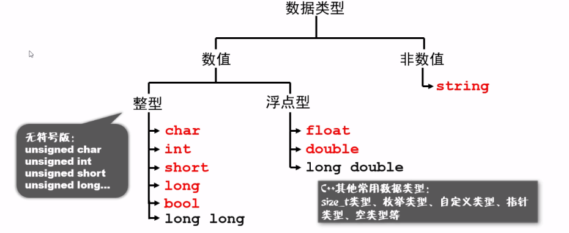

# 变量

## 命名规则
* 由 数字、字母和下划线 组成
* 不可以用下划线开头
* 不要使用拼音
* 尽量不要使用单个英文单词
* 提倡使用有正式含义的英文单词

## 内置类型

C++ 为程序员提供了种类丰富的内置数据类型和用户自定义的数据类型。下表列出了七种基本的 C++ 数据类型：

| 类型     | 关键字  |
| :------- | :------ |
| 布尔型   | bool    |
| 字符型   | char    |
| 整型     | int     |
| 浮点型   | float   |
| 双浮点型 | double  |
| 无类型   | void    |
| 宽字符型 | wchar_t |

其实 wchar_t 是这样来的：

```
typedef short int wchar_t;
```

所以 wchar_t 实际上的空间是和 short int 一样。

一些基本类型可以使用一个或多个类型修饰符进行修饰：

- signed
- unsigned
- short
- long

下表显示了各种变量类型在内存中存储值时需要占用的内存，以及该类型的变量所能存储的最大值和最小值。

**注意：**不同系统会有所差异，一字节为 8 位。

**注意：**long int 与 int 都是 4 个字节，因为早期的 C 编译器定义了 long int 占用 4 个字节，int 占用 2 个字节，新版的C/C++ 标准兼容了早期的这一设定。

| 类型               | 位            | 范围                                                         |
| :----------------- | :------------ | :----------------------------------------------------------- |
| char               | 1 个字节      | -128 到 127 或者 0 到 255                                    |
| unsigned char      | 1 个字节      | 0 到 255                                                     |
| signed char        | 1 个字节      | -128 到 127                                                  |
| int                | 4 个字节      | -2147483648 到 2147483647                                    |
| unsigned int       | 4 个字节      | 0 到 4294967295                                              |
| signed int         | 4 个字节      | -2147483648 到 2147483647                                    |
| short int          | 2 个字节      | -32768 到 32767                                              |
| unsigned short int | 2 个字节      | 0 到 65,535                                                  |
| signed short int   | 2 个字节      | -32768 到 32767                                              |
| long int           | 8 个字节      | -9,223,372,036,854,775,808 到 9,223,372,036,854,775,807      |
| signed long int    | 8 个字节      | -9,223,372,036,854,775,808 到 9,223,372,036,854,775,807      |
| unsigned long int  | 8 个字节      | 0 到 18,446,744,073,709,551,615                              |
| float              | 4 个字节      | 精度型占4个字节（32位）内存空间，+/- 3.4e +/- 38 (~7 个数字) |
| double             | 8 个字节      | 双精度型占8 个字节（64位）内存空间，+/- 1.7e +/- 308 (~15 个数字) |
| long double        | 16 个字节     | 长双精度型 16 个字节（128位）内存空间，可提供18-19位有效数字。 |
| wchar_t            | 2 或 4 个字节 | 1 个宽字符                                                   |

从上表可得知，变量的大小会根据编译器和所使用的电脑而有所不同。



# 输入输出

# 算数运算符

# 类型转换

# 课堂练习

## 打印整型的最大值

```c++ 
#include <iostream>

using namespace std;

int main()
{
    cout << "INT 最大值："
         << INT_MAX
         << "\n"
         << "INT 最小值："
         << INT_MIN << endl;
    return 0;
}
```

运行结果：
```bash
INT 最大值：2147483647
INT 最小值：-2147483648
```
