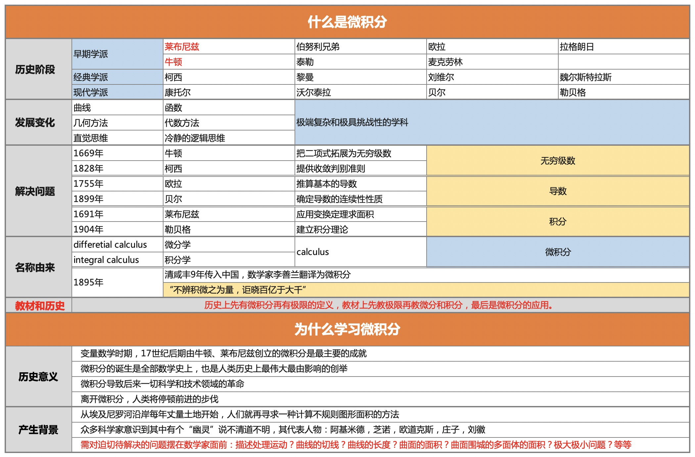

# 为什么学习微积分					

## 历史意义	

* 变量数学时期，17世纪后期由牛顿、莱布尼兹创立的微积分是最主要的成就				
* 微积分的诞生是全部数学史上，也是人类历史上最伟大最由影响的创举				
* 微积分导致后来一切科学和技术领域的革命				
* 离开微积分，人类将停顿前进的步伐		
		
## 产生背景	

* 从埃及尼罗河沿岸每年丈量土地开始，人们就再寻求一种计算不规则图形面积的方法				
* 众多科学家意识到其中有个“幽灵”说不清道不明，其代表人物：阿基米德，芝诺，欧道克斯，庄子，刘徽				
* 需对迫切待解决的问题摆在数学家面前：描述处理运动？曲线的切线？曲线的长度？曲面的面积？曲面围城的多面体的面积？极大极小问题？等等
				
# 历史阶段

* 早期学派 莱布尼兹 到 伯努利兄弟、欧拉、拉格朗日、柯西；从牛顿 到 泰勒、麦克劳林；
* 经典学派	柯西	黎曼	刘维尔	魏尔斯特拉斯
* 现代学派	康托尔	沃尔泰拉	贝尔	勒贝格

# 发展变化

* 从曲线到函数		
* 从几何方法到代数方法			
* 从直觉思维到冷静的逻辑思维			

数学是一个极端复杂和极具挑战性的学科	

| 时间 | 国家 | 数学家        | 数学科学发展大事记                                           |
| ---- | ---- | ------------- | ------------------------------------------------------------ |
| 1669 | 英国 | 牛顿          | 发明解非线性方程的牛顿-雷夫逊方法（英国  牛顿、雷夫逊）。    |
| 1684 | 德国 | 莱布尼茨      | 莱布尼茨发表关于微分法的著作《关于极大极小以及切线的新方法》。 |
| 1686 | 德国 | 莱布尼茨      | 莱布尼茨发表了关于积分法的著作。                             |
| 1691 | 瑞士 | 约翰·伯努利   | 约翰·伯努利出版《微分学初步》，促进了微积分在物理学和力学上的应用及研究。 |
| 1697 | 瑞士 | 约翰·伯努利   | 解决了一些变分问题，发现最速下降线和测地线（瑞士  约翰·伯努利）。 |
| 1704 | 英国 | 牛顿          | 牛顿发表《三次曲线枚举》、《利用无穷级数求曲线的面积和长度》、《流数法》。 |
| 1711 | 英国 | 牛顿          | 牛顿发表《使用级数、流数等等的分析》。                       |
| 1712 | 英国 | 泰勒          | 1712年7月给其老师梅钦（数学家  、天文学家）信中首先提出的著名定理－－泰勒定理：式内v为独立变量的增量， 及 为流数。 |
| 1713 | 瑞士 | 雅各布·伯努利 | 出版概率论的第一本著作《猜度术》（瑞士  雅各布·伯努利）。    |
| 1736 | 英国 | 牛顿          | 牛顿发表《流数法和无穷级数》。欧拉出版《力学、或解析地叙述运动的理论》，是用分析方法发展牛顿的质点动力学的第一本著作。 |
| 1744 | 英国 | 麦克劳林      | 1742年撰写的《流数论》以泰勒级数作为基本工具，是对牛顿的流数法作出符合逻辑的、系统解释的第一本书。当泰勒公式中x=0时便称作麦克劳林定理。 |
| 1744 | 瑞士 | 欧拉          | 欧拉导出了变分法的欧勒方程，发现某些极小曲面。               |
| 1748 | 瑞士 | 欧拉          | 欧拉出版了系统研究分析数学的《无穷分析概要》。               |
| 1761 | 法国 | 拉格朗日      | 1760─1761拉格朗日系统地研究了变分法及其在力学上的应用。      |
| 1767 | 法国 | 拉格朗日      | 拉格朗日发现分离代数方程实根的方法和求其近似值的方法。       |
| 1771 | 法国 | 拉格朗日      | 1770─1771拉格朗日把置换群用于代数方程式求解，这是群论的开始。 |
| 1772 | 法国 | 拉格朗日      | 拉格朗日给出三体问题最初的特解。                             |
| 1774 | 瑞士 | 欧拉          | 1755—1774  欧拉出版《微分学》和《积分学》三卷。              |
| 1788 | 法国 | 拉格朗日      | 拉格朗日出版《解析力学》，把新发展的解析法应用于质点、刚体力学。 |
| 1797 | 法国 | 拉格朗日      | 拉格朗日发表《解析函数论》不用极限的概念而用代数方法建立微分学。 |
| 1821 | 法国 | 柯西          | 柯西《分析教程》出版，用极限严格地定义了函数的连续、导数和积分，研究了无穷级数的收敛性等。 |
| 1825 | 法国 | 柯西          | 柯西发明关于复变函数的柯西积分定理，并用来求物理数学上常用的一些定积分值。 |
| 1831 | 法国 | 柯西          | 发现解析函数的幂级数收敛定理（法国  柯西）。                 |
| 1836 | 法国 | 柯西          | 柯西证明解析系数微分方程式解的存在性。证明具有已知周长的一切封闭曲线中包围最大面积的图形必定是圆（瑞士  施坦纳）。 |
| 1837 | 德国 | 狄利克雷      | 第一次给出了三角级数的一个收敛性定理（德国  狄利克莱）。     |
| 1840 | 德国 | 狄利克雷      | 把解析函数用于数论，并且引入了“狄利克雷”级数（德国  狄利克雷）。 |
| 1850 | 德国 | 黎曼          | 黎曼给出了“黎曼积分”的定义，提出函数可积的概念。             |
| 1851 | 德国 | 黎曼          | 黎曼提出共形映照的原理，在力学、工程技术中应用颇多，但未给出证明。 |
| 1851 | 法国 | 刘维尔        | 刘维尔发现了第一个超越数                                     |
| 1854 | 德国 | 黎曼          | 黎曼建立更广泛的一类非欧几何学——黎曼几何学，并提出多维拓扑流形的概念。切比雪夫开始建立函数逼近论，利用初等函数来逼近复杂的函数。 |
| 1856 | 德国 | 魏尔斯特拉斯  | 魏尔斯特拉斯建立极限理论中的ε-δ方法，确立了一致收敛性的概念。 |
| 1857 | 德国 | 黎曼          | 黎曼详细地讨论了黎曼面，把多值函数看成黎曼面上的单值函数。   |
| 1872 | 德国 | 魏尔斯特拉斯  | 数学分析的“算术化”，即以有理数的集合来定义实数（德国  戴特金、康托尔、魏尔斯特拉斯）。 |
| 1873 | 法国 | 埃尔米特      | 证明了e是超越数（法国 埃尔米特）。                           |
| 1876 | 德国 | 魏尔斯特拉斯  | 《解析函数论》发行，把复变函数论建立在幂级数的基础上（德国  魏尔斯特拉斯）。 |
| 1882 | 德国 | 林德曼        | 证明了π是超越数（德国 林德曼）。                             |
| 1883 | 德国 | 康托尔        | 康托尔建立集合论，发展了超穷基数的理论。                     |
| 1901 | 法国 | 勒贝格        | 法国数学家勒贝格，提出勒贝格测度和勒贝格积分，推广了长度、面积积分的概念。 |

