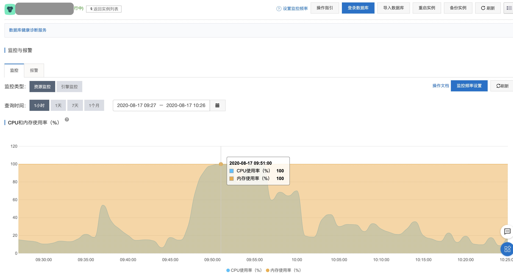
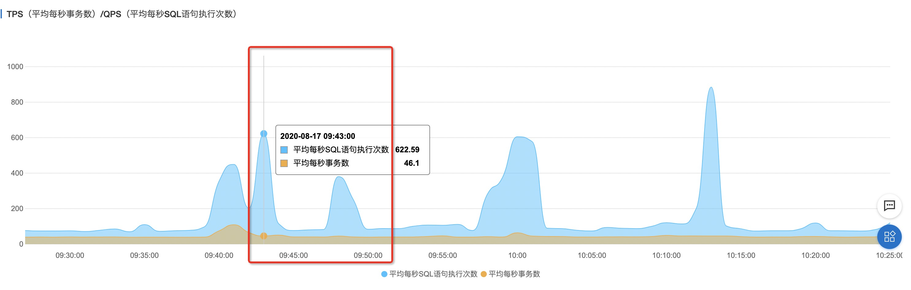
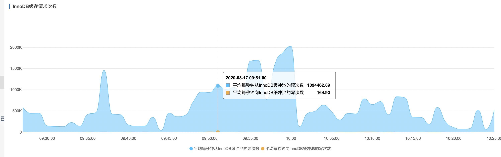
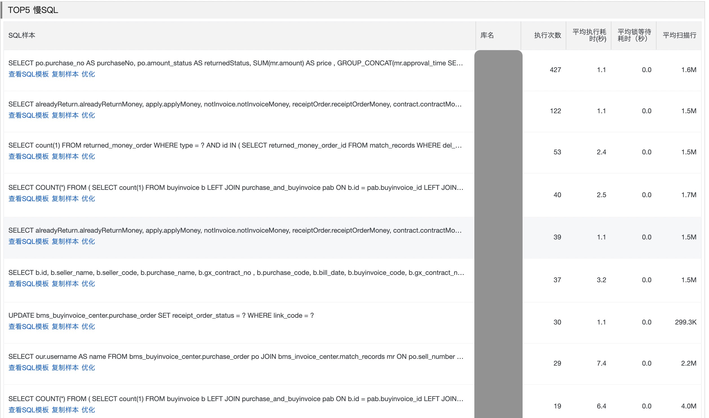
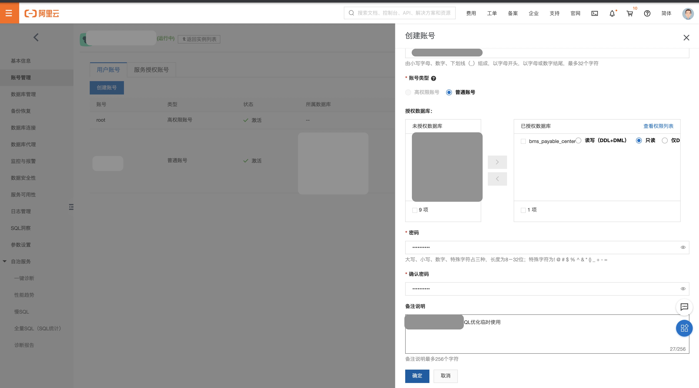
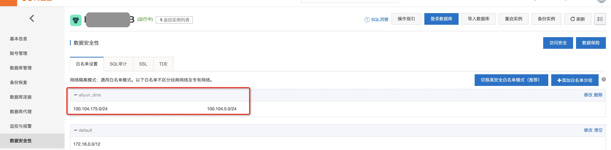
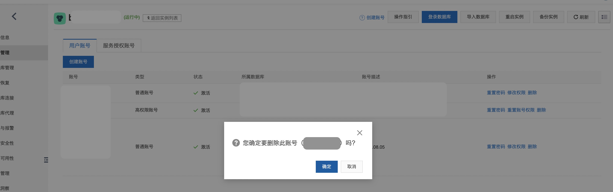

# 告警明细


# 信息搜集

## 实例信息

基本信息

| 实例ID：rm-xx                    | 名称：   xx-DB                               |                               |      |
| -------------------------------- | -------------------------------------------- | ----------------------------- | ---- |
| 地域可用区：华南1（深圳）可用区D | 类型及系列：常规实例 (高可用版)              |                               |      |
| 存储类型：本地SSD盘              |                                              |                               |      |
| 内网地址：xx                     | 内网端口：3306                               |                               |      |
| 运行状态：运行中                 | 计费方式：包月672天后到期 ( 自动续费[取消] ) | 创建时间：2019-06-20 22:58:01 |      |
|                                  |                                              |                               |      |

| 规格族：通用型            | 数据库类型：MySQL 5.7        | CPU：4核         |
| ------------------------- | ---------------------------- | ---------------- |
| 数据库内存：8192MB        | 最大IOPS：5000               | 最大连接数：2000 |
| 可维护时间段：02:00-06:00 | 实例规格：rds.mysql.s3.large |                  |

使用量统计

| 存储空间：已使用 44.37G(共150.00G) | 备份使用量：数据46.32G，归档备份0.00K, 日志8.58G（总量在76800MB 以内免费） |
| ---------------------------------- | ------------------------------------------------------------ |
| SQL采集量：0.00K                   |                                                              |

 

## 监控信息





CPU问题出现时间段：9:45～10:00

该时段的 TPS和QPS没有与CPU呈现一致的趋势，可以初步判断，业务上没有压力。




从存储引擎的监控看出，此时数据库读取的行数非常多，读次数非常高。

该时间段没有锁冲突，基本可以确定慢SQL导致。

## 自治服务（原CloudDBA性能分析）


慢SQL趋势与CPU趋势一致。

## 日志服务-慢SQL统计



# RDS SQL优化

创建驻云DBA专用的只读账号，并在报告完成后删除。



 







## Top1-SQL优化

```
select po.purchase_no purchaseNo,
         po.amount_status returnedStatus,                                       
         SUM(mr.amount) price,
         GROUP_CONCAT(mr.approval_time SEPARATOR ',') returnedDate,
         mr.settle_org department,                                        
         mr.settle_org_code settleOrgCode,                                  
         GROUP_CONCAT(distinct (rmo.type) SEPARATOR ',') returnedType,      
         GROUP_CONCAT(distinct (i.invoice_number) SEPARATOR ',') invoiceNumber,
         rmo.order_status orderStatus,
         rmo.pay_mode payMethod
        from bms_buyinvoice_center.purchase_order po
        left join bms_invoice_center.match_records mr on po.sell_number = mr.sap_order_no and mr.del_flag = 0
               and mr.status = 3
               and mr.del_flag = 0
        left join bms_invoice_center.returned_money_order rmo on mr.returned_money_order_id = rmo.id and rmo.del_flag = 0
        left join bms_invoice_center.invoice i on i.id = mr.invoice_id
        where po.purchase_no = '3101133355'
        GROUP BY po.purchase_no;
        
--- 统计信息
库名    : 
        bms_buyinvoice_center
        bms_invoice_center
执行次数       : 427
平均执行耗时(秒)       : 1.1
平均锁等待耗时（秒）   : 0.0
平均扫描行     : 1.6M
--- 信息索取
1. 表
bms_buyinvoice_center.purchase_order 采购单表 po
bms_invoice_center.match_records 匹配关系 mr
bms_invoice_center.returned_money_order 回款单 rmo
bms_invoice_center.invoice  发票 i
2. 执行计划
 
RDS资源正常的情况下SQL执行的时间 : 1002ms
+--------------+-----------------------+-----------------+----------------------+----------------+-------------------------+---------------+-------------------+-----------------------------------------------+----------------+--------------------+-----------------+
| id           | select_type           | table           | partitions           | type           | possible_keys           | key           | key_len           | ref                                           | rows           | filtered           | Extra           |
+--------------+-----------------------+-----------------+----------------------+----------------+-------------------------+---------------+-------------------+-----------------------------------------------+----------------+--------------------+-----------------+
| 1            | SIMPLE                | po              |                      | const          | no-unique               | no-unique     | 767               | const                                         | 1              | 100.00             |                 |
| 1            | SIMPLE                | mr              |                      | ALL            | status_nk               |               |                   |                                               | 1458735        | 100.00             | Using where     |
| 1            | SIMPLE                | rmo             |                      | eq_ref         | PRIMARY                 | PRIMARY       | 8                 | bms_invoice_center.mr.returned_money_order_id | 1              | 100.00             | Using where     |
| 1            | SIMPLE                | i               |                      | eq_ref         | PRIMARY                 | PRIMARY       | 8                 | bms_invoice_center.mr.invoice_id              | 1              | 100.00             |                 |
+--------------+-----------------------+-----------------+----------------------+----------------+-------------------------+---------------+-------------------+-----------------------------------------------+----------------+--------------------+-----------------+
 
执行计划中可以看出，优化器选择了mr表为基表
select count(*) from bms_invoice_center.match_records mr where mr.del_flag = 0
               and mr.status = 3
               and mr.del_flag = 0;
               
               mysql>select count(*) from bms_invoice_center.match_records mr where mr.del_flag = 0
                               and mr.status = 3
                               and mr.del_flag = 0;
               +--------------------+
               | count(*)           |
               +--------------------+
               | 1308346            |
               +--------------------+
               返回行数: [1], 耗时: [792ms]
               mysql>desc select count(*) from bms_invoice_center.match_records mr where mr.del_flag = 0
                               and mr.status = 3;
               +--------------+-----------------------+-----------------+----------------------+----------------+-------------------------+---------------+-------------------+---------------+----------------+--------------------+-----------------+
               | id           | select_type           | table           | partitions           | type           | possible_keys           | key           | key_len           | ref           | rows           | filtered           | Extra           |
               +--------------+-----------------------+-----------------+----------------------+----------------+-------------------------+---------------+-------------------+---------------+----------------+--------------------+-----------------+
               | 1            | SIMPLE                | mr              |                      | ALL            | status_nk               |               |                   |               | 1458744        | 1.00               | Using where     |
               +--------------+-----------------------+-----------------+----------------------+----------------+-------------------------+---------------+-------------------+---------------+----------------+--------------------+-----------------+
               返回行数: [1], 耗时: [56ms]
3. 索引分析            
               该语句的问题：
               1. 重复的过滤条件 del_flag=0
               2. 没有走索引，而是全表扫描，行数145w，而返回的函数只有1行
               alter table bms_invoice_center.match_records add index idx_del_flag_status (del_flag,status);
               
4. 测试验证            
               
               desc select count(*) from qixin.match_records mr where mr.del_flag = 0 and mr.status = 3;
               alter table qixin.match_records add index idx_del_flag_status (del_flag,status);
               测试环境中，通过添加复合索引，优化SQL的执行计划，提高SQL执行效率。
```

 


# 优化建议

## Top1-慢SQL明细

```sql
select po.purchase_no purchaseNo,
         po.amount_status returnedStatus,                                       
         SUM(mr.amount) price,
         GROUP_CONCAT(mr.approval_time SEPARATOR ',') returnedDate,
         mr.settle_org department,                                        
         mr.settle_org_code settleOrgCode,                                  
         GROUP_CONCAT(distinct (rmo.type) SEPARATOR ',') returnedType,      
         GROUP_CONCAT(distinct (i.invoice_number) SEPARATOR ',') invoiceNumber,
         rmo.order_status orderStatus,
         rmo.pay_mode payMethod
        from bms_buyinvoice_center.purchase_order po
        left join bms_invoice_center.match_records mr on po.sell_number = mr.sap_order_no and mr.del_flag = 0
               and mr.status = 3
               and mr.del_flag = 0
        left join bms_invoice_center.returned_money_order rmo on mr.returned_money_order_id = rmo.id and rmo.del_flag = 0
        left join bms_invoice_center.invoice i on i.id = mr.invoice_id
        where po.purchase_no = '3101133355'
        GROUP BY po.purchase_no;
```

SQL特点：执行次数最多，扫描行数最多。

## Top1-慢SQL优化建议

```sql
该语句的问题主要在 bms_invoice_center.match_records mr 表
1. 重复的过滤条件 del_flag=0

2. 没有走索引，而是全表扫描，行数145w，而返回的行数只有1行
优化建议：
建议添加复合索引来提高SQL的执行效率
alter table bms_invoice_center.match_records add index idx_del_flag_status (del_flag,status);
```

注意：

可以先在开发环境中做验证，确认后，选择业务低峰期执行。

 

