# 告警明细

2020年11月16日 4:59~5:03 期间出现了大量慢查询，导致CPU飙高至98%。

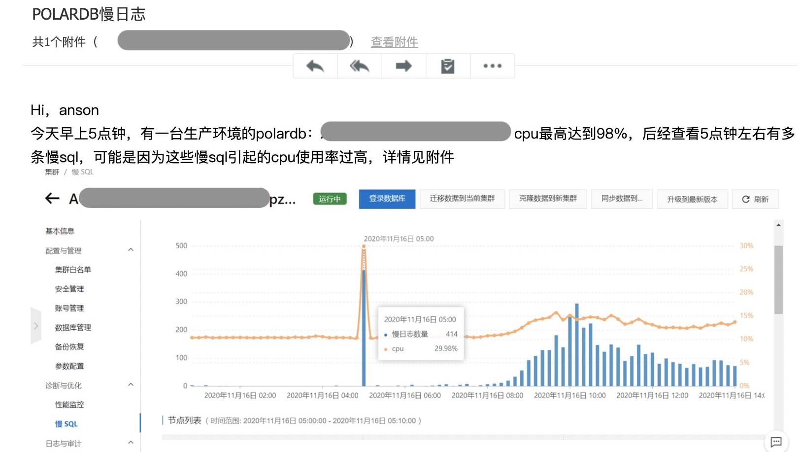

# 信息搜集

## 实例信息

- ACLSH-PRD-PDB-ODS-67 | pc-pz5zdh99c3i2js8vy
- 地域:华东 2 金融云
- 数据分布的可用区:华东2 金融云 可用区G（主），华东 2 金融云可用区 F

# 慢SQL统计

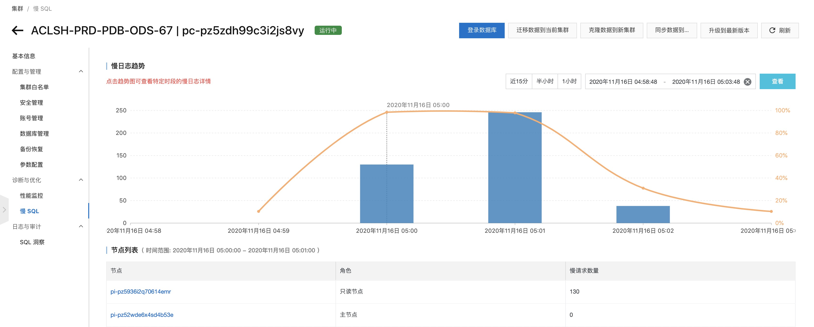

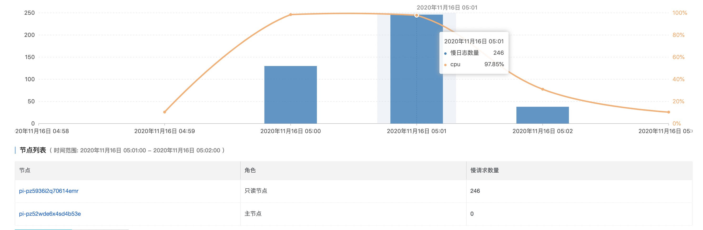

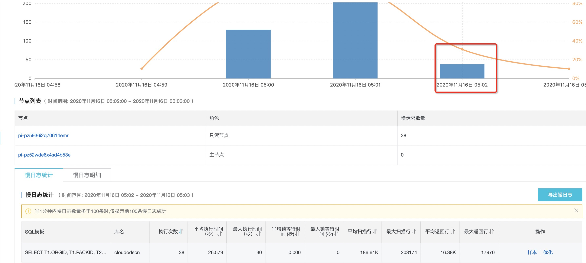

## 慢日志样本1

```sql
SELECT ORGID, CURCODE, PLANCODE, PLANNAME, PLANFLAG
    , PLANFLAG2, SEXUSE, STATUS, PLANTYPE, BENEFTYPE
    , RIDERIND, DATEBACK, OTHERIND, SELID, SELGRP
    , PIPORDER, BAND, OCCEXPIND, EFFDATE, EXPDATE
    , DATEPEND, AGEPEND, FIXCOV, ADUMINCOV, ADUMCPEND
    , JUVMINCOV, JUVMCPEND, ADUMINUNIT, ADUMUPEND, JUVMINUNIT
    , JUVMUPEND, UNITAMT, UNITPEND, PAYMODE, PMDPEND
    , COVDIV, DIVPEND, MAXBAND, EXPPEND, BANDPEND
    , FLAG, FILLER, PAPLOB
FROM VWNBRPLAN;
```

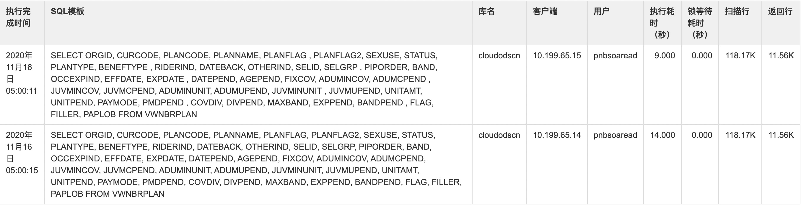

## 慢日志样本2

```sql
SELECT DISTINCT PLANCODE, FUNDCODE
FROM LLDPFI A
WHERE FUNDCODE LIKE 'F%'
    AND NOT EXISTS (
        SELECT 1
        FROM VWNBRPLAN
        WHERE STATUS = 'X'
            AND PLANCODE = A.PLANCODE
    )
ORDER BY A.PLANCODE, A.FUNDCODE;
```

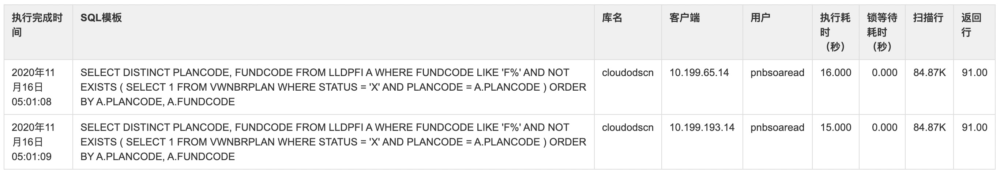

## 慢日志样本3

```sql
SELECT T1.ORGID, T1.PACKID, T2.PAYMODE AS PAYMODE
FROM NBRPACKDTL T1, VWNBRPLAN T2
WHERE T1.ORGID = T2.ORGID
    AND T1.MEMPLAN = T2.PLANCODE
ORDER BY ORGID, PACKID;
```

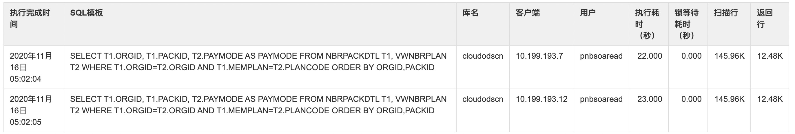

# 慢SQL优化

```sql
show create table nbrplan;
show create table nbrcurcode;
show create table nladpa;
show create table ladpj;
show create table lldpfi;
show create table nbrpackdtl;

SELECT
    t.table_name 表,
    t.table_schema 库,
    t.engine 引擎,
    t.table_length_B 表空间,
    t.data_length_B 数据空间,
    t.index_length_B 索引空间,
    t.table_rows 行数,
    t.avg_row_length_B 平均行长KB
FROM
    (
    SELECT
        table_name,
            table_schema,
            ENGINE,
            table_rows,
            data_length +  index_length AS table_length_B,
            data_length AS data_length_B,
            index_length AS index_length_B,
            AVG_ROW_LENGTH AS avg_row_length_B
    FROM
        information_schema.tables
    WHERE
        table_schema IN ('cloudodscn') and table_type != 'VIEW' and table_name in ("nbrplan","nbrcurcode","nladpa","ladpj","lldpfi","nbrpackdtl")
        ) t;
```


## 优化慢查询1

* 慢查询样本1 来自`pnbsoaread@10.199.65.15` 和 `pnbsoaread@10.199.65.14` 的查询请求，对视图的`VWNBRPLAN`查询。

* 获取视图、表的定义，分析SQL结构；统计表的数据量。

* 建议删除无效`group by`，不仅是语法规范问题，还会额外消耗数据库IO。

* 从SQL执行时间和SQL结构初步判断为分析型SQL，且在只读实例上查询，对写实例没有影响。

  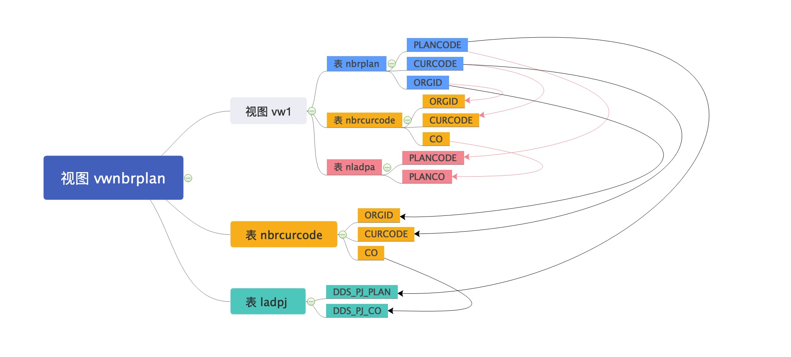

  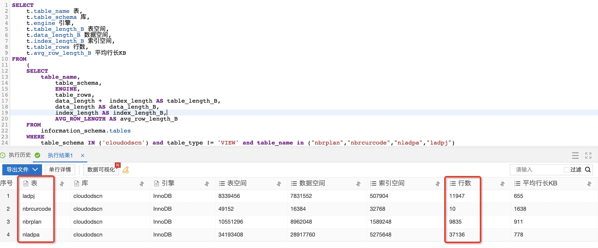

  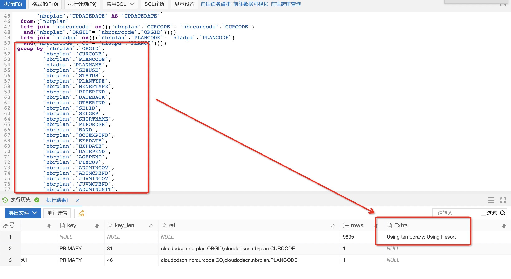

  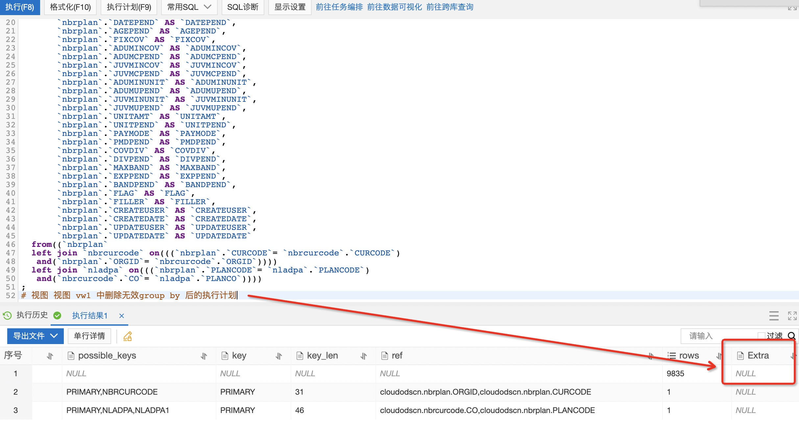

  ```sql
  # 视图 vwnbrplan
  CREATE ALGORITHM= UNDEFINED DEFINER= `dtssyncwriter`@`%` SQL SECURITY INVOKER VIEW `vwnbrplan` AS(
  select `vw1`.`ORGID` AS `ORGID`,
         `vw1`.`CURCODE` AS `CURCODE`,
         `vw1`.`PLANCODE` AS `PLANCODE`,
         `vw1`.`PLANNAME` AS `PLANNAME`,
         `ladpj`.`DDS_PJ_RCCPLAN` AS `PLANFLAG`,
         `ladpj`.`DDS_PJ_FLAG2` AS `PLANFLAG2`,
         `vw1`.`SEXUSE` AS `SEXUSE`,
         `vw1`.`STATUS` AS `STATUS`,
         `vw1`.`PLANTYPE` AS `PLANTYPE`,
         `vw1`.`BENEFTYPE` AS `BENEFTYPE`,
         `vw1`.`RIDERIND` AS `RIDERIND`,
         `vw1`.`DATEBACK` AS `DATEBACK`,
         `vw1`.`OTHERIND` AS `OTHERIND`,
         `vw1`.`SELID` AS `SELID`,
         `vw1`.`SELGRP` AS `SELGRP`,
         `vw1`.`SHORTNAME` AS `SHORTNAME`,
         `vw1`.`PIPORDER` AS `PIPORDER`,
         `vw1`.`BAND` AS `BAND`,
         `vw1`.`OCCEXPIND` AS `OCCEXPIND`,
         `vw1`.`EFFDATE` AS `EFFDATE`,
         `vw1`.`EXPDATE` AS `EXPDATE`,
         `vw1`.`DATEPEND` AS `DATEPEND`,
         `vw1`.`AGEPEND` AS `AGEPEND`,
         `vw1`.`FIXCOV` AS `FIXCOV`,
         `vw1`.`ADUMINCOV` AS `ADUMINCOV`,
         `vw1`.`ADUMCPEND` AS `ADUMCPEND`,
         `vw1`.`JUVMINCOV` AS `JUVMINCOV`,
         `vw1`.`JUVMCPEND` AS `JUVMCPEND`,
         `vw1`.`ADUMINUNIT` AS `ADUMINUNIT`,
         `vw1`.`ADUMUPEND` AS `ADUMUPEND`,
         `vw1`.`JUVMINUNIT` AS `JUVMINUNIT`,
         `vw1`.`JUVMUPEND` AS `JUVMUPEND`,
         `vw1`.`UNITAMT` AS `UNITAMT`,
         `vw1`.`UNITPEND` AS `UNITPEND`,
         `vw1`.`PAYMODE` AS `PAYMODE`,
         `vw1`.`PMDPEND` AS `PMDPEND`,
         `vw1`.`COVDIV` AS `COVDIV`,
         `vw1`.`DIVPEND` AS `DIVPEND`,
         `vw1`.`MAXBAND` AS `MAXBAND`,
         `vw1`.`EXPPEND` AS `EXPPEND`,
         `vw1`.`FLAG` AS `FLAG`,
         `vw1`.`BANDPEND` AS `BANDPEND`,
         `vw1`.`FILLER` AS `FILLER`,
         `vw1`.`CREATEUSER` AS `CREATEUSER`,
         `vw1`.`CREATEDATE` AS `CREATEDATE`,
         `vw1`.`UPDATEUSER` AS `UPDATEUSER`,
         `vw1`.`UPDATEDATE` AS `UPDATEDATE`,
         substr(`ladpj`.`DDS_PJ_COVERAGE_TYPE`, 1, 2) AS `PAPLOB`
    from((`vw1`
    left join `nbrcurcode` on(((`vw1`.`CURCODE`= `nbrcurcode`.`CURCODE`)
     and(`vw1`.`ORGID`= `nbrcurcode`.`ORGID`))))
    left join `ladpj` on(((`vw1`.`PLANCODE`= `ladpj`.`DDS_PJ_PLAN`)
     and(`nbrcurcode`.`CO`= `ladpj`.`DDS_PJ_CO`))))
  );
  
  ## 视图 vw1 
   CREATE ALGORITHM= UNDEFINED DEFINER= `dtssyncwriter`@`%` SQL SECURITY INVOKER VIEW `vw1` AS(
     select `nbrplan`.`ORGID` AS `ORGID`,
         `nbrplan`.`CURCODE` AS `CURCODE`,
         `nbrplan`.`PLANCODE` AS `PLANCODE`,
         `nladpa`.`PLANNAME` AS `PLANNAME`,
         `nbrplan`.`SEXUSE` AS `SEXUSE`,
         `nbrplan`.`STATUS` AS `STATUS`,
         `nbrplan`.`PLANTYPE` AS `PLANTYPE`,
         `nbrplan`.`BENEFTYPE` AS `BENEFTYPE`,
         `nbrplan`.`RIDERIND` AS `RIDERIND`,
         `nbrplan`.`DATEBACK` AS `DATEBACK`,
         `nbrplan`.`OTHERIND` AS `OTHERIND`,
         `nbrplan`.`SELID` AS `SELID`,
         `nbrplan`.`SELGRP` AS `SELGRP`,
         `nbrplan`.`SHORTNAME` AS `SHORTNAME`,
         `nbrplan`.`PIPORDER` AS `PIPORDER`,
         `nbrplan`.`BAND` AS `BAND`,
         `nbrplan`.`OCCEXPIND` AS `OCCEXPIND`,
         `nbrplan`.`EFFDATE` AS `EFFDATE`,
         `nbrplan`.`EXPDATE` AS `EXPDATE`,
         `nbrplan`.`DATEPEND` AS `DATEPEND`,
         `nbrplan`.`AGEPEND` AS `AGEPEND`,
         `nbrplan`.`FIXCOV` AS `FIXCOV`,
         `nbrplan`.`ADUMINCOV` AS `ADUMINCOV`,
         `nbrplan`.`ADUMCPEND` AS `ADUMCPEND`,
         `nbrplan`.`JUVMINCOV` AS `JUVMINCOV`,
         `nbrplan`.`JUVMCPEND` AS `JUVMCPEND`,
         `nbrplan`.`ADUMINUNIT` AS `ADUMINUNIT`,
         `nbrplan`.`ADUMUPEND` AS `ADUMUPEND`,
         `nbrplan`.`JUVMINUNIT` AS `JUVMINUNIT`,
         `nbrplan`.`JUVMUPEND` AS `JUVMUPEND`,
         `nbrplan`.`UNITAMT` AS `UNITAMT`,
         `nbrplan`.`UNITPEND` AS `UNITPEND`,
         `nbrplan`.`PAYMODE` AS `PAYMODE`,
         `nbrplan`.`PMDPEND` AS `PMDPEND`,
         `nbrplan`.`COVDIV` AS `COVDIV`,
         `nbrplan`.`DIVPEND` AS `DIVPEND`,
         `nbrplan`.`MAXBAND` AS `MAXBAND`,
         `nbrplan`.`EXPPEND` AS `EXPPEND`,
         `nbrplan`.`BANDPEND` AS `BANDPEND`,
         `nbrplan`.`FLAG` AS `FLAG`,
         `nbrplan`.`FILLER` AS `FILLER`,
         `nbrplan`.`CREATEUSER` AS `CREATEUSER`,
         `nbrplan`.`CREATEDATE` AS `CREATEDATE`,
         `nbrplan`.`UPDATEUSER` AS `UPDATEUSER`,
         `nbrplan`.`UPDATEDATE` AS `UPDATEDATE`
    from((`nbrplan`
    left join `nbrcurcode` on(((`nbrplan`.`CURCODE`= `nbrcurcode`.`CURCODE`)
     and(`nbrplan`.`ORGID`= `nbrcurcode`.`ORGID`))))
    left join `nladpa` on(((`nbrplan`.`PLANCODE`= `nladpa`.`PLANCODE`)
     and(`nbrcurcode`.`CO`= `nladpa`.`PLANCO`))))
   group by `nbrplan`.`ORGID`,
           `nbrplan`.`CURCODE`,
           `nbrplan`.`PLANCODE`,
           `nladpa`.`PLANNAME`,
           `nbrplan`.`SEXUSE`,
           `nbrplan`.`STATUS`,
           `nbrplan`.`PLANTYPE`,
           `nbrplan`.`BENEFTYPE`,
           `nbrplan`.`RIDERIND`,
           `nbrplan`.`DATEBACK`,
           `nbrplan`.`OTHERIND`,
           `nbrplan`.`SELID`,
           `nbrplan`.`SELGRP`,
           `nbrplan`.`SHORTNAME`,
           `nbrplan`.`PIPORDER`,
           `nbrplan`.`BAND`,
           `nbrplan`.`OCCEXPIND`,
           `nbrplan`.`EFFDATE`,
           `nbrplan`.`EXPDATE`,
           `nbrplan`.`DATEPEND`,
           `nbrplan`.`AGEPEND`,
           `nbrplan`.`FIXCOV`,
           `nbrplan`.`ADUMINCOV`,
           `nbrplan`.`ADUMCPEND`,
           `nbrplan`.`JUVMINCOV`,
           `nbrplan`.`JUVMCPEND`,
           `nbrplan`.`ADUMINUNIT`,
           `nbrplan`.`ADUMUPEND`,
           `nbrplan`.`JUVMINUNIT`,
           `nbrplan`.`JUVMUPEND`,
           `nbrplan`.`UNITAMT`,
           `nbrplan`.`UNITPEND`,
           `nbrplan`.`PAYMODE`,
           `nbrplan`.`PMDPEND`,
           `nbrplan`.`COVDIV`,
           `nbrplan`.`DIVPEND`,
           `nbrplan`.`MAXBAND`,
           `nbrplan`.`EXPPEND`,
           `nbrplan`.`BANDPEND`,
           `nbrplan`.`FLAG`,
           `nbrplan`.`FILLER`,
           `nbrplan`.`CREATEUSER`,
           `nbrplan`.`CREATEDATE`,
           `nbrplan`.`UPDATEUSER`,
           `nbrplan`.`UPDATEDATE`
  );
  
  ## 表结构
  ### nbrplan
  ### nbrcurcode
  ### nladpa
  ### ladpj
  
  CREATE TABLE `nbrplan` (
    `ORGID` varchar(6) COLLATE utf8_bin NOT NULL DEFAULT '',
    `CURCODE` varchar(3) COLLATE utf8_bin NOT NULL DEFAULT '',
    `PLANCODE` varchar(10) COLLATE utf8_bin NOT NULL DEFAULT '',
    `SEXUSE` varchar(1) COLLATE utf8_bin NOT NULL DEFAULT '',
    `STATUS` varchar(2) COLLATE utf8_bin DEFAULT NULL,
    `PLANTYPE` varchar(2) COLLATE utf8_bin DEFAULT NULL,
    `BENEFTYPE` varchar(2) COLLATE utf8_bin DEFAULT NULL,
    `RIDERIND` varchar(2) COLLATE utf8_bin DEFAULT NULL,
    `DATEBACK` varchar(1) COLLATE utf8_bin DEFAULT NULL,
    `OTHERIND` varchar(10) COLLATE utf8_bin DEFAULT NULL,
    `SELID` varchar(10) COLLATE utf8_bin DEFAULT NULL,
    `SELGRP` varchar(24) COLLATE utf8_bin DEFAULT NULL,
    `SHORTNAME` varchar(30) COLLATE utf8_bin DEFAULT NULL,
    `PIPORDER` decimal(4,0) DEFAULT NULL,
    `BAND` varchar(10) COLLATE utf8_bin DEFAULT NULL,
    `OCCEXPIND` varchar(10) COLLATE utf8_bin DEFAULT NULL,
    `EFFDATE` varchar(8) COLLATE utf8_bin DEFAULT NULL,
    `EXPDATE` varchar(8) COLLATE utf8_bin DEFAULT NULL,
    `DATEPEND` varchar(4) COLLATE utf8_bin DEFAULT NULL,
    `AGEPEND` varchar(4) COLLATE utf8_bin DEFAULT NULL,
    `FIXCOV` decimal(10,0) DEFAULT NULL,
    `ADUMINCOV` decimal(8,0) DEFAULT NULL,
    `ADUMCPEND` varchar(4) COLLATE utf8_bin DEFAULT NULL,
    `JUVMINCOV` decimal(8,0) DEFAULT NULL,
    `JUVMCPEND` varchar(4) COLLATE utf8_bin DEFAULT NULL,
    `ADUMINUNIT` decimal(3,0) DEFAULT NULL,
    `ADUMUPEND` varchar(4) COLLATE utf8_bin DEFAULT NULL,
    `JUVMINUNIT` decimal(3,0) DEFAULT NULL,
    `JUVMUPEND` varchar(4) COLLATE utf8_bin DEFAULT NULL,
    `UNITAMT` decimal(6,0) DEFAULT NULL,
    `UNITPEND` varchar(4) COLLATE utf8_bin DEFAULT NULL,
    `PAYMODE` varchar(10) COLLATE utf8_bin DEFAULT NULL,
    `PMDPEND` varchar(4) COLLATE utf8_bin DEFAULT NULL,
    `COVDIV` decimal(6,0) DEFAULT NULL,
    `DIVPEND` varchar(4) COLLATE utf8_bin DEFAULT NULL,
    `MAXBAND` varchar(2) COLLATE utf8_bin DEFAULT NULL,
    `EXPPEND` varchar(4) COLLATE utf8_bin DEFAULT NULL,
    `BANDPEND` varchar(4) COLLATE utf8_bin DEFAULT NULL,
    `FLAG` varchar(10) COLLATE utf8_bin DEFAULT NULL,
    `FILLER` varchar(20) COLLATE utf8_bin DEFAULT NULL,
    `CREATEUSER` varchar(10) COLLATE utf8_bin DEFAULT NULL,
    `CREATEDATE` varchar(8) COLLATE utf8_bin DEFAULT NULL,
    `UPDATEUSER` varchar(10) COLLATE utf8_bin DEFAULT NULL,
    `UPDATEDATE` varchar(8) COLLATE utf8_bin DEFAULT NULL,
    `DTL__CAPXRESTART1` varchar(255) COLLATE utf8_bin DEFAULT NULL,
    `DTL__CAPXRESTART2` varchar(255) COLLATE utf8_bin DEFAULT NULL,
    `DTL__CAPXUOW` varchar(255) COLLATE utf8_bin DEFAULT NULL,
    `DTL__CAPXUSER` varchar(255) COLLATE utf8_bin DEFAULT NULL,
    `DTL__CAPXTIMESTAMP` varchar(20) COLLATE utf8_bin DEFAULT NULL,
    `DTL__CAPXACTION` varchar(1) COLLATE utf8_bin DEFAULT NULL,
    `DTL__CAPXCASDELIND` varchar(1) COLLATE utf8_bin DEFAULT NULL,
    `DTL__CAPXRRN` decimal(10,0) DEFAULT NULL,
    `INSERTIME` datetime DEFAULT NULL,
    `UPDATETIME` datetime DEFAULT NULL,
    `SRCSYS` varchar(10) COLLATE utf8_bin DEFAULT NULL,
    PRIMARY KEY (`ORGID`,`CURCODE`,`PLANCODE`,`SEXUSE`),
    UNIQUE KEY `NBRPLAN1` (`ORGID`,`CURCODE`,`PLANCODE`,`SEXUSE`)
  ) ENGINE=InnoDB DEFAULT CHARSET=utf8 COLLATE=utf8_bin;
  
  CREATE TABLE `nbrcurcode` (
    `ORGID` varchar(6) COLLATE utf8_bin NOT NULL DEFAULT '',
    `CURCODE` varchar(3) COLLATE utf8_bin NOT NULL DEFAULT '',
    `CURDESC` varchar(40) COLLATE utf8_bin DEFAULT NULL,
    `CO` varchar(4) COLLATE utf8_bin DEFAULT NULL,
    `CREATEUSER` varchar(10) COLLATE utf8_bin DEFAULT NULL,
    `CREATEDATE` varchar(8) COLLATE utf8_bin DEFAULT NULL,
    `UPDATEUSER` varchar(10) COLLATE utf8_bin DEFAULT NULL,
    `UPDATEDATE` varchar(8) COLLATE utf8_bin DEFAULT NULL,
    `DTL__CAPXRESTART1` varchar(255) COLLATE utf8_bin DEFAULT NULL,
    `DTL__CAPXRESTART2` varchar(255) COLLATE utf8_bin DEFAULT NULL,
    `DTL__CAPXUOW` varchar(255) COLLATE utf8_bin DEFAULT NULL,
    `DTL__CAPXUSER` varchar(255) COLLATE utf8_bin DEFAULT NULL,
    `DTL__CAPXTIMESTAMP` varchar(20) COLLATE utf8_bin DEFAULT NULL,
    `DTL__CAPXACTION` varchar(1) COLLATE utf8_bin DEFAULT NULL,
    `DTL__CAPXCASDELIND` varchar(1) COLLATE utf8_bin DEFAULT NULL,
    `DTL__CAPXRRN` decimal(10,0) DEFAULT NULL,
    `INSERTIME` datetime DEFAULT NULL,
    `UPDATETIME` datetime DEFAULT NULL,
    `SRCSYS` varchar(10) COLLATE utf8_bin DEFAULT NULL,
    PRIMARY KEY (`ORGID`,`CURCODE`),
    UNIQUE KEY `NBRCURCODE` (`ORGID`,`CURCODE`),
    KEY `NBRCURCODE01` (`CO`,`ORGID`,`CURCODE`)
  ) ENGINE=InnoDB DEFAULT CHARSET=utf8 COLLATE=utf8_bin;
  
  CREATE TABLE `nladpa` (
    `DTL__CAPXRESTART1` varchar(255) COLLATE utf8_bin DEFAULT NULL,
    `DTL__CAPXRESTART2` varchar(255) COLLATE utf8_bin DEFAULT NULL,
    `DTL__CAPXUOW` varchar(255) COLLATE utf8_bin DEFAULT NULL,
    `DTL__CAPXUSER` varchar(255) COLLATE utf8_bin DEFAULT NULL,
    `DTL__CAPXTIMESTAMP` varchar(20) COLLATE utf8_bin DEFAULT NULL,
    `DTL__CAPXACTION` varchar(1) COLLATE utf8_bin DEFAULT NULL,
    `DTL__CAPXCASDELIND` varchar(1) COLLATE utf8_bin DEFAULT NULL,
    `DTL__CAPXRRN` decimal(10,0) DEFAULT NULL,
    `PLANCO` varchar(4) COLLATE utf8_bin NOT NULL DEFAULT '',
    `PLANCODE` varchar(10) COLLATE utf8_bin NOT NULL DEFAULT '',
    `AGTTYP` varchar(1) COLLATE utf8_bin NOT NULL DEFAULT '',
    `PLANNAME` varchar(42) COLLATE utf8_bin DEFAULT NULL,
    `CSVPRINT` varchar(1) COLLATE utf8_bin DEFAULT NULL,
    `APPPRINT` varchar(1) COLLATE utf8_bin DEFAULT NULL,
    `PIPPRINT` varchar(1) COLLATE utf8_bin DEFAULT NULL,
    `CSVFLD` varchar(10) COLLATE utf8_bin DEFAULT NULL,
    `CSVFMT` varchar(3) COLLATE utf8_bin DEFAULT NULL,
    `CNTRNO` varchar(9) COLLATE utf8_bin DEFAULT NULL,
    `OLDPLAN` varchar(1) COLLATE utf8_bin DEFAULT NULL,
    `PIPRMCD` varchar(3) COLLATE utf8_bin DEFAULT NULL,
    `CSVRMCD` varchar(3) COLLATE utf8_bin DEFAULT NULL,
    `RIDRMCD` varchar(3) COLLATE utf8_bin DEFAULT NULL,
    `DOCNAME` varchar(12) COLLATE utf8_bin DEFAULT NULL,
    `DOCPATH` varchar(25) COLLATE utf8_bin DEFAULT NULL,
    `DOCPAGE` varchar(2) COLLATE utf8_bin DEFAULT NULL,
    `ENDRSFLG` varchar(1) COLLATE utf8_bin DEFAULT NULL,
    `ENDRSNAM` varchar(12) COLLATE utf8_bin DEFAULT NULL,
    `RESFLD1` varchar(10) COLLATE utf8_bin DEFAULT NULL,
    `RESFLD2` varchar(20) COLLATE utf8_bin DEFAULT NULL,
    `RESFLD3` varchar(30) COLLATE utf8_bin DEFAULT NULL,
    `INSERTIME` datetime DEFAULT NULL,
    `UPDATETIME` datetime DEFAULT NULL,
    `SRCSYS` varchar(10) COLLATE utf8_bin DEFAULT NULL,
    PRIMARY KEY (`PLANCO`,`PLANCODE`,`AGTTYP`),
    UNIQUE KEY `NLADPA` (`PLANCO`,`PLANCODE`,`AGTTYP`),
    UNIQUE KEY `NLADPA1` (`PLANCO`,`PLANCODE`,`AGTTYP`)
  ) ENGINE=InnoDB DEFAULT CHARSET=utf8 COLLATE=utf8_bin;
  
  CREATE TABLE `ladpj` (
    `DDS_PJ_CO` varchar(4) COLLATE utf8_bin NOT NULL DEFAULT '',
    `DDS_PJ_PLAN` varchar(10) COLLATE utf8_bin NOT NULL DEFAULT '',
    `DDS_PJ_COVERAGE_TYPE` varchar(4) COLLATE utf8_bin DEFAULT NULL,
    `DDS_PJ_COVERAGE_GROUP` varchar(1) COLLATE utf8_bin DEFAULT NULL,
    `DDS_PJ_TERM_COVERAGE` varchar(1) COLLATE utf8_bin DEFAULT NULL,
    `DDS_PJ_RCCPLAN` varchar(10) COLLATE utf8_bin DEFAULT NULL,
    `DDS_PJ_COMMFLAT` varchar(1) COLLATE utf8_bin DEFAULT NULL,
    `DDS_PJ_ACFLAT` varchar(1) COLLATE utf8_bin DEFAULT NULL,
    `DDS_PJ_PRMFLAT` varchar(1) COLLATE utf8_bin DEFAULT NULL,
    `DDS_PJ_CASECNT` decimal(2,1) DEFAULT NULL,
    `DDS_PJ_FLAG1` varchar(1) COLLATE utf8_bin DEFAULT NULL,
    `DDS_PJ_FLAG2` varchar(1) COLLATE utf8_bin DEFAULT NULL,
    `DDS_PJ_FLAG3` varchar(1) COLLATE utf8_bin DEFAULT NULL,
    `DDS_PJ_DATE1` varchar(8) COLLATE utf8_bin DEFAULT NULL,
    `DDS_PJ_DATE2` varchar(8) COLLATE utf8_bin DEFAULT NULL,
    `DDS_PJ_CODE1` varchar(10) COLLATE utf8_bin DEFAULT NULL,
    `DDS_PJ_CODE2` varchar(10) COLLATE utf8_bin DEFAULT NULL,
    `DDS_PJ_CODE3` varchar(30) COLLATE utf8_bin DEFAULT NULL,
    `DDS_PJ_INT1` decimal(5,4) DEFAULT NULL,
    `DDS_PJ_INT2` decimal(5,4) DEFAULT NULL,
    `DDS_PJ_AMT1` decimal(11,2) DEFAULT NULL,
    `DDS_PJ_AMT2` decimal(11,2) DEFAULT NULL,
    `DDS_PJ_NUM1` decimal(3,0) DEFAULT NULL,
    `DDS_PJ_NUM2` decimal(3,0) DEFAULT NULL,
    `DDS_PJ_NUM3` decimal(11,2) DEFAULT NULL,
    `DTL__CAPXRESTART1` varchar(255) COLLATE utf8_bin DEFAULT NULL,
    `DTL__CAPXRESTART2` varchar(255) COLLATE utf8_bin DEFAULT NULL,
    `DTL__CAPXUOW` varchar(255) COLLATE utf8_bin DEFAULT NULL,
    `DTL__CAPXUSER` varchar(255) COLLATE utf8_bin DEFAULT NULL,
    `DTL__CAPXTIMESTAMP` varchar(20) COLLATE utf8_bin DEFAULT NULL,
    `DTL__CAPXACTION` varchar(1) COLLATE utf8_bin DEFAULT NULL,
    `DTL__CAPXCASDELIND` varchar(1) COLLATE utf8_bin DEFAULT NULL,
    `DTL__CAPXRRN` decimal(10,0) DEFAULT NULL,
    `INSERTIME` datetime DEFAULT NULL,
    `UPDATETIME` datetime DEFAULT NULL,
    `SRCSYS` varchar(10) COLLATE utf8_bin DEFAULT NULL,
    PRIMARY KEY (`DDS_PJ_CO`,`DDS_PJ_PLAN`),
    UNIQUE KEY `LADPJ` (`DDS_PJ_CO`,`DDS_PJ_PLAN`)
  ) ENGINE=InnoDB DEFAULT CHARSET=utf8 COLLATE=utf8_bin;
  ```

  

## 优化慢查询2

* 慢查询样本2 来自`pnbsoaread@10.199.65.14` 和 `pnbsoaread@10.199.193.14` 的查询请求，对视图`VWNBRPLAN`和`表LLDPFI`的NOT EXISTS子查询。
* 获取视图、表的定义，分析SQL结构；统计表的数据量。
* 建议删除无效`group by`，不仅是语法规范问题，还会额外消耗数据库IO。
* 从SQL执行时间和SQL结构初步判断为分析型SQL，且在只读实例上查询，对写实例没有影响。

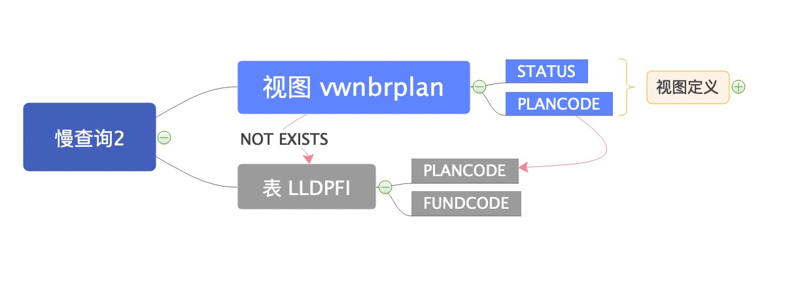

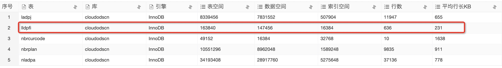

```sql
SELECT DISTINCT PLANCODE, FUNDCODE
FROM LLDPFI A
WHERE FUNDCODE LIKE 'F%'
	AND NOT EXISTS (
		SELECT 1
		FROM VWNBRPLAN
		WHERE STATUS = 'X'
			AND PLANCODE = A.PLANCODE
	)
ORDER BY A.PLANCODE, A.FUNDCODE;

# 表 LLDPFI
# 视图 VWNBRPLAN
CREATE TABLE `lldpfi` (
  `DTL__CAPXRESTART1` varchar(255) COLLATE utf8_bin DEFAULT NULL,
  `DTL__CAPXRESTART2` varchar(255) COLLATE utf8_bin DEFAULT NULL,
  `DTL__CAPXUOW` varchar(255) COLLATE utf8_bin DEFAULT NULL,
  `DTL__CAPXUSER` varchar(255) COLLATE utf8_bin DEFAULT NULL,
  `DTL__CAPXTIMESTAMP` varchar(20) COLLATE utf8_bin DEFAULT NULL,
  `DTL__CAPXACTION` varchar(1) COLLATE utf8_bin DEFAULT NULL,
  `DTL__CAPXCASDELIND` varchar(1) COLLATE utf8_bin DEFAULT NULL,
  `DTL__CAPXRRN` decimal(10,0) DEFAULT NULL,
  `COMPANY` varchar(4) COLLATE utf8_bin NOT NULL DEFAULT '',
  `PLANCODE` varchar(10) COLLATE utf8_bin NOT NULL DEFAULT '',
  `FUNDCODE` varchar(3) COLLATE utf8_bin NOT NULL DEFAULT '',
  `STARTDATE` varchar(8) COLLATE utf8_bin DEFAULT NULL,
  `ENDDATE` varchar(8) COLLATE utf8_bin DEFAULT NULL,
  `INSERTIME` datetime DEFAULT NULL,
  `UPDATETIME` datetime DEFAULT NULL,
  `SRCSYS` varchar(10) COLLATE utf8_bin DEFAULT NULL,
  PRIMARY KEY (`COMPANY`,`PLANCODE`,`FUNDCODE`),
  UNIQUE KEY `LLDPFI` (`COMPANY`,`PLANCODE`,`FUNDCODE`)
) ENGINE=InnoDB DEFAULT CHARSET=utf8 COLLATE=utf8_bin;
```

## 优化慢查询3

* 慢查询样本3 来自`pnbsoaread@10.199.193.7` 和 `pnbsoaread@10.199.193.12` 的查询请求，对视图`VWNBRPLAN`和`表LLDPFI`的`NOT EXISTS`子查询。
* 获取视图、表的定义，分析SQL结构；统计表的数据量。
* 建议删除无效`group by`，不仅是语法规范问题，还会额外消耗数据库IO。
* 建议删除冗余索引`PRIMARY KEY`与	`UNIQUE KEY NBRPACKDTL` 重复。
* 从SQL执行时间和SQL结构初步判断为分析型SQL，且在只读实例上查询，对写实例没有影响。


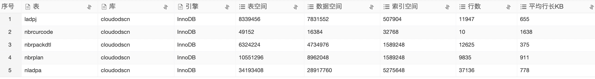


```sql
SELECT T1.ORGID, T1.PACKID, T2.PAYMODE AS PAYMODE
FROM NBRPACKDTL T1, VWNBRPLAN T2
WHERE T1.ORGID = T2.ORGID
	AND T1.MEMPLAN = T2.PLANCODE
ORDER BY ORGID, PACKID;

# 表 NBRPACKDTL
# 视图 VWNBRPLAN

CREATE TABLE `nbrpackdtl` (
  `DTL__CAPXRESTART1` varchar(255) COLLATE utf8_bin DEFAULT NULL,
  `DTL__CAPXRESTART2` varchar(255) COLLATE utf8_bin DEFAULT NULL,
  `DTL__CAPXUOW` varchar(255) COLLATE utf8_bin DEFAULT NULL,
  `DTL__CAPXUSER` varchar(255) COLLATE utf8_bin DEFAULT NULL,
  `DTL__CAPXTIMESTAMP` varchar(20) COLLATE utf8_bin DEFAULT NULL,
  `DTL__CAPXACTION` varchar(1) COLLATE utf8_bin DEFAULT NULL,
  `DTL__CAPXCASDELIND` varchar(1) COLLATE utf8_bin DEFAULT NULL,
  `DTL__CAPXRRN` decimal(10,0) DEFAULT NULL,
  `ORGID` varchar(6) COLLATE utf8_bin NOT NULL DEFAULT '',
  `CURCODE` varchar(3) COLLATE utf8_bin NOT NULL DEFAULT '',
  `MAINPLAN` varchar(10) COLLATE utf8_bin NOT NULL DEFAULT '',
  `PACKID` varchar(4) COLLATE utf8_bin NOT NULL DEFAULT '',
  `MEMPLAN` varchar(10) COLLATE utf8_bin NOT NULL DEFAULT '',
  `SEXUSE` varchar(1) COLLATE utf8_bin NOT NULL DEFAULT '',
  `COVTYPE` varchar(3) COLLATE utf8_bin DEFAULT NULL,
  `AMOUNT` decimal(13,2) DEFAULT NULL,
  `UNITS` decimal(5,0) DEFAULT NULL,
  `NUMERATOR` decimal(13,2) DEFAULT NULL,
  `DENOMINAT` decimal(13,2) DEFAULT NULL,
  `EXPRESSION` varchar(100) COLLATE utf8_bin DEFAULT NULL,
  `FILLER1` varchar(5) COLLATE utf8_bin DEFAULT NULL,
  `FILLER2` varchar(10) COLLATE utf8_bin DEFAULT NULL,
  `FILLER3` varchar(20) COLLATE utf8_bin DEFAULT NULL,
  `CREATEUSER` varchar(10) COLLATE utf8_bin DEFAULT NULL,
  `CREATEDATE` varchar(8) COLLATE utf8_bin DEFAULT NULL,
  `UPDATEUSER` varchar(10) COLLATE utf8_bin DEFAULT NULL,
  `UPDATEDATE` varchar(8) COLLATE utf8_bin DEFAULT NULL,
  `INSERTIME` datetime DEFAULT NULL,
  `UPDATETIME` datetime DEFAULT NULL,
  `SRCSYS` varchar(10) COLLATE utf8_bin DEFAULT NULL,
  PRIMARY KEY (`ORGID`,`CURCODE`,`SEXUSE`,`MAINPLAN`,`MEMPLAN`,`PACKID`),
  UNIQUE KEY `NBRPACKDTL` (`ORGID`,`CURCODE`,`SEXUSE`,`MAINPLAN`,`MEMPLAN`,`PACKID`)
) ENGINE=InnoDB DEFAULT CHARSET=utf8 COLLATE=utf8_bin;
```

# 总结

* 2020年11月16日 4:59~5:03 期间出现了大量慢查询，导致CPU飙高至98%。
* 慢查询特点如下：
  * 都来自``pnbsoaread`用户；
  * 都与视图`VWNBRPLAN`有关；
  * 都存在无效的`group by`子句。
* 慢查询优化建议：
  1. 建议删除无效`group by`，不仅是语法规范问题，还会额外消耗数据库IO。
  2. 建议删除`nbrpackdtl`表的冗余索引`NBRPACKDTL` ，因为**`PRIMARY KEY`与	`UNIQUE KEY NBRPACKDTL` 重复**。
  3. 从SQL执行时间和SQL结构初步判断为分析型SQL，且在只读实例上查询，对写实例没有影响。