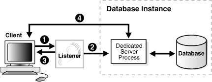

# 1Z0-062 题目概览

编号 | 知识点 | 题目数量
-- | --- | ----
   |

# 1Z0-062 考点

- [Oracle Database 12c管理1Z0-062](https://education.oracle.com/oracle-database-12c-administration/pexam_1Z0-062)

考试价格： ¥1077 | 时长： 120分钟 | 及格分数： 64％ | 67题

## 探索Oracle数据库体系结构

- 列出Oracle数据库的体系结构组件
- 解释内存结构
- 描述后台流程

## Oracle数据库实例

- 了解初始化参数文件
- 启动和关闭Oracle数据库实例
- 查看警报日志并访问动态性能视图

## 管理用户安全

- 创建和管理数据库用户帐户
- 授予和撤销特权
- 创建和管理角色
- 创建和管理个人资料

## 创建和管理表空间

- 解释Oracle数据库服务器如何自动管理空间
- 通过压缩节省空间
- 使用细分顾问
- 使用段收缩功能从表和索引中回收浪费的空间

## 管理数据并发

- 描述锁定机制以及Oracle如何管理数据并发
- 监视并解决锁定冲突

## 备份和恢复概念

- 确定检查点，重做日志文件和存档日志文件的重要性

## 执行数据库备份

- 创建一致的数据库备份
- 备份数据库而不关闭数据库
- 创建增量备份
- 自动化数据库备份
- 管理备份

## 移动数据

- 描述移动数据的方法
- 使用SQL * Loader从非Oracle数据库加载数据
- 使用外部表通过平台无关的文件移动数据
- 解释Oracle数据泵的一般体系结构
- 使用数据泵导出和导入在Oracle数据库之间移动数据

## 管理性能：SQL调整

- 使用SQL Tuning Advisor

## 使用DBCA创建Oracle数据库

- 使用DBCA生成数据库创建脚本
- 使用DBCA管理数据库设计模板

## DBAAS简介

- 认识DBaaS实例和数据库实例之间的区别
- 浏览我的服务仪表板
- 用户身份验证和角色
- 生成安全Shell（SSH）公钥/私钥对

## Oracle数据库管理工具

- 使用数据库管理工具

## 配置Oracle网络环境

- 配置Oracle Net Services
- 使用工具来配置和管理Oracle网络
- 配置客户端网络
- 配置数据库之间的通信

## 管理数据库存储结构

- 描述表行数据在块中的存储
- 创建和管理表空间

## 管理撤消数据

- 说明DML和撤消数据生成
- 监视和管理撤消数据
- 描述撤消数据和重做数据之间的区别
- 配置撤消保留

## 实施Oracle数据库审核

- 启用标准数据库审核和统一审核

## 备份和恢复配置

- 配置快速恢复区域
- 配置ARCHIVELOG模式

## 执行数据库恢复

- 确定执行恢复的需求
- 使用Recovery Manager（RMAN）和Data Recovery Advisor来执行控制文件，重做日志文件和数据文件的恢复

## 执行数据库维护

- 使用服务器生成的警报

## 使用Oracle Scheduler自动化任务

- 使用Oracle Scheduler简化管理任务
- 使用工作链执行一系列相关任务
- 在远程系统上使用Scheduler作业
- 使用高级计划程序功能对作业进行优先级排序

## 升级Oracle数据库软件

- 描述数据迁移方法
- 描述升级过程

# 1Z0-062 实践

## 实践-1:探索Oracle数据库体系结构

Practice 2-1: Exploring the Oracle Database Architecture

## 实践-2:关闭数据库实例transactional

### Overview

本实验的目的，了解关闭数据库实例的过程，实验中将使用`shutdown transactional`来关闭数据库。

### Task

### Practice

1. 会话1：登陆pdb，执行insert 不提交事务

```sql
[oracle@oracle01 ~]$ sqlplus / as sysdba
SYS@booboo>conn scott/tiger@booboopdb1
Connected.
SCOTT@booboopdb1>desc t02;
 Name                               Null?    Type
 ----------------------------------------------------- -------- ------------------------------------
 X                               NOT NULL NUMBER(38)
 Y                                VARCHAR2(20)

SCOTT@booboopdb1>insert into t02 values (1,'superman');

1 row created.

SCOTT@booboopdb1>insert into t02 values (2,'batman');

1 row created.
```

1. 会话2：登陆cdb，执行create user c##test identified by oracle;

```sql
[oracle@oracle01 ~]$ sqlplus / as sysdba

SQL*Plus: Release 12.2.0.1.0 Production on Thu Feb 6 15:56:20 2020

Copyright (c) 1982, 2016, Oracle.  All rights reserved.


Connected to:
Oracle Database 12c Enterprise Edition Release 12.2.0.1.0 - 64bit Production

SYS@booboo>show pdbs;

    CON_ID CON_NAME              OPEN MODE  RESTRICTED
---------- ------------------------------ ---------- ----------
     2 PDB$SEED              READ ONLY  NO
     3 BOOBOOPDB1              READ WRITE NO
     4 BOOBOOPDB2              MOUNTED
     5 BOOBOOPDB3              MOUNTED
     6 BOOBOOPDB4              MOUNTED
SYS@booboo>create user c##test identified by oracle;

User created.
```

1. 会话3：登陆cdb，执行 shutdown transactional 观察日志

```sql
[oracle@oracle01 ~]$ sqlplus / as sysdba

SQL*Plus: Release 12.2.0.1.0 Production on Thu Feb 6 16:17:12 2020

Copyright (c) 1982, 2016, Oracle.  All rights reserved.


Connected to:
Oracle Database 12c Enterprise Edition Release 12.2.0.1.0 - 64bit Production

SYS@booboo>shutdown transactional
Database closed.
Database dismounted.
ORACLE instance shut down.
SYS@booboo>!date
Thu Feb  6 16:19:20 CST 2020
```

观察日志

```bash
[oracle@oracle01 ~]$ adrci

ADRCI: Release 12.2.0.1.0 - Production on Thu Feb 6 16:18:05 2020

Copyright (c) 1982, 2017, Oracle and/or its affiliates.  All rights reserved.

ADR base = "/u01/app/oracle"
adrci> help        

 HELP [topic]
   Available Topics:
        CREATE REPORT
        ECHO
        ESTIMATE
        EXIT
        HELP
        HOST
        IPS
        PURGE
        RUN
        SELECT
        SET BASE
        SET BROWSER
        SET CONTROL
        SET ECHO
        SET EDITOR
        SET HOMES | HOME | HOMEPATH
        SET TERMOUT
        SHOW ALERT
        SHOW BASE
        SHOW CONTROL
        SHOW HM_RUN
        SHOW HOMES | HOME | HOMEPATH
        SHOW INCDIR
        SHOW INCIDENT
        SHOW LOG
        SHOW PROBLEM
        SHOW REPORT
        SHOW TRACEFILE
        SPOOL

 There are other commands intended to be used directly by Oracle, type
 "HELP EXTENDED" to see the list

adrci> show alert

Choose the home from which to view the alert log:

1: diag/rdbms/booboo/booboo
2: diag/clients/user_oracle/host_2874269298_107
3: diag/tnslsnr/oracle01/listener
4: diag/tnslsnr/oracle01/listener2
Q: to quit

Please select option: 1
Output the results to file: /tmp/alert_43088_1406_booboo_1.ado

Please select option: q       
adrci> exit
```

日志分析

```bash
2020-02-06 16:17:14.624000 +08:00
Shutting down instance (transactional) (OS id: 42991)
## 开始：down instance (transactional)


2020-02-06 16:17:15.816000 +08:00
Stopping background process SMCO # 停止后台进程 SMCO
2020-02-06 16:17:17.028000 +08:00
Shutting down instance: further logons disabled #禁用进一步的登录
2020-02-06 16:17:18.147000 +08:00
Stopping background process CJQ0  # 停止后台进程 CJQ0
Stopping background process MMNL  # 停止后台进程 MMNL
2020-02-06 16:17:19.219000 +08:00
Stopping background process MMON  # 停止后台进程 MMON
2020-02-06 16:17:20.900000 +08:00


alter pluggable database all close immediate # 开始关闭pdb【immediate】：只产生检查点，不等待事务结果
JIT: pid 42991 requesting stop
KILL SESSION for sid=(67, 40381):
  Reason = PDB close immediate
  Mode = KILL HARD FORCE -/-/-
  Requestor = USER (orapid = 33, ospid = 42991, inst = 1)
  Owner = Process: USER (orapid = 43, ospid = 41840)
  Result = ORA-0
2020-02-06 16:17:22.565000 +08:00
Pluggable database BOOBOOPDB1 closed # booboopdb1 该PDB已成功关闭。
Completed: alter pluggable database all close immediate # 完成关闭pdb【immediate】
## 完成：关闭pdb all close immediate


JIT: pid 42991 requesting stop
All transactions complete. Performing immediate shutdown # 所有事务完成，开始执行【immediate】 shutdown
License high water mark = 17
Dispatchers and shared servers shutdown # 调度程序和共享服务器关闭
2020-02-06 16:17:24.676000 +08:00
ALTER DATABASE CLOSE NORMAL
Stopping Emon pool # 停止Emon池
alter pluggable database all close immediate # ALL PDB已成功关闭。
Completed: alter pluggable database all close immediate # 完成关闭pdb【immediate】
## 完成：关闭pdb all close immediate


Stopping Emon pool # 停止Emon池
Shutting down archive processes # 【开始】关闭归档过程
TT00: Gap Manager exiting (PID:100073)
OS process OFSD (ospid 100019) idle for 30 seconds, exiting
2020-02-06 16:17:25.809000 +08:00
Archiving is disabled # 【完成】关闭归档过程
Thread 1 closed at log sequence 14
Successful close of redo thread 1
Completed: ALTER DATABASE CLOSE NORMAL
## 完成：关闭 DATABASE NORMAL


ALTER DATABASE DISMOUNT # dismount 数据库
Shutting down archive processes # 关闭归档进程
Archiving is disabled
Completed: ALTER DATABASE DISMOUNT

## 完成：关闭 DATABASE DISMOUNT


2020-02-06 16:17:27.001000 +08:00
ARCH: Archival disabled due to shutdown: 1089
Shutting down archive processes
Archiving is disabled
JIT: pid 42991 requesting stop
2020-02-06 16:17:28.008000 +08:00
ARCH: Archival disabled due to shutdown: 1089
Shutting down archive processes
Archiving is disabled
Stopping background process VKTM
JIT: pid 42991 requesting stop
2020-02-06 16:17:37.473000 +08:00
Instance shutdown complete (OS id: 42991)
## 完成：Instance shutdown
```

1. 开始：down instance (transactional)
2. 完成：关闭pdb all close immediate(booboopdb1)
3. 完成：关闭pdb all close immediate(all)
4. 完成：关闭 DATABASE NORMAL
5. 完成：关闭 DATABASE DISMOUNT
6. 完成：Instance shutdown

重新启动数据库后，发现事务并没有提交

```sql

SYS@booboo>conn scott/tiger@booboopdb1
Connected.
SCOTT@booboopdb1>select * from t02;

no rows selected
```

### KnowledgePoint


注意：虽然发起的关闭是 transactional ，但是在Oracle12c中，关闭PDB时使用的却是`alter pluggable database all close immediate`。因此不会等待PDB的事务提交即立刻关闭数据库。

## 实践-3:关闭数据库实例abort

### Overview

本实验的目的，了解关闭数据库实例的过程，实验中将使用`shutdown abort`来关闭数据库。

### Task

### Practice

1. 关闭实例

  ```sql
  SYS@booboo>shutdown abort
  ORACLE instance shut down.
  SYS@booboo>!date
  Thu Feb  6 18:13:24 CST 2020
  ```

2. 查看日志

  ```bash
  Shutting down instance (abort) (OS id: 44076)
  License high water mark = 6
  USER (ospid: 44076): terminating the instance
  Instance terminated by USER, pid = 44076
  2020-02-06 18:13:18.716000 +08:00
  Instance shutdown complete (OS id: 44076)
  ```

### KnowledgePoint

关闭速度非常快。

## 实践-4:隐藏列 invisible

oracle 12c 新特性之不可见字段

在Oracle 11g R1中，Oracle以不可见索引和虚拟字段的形式引入了一些不错的增强特性。继承前者并发扬光大，Oracle 12c 中引入了不可见字段思想。在之前的版本中，为了隐藏重要的数据字段以避免在通用查询中显示，我们往往会创建一个视图来隐藏所需信息或应用某些安全条件。 在12c中，你可以在表中创建不可见字段。当一个字段定义为不可见时，这一字段就默认不会出现在通用查询中，除非在SQL语句或条件中有显式的提及这一字段，或是在表定义中有DESCRIBED。要添加或是修改一个不可见字段是非常容易的，反之亦然。

```sql
CREATE TABLE test_p (prod_id number(4),
Prod_name varchar2 (20),
Category_id number(30),
Quantity_on_hand number (3) INVISIBLE);

desc test_p
alter table test_p add constraint test_01  unique (Quantity_on_hand);
alter table test_p modify(Quantity_on_hand visible);
alter table test_p modify(Quantity_on_hand sible);
```

## 实践-5:存储过程DR和IR

如何防止对CREATE_TEST存储过程具有EXECUTE特权的用户将值插入他们没有任何特权的表中？

Create the CREATE_TEST procedure with invoker rights.

oracle存储过程分两种，DR(Definer's Rights ) Procedure和IR(Invoker's Rights ) Procedure。 定义存储过程时，通过指定AUTHID 属性，定义DR Procedure 和IR Procedure

1. 定义者权限：定义者权限PL/SQL程序单元是以这个程序单元拥有者的特权来执行它的，也就是说，任何具有这个PL/SQL程序单元执行权的用户都可以访问程序中的对象。所有具有执行权的用户都有相同的访问权限，在定义者权限下，执行的用户操作的schema为定义者，所操作的对象是定义者在编译时指定的对象。在定义者(definer)权限下，当前用户的权限为角色无效情况下所拥有的权限。

  ```sql
  CREATE OR REPLACE procedure DEMO(ID in NUMBER)
  AUTHID DEFINER as
  ...
  BEGIN
  ...
  ND DEMO
  ```

2. 调用者权限：调用者权限是指当前用户（而不是程序的创建者）执行PL/SQL程序体的权限。这意味着不同的用户对于某个对象具有的权限很可能是不同的，这个思想的提出，解决了不同用户更新不同表的方法。在调用者权限下，执行的用户操作的schema为当前用户，所操作的对象是当前模式下的对象。在调用者(invoker)权限下，当前用户的权限为当前所拥有的权限(含角色)。

  ```sql
  CREATE OR REPLACE procedure DEMO(ID in NUMBER)
  AUTHID CURRENT_USER  as
  ...
  BEGIN
  ...
  ND DEMO
  ```

ORACLE默认为定义者权限，定义者权限在存储过程中ROLE无效，需要显示授权，例如在存储过程中调用其他用户的表，但是定义存储过程的当前用户没有显示访问该表的权限，即使当前用户具有dba角色，编译过程中也会出现权限不足的问题，因为role无效。

## 实践-6:参数DB_8K_CACHE_SIZE

查看参数

```sql
select * from V$SYSTEM_PARAMETER where name='db_8k_cache_size';

exec print_table(q'[select * from V$SYSTEM_PARAMETER WHERE name='db_8k_cache_size']')
```

执行结果

```sql
NUM                  : 1447
NAME                  : db_8k_cache_size
TYPE                  : 6
VALUE                  : 0
DISPLAY_VALUE              : 0
DEFAULT_VALUE              : 0
ISDEFAULT              : TRUE
ISSES_MODIFIABLE          : FALSE
ISSYS_MODIFIABLE          : IMMEDIATE
ISPDB_MODIFIABLE          : FALSE
ISINSTANCE_MODIFIABLE          : TRUE
ISMODIFIED              : FALSE
ISADJUSTED              : FALSE
ISDEPRECATED              : FALSE
ISBASIC               : FALSE
DESCRIPTION              : Size of cache for 8K buffers
UPDATE_COMMENT              :
HASH                  : 1564706367
CON_ID                  : 0
-----------------

PL/SQL procedure successfully completed.
```

- ISSYS_MODIFIABLE : IMMEDIATE
- 指示参数是否可以更改`ALTER SYSTEM`以及更改何时生效：`IMMEDIATE`- `ALTER SYSTEM`无论用于启动实例的参数文件的类型如何，都可以更改参数。更改将立即生效。 DESCRIPTION : Size of cache for 8K buffers 8K缓冲区的缓存大小

## 实践-7:参数ENABLE_DDL_LOGGING

当需要确定某些ddl操作什么时候发生，确定是表啥时间被动了，可以设置此参数。

```sql
--此参数支持动态调整
alter system set enable_ddl_logging=true scope=both;
show parameter enable_ddl_logging;
drop procedure print_table;
CREATE OR REPLACE PROCEDURE print_table(p_query IN VARCHAR2)
AUTHID CURRENT_USER
IS
 l_thecursor INTEGER DEFAULT dbms_sql.open_cursor;
 l_columnvalue VARCHAR2(4000);
 l_status  INTEGER;
 l_desctbl  dbms_sql.desc_tab;
 l_colcnt  NUMBER;
BEGIN
 EXECUTE IMMEDIATE 'alter session set nls_date_format=''dd-mon-yyyy hh24:mi:ss'' ';

 dbms_sql.parse(l_thecursor, p_query, dbms_sql.native);

 dbms_sql.describe_columns (l_thecursor, l_colcnt, l_desctbl);

 FOR i IN 1 .. l_colcnt LOOP
  dbms_sql.define_column (l_thecursor, i, l_columnvalue, 4000);
 END LOOP;

 l_status := dbms_sql.EXECUTE(l_thecursor);

 WHILE ( dbms_sql.Fetch_rows(l_thecursor) > 0 ) LOOP
  FOR i IN 1 .. l_colcnt LOOP
   dbms_sql.column_value (l_thecursor, i, l_columnvalue);

   dbms_output.Put_line (RPAD(L_desctbl(i).col_name, 30)
         || ': '
         || l_columnvalue);
  END LOOP;

  dbms_output.put_line('-----------------');
 END LOOP;

 EXECUTE IMMEDIATE 'alter session set nls_date_format=''dd-MON-rr'' ';
EXCEPTION
 WHEN OTHERS THEN
    EXECUTE IMMEDIATE
    'alter session set nls_date_format=''dd-MON-rr'' ';

    RAISE;
END;
/
exec print_table('select 1 from dual')
```

运行结果

- DDL日志明细xml格式文件：`less /u01/app/oracle/diag/rdbms/emcdb/emcdb/log/ddl/log.xml`
- DDL日志明细TXT格式文件：`less /u01/app/oracle/diag/rdbms/emcdb/emcdb/log/ddl_emcdb.log`

```sql
[oracle@ocm log]$ pwd
/u01/app/oracle/diag/rdbms/emcdb/emcdb/log
[oracle@ocm log]$ ll
total 8
drwxr-x--- 2 oracle oinstall   21 Feb  7 19:31 ddl
-rw-r----- 1 oracle oinstall 1217 Feb  7 19:32 ddl_emcdb.log
drwxr-x--- 2 oracle oinstall   21 Feb  2 19:57 debug
-rw-r----- 1 oracle oinstall  888 Feb  5 02:57 debug.log
drwxr-x--- 2 oracle oinstall    6 Dec  8 16:30 hcs
drwxr-x--- 2 oracle oinstall    6 Dec  8 16:30 imdb
drwxr-x--- 2 oracle oinstall    6 Dec  8 16:30 test
[oracle@ocm log]$ head ddl_emcdb.log
2020-02-07T19:31:14.248644+08:00
diag_adl:drop procedure print_table
2020-02-07T19:32:01.698631+08:00
diag_adl:CREATE OR REPLACE PROCEDURE print_table(p_query IN VARCHAR2)
AUTHID CURRENT_USER
IS
 l_thecursor INTEGER DEFAULT dbms_sql.open_cursor;
 l_columnvalue VARCHAR2(4000);
 l_status  INTEGER;
 l_desctbl  dbms_sql.desc_tab;
[oracle@ocm log]$ head ddl/log.xml
<msg time='2020-02-07T19:31:14.248+08:00' org_id='oracle' comp_id='rdbms'
 msg_id='opiexe:4695:2946163730' type='UNKNOWN' group='diag_adl'
 level='16' host_id='ocm' host_addr='192.168.14.154'
 pid='20083' version='1' con_uid='1'
 con_id='1' con_name='CDB$ROOT'>
 <txt>drop procedure print_table
 </txt>
</msg>
<msg time='2020-02-07T19:32:01.698+08:00' org_id='oracle' comp_id='rdbms'
 msg_id='opiexe:4695:2946163730' type='UNKNOWN' group='diag_adl'
```

### KnowledgePoint

> ENABLE_DDL_LOGGING

<https://docs.oracle.com/en/database/oracle/oracle-database/12.2/refrn/ENABLE_DDL_LOGGING.html>

Property            | Description
------------------- | -------------------------------
Parameter type      | Boolean
Default value       | `false`
Modifiable          | `ALTER SESSION`, `ALTER SYSTEM`
Modifiable in a PDB | Yes
Range of values     | `true                           | false`
Basic               | No

- `ENABLE_DDL_LOGGING` enables or disables the writing of a subset of data definition language (DDL) statements to a DDL log.
- DDL日志是与警报日志具有相同格式和基本行为的文件，但它仅包含数据库发出的DDL语句。仅当RDBMS组件创建DDL日志，并且`ENABLE_DDL_LOGGING`初始化参数设置为`true`。当此参数设置`false`为时，DDL语句不包含在任何日志中。
- 对于数据库发出的每个DDL语句，DDL日志均包含一个日志记录。DDL日志包含在IPS事件包中。
- 有两个DDL日志包含相同的信息。一个是XML文件，另一个是文本文件。DDL日志存储在`log/ddl`ADR主目录的子目录中。

当`ENABLE_DDL_LOGGING`设置`true`为时，将以下DDL语句写入日志：

- `ALTER/CREATE/DROP/TRUNCATE CLUSTER`
- `ALTER/CREATE/DROP FUNCTION`
- `ALTER/CREATE/DROP INDEX`
- `ALTER/CREATE/DROP OUTLINE`
- `ALTER/CREATE/DROP PACKAGE`
- `ALTER/CREATE/DROP PACKAGE BODY`
- `ALTER/CREATE/DROP PROCEDURE`
- `ALTER/CREATE/DROP PROFILE`
- `ALTER/CREATE/DROP SEQUENCE`
- `CREATE/DROP SYNONYM`
- `ALTER/CREATE/DROP/RENAME/TRUNCATE TABLE`
- `ALTER/CREATE/DROP TRIGGER`
- `ALTER/CREATE/DROP TYPE`
- `ALTER/CREATE/DROP TYPE BODY`
- `DROP USER`
- `ALTER/CREATE/DROP VIEW`

## 实践-8:Oracle Data Redaction

### Overview

Oracle Data Redaction 提供了一种简单方法来快速编写应用程序中显示的敏感信息, 而无需变更磁盘或高速缓存中的基础数据库块。数据根据灵活的多因素策略实时编写。作为 Oracle Advanced Security 的一部分授权数据编写。

本实验将学习如何配置一个数据编写策略并验证。

### Task

1. 使用DBA1用户，创建一个表regions
2. 登陆到企业云管理平台，点击 **安全 > 数据编辑**，新建一个数据编辑策略。
3. 使用scott用户访问dba1的regions表，查看是否生效
4. 使用hr用户访问dba1的regions表，查看是否生效

### Practice

1. 使用DBA1用户，创建一个表regions

  ```sql
  SQL> conn dba1/oracle@emrep
  Connected.
  SQL> desc regions;
  Name                       Null?    Type
  ----------------------------------------- -------- ----------------------------
  REGION_ID                   NOT NULL NUMBER
  REGION_NAME                   NOT NULL VARCHAR2(25)

  SQL> select * from regions;

  REGION_ID REGION_NAME
  ---------- -------------------------
  1 Europe
  2 Americas
  3 Asia
  4 Middle East and Africa
  5 192.168.1.1

  SQL> grant select on regions to hr;
  SQL> grant select on regions to scott;
  ```

2. 登陆到企业云管理平台，点击 **安全 > 数据编辑 > 创建策略**

  要求，当scott用户访问`dba1.regions`表时策略才会生效，具体策略如下表，含义为：如果region_name列匹配到ip地址，则变更更最后一位为999；否则不显示。

  | col | value | | ---------- | ------------------------------------------------ | | schema | DBA1 | | 表/视图 | REGIONS | | 策略名 | dba1_regions_exp | | 策略表达式 | SYS_CONTEXT('USERENV', 'SESSION_USER') = 'SCOTT' |

  | 对象列 | 列数据类型 | 编写函数 | 函数属性 | | ----------- | ---------- | -------- | --------------------------------------------------- | | REGION_NAME | VARCHAR2 | REGEX | `(\d{1,3}\.\d{1,3}\.\d{1,3})\.\d{1,3},\1.999,1,1,i` |

  

  

  ```sql
  BEGIN

  BEGIN  DBMS_REDACT.ADD_POLICY  (OBJECT_SCHEMA => 'DBA1',  object_name => 'REGIONS',  policy_name => 'dba1_regions_exp',  expression => 'SYS_CONTEXT(''USERENV'', ''SESSION_USER'') = ''SCOTT'''); END;

  BEGIN  DBMS_REDACT.ALTER_POLICY  (OBJECT_SCHEMA => 'DBA1',  object_name => 'REGIONS',  policy_name => 'dba1_regions_exp',  action => DBMS_REDACT.ADD_COLUMN,  column_name => '"REGION_NAME"',  function_type => DBMS_REDACT.REGEXP , regexp_pattern         => (\d{1,3}\.\d{1,3}\.\d{1,3})\.\d{1,3},regexp_replace_string  => \1.999,regexp_position        => 1,regexp_occurrence      => 1,regexp_match_parameter => i);  END;

  END;
  /
  ```

3. 使用scott用户访问dba1的regions表，查看是否生效

  ```sql
  SQL> conn scott/tiger@emrep
  Connected.
  SQL> column region_name format a25
  SQL> select * from dba1.regions;

  REGION_ID REGION_NAME
  ---------- -------------------------
  1
  2
  3
  4
  5 192.168.1.999
  ```

  id为5的行 region_name只显示了为ip的行，且对最后一个地址做了替换。说明成功了。

4. 使用hr用户访问dba1的regions表，查看是否生效

  ```sql
  SQL> conn hr/hr@emrep;
  Connected.
  SQL> column region_name format a25
  SQL> select * from dba1.regions;

  REGION_ID REGION_NAME
  ```

--------------------------------------------------------------------------------

````
    1 Europe
    2 Americas
    3 Asia
    4 Middle East and Africa
    5 192.168.1.1
```
````

可以看到规则对hr用户没有生效。

### KnowledgePoint

- [Oracle Data Redaction简介](https://docs.oracle.com/en/database/oracle/oracle-database/12.2/asoag/introduction-to-oracle-data-redaction.html#GUID-82EA9712-387C-4D3A-BB72-F64A707C67CA) Oracle Data Redaction是实时编辑敏感数据的功能。
- [Oracle Data Redaction特性和功能](https://docs.oracle.com/en/database/oracle/oracle-database/12.2/asoag/oracle-data-redaction-features-and-capabilities.html#GUID-98B40084-EA10-4265-A6E5-D2EAC934E005) Oracle Data Redaction提供了多种编辑不同类型数据的方法。
- [配置Oracle数据修订策略](https://docs.oracle.com/en/database/oracle/oracle-database/12.2/asoag/configuring-oracle-data-redaction-policies.html#GUID-78C0ECD1-388C-4E12-87C3-32FBC05F294D) Oracle数据修订策略根据表列类型和要使用的修订类型定义如何对列中的数据进行修订。
- [在Oracle Enterprise Manager中管理Oracle Data Redaction策略](https://docs.oracle.com/en/database/oracle/oracle-database/12.2/asoag/using-oracle-data-redaction-in-oracle-enterprise-manager.html#GUID-8267183A-1778-428E-9B6E-AB06D8CC7EAB) Oracle Enterprise Manager Cloud Control（云控制）可以管理Oracle Data Redaction策略和格式。
- [将Oracle Data Redaction与Oracle数据库功能](https://docs.oracle.com/en/database/oracle/oracle-database/12.2/asoag/oracle-data-redaction-use-with-oracle-database-features.html#GUID-D0C97997-0F35-42B7-98B1-1DA4197001F0) 一起使用Oracle Data Redaction可以与其他Oracle功能一起使用，但是某些Oracle功能可能对Oracle Data Redaction有限制。
- [Oracle Data Redaction的安全注意事项](https://docs.oracle.com/en/database/oracle/oracle-database/12.2/asoag/security-considerations-for-using-oracle-data-redaction.html#GUID-1D2850E8-2485-4C3D-BBF2-75E2CFAC3F37) Oracle提供了使用Oracle Data Redaction的准则。

## 实践-9:REDACTION_VALUES_FOR_TYPE_FULL

### Overview

通过DBMS_REDACT.REDACTION_VALUES_FOR_TYPE_FULL 此过程修改"数据修订"策略的数值默认显示值以进行完整修订。

### Task

1. 修改redaction_values_for_type_full的NUMBER_VALUE为-1（pdb中操作）
2. 登陆云管理控制台添加策略，scott用户访问dba1.employees表时，看不到真实的salary。看到的都是-1。
3. 使用scott用户测试是否策略生效。
4. 重启服务
5. 使用scott用户测试是否策略生效。

### Practice

1. 修改redaction_values_for_type_full的NUMBER_VALUE为-1

  ```sql
  SQL> conn / as sysdba
  Connected.
  SQL>SQL> conn / as sysdba
  Connected.
  SQL> alter session set container=emrep;

  Session altered.

  SQL> select number_value from redaction_values_for_type_full;

  NUMBER_VALUE
  ------------
  0

  SQL> exec dbms_redact.update_full_redaction_values(-1)

  PL/SQL procedure successfully completed.

  SQL> select number_value from redaction_values_for_type_full;

  NUMBER_VALUE
  ------------
  -1

  select number_value from redaction_values_for_type_full;

  NUMBER_VALUE
  ------------
  0

  SQL> exec dbms_redact.update_full_redaction_values(-1)

  PL/SQL procedure successfully completed.

  SQL> select number_value from redaction_values_for_type_full;

  NUMBER_VALUE
  ------------
  -1
```

2. 登陆云管理控制台添加策略

  

  

  ```sql
  BEGIN

  BEGIN  DBMS_REDACT.ADD_POLICY  (OBJECT_SCHEMA => 'DBA1',  object_name => 'EMPLOYEES',  policy_name => 'dba1_employees_exp',  expression => 'SYS_CONTEXT(''USERENV'', ''SESSION_USER'') = ''SCOTT'''); END;

  BEGIN  DBMS_REDACT.ALTER_POLICY  (OBJECT_SCHEMA => 'DBA1',  object_name => 'EMPLOYEES',  policy_name => 'dba1_employees_exp',  action => DBMS_REDACT.ADD_COLUMN,  column_name => '"SALARY"',  function_type => DBMS_REDACT.FULL );  END;

  END;
  ```

3. 使用scott用户测试是否策略生效。

  ```sql
  SQL> conn scott/tiger@emrep;
  Connected.
  SQL> desc dba1.employees;
  Name                       Null?    Type
  ----------------------------------------- -------- ----------------------------
  EMPLOYEE_ID                   NOT NULL NUMBER(6)
  FIRST_NAME                        VARCHAR2(20)
  LAST_NAME                   NOT NULL VARCHAR2(25)
  EMAIL                       NOT NULL VARCHAR2(25)
  PHONE_NUMBER                        VARCHAR2(20)
  HIRE_DATE                   NOT NULL DATE
  JOB_ID                    NOT NULL VARCHAR2(10)
  SALARY                         NUMBER(8,2)
  COMMISSION_PCT                     NUMBER(2,2)
  MANAGER_ID                        NUMBER(6)
  DEPARTMENT_ID                        NUMBER(4)

  SQL> select employee_id,first_name,salary from dba1.employees where rownum < 5;

  EMPLOYEE_ID FIRST_NAME             SALARY
  ----------- -------------------- ----------
  198 Donald              0
  199 Douglas              0
  200 Jennifer              0
  201 Michael              0
  ```

  发现salary显示的时0而不是-1。

4. 重启服务

  ```sql
  SQL> shutdown immediate
  Database closed.
  Database dismounted.
  ORACLE instance shut down.
  SQL> startup
  ORACLE instance started.

  Total System Global Area  838860800 bytes
  Fixed Size            8798312 bytes
  Variable Size          490737560 bytes
  Database Buffers      331350016 bytes
  Redo Buffers            7974912 bytes
  Database mounted.
  Database opened.
  ```

5. 使用scott用户测试是否策略生效。

  ```sql
  SQL> conn scott/tiger@emrep;
  Connected.
  SQL> select employee_id,first_name,salary from dba1.employees where rownum < 5;

  EMPLOYEE_ID FIRST_NAME             SALARY
  ----------- -------------------- ----------
  198 Donald             -1
  199 Douglas             -1
  200 Jennifer             -1
  201 Michael             -1

  SQL> conn hr/hr@emrep;
  Connected.
  SQL> select employee_id,first_name,salary from dba1.employees where rownum < 5;

  EMPLOYEE_ID FIRST_NAME             SALARY
  ----------- -------------------- ----------
  198 Donald               2600
  199 Douglas               2600
  200 Jennifer               4400
  201 Michael              13000
  ```

  重启后已生效，数字类型的salary列全部显示为 -1。

### KnowledgePoint

[提示与技巧：Oracle Database 12_c_ 中的数据编辑](https://www.oracle.com/technetwork/cn/articles/database/data-redaction-odb12c-2331480-zhs.html)

#### 简介

Oracle Data Redaction 是 Oracle Database 12c 引入的一个新特性。这个新特性是 Advanced Security 选件的一部分，可以实时保护显示给用户的数据，无需更改应用。

Oracle Database 12c 在执行查询时应用保护。存储的数据保持不变，要显示的数据则在离开数据库前动态转换。

不要将此特性与自版本 11g 起提供的 Oracle Data Masking 混淆。采用 Oracle Data Masking 时，将以屏蔽形式处理数据，更新后的数据存储在新数据块中。因此，Data Masking 更适合非生产环境。

下面是已有的其他一些有助于提高数据安全性的特性：

- 虚拟专用数据库 (VPD) -- 通过向针对数据库执行的 SQL 语句动态添加谓词，控制行级和列级访问。
- Oracle Label Security -- 允许向表记录添加用户定义的值。与 VPD 相结合，可以更精细地控制访问用户和访问内容。
- Database Vault -- 数据编辑不能防止特权用户（如 DBA）访问受保护的数据。为解决此问题，您可以利用 Database Vault。

从许可角度来说，Oracle Data Masking 仅适用于企业版数据库，且需要 Advanced Security 许可。

#### 工作原理

我们可以创建编辑策略，指定必须满足哪些条件后才能对数据进行编辑并将其返回给用户。定义此类策略期间，DBA 可以指定必须对哪些列应用何种类型的保护。

用于创建保护规则的软件包名为 **DBMS_REDACT**。它包括五个用于管理规则的过程，以及一个用于更改完全编辑策略默认值的过程。

- **DBMS_REDACT.ALTER_POLICY** -- 允许更改现有策略。
- **DBMS_REDACT.DISABLE_POLICY** -- 禁用现有策略。
- **DBMS_REDACT.DROP_POLICY** -- 删除现有策略。
- **DBMS_REDACT.ENABLE_POLICY** -- 启用现有策略。
- **DBMS_REDACT.UPDATE_FULL_REDACTION_VALUES** -- 更改完全编辑的默认返回值。必须重启数据库才能生效。

#### DBMS_REDACT.REDACTION_VALUES_FOR_TYPE_FULL

- [DBMS_REDACT](https://docs.oracle.com/database/121/ARPLS/d_redact.htm#ARPLS73800)
- [REDACTION_VALUES_FOR_TYPE_FULL](https://docs.oracle.com/en/database/oracle/oracle-database/12.2/refrn/REDACTION_VALUES_FOR_TYPE_FULL.html#GUID-7C9711A8-C3FA-413E-90A4-5E875FFAB870)

DBMS_REDACT.REDACTION_VALUES_FOR_TYPE_FULL 此过程将修改"数据修订"策略的默认显示值以进行完整修订。

句法

```
DBMS_REDACT.UPDATE_FULL_REDACTION_VALUES（
   number_val IN NUMBER：= NULL，
   binfloat_val IN BINARY_FLOAT：= NULL，
   bindouble_val IN BINARY_DOUBLE：= NULL，
   char_val IN CHAR：= NULL，
   varchar_val IN VARCHAR2：= NULL，
   nchar_val IN NCHAR：= NULL，
   nvarchar_val IN NVARCHAR2：= NULL，
   date_val IN DATE：= NULL，
   ts_val IN TIMESTAMP：= NULL，
   tswtz_val在带有时区的TIMESTAMP中：= NULL，
   blob_val IN BLOB：= NULL，
   clob_val IN CLOB：= NULL，
   nclob_val IN NCLOB NULL）;
```

参量

表121-11 UPDATE_FULL_REDACTION_VALUES过程参数

参数              | 描述
--------------- | -------------------------------------
`number_val`    | 修改`NUMBER`数据类型列的默认值
`binfloat_val`  | 修改`BINARY_FLOAT`数据类型列的默认值
`bindouble_val` | 修改`BINARY_DOUBLE`数据类型列的默认值
`char_val`      | 修改`CHAR`数据类型列的默认值
`varchar_val`   | 修改`VARCHAR2`数据类型列的默认值
`nchar_val`     | 修改`NCHAR`数据类型列的默认值
`nvarchar_val`  | 修改`NVARCHAR2`数据类型列的默认值
`date`          | 修改`DATE`数据类型列的默认值
`ts_val`        | 修改`TIMESTAMP`数据类型列的默认值
`tswtz_val`     | 修改`TIMESTAMP WITH TIME ZONE`数据类型列的默认值
`blob_val`      | 修改`BLOB`数据类型列的默认值
`clob_val`      | 修改`CLOB`数据类型列的默认值
`nclob_val`     | 修改`NCLOB`数据类型列的默认值

例外情况

`ORA-28082`-参数参数是无效的（其中，可能的值是`char_val`，`nchar_val`，`varchar_val`和`nvarchar_val`）

#### BINARY_DOUBLE_VALUE

例如，如果将修订策略应用于类型为的列，`BINARY_DOUBLE`并且修订类型为完全修订，则该列将使用`BINARY_DOUBLE_VALUE`此视图的列中显示的值进行编辑。

列                                | 数据类型                          | 空值         | 描述
-------------------------------- | ----------------------------- | ---------- | -------------------------------------
`NUMBER_VALUE`                   | `NUMBER`                      | `NOT NULL` | 对NUMBER列进行完全修订的修订结果
`BINARY_FLOAT_VALUE`             | `BINARY_FLOAT`                | `NOT NULL` | 对BINARY_FLOAT列进行完全修订的修订结果
`BINARY_DOUBLE_VALUE`            | `BINARY_DOUBLE`               | `NOT NULL` | 对BINARY_DOUBLE列进行完全修订的修订结果
`CHAR_VALUE`                     | `VARCHAR2(1)`                 |            | 对CHAR列进行完全修订的修订结果
`VARCHAR_VALUE`                  | `VARCHAR2(1)`                 |            | 对VARCHAR2列进行完全修订的修订结果
`NCHAR_VALUE`                    | `NCHAR(1)`                    |            | 对NCHAR列进行完全修订的修订结果
`NVARCHAR_VALUE`                 | `NVARCHAR2(1)`                |            | 用于NVARCHAR2列的完整修订的修订结果
`DATE_VALUE`                     | `DATE`                        | `NOT NULL` | 用于DATE列的完整修订的修订结果
`TIMESTAMP_VALUE`                | `TIMESTAMP(6)`                | `NOT NULL` | 对TIMESTAMP列进行完全修订的修订结果
`TIMESTAMP_WITH_TIME_ZONE_VALUE` | `TIMESTAMP(6) WITH TIME ZONE` | `NOT NULL` | 对TIMESTAMP WITH TIME ZONE列进行完全修订的修订结果
`BLOB_VALUE`                     | `BLOB`                        |            | 对BLOB列进行完全修订的修订结果
`CLOB_VALUE`                     | `CLOB`                        |            | 对CLOB列进行完全修订的修订结果
`NCLOB_VALUE`                    | `NCLOB`                       |            | 对NCLOB列进行完全修订的修订结果

## 实践-10:RMAN VALIDATE

### Overview

### Task

### Practice

### KnowledgePoint

[VALIDATE](https://docs.oracle.com/en/database/oracle/oracle-database/12.2/rcmrf/VALIDATE.html#GUID-ECE57997-40CE-4029-A434-320441D2AD1E)

#### 目的

使用该`VALIDATE`命令检查损坏的块和丢失的文件，或确定是否可以还原备份集。

如果`VALIDATE`在验证期间检测到问题，则RMAN会显示该问题并触发执行故障评估。如果检测到故障，则RMAN将其记录到自动化诊断系统信息库。您可以`LIST` `FAILURE`用来查看失败。

#### 先决条件

目标数据库必须已安装或打开。

#### 使用说明

`VALIDATE`命令中的选项在语义上等效于命令中的选项`BACKUP` `VALIDATE`。`BACKUP VALIDATE`但是，与`VALIDATE`可以不同的是，它可以检查单个备份集和数据块。

该`VALIDATE`命令在验证期间不会跳过任何块。如果RMAN由于未使用的块压缩而未读取块，并且如果该块已损坏，则RMAN不会检测到损坏。损坏的未使用块无害。

在物理损坏中，数据库根本无法识别该块。在逻辑损坏中，块的内容在逻辑上不一致。默认情况下，该`VALIDATE`命令仅检查物理损坏。您也可以指定`CHECK LOGICAL`检查逻辑损坏。RMAN填充`V$DATABASE_BLOCK_CORRUPTION` 查看其发现。

块损坏可分为块间损坏和块内损坏。在块内损坏中，损坏发生在块本身内，并且可以是物理或逻辑损坏。在块间损坏中，损坏发生在块之间，并且只能是逻辑损坏。该`VALIDATE`命令仅检查块内损坏。

## 实践-11:V$RSRC_CONSUMER_GROUP

### Overview

### Task

### Practice

```sql
select name,active_sessions,queue_length,consumed_cpu_time,cpu_waits,cpu_wait_time from v$rsrc_consumer_group;
```

- name：消费群体名称
- active_sessions：消费者组中当前活动的会话数
- queue_length：队列中等待的会话数
- consumed_cpu_time：使用者组中所有会话消耗的CPU时间累积量（以毫秒为单位）
- cpu_waits：由于资源管理，使用者组中所有会话必须等待CPU的累积次数。这不包括由于闩锁或排队争用而引起的等待，I / O等待等。当不主动管理CPU资源时，此值设置为零。
- cpu_wait_time：由于资源管理，会话等待CPU的累计时间。这不包括由于闩锁或排队争用而引起的等待，I / O等待等。当不主动管理CPU资源时，此值设置为零。

### KnowledgePoint

[V$RSRC_CONSUMER_GROUP](https://docs.oracle.com/en/database/oracle/oracle-database/12.2/refrn/V-RSRC_CONSUMER_GROUP.html#GUID-78EEDB39-2F56-4D6B-8878-5840E95EAFB5)

`V$RSRC_CONSUMER_GROUP` 显示与当前活动的资源使用者组有关的数据。

将`STATISTICS_LEVEL`设置为`TYPICAL`或时`ALL`，即使未设置Resource Manager计划或Resource Manager计划不监视CPU或会话资源，此视图也包含有关CPU利用率和等待时间的信息。

`V$RSRC_CONSUMER_GROUP`当可插拔数据库（PDB）更改其资源计划时，将重置统计信息。它们不受多租户容器数据库（CDB）资源计划更改的影响。

由于可以在不同的PDB之间独立设置PDB计划，`V$RSRC_CONSUMER_GROUP`因此不会在不同的PDB中覆盖相同的时间段。因此，此视图对于比较不同PDB之间的统计信息没有用。

柱                           | 数据类型           | 描述
--------------------------- | -------------- | ----------------------------------------------------------------------------------------------
`ID`                        | `NUMBER`       | 使用者组对象ID（唯一的数字，在数据库关闭和启动期间保持一致）
`NAME`                      | `VARCHAR2(32)` | 消费群体名称
`ACTIVE_SESSIONS`           | `NUMBER`       | 消费者组中当前活动的会话数
`EXECUTION_WAITERS`         | `NUMBER`       | 等待执行时间片的当前活动会话数，在这些时间段中将可以使用CPU
`REQUESTS`                  | `NUMBER`       | 在使用者组中执行的累计请求数
`CPU_WAIT_TIME`             | `NUMBER`       | 由于资源管理，会话等待CPU的累计时间。这不包括由于闩锁或排队争用而引起的等待，I / O等待等。当不主动管理CPU资源时，此值设置为零。
`CPU_WAITS`                 | `NUMBER`       | 由于资源管理，使用者组中所有会话必须等待CPU的累积次数。这不包括由于闩锁或排队争用而引起的等待，I / O等待等。当不主动管理CPU资源时，此值设置为零。
`CONSUMED_CPU_TIME`         | `NUMBER`       | 使用者组中所有会话消耗的CPU时间累积量（以毫秒为单位）
`YIELDS`                    | `NUMBER`       | 由于数量到期，使用者组中的会话必须让CPU放弃其他会话的累积次数。当不主动管理CPU资源时，此值设置为零。
`CPU_DECISIONS`             | `NUMBER`       | 使用者组所在的CPU决策百分比。当不主动管理CPU资源时，此值设置为零。
`CPU_DECISIONS_EXCLUSIVE`   | `NUMBER`       | 存在使用者组并且是唯一的使用者组的CPU决策百分比。当不主动管理CPU资源时，此值设置为零。
`CPU_DECISIONS_WON`         | `NUMBER`       | 消费者组赢得的CPU决策百分比。当不主动管理CPU资源时，此值设置为零。
`QUEUE_LENGTH`              | `NUMBER`       | 队列中等待的会话数
`CURRENT_UNDO_CONSUMPTION`  | `NUMBER`       | 消费者组当前消耗的撤消量（以KB为单位）
`ACTIVE_SESSION_LIMIT_HIT`  | `NUMBER`       | 由于使用者组达到其活动会话限制，使用者组中的会话排队的次数
`UNDO_LIMIT_HIT`            | `NUMBER`       | 由于使用者组达到其`UNDO_POOL`限制 而取消了使用者组中的查询的次数
`SWITCHES_IN_CPU_TIME`      | `NUMBER`       | 由于资源管理器计划的`SWITCH_TIME`限制， 进入使用者组的切换数
`SWITCHES_OUT_CPU_TIME`     | `NUMBER`       | 由于资源管理器计划的`SWITCH_TIME`限制 ，不在使用者组中的交换机数量
`SWITCHES_IN_IO_MEGABYTES`  | `NUMBER`       | 由于资源管理器计划的`SWITCH_IO_MEGABYTES`限制， 进入使用者组的切换数
`SWITCHES_OUT_IO_MEGABYTES` | `NUMBER`       | 由于资源管理器计划的`SWITCH_IO_MEGABYTES`限制 ，不在使用者组中的交换机数量
`SWITCHES_IN_IO_REQUESTS`   | `NUMBER`       | 由于资源管理器计划的`SWITCH_IO_REQS`限制， 进入使用者组的切换数
`SWITCHES_OUT_IO_REQUESTS`  | `NUMBER`       | 由于资源管理器计划的`SWITCH_IO_REQS`限制 ，不在使用者组中的交换机数量
`SWITCHES_IN_IO_LOGICAL`    | `NUMBER`       | 由于资源管理器计划的`SWITCH_IO_LOGICAL`限制， 进入使用者组的切换数
`SWITCHES_OUT_IO_LOGICAL`   | `NUMBER`       | 由于资源管理器计划的`SWITCH_IO_LOGICAL`限制 ，不在使用者组中的交换机数量
`SWITCHES_IN_ELAPSED_TIME`  | `NUMBER`       | 由于资源管理器计划的`SWITCH_ELAPSED_TIME`限制， 进入使用者组的切换数
`SWITCHES_OUT_ELAPSED_TIME` | `NUMBER`       | 由于资源管理器计划的`SWITCH_ELAPSED_TIME`限制 ，不在使用者组中的交换机数量
`SQL_CANCELED`              | `NUMBER`       | 在使用者组中运行的SQL查询由于超出资源管理器计划的`SWITCH_TIME`限制`CANCEL_SQL`并被指定为资源管理器计划的中止而被中止的次数`SWITCH_GROUP`
`ACTIVE_SESSIONS_KILLED`    | `NUMBER`       | 在使用者组中运行的会话由于超出资源管理器计划的`SWITCH_TIME`限制`KILL_SESSION`并被指定为资源管理器计划的会话而被终止的次数`SWITCH_GROUP`
`IDLE_SESSIONS_KILLED`      | `NUMBER`       | 消费者组中的会话由于空闲时间太长（达到`MAX_IDLE_TIME`）而 被杀死的次数
`IDLE_BLKR_SESSIONS_KILLED` | `NUMBER`       | 消费者组中的会话因空闲时间太长（达到`MAX_IDLE_BLOCKER_TIME`）并阻止其他会话而被杀死的次数
`QUEUED_TIME`               | `NUMBER`       | 由于活动会话限制，使用者组中的会话在"排队"状态下所花费的总时间（以毫秒为单位）
`QUEUE_TIME_OUTS`           | `NUMBER`       | 消费者组中的会话请求排队时间过长（达到`QUEUEING_P1`）而 超时的次数
`IO_SERVICE_TIME`           | `NUMBER`       | 累积I / O等待时间（以毫秒为单位）
`IO_SERVICE_WAITS`          | `NUMBER`       | 等待请求总数
`SMALL_READ_MEGABYTES`      | `NUMBER`       | 读取的单块兆字节数
`SMALL_WRITE_MEGABYTES`     | `NUMBER`       | 写入的单块兆字节数
`LARGE_READ_MEGABYTES`      | `NUMBER`       | 读取的多块兆字节数
`LARGE_WRITE_MEGABYTES`     | `NUMBER`       | 写入的多块兆字节数
`SMALL_READ_REQUESTS`       | `NUMBER`       | 单块读取请求数
`SMALL_WRITE_REQUESTS`      | `NUMBER`       | 单块写入请求数
`LARGE_READ_REQUESTS`       | `NUMBER`       | 多块读取请求数
`LARGE_WRITE_REQUESTS`      | `NUMBER`       | 多块写入请求数
`CURRENT_PQS_ACTIVE`        | `NUMBER`       | 使用者组中活动并行语句的数量。此值不包括永不排队的并行语句，例如GV $查询。
`CURRENT_PQ_SERVERS_ACTIVE` | `NUMBER`       | 使用者组中活动并行服务器的数量。此值不包括运行从未排队的并行语句的服务器，例如GV $查询。
`PQS_QUEUED`                | `NUMBER`       | 尝试运行并行语句时，使用者组中的会话排队的次数
`PQS_COMPLETED`             | `NUMBER`       | 使用者组中已完成的并行语句总数
`PQ_SERVERS_USED`           | `NUMBER`       | 使用者组中已完成的并行语句使用的并行服务器总数
`PQ_ACTIVE_TIME`            | `NUMBER`       | 使用者组中所有已完成的并行语句的并行活动时间的累积总和（以毫秒为单位）
`CURRENT_PQS_QUEUED`        | `NUMBER`       | 使用者组中正在尝试运行并行语句的并行语句队列中正在等待的会话数
`PQ_QUEUED_TIME`            | `NUMBER`       | 尝试运行并行语句时，使用者组中的会话排队的总时间（以毫秒为单位）
`PQ_QUEUE_TIME_OUTS`        | `NUMBER`       | 消费方组中的会话的并行语句由于队列时间超出资源管理器计划的`PARALLEL_QUEUE_TIMEOUT`限制而 超时的次数
`CON_ID`                    | `NUMBER`       | 数据所属的容器的ID。可能的值包括：`0`：此值用于包含与整个CDB有关的数据的行。此值也用于非CDB中的行。`1`：此值用于包含仅与根相关的数据的行n：其中n是包含数据的行的适用容器ID

也可以看看：

- " [STATISTICS_LEVEL](https://docs.oracle.com/en/database/oracle/oracle-database/12.2/refrn/STATISTICS_LEVEL.html#GUID-16B23F95-8644-407A-A6C8-E85CADFA61FF) "
- " [V $ RSRC_PDB](https://docs.oracle.com/en/database/oracle/oracle-database/12.2/refrn/V-RSRC_PDB.html#GUID-8658D0A2-3822-429B-BB3B-79ABEAC70A3D) "
- [《 Oracle数据库管理员指南》](https://www.oracle.com/pls/topic/lookup?ctx=en/database/oracle/oracle-database/12.2/refrn&id=ADMIN11881)中有关资源组的信息
- [《 Oracle数据库PL / SQL软件包和类型参考》，](https://www.oracle.com/pls/topic/lookup?ctx=en/database/oracle/oracle-database/12.2/refrn&id=ARPLS050)以获取有关使用`DBMS_RESOURCE_MANAGER`软件包 创建资源组的信息

## 实践-12:使用升级前信息工具

### Overview

### Task

### Practice

### KnowledgePoint

[使用升级前信息工具](https://docs.oracle.com/cd/E11882_01/server.112/e23633/upgrade.htm#UPGRD12395)

在安装了适用于Oracle Database 11 g第2版（11.2）的软件和所有必需的修补程序之后，Oracle建议您分析数据库，然后再将其升级到新版本。这是通过在要升级的数据库环境中运行"升级前信息工具"来完成的。升级前信息工具是Oracle数据库11 g第2版（11.2）软件随附的SQL脚本。如果您要手动升级，则这是必需的步骤。否则，`catupgrd.sql`脚本将以错误终止。如果要使用DBUA进行升级，还建议运行"升级前信息工具"，以便可以预览DBUA检查的项目。

这些主题包含有关升级前信息工具的其他信息：

- [关于升级前信息工具的输出](https://docs.oracle.com/cd/E11882_01/server.112/e23633/upgrade.htm#CHDJGEDB)
- [升级前信息工具的其他警告](https://docs.oracle.com/cd/E11882_01/server.112/e23633/upgrade.htm#BABDBDCD)

## 实践-13:`STATISTICS_LEVEL`指定数据库和操作系统统计信息的收集级别

### Overview

### Task

1. 查看你环境中该参数的值

  ```sql
  SQL> conn dba1/oracle@emrep

  SQL> show parameter STATISTICS_LEVEL

  NAME                     TYPE     VALUE
  ------------------------------------ ----------- ------------------------------
  statistics_level             string     TYPICAL
  SQL>
  ```

2. 说出参数的含义

### Practice

### KnowledgePoint

[STATISTICS_LEVEL](https://docs.oracle.com/en/database/oracle/oracle-database/12.2/refrn/STATISTICS_LEVEL.html#GUID-16B23F95-8644-407A-A6C8-E85CADFA61FF)

`STATISTICS_LEVEL`指定数据库和操作系统统计信息的收集级别。Oracle数据库出于各种目的收集这些统计信息，包括制定自我管理决策。

属性       | 描述
-------- | -------------------------------
参数类型     | 串
句法       | `STATISTICS_LEVEL = { ALL       | TYPICAL | BASIC }`
默认值      | `TYPICAL`
可修改的     | `ALTER SESSION`， `ALTER SYSTEM`
可在PDB中修改 | 是
基本的      | 没有

默认设置`TYPICAL`确保确保收集数据库自我管理功能所需的所有主要统计信息，并提供最佳的整体性能。对于大多数环境，默认值应该足够。

当`STATISTICS_LEVEL`参数设置为时`ALL`，其他统计信息将添加到使用该设置收集的统计信息集中`TYPICAL`。其他统计信息是定时操作系统统计信息和计划执行统计信息。

将`STATISTICS_LEVEL`参数设置为`BASIC`禁用会禁用Oracle数据库功能所需的许多重要统计信息的收集，包括：

- 自动工作量存储库（AWR）快照
- 自动数据库诊断监视器（ADDM）
- 所有服务器生成的警报
- 自动SGA内存管理
- 自动优化器统计信息收集
- 对象级统计
- 端到端应用程序跟踪（`V$CLIENT_STATS`）
- 数据库时间分布统计（`V$SESS_TIME_MODEL`和`V$SYS_TIME_MODEL`）
- 服务水平统计
- 缓冲区高速缓存咨询
- MTTR咨询
- 共享池大小调整咨询
- 段级别统计
- PGA目标咨询
- 定时统计
- 监测统计

注意：

Oracle强烈建议您不要禁用这些重要的功能。

通过`STATISTICS_LEVEL`修改参数后`ALTER SYSTEM`，根据的新值，所有建议或统计信息都会动态打开或关闭`STATISTICS_LEVEL`。当被修改时`ALTER SESSION`，以下咨询或统计信息仅在本地会话中打开或关闭。它们在系统范围内的状态不变：

- 定时统计
- 定时操作系统统计信息
- 计划执行统计

该`V$STATISTICS_LEVEL`视图显示有关由`STATISTICS_LEVEL`参数控制的统计信息或咨询状态的信息。请参见" [V $ STATISTICS_LEVEL](https://docs.oracle.com/en/database/oracle/oracle-database/12.2/refrn/V-STATISTICS_LEVEL.html#GUID-8A215D2B-4A6A-455F-81A9-66D6350A867A) "。

也可以看看：

[Oracle Database Performance Tuning Guide](https://www.oracle.com/pls/topic/lookup?ctx=en/database/oracle/oracle-database/12.2/refrn&id=TGDBA153)有关此参数的更多信息

## 实践-14:Automatic Memory Management

### Overview

### Task

### Practice

```sql
SQL> select COMPONENT from V$MEMORY_DYNAMIC_COMPONENTS;

COMPONENT
----------------------------------------------------------------
shared pool
large pool
java pool
streams pool
SGA Target
DEFAULT buffer cache
KEEP buffer cache
RECYCLE buffer cache
DEFAULT 2K buffer cache
DEFAULT 4K buffer cache
DEFAULT 8K buffer cache
DEFAULT 16K buffer cache
DEFAULT 32K buffer cache
Shared IO Pool
Data Transfer Cache
In-Memory Area
In Memory RW Extension Area
In Memory RO Extension Area
PGA Target
ASM Buffer Cache

20 rows selected.
```


> #### 启用自动内存管理-方法1 
>
> [使用自动内存管理](https://docs.oracle.com/en/database/oracle/oracle-database/12.2/admin/managing-memory.html#GUID-8F54391B-D42A-4FDA-9D12-E1F81FD113EA)

```sql
ALTER SYSTEM SET MEMORY_MAX_TARGET = nM SCOPE = SPFILE;
```

该`SCOPE` `=` `SPFILE`子句仅在服务器参数文件中设置值，而不为运行中的实例设置值。您必须包含此`SCOPE`子句，因为`MEMORY_MAX_TARGET`它不是动态初始化参数。

如果使用文本初始化参数文件启动实例，请手动编辑该文件，使其包含以下语句：

```
memory_max_target = nM
memory_target = mM
```

关闭并重新启动数据库。

> 方法2-

如果使用服务器参数文件启动Oracle数据库实例，请输入以下命令：

```
ALTER SYSTEM SET MEMORY_TARGET = n M; 
ALTER SYSTEM SET SGA_TARGET = 0; 
ALTER SYSTEM SET PGA_AGGREGATE_TARGET = 0;
```


### KnowledgePoint

[关于自动内存管理](https://docs.oracle.com/en/database/oracle/oracle-database/12.2/admin/managing-memory.html) 管理实例内存的最简单方法是允许Oracle数据库实例为您自动管理和调整它。为此（在大多数平台上），您只需设置目标内存大小初始化参数（MEMORY_TARGET）和可选的最大内存大小初始化参数（MEMORY_MAX_TARGET）。 动态性能视图V$MEMORY_DYNAMIC_COMPONENTS显示所有动态调整的内存组件的当前大小，包括SGA和实例PGA的总大小。

## 实践-15:Automatic Shared Memory Management

### Overview

### Task

### Practice

### KnowledgePoint

自动共享内存管理简化了SGA内存管理。

- [关于自动共享内存管理](https://docs.oracle.com/en/database/oracle/oracle-database/12.2/admin/managing-memory.html#GUID-B8B8923C-4213-42A9-8ED3-4ABE48C23914) 使用自动共享内存管理，您可以使用`SGA_TARGET`初始化参数指定实例可用的SGA内存总量，并且Oracle数据库会自动在各种SGA组件之间分配此内存，以确保最有效的内存利用率。
- [SGA中](https://docs.oracle.com/en/database/oracle/oracle-database/12.2/admin/managing-memory.html#GUID-F07D8DE0-C756-4E3D-ABFC-27A0D3B45F4B) 的[组件和颗粒](https://docs.oracle.com/en/database/oracle/oracle-database/12.2/admin/managing-memory.html#GUID-F07D8DE0-C756-4E3D-ABFC-27A0D3B45F4B) SGA包含几个内存组件，它们是用于满足特定类别的内存分配请求的内存池。
- [设置最大SGA大小](https://docs.oracle.com/en/database/oracle/oracle-database/12.2/admin/managing-memory.html#GUID-DFDA2DAA-B15D-4EC9-B7B1-A32304D7BEF9) 的`SGA_MAX_SIZE`初始化参数指定系统全局区的该实例的生命周期的最大尺寸。
- [设置SGA目标大小](https://docs.oracle.com/en/database/oracle/oracle-database/12.2/admin/managing-memory.html#GUID-3F0255D6-CE7F-4581-80D1-BE23362A99CF) 您可以通过将`SGA_TARGET`初始化参数设置为非零值来启用自动共享内存管理功能。此参数设置SGA的总大小。它替换了控制为一组特定的单个组件分配的内存的参数，这些参数现在可以根据需要自动动态调整大小（调整）。
- [启用自动共享内存管理](https://docs.oracle.com/en/database/oracle/oracle-database/12.2/admin/managing-memory.html#GUID-0E0EBCD5-6134-492B-9232-3F76D92B1900) 启用自动共享内存管理（ASMM）的过程取决于您是从手动共享内存管理还是从自动内存管理更改为ASMM。
- [设置](https://docs.oracle.com/en/database/oracle/oracle-database/12.2/admin/managing-memory.html#GUID-3DB194B9-1F36-4522-91A1-EC8304FF9DA7) 自动调整大小的SGA组件的最小值您可以通过为与这些大小相对应的参数指定最小值来对自动调整大小的SGA组件的大小进行一些控制。如果您知道没有特定组件中的最小内存，应用程序将无法正常运行，则这样做很有用。
- [SGA_TARGET](https://docs.oracle.com/en/database/oracle/oracle-database/12.2/admin/managing-memory.html#GUID-CB7EE1F0-B6A0-4118-A0DD-5A3CC32A8ECA) 的[动态修改](https://docs.oracle.com/en/database/oracle/oracle-database/12.2/admin/managing-memory.html#GUID-CB7EE1F0-B6A0-4118-A0DD-5A3CC32A8ECA)`SGA_TARGET`可以将参数动态增加到为该`SGA_MAX_SIZE`参数指定的值，也可以减少该参数。
- [修改自动调整大小的组件的参数](https://docs.oracle.com/en/database/oracle/oracle-database/12.2/admin/managing-memory.html#GUID-17DE9E10-3066-4908-A295-B27DD94EF2CB) 启用自动共享内存管理后，手动指定的自动调整大小的组件大小将作为组件大小的下限。您可以通过更改相应参数的值来动态修改此限制。
- [修改手动调整大小的零部件的](https://docs.oracle.com/en/database/oracle/oracle-database/12.2/admin/managing-memory.html#GUID-EBA07C5C-A639-4B6A-A2BF-E3F1176F80D0) 参数手动调整大小的[零部件的](https://docs.oracle.com/en/database/oracle/oracle-database/12.2/admin/managing-memory.html#GUID-EBA07C5C-A639-4B6A-A2BF-E3F1176F80D0)参数也可以动态更改。但是，该参数的值不是设置最小大小，而是指定相应组件的精确大小。

也可以看看：

- [《 Oracle数据库性能调优指南》](https://www.oracle.com/pls/topic/lookup?ctx=en/database/oracle/oracle-database/12.2/admin&id=TGDBA291)中有关调优SGA组件的信息

## 实践-16:关于动态统计级别OPTIMIZER_DYNAMIC_SAMPLING

### Overview

### Task

### Practice

### KnowledgePoint

`OPTIMIZER_DYNAMIC_SAMPLING` 控制数据库何时收集动态统计信息以及优化器用来收集统计信息的样本大小。

属性       | 描述
-------- | -------------------------------------------------------------------------------------------------------------------------------------------
参数类型     | 整数
默认值      | 如果`OPTIMIZER_FEATURES_ENABLE`设置为`10.0.0`或更高，则`2`如果`OPTIMIZER_FEATURES_ENABLE`设置为`9.2.0`，则`1`如果`OPTIMIZER_FEATURES_ENABLE`设置为`9.0.1`或更低，则`0`
可修改的     | `ALTER SESSION`， `ALTER SYSTEM`
可在PDB中修改 | 是
取值范围     | `0` 至 `11`
基本的      | 没有

注意：

在Oracle Database 12c第1版（12.1）之前的版本中，动态统计信息称为动态采样。

如果将的值`OPTIMIZER_DYNAMIC_SAMPLING`设置为`11`，则该`OPTIMIZER_FEATURES_ENABLE`设置对设置无效`OPTIMIZER_DYNAMIC_SAMPLING`。

该动态统计级别控制都在数据库云集动态统计和样本，优化程序使用，收集统计数据的大小。

使用`OPTIMIZER_DYNAMIC_SAMPLING`初始化参数或语句提示来设置动态统计信息级别。

注意：

在Oracle Database 12c第1版（12.1）之前的版本中，动态统计信息称为动态采样。

下表描述了动态统计信息的级别。请注意以下几点：

- 如果启用了动态统计信息，则当SQL语句使用并行执行时，数据库可以选择使用动态统计信息。
- 如果`OPTIMIZER_ADAPTIVE_STATISTICS`为`TRUE`，则当存在相关的SQL计划指令时，优化器将使用动态统计信息。数据库将结果统计信息保存在SQL计划指令存储中，以使其可用于其他查询。

表12-5动态统计级别

水平 | 当优化器使用动态统计信息时                                                                                                                              | 样本量（块）
-- | ------------------------------------------------------------------------------------------------------------------------------------------ | ------
0  | 不要使用动态统计信息。                                                                                                                                | 不适用
1  | 对所有没有统计信息的表使用动态统计信息，但前提是必须满足以下条件：查询中至少有一个非分区表没有统计信息。该表没有索引。该表中的块数多于用于此表的动态统计信息的块数。                                                         | 32
2  | 如果语句中至少有一个表没有统计信息，请使用动态统计信息。这是默认值。                                                                                                         | 64
3  | 如果满足以下任一条件，请使用动态统计信息：该语句中至少有一个表没有统计信息。该语句具有一个或多个`WHERE`子句谓词中使用的表达式，例如`WHERE SUBSTR(CUSTLASTNAME,1,3)`。                                     | 64
4  | 如果满足以下任一条件，请使用动态统计信息：该语句中至少有一个表没有统计信息。该语句具有一个或多个`WHERE`子句谓词中使用的表达式，例如`WHERE SUBSTR(CUSTLASTNAME,1,3)`。该语句使用复杂谓词（同一表上多个谓词之间的`OR`或`AND`运算符）。 | 64
5  | 标准与第4级相同，但是数据库使用不同的样本量。                                                                                                                    | 128
6  | 标准与第4级相同，但是数据库使用不同的样本量。                                                                                                                    | 256
7  | 标准与第4级相同，但是数据库使用不同的样本量。                                                                                                                    | 512
8  | 标准与第4级相同，但是数据库使用不同的样本量。                                                                                                                    | 1024
9  | 标准与第4级相同，但是数据库使用不同的样本量。                                                                                                                    | 4086
10 | 标准与第4级相同，但是数据库使用不同的样本量。                                                                                                                    | 所有块
11 | 当优化器认为必要时，数据库会自动使用自适应动态采样。                                                                                                                 | 自动确定

也可以看看：

- " [当数据库采样数据时](https://docs.oracle.com/en/database/oracle/oracle-database/12.2/tgsql/optimizer-statistics-concepts.html#GUID-E932F5B4-9BDB-4EE4-934C-7F1979CC62A9) "
- [Oracle数据库参考](https://www.oracle.com/pls/topic/lookup?ctx=en/database/oracle/oracle-database/12.2/tgsql&id=REFRN10140)，了解`OPTIMIZER_DYNAMIC_SAMPLING`初始化参数
- [《 Oracle数据库SQL调优指南》中](https://www.oracle.com/pls/topic/lookup?ctx=en/database/oracle/oracle-database/12.2/refrn&id=TGSQL-GUID-DEE2AF8B-5F4B-4FE7-9F0E-7D188921EBCC)提供了有关可以为`OPTIMIZER_DYNAMIC_SAMPLING`参数设置的值（0 – 11）的详细信息。

## 实践-17:在数据库之间传输表空间Management

### Overview

### Task

### Practice

### KnowledgePoint

您可以在数据库之间传输表空间。

注意：

要将可传输表空间集导入到不同平台上的Oracle数据库中，两个数据库的兼容性必须至少设置为10.0.0。有关跨发行版传输表空间的数据库兼容性的讨论，请参见" [传输数据的兼容性注意事项](https://docs.oracle.com/en/database/oracle/oracle-database/12.2/admin/transporting-data.html#GUID-AC5C8D9D-796A-4EDE-AC35-AF963ECCFE5C) "。

- [可传输表空间简介](https://docs.oracle.com/en/database/oracle/oracle-database/12.2/admin/transporting-data.html#GUID-9304426D-9D40-4F0D-8661-F53B608A652F) 可以使用可传输表空间功能将一组表空间从一个Oracle数据库复制到另一个。
- [可传输表空间](https://docs.oracle.com/en/database/oracle/oracle-database/12.2/admin/transporting-data.html#GUID-DAB51E42-9BBC-4001-B5CB-0ECDBE128787) 的限制可传输表[空间](https://docs.oracle.com/en/database/oracle/oracle-database/12.2/admin/transporting-data.html#GUID-DAB51E42-9BBC-4001-B5CB-0ECDBE128787)有限制。
- [在数据库之间传输表空间](https://docs.oracle.com/en/database/oracle/oracle-database/12.2/admin/transporting-data.html#GUID-E4C56852-73A5-44A2-BB10-938831DA6E4C) 您可以在数据库之间传输表空间。

在数据库之间传输表空间的步骤：

您可以在数据库之间传输表空间。

以下任务列表总结了传输表空间的过程。在随后的示例中提供了每个任务的详细信息。

1. 选择一组独立的表空间。

2. 在源数据库中，将表空间集设置为只读模式，并生成可传输表空间集。

  可传输表空间集（或可传输集）由要传输的表空间集的数据文件和包含表空间集的结构信息（元数据）的导出转储文件组成。您使用数据泵执行导出。

3. 传输导出转储文件。

  将导出转储文件复制到目标数据库可访问的位置。

4. 传输表空间集。

  将数据文件复制到目标数据库可访问的位置。

  如果源平台和目标平台不同，则通过运行在所述查询检查每个平台的endian格式`V$TRANSPORTABLE_PLATFORM`视图在" [传输数据跨平台](https://docs.oracle.com/en/database/oracle/oracle-database/12.2/admin/transporting-data.html#GUID-FE3003B9-605A-4269-B167-005AC778C870) "。

  如果源平台的字节序格式与目标平台的字节序格式不同，请使用以下方法之一转换数据文件：

  - 使用包中的`GET_FILE`或`PUT_FILE`过程`DBMS_FILE_TRANSFER`来传输数据文件。这些过程自动将数据文件转换为目标平台的字节序格式。
  - 使用RMAN `CONVERT`命令将数据文件转换为目标平台的字节序格式。

  有关更多信息，请参见" [在平台之间转换数据](https://docs.oracle.com/en/database/oracle/oracle-database/12.2/admin/transporting-data.html#GUID-E4B0F929-79D0-4DEE-B1DD-378BDBC31A0B) "。

5. （可选）将表空间还原为源数据库上的读/写模式。

6. 在目标数据库上，导入表空间集。

  调用数据泵实用程序以导入表空间集的元数据。

## 实践-18:DB_FLASH_CACHE_FILE

### Overview

### Task

### Practice

```sql
db_flash_cache_file = /dev/raw/sda, /dev/raw/sdb, /dev/raw/sdc
db_flash_cache_size = 32G, 32G, 64G
```

### KnowledgePoint

`DB_FLASH_CACHE_FILE` 指定用于表示闪存集合的闪存或磁盘组的文件名，以与数据库智能闪存缓存一起使用。

属性       | 描述
-------- | -----------------------------------------------
参数类型     | 串
句法       | `DB_FLASH_CACHE_FILE =`filename [,filename]...` | `` `disk group``
默认值      | 没有默认值。
可修改的     | `ALTER SYSTEM`
可在PDB中修改 | 没有
基本的      | 没有

您最多可以为闪存设备指定16个文件名。例如，如果有三个闪存原始设备：

```
db_flash_cache_file = /dev/raw/sda, /dev/raw/sdb, /dev/raw/sdc
```

`DB_FLASH_CACHE_SIZE`不允许在不指定初始化参数的情况下指定此参数。

`DB_FLASH_CACHE_SIZE`指定数据库智能闪存缓存（闪存缓存）的大小。此参数只能在实例启动时指定。

属性       | 描述
-------- | ------------------------------
参数类型     | 大整数
句法       | `DB_FLASH_CACHE_SIZE =` 整数 `[K | M | G] [,`整数`[K | M | G]]...`
默认值      | `0`
可修改的     | `ALTER SYSTEM`
可在PDB中修改 | 没有
取值范围     | 最低要求： `0`最大值：取决于操作系统
基本的      | 没有

您最多可以为用指定的闪存设备指定16个文件大小`DB_FLASH_CACHE_FILE`。例如，如果有三个闪存原始设备，则可以如下指定每个设备的大小：

```
db_flash_cache_file = /dev/raw/sda, /dev/raw/sdb, /dev/raw/sdc
db_flash_cache_size = 32G, 32G, 64G
```

如果您的闪存缓存由一个闪存缓存设备组成，则可以`0`在数据库启动后动态将该参数更改为该闪存缓存设备的参数（禁用闪存缓存）。然后，可以通过在启动数据库时将设备的此参数设置回原始值来重新启用闪存缓存。`DB_FLASH_CACHE_SIZE`不支持动态调整闪存缓存大小或将其重新启用为其他大小。

如果您的闪存缓存包含多个闪存缓存设备，则可以`0`在数据库启动后将参数动态更改为特定的闪存缓存设备（将其关闭）。然后，您可以通过将该设备的此参数设置回启动数据库时具有的原始值（将其重新打开）来重新启用该闪存设备。

例如，要关闭`/dev/raw/sdb`闪存设备：

```
db_flash_cache_file = /dev/raw/sda, /dev/raw/sdb, /dev/raw/sdc
db_flash_cache_size = 32G, 0, 64G
```

并且，要重新打开`/dev/raw/sdb`闪存设备：

```
db_flash_cache_file = /dev/raw/sda, /dev/raw/sdb, /dev/raw/sdc
db_flash_cache_size = 32G, 32G, 64G
```

也可以看看：

" [DB_FLASH_CACHE_FILE](https://docs.oracle.com/en/database/oracle/oracle-database/12.2/refrn/DB_FLASH_CACHE_FILE.html#GUID-45C21508-08FD-4535-A5BD-73284588F850) "

" [DB_FLASH_CACHE_SIZE](https://docs.oracle.com/en/database/oracle/oracle-database/12.2/refrn/DB_FLASH_CACHE_SIZE.html#GUID-9B2E54F0-F2C0-4C3A-88B7-C2F64F32376F) "

## 实践-19:在线缩小数据库段

### Overview

### Task

### Practice

### KnowledgePoint

您可以使用在线段收缩来收回Oracle数据库段中高水位以下的零碎可用空间。

段缩减的好处包括：

- 数据压缩可提高缓存利用率，进而提高在线事务处理（OLTP）性能。
- 压缩后的数据需要在全表扫描中扫描的块更少，从而可以提高决策支持系统（DSS）的性能。

段收缩是一种在线的就地操作。可以在段收缩的数据移动阶段发出DML操作和查询。当释放空间时，并发DML操作在收缩操作结束时会短暂阻塞。索引在收缩操作期间保持不变，并在操作完成后仍然可用。段收缩不需要分配额外的磁盘空间。

段收缩可回收高水位线上方和下方的未使用空间。相反，空间释放仅在高水位线以上回收未使用的空间。在收缩操作中，默认情况下，数据库会压缩段，调整高水位线并释放回收的空间。

段缩小要求将行移到新位置。因此，必须首先在要缩小的对象中启用行移动，并禁用在该对象上定义的所有基于Rowid的触发器。您可以使用`ALTER` `TABLE`... `ENABLE` `ROW` `MOVEMENT`命令在表中启用行移动。

使用自动段空间管理（ASSM），只能对本地管理的表空间中的段执行收缩操作。在ASSM表空间中，所有分段类型均可进行在线分段收缩，但以下情况除外：

- 物联网映射表

- 具有基于rowid的物化视图的表

- 具有基于函数的索引的表

- `SECUREFILE` 吊带

- 使用以下压缩方法压缩的表：

  - 基本表压缩使用 `ROW STORE COMPRESS BASIC`
  - 仓库压缩使用 `COLUMN STORE COMPRESS FOR QUERY`
  - 使用压缩存档 `COLUMN STORE COMPRESS FOR ARCHIVE`

  但是，使用高级行压缩来压缩的表`ROW STORE COMPRESS ADVANCED`可以进行在线段收缩。有关表压缩方法的信息，请参见" [考虑使用表压缩](https://docs.oracle.com/en/database/oracle/oracle-database/12.2/admin/managing-tables.html#GUID-ED833867-4B7F-442E-A70C-9C19DAA8F445) "。

注意：

在线缩小数据库段可能导致从属数据库对象无效。请参阅" [关于对象依赖性和对象无效](https://docs.oracle.com/en/database/oracle/oracle-database/12.2/admin/managing-schema-objects.html#GUID-919EF353-E9F4-4767-B6BD-5191BE3E38E5) "。

也可以看看：

有关该`ALTER` `TABLE`命令的更多信息，请[参见《 Oracle数据库SQL语言参考](https://www.oracle.com/pls/topic/lookup?ctx=en/database/oracle/oracle-database/12.2/admin&id=SQLRF01001)》。

[在线缩小数据库段](https://docs.oracle.com/en/database/oracle/oracle-database/12.2/admin/managing-space-for-schema-objects.html#GUID-37DF35E0-116B-4AAB-BFB3-DDBDBAB29BEB)

## 实践-20:数据库内归档In-Database Archiving

### Overview

在企业的应用场景中，经常会遇到当我们不需要表中的某些行时，需要把它删除。但是有时候并不是想在物理上真正的删除这些数据，在传统的表设计中，我们一般会采用加一个额外的列来表示逻辑删除。比如is_del，当应用程序在处理时，在where条件中根据is_del的值来判断某些行是否应该被删除了。这种解决方案给维护带来了额外的开销，而且缺少灵活性。

Oracle12c版本中增加了一个新特性叫作row archive，可以让数据库自动判断某些行数据是否为删除，这个新功能也叫作In-DatabaseArchiving（数据库内归档），这个解决方案减少了维护上的开销，而且实现起来非常简单灵活。

简单的说数据库内归档（即行归档）就是在数据库自动创建的隐藏列上给予赋值，如果是0，说明是活跃的数据，可以被查询到，如果是非0的数据，则表示为归档的数据（即被删除的数据），查询时就不会被查询出来。行归档就像一个开关一样，数据要么是活跃的，要么是归档的，根据用户设置的归档策略数据库自动判断。

本文通过各种案例诠释Oracle 12c中关于ILM（数据生命周期管理）多个新特性中相对最简单的一个――数据库内归档（In-DatabaseArchiving）。

ILM有些特性在12c版本中只有12.2版本才支持，但是行归档功能在12.1版本中就支持，而且支持多租户架构，可以在PDB中使用。

### Task

### Practice

1. 观察表启用行归档前后的结构变化

  ```sql
  /* 查看启用行归档前表的结构 */
  conn scott/tiger@booboopdb1
  col COLUMN_NAME for a20
  col DATA_TYPE for a20
  col HIDDEN_COLUMN for a10
  select COLUMN_NAME,DATA_TYPE,HIDDEN_COLUMN FROM USER_TAB_COLS WHERE TABLE_NAME='EMP';
  /* 启用行归档 */
  alter table EMP row archival;
  /* 查看启用行归档后表的结构 */
  select COLUMN_NAME,DATA_TYPE,HIDDEN_COLUMN FROM USER_TAB_COLS WHERE TABLE_NAME='EMP';
  ```

  

  可以看出Oracle是使用隐藏列来实现这个功能的，在启用该特性以后，会自动在表上增加`SYS_NC00009$`和`ORA_ARCHIVE_STATE`字段，`ORA_ARCHIVE_STATE`是一个`VARCHAR2(4000)`的字段。其中S`YS_NC00009$`是为了以后创建函数索引的时候使用，`ORA_ARCHIVE_STATE`用来表示行数据的活跃状态。

2. 启用行归档后数据查询操作

  ```sql
  /*查看EMP表中的当前的数据分布：*/
  select ename,to_char(hiredate,'yyyy-mm-dd hh24:mi:ss') from emp order by hiredate;
  /*将雇佣日期在1981-05-01 00:00:00之前的记录设置为归档。可以通过使用UPDATE语句将ORA_ARCHIVE_STATE字段更新为任意非0的字符来实现。*/
  update emp set ORA_ARCHIVE_STATE=1 where hiredate < to_date('1981-05-01 00:00:00','yyyy-mm-dd hh24:mi:ss');
  /*查看EMP表中的当前的数据分布：*/
  select ename,to_char(hiredate,'yyyy-mm-dd hh24:mi:ss') from emp order by hiredate;
  /* 可以查看这些行的数据活跃状态标识 */
  select ename,to_char(hiredate,'yyyy-mm-dd hh24:mi:ss'),ORA_ARCHIVE_STATE from emp order by hiredate;
  ```

  通过隐藏的列的值，数据库自动判断哪些数据是活跃的，哪些是归档的，活跃的就显示，归档的就不显示，无需添加条件语句。

  可以在会话级别控制归档数据的显示情况：

  ```sql
  /* 记录是归档的，也显示出来，注意归档的状态标识0为活跃的，非0值为归档的 */
  ALTER SESSION SET ROW ARCHIVAL VISIBILITY = ALL;
  select ename,to_char(hiredate,'yyyy-mm-ddhh24:mi:ss'),ORA_ARCHIVE_STATE from emp order by hiredate;
  /* 如果不显示归档的数据，则重新设置为默认值：*/
  ALTER SESSION SET ROW ARCHIVAL VISIBILITY = ACTIVE;
  select ename,to_char(hiredate,'yyyy-mm-ddhh24:mi:ss'),ORA_ARCHIVE_STATE from emp order by hiredate;
  ```

3. 启用行归档后数据更新操作

  如果会话处于ARCHIVAL VISIBILITY = ACTIVE，如果在UPDATE的时候ORA_ARCHIVE_STATE字段为非0值，则这些行不会被修改；如果需要被修改则要把参数设为ROW ARCHIVAL VISIBILITY = ALL。

  ```sql
  update emp set sal=sal+100 where hiredate < to_date('1981-12-17 00:00:00','yyyy-mm-dd hh24:mi:ss');
  /*如果要能够更新这些行，需要设置如下参数：*/
  ALTER SESSION SET ROW ARCHIVALVISIBILITY = ALL;
  update emp set sal=sal+100 where hiredate < to_date('1981-12-17 00:00:00','yyyy-mm-dd hh24:mi:ss');
  ```

  被标识为归档的数据，用select查询不出来，那么在进行update和delete操作的时候也一样无法操作。只有在会话级把ROW ARCHIVAL VISIBILITY 设置成all，才可以修改。

4. 那么数据库是如何处理归档的数据呢，虽然我们没有添加条件，但是数据库还是对隐藏字段进行了filter操作。即使是只显示活跃数据，也仍然需要扫描全表。这一点在真实应用中可以通过创建索引来避免全表扫描，也就是**数据库内归档虽然没有显示归档的数据，但是归档的数据数据库还是会扫描的**。

  ```sql
  select count(*) from emp;
  /* 查看执行计划 */
  EXPLAIN PLAN FOR SELECT * FROM EMP;
  SELECT * FROM TABLE(DBMS_XPLAN.DISPLAY);
  ```

  数据库内归档是一个Oracle利用隐藏字段实现的非常简单的功能，但是数据架构人员在规划的时候一定要考虑性能因素，不显示不代表不扫描。

  

5. 取消行归档

  ```sql
  /* 禁用行归档 */
  alter table EMP no row archival;

  /* 查看禁用行归档后表的结构 */
  select COLUMN_NAME,DATA_TYPE,HIDDEN_COLUMN FROM USER_TAB_COLS WHERE TABLE_NAME='EMP';
  ```

  可以看出原来在表上增加SYS_NC00009$和ORA_ARCHIVE_STATE字段被自动删除了。

### KnowledgePoint

数据库内归档允许用户和应用程序设置单个行的归档状态。除非启用了会话以查看存档的数据，否则标记为已存档的行是不可见的。

使用数据库内归档，可以在生产数据库中存储更多数据更长的时间，而不会影响应用程序性能。此外，可以主动压缩归档数据，以帮助提高查询和备份性能。在应用程序升级期间可以推迟对存档数据的更新，从而极大地提高了升级性能。

也可以看看：

有关详细信息，请参见[《 Oracle数据库VLDB和分区指南](https://docs.oracle.com/database/121/VLDBG/GUID-0193CE0F-4D9A-4D6F-8B19-E471DE94107C.htm#VLDBG007)》

## 实践-21:ORACLE_DATAPUMP

### Overview

用外部表（ORACLE_DATAPUMP）实现如下需求：

1. 将 `scott`.`dept_emp` 导出数据到文件
2. 将文件导入到 `eoda`.`extbk`

> 只有 `ORACLE_DATAPUMP` 引擎支持这种方式

### Task

1. 创建`scott`.`dept_emp`外部表来导出数据
2. 进入目录查看外部表的文件 `dept_dp.data`
3. 创建`eoda`.`extbk`外部表来导入数据
4. 查看`eoda`.`extbk`数据

### Practice

```sql
# 创建`scott`.`dept_emp`外部表来导出数据
create table scott.dept_emp
  organization external
  (
  type oracle_datapump
  default directory ext
  location('dept_dp.data')
  )
  as
  select * from scott.dept;

# 进入目录查看外部表的文件 `dept_dp.data`
cd /home/oracle/ext/; ls dept_dp.data

# 创建`eoda`.`extbk`外部表来导入数据
create table eoda.extbk
    ( deptno number(2),
      dname  varchar2(14),
      loc     varchar2(13)
    )
    organization external
    (type oracle_datapump
    default directory ext
    location('dept_dp.data')
    );

# 查看`eoda`.`extbk`数据
desc eoda.extbk
select * from eoda.extbk;
```

### KnowledgePoint

外部表:

- oracle_loader: 通过sqlldr引擎方式加载，访问flat格式文件
- oracle_datapump: 通过datapump接口来加载，访问通过oracle_datapump方式卸载的dmp文件

[关于外部表](https://docs.oracle.com/en/database/oracle/oracle-database/12.2/admin/managing-tables.html#GUID-697B86CC-875C-4F68-AF80-49B41F33AE45)

## 实践-22:快速恢复区域删除规则

### Overview

尽管快速恢复区主要是自我管理的，但某些情况下可能需要数据库管理干预。

### Task

尽管快速恢复区主要是自我管理的，但某些情况下可能需要数据库管理干预。

#### 快速恢复区域的删除规则

RMAN使用某些规则来确定何时可以从快速恢复区域删除文件。

以下规则控制文件何时有资格从恢复区域删除：

- 永久文件永远无法删除。

- 保留策略中已过时的文件可以删除。

- 已复制到磁带上的临时文件可以删除。

- 在日志的所有使用者均满足其要求之前，已归档的重做日志才有资格删除。

  日志的使用者可以包括RMAN，备用数据库，Oracle Streams数据库和闪回数据库功能。

- 通过逻辑备用数据库上的LogMiner会话挖掘的外部归档日志可以删除。因为它是从不同于当前数据库的数据库中生成的，所以[**外部归档重做日志**](https://docs.oracle.com/en/database/oracle/oracle-database/12.2/bradv/glossary.html#GUID-E2428029-4C01-4DFF-8C08-028EF57CF8C7)的DBID与当前归档重做日志的DBID不同。

控制从快速恢复区域删除文件的安全可靠的方法是配置保留策略和归档日志删除策略。要增加移动到磁带的文件保留在磁盘上的可能性，请增加快速恢复区域配额。

#### 监视快速恢复区空间使用情况

您可以使用`V$RECOVERY_FILE_DEST`和`V$RECOVERY_AREA_USAGE`视图来确定是否为快速恢复区域分配了足够的空间。

查询该`V$RECOVERY_FILE_DEST`视图以发现当前位置，磁盘配额，使用中的空间，通过删除文件可回收的空间以及快速恢复区域中的文件总数。空格列以字节为单位指定数量。查询该`V$RECOVERY_AREA_USAGE`视图以发现不同类型的文件使用的总磁盘配额的百分比。此外，您可以通过删除过时，冗余或备份到磁带的文件来确定每种类型的文件可以回收多少空间。

在数据库上定义了保证的还原点后，您必须监视快速恢复区域中用于满足保证所需的文件的空间量。使用查询收视保证还原点"[上市还原点使用V $ RESTORE_POINT观](https://docs.oracle.com/en/database/oracle/oracle-database/12.2/bradv/using-flasback-database-restore-points.html#GUID-1A583D44-66CB-4D21-B170-2A07CFF6EE65)"，看到了`STORAGE_SIZE`列，以确定与每个文件所需的空间保证还原点。

示例12-1快速恢复区域空间消耗

以下示例显示有关快速恢复区域的详细信息，例如位置，磁盘配额，空间使用情况和文件数量。

```sql
SELECT * FROM V$RECOVERY_FILE_DEST;

NAME          SPACE_LIMIT SPACE_USED SPACE_RECLAIMABLE NUMBER_OF_FILES  CON_ID
------------  ----------- ---------- ----------------- ---------------  ------
/mydisk/rcva   5368709120 109240320             256000              28       0
```

示例12-2基于文件类型的快速恢复区域空间使用情况

以下示例显示每种文件类型的已使用空间百分比，可回收空间百分比以及快速恢复区域中的文件数。

```sql
SELECT * FROM V$RECOVERY_AREA_USAGE;

FILE_TYPE    PERCENT_SPACE_USED PERCENT_SPACE_RECLAIMABLE NUMBER_OF_FILES  CON_ID
------------ ------------------ ------------------------- ---------------  ------
CONTROLFILE                   0                         0               0       0
ONLINELOG                     2                         0              22       0
ARCHIVELOG                 4.05                      2.01              31       0
BACKUPPIECE                3.94                      3.86               8       0
IMAGECOPY                 15.64                     10.43              66       0
FLASHBACKLOG                .08                         0               1       0
```

#### 管理快速恢复区域中闪回日志的空间

除通过设置闪回保留目标或使用保证的还原点外，您无法直接在快速恢复区域中管理闪回日志。

但是，您可以整体上管理快速恢复区域的空间，以最大程度地保留闪回日志的可用空间。这样，您增加了实现闪回目标的可能性。

为了使闪回日志空间，备份快速恢复区的其他内容胶带如命令`BACKUP` `RECOVERY` `AREA`，`BACKUP` `BACKUPSET`等。Oracle数据库自动从快速恢复区域删除过时的文件。如果将备份卸载到磁带上仍无法创建足够的空间来满足备份保留策略和闪回保留目标，请在快速恢复区域中分配更多空间。

注意：

您无法备份闪回日志。因此，将`BACKUP` `RECOVERY` `AREA`快速恢复区域的内容备份到磁带时，该操作不包括闪回日志。

#### 响应完整的快速恢复区域

如果RMAN保留策略要求保留的备份集大于快速恢复区磁盘配额，或者如果保留策略设置为`NONE`，则快速恢复区将完全填满没有可回收的空间。

当可回收空间小于15％时，数据库将发出警告警报；当可回收空间小于3％时，数据库将发出严重警报。要向DBA警告这种情况，会将条目添加到警报日志和`DBA_OUTSTANDING_ALERTS`表中（由Enterprise Manager使用）。但是，数据库将继续消耗快速恢复区域中的空间，直到没有剩余的可回收空间为止。

恢复区完全满后，显示的错误如下，其中_nnnnn_是所需的字节数，_mmmmm_是磁盘配额：

```sql
ORA-19809: limit exceeded for recovery files
ORA-19804: cannot reclaim nnnnn bytes disk space from mmmmm limit
```

如果没有适合删除的文件，您有几种选择来解决完整的快速恢复区域：

- 使更多的磁盘空间可用并增加`DB_RECOVERY_FILE_DEST_SIZE`以反映更多的空间。

- 将备份从快速恢复区域移至第三级存储（例如磁带）。

  该`BACKUP` `RECOVERY` `AREA`命令是将所有恢复区域文件备份到磁带的一种便捷方法。将备份从恢复区域转移到磁带后，可以从快速恢复区域删除文件。闪回日志无法在恢复区域之外进行备份，也不能通过进行备份`BACKUP` `RECOVERY` `AREA`。

- 运行`DELETE`使用操作系统实用程序删除的所有文件。

  如果使用主机操作系统命令删除文件，则数据库将不知道所产生的可用空间。您可以运行RMAN`CROSSCHECK`命令，以使RMAN重新检查快速恢复区域的内容并标识过期的文件，然后使用该`DELETE EXPIRED`命令从RMAN存储库中删除每个[**过期的备份**](https://docs.oracle.com/en/database/oracle/oracle-database/12.2/bradv/glossary.html#GUID-A8547B27-5415-4AAA-B2B4-C0998EB62E47)。

- 确保您需要保证的还原点。如果没有，请删除它们。

  保证还原点不需要的闪回日志将自动删除，以为快速恢复区域中的其他文件获取空间。有保证的还原点会强制将执行闪回数据库所需的闪回日志保留到还原点SCN。

- 查看您的备份保留策略，以及（如果使用Data Guard）已归档的重做日志删除策略。

#### 将快速恢复区域更改到新位置

使用`ALTER SYSTEM`命令更改快速恢复区域的位置。

如果必须将数据库的快速恢复区域移动到新位置，请按照以下步骤操作：

1. 在目标数据库上启动SQL * Plus并更改`DB_RECOVERY_FILE_DEST`初始化参数。例如，输入以下命令来将目标设置为ASM磁盘组`disk1`：

  ```sql
  ALTER SYSTEM SET DB_RECOVERY_FILE_DEST='+disk1' SCOPE=BOTH SID='*';
  ```

  更改此参数后，将在新位置创建所有新的快速恢复区域文件。

2. 将永久文件，闪回日志和瞬态文件保留或移动到旧的闪回恢复位置。

  如果将现有文件保留在闪回恢复中，则数据库会在有资格删除的情况下从旧的快速恢复区域中删除这些临时文件。

  如果必须将旧文件移动到新的快速恢复区域，请参见《[Oracle自动存储管理管理员指南》](https://www.oracle.com/pls/topic/lookup?ctx=en/database/oracle/oracle-database/12.2/bradv&id=OSTMG89997)。使用RMAN将数据库文件移入和移出ASM磁盘组的过程在将文件移入和移出快速恢复区域时有效。

#### 禁用快速恢复区域

该`ALTER SYSTEM`命令可用于禁用快速恢复区域。

在禁用快速恢复区域之前，必须首先删除所有保证的恢复点，然后关闭闪回数据库。

然后，您可以将`DB_RECOVERY_FILE_DEST`初始化参数设置为空字符串以禁用快速恢复区域。例如，使用以下SQL语句来更改正在运行的数据库上的参数：

```sql
ALTER SYSTEM SET DB_RECOVERY_FILE_DEST='' SCOPE=BOTH SID='*';
```

该数据库不再为旧`DB_RECOVERY_FILE_DEST`位置中存储的文件提供快速恢复区域的空间管理功能。但是，这些文件对于RMAN存储库仍然是已知的，并且可用于备份和还原活动。

#### 在文件创建过程中响应实例崩溃

通常，快速恢复区域是自我维护的。但是，当实例在快速恢复区域中创建文件时崩溃时，数据库可能会将文件保留在快速恢复区域中。

发生这种情况时，警报日志包含以下错误，其中_`location`_是快速恢复区域的位置：

```sql
ORA-19816: WARNING: Files may exist in location that are not known to database.
```

在这种情况下，请使用RMAN命令`CATALOG RECOVERY AREA`重新编录任何此类文件。如果相关文件的文件头已损坏，请使用操作系统实用程序手动删除该文件。

### Practice

### KnowledgePoint

[关于备份保留策略和快速恢复区域删除规则](https://docs.oracle.com/en/database/oracle/oracle-database/12.2/bradv/rman-backup-concepts.html#GUID-C55C7DC1-57DB-4E6B-B56E-006C8472054A) [维护快速恢复区](https://docs.oracle.com/en/database/oracle/oracle-database/12.2/bradv/maintaining-rman-backups.html#GUID-A60E5493-8988-40E5-9E70-36AE6A0DFD69)

快速恢复区包含：

- 重做日志文件或重做日志文件的多路复本

- 控制文件或控制文件的多路复本

- RMAN备份（数据文件副本，控制文件副本，备份片段，控制文件自动备份）

- 存档的日志

- 闪回日志

## 实践-23:控制文件丢失恢复

### Overview

假设所有控制文件全部丢失，包括备份。需恢复数据库到数据文件时间点。

### Task

1. 查看当前控制文件、数据文件、日志文件位置

  ```sql
  select name from v$controlfile;
  select name from v$datafile;
  select member from v$logfile;
  ```

2. 停库，清除当前控制文件，启动到`nomount`

3. 创建控制文件

  ```sql
  create controlfile reuse database BOOBOO resetlogs archivelog
  datafile
  '/u01/app/oracle/oradata/BOOBOO/system01.dbf',
  '/u01/app/oracle/oradata/BOOBOO/sysaux01.dbf',
  '/u01/app/oracle/oradata/BOOBOO/undotbs01.dbf',
  '/u01/app/oracle/oradata/BOOBOO/users01.dbf'
  logfile
  group 1 ('/u01/app/oracle/oradata/BOOBOO/redo01a.log','/u01/app/oracle/oradata/BOOBOO/redo01b.log') size 50m,
  group 2 ('/u01/app/oracle/oradata/BOOBOO/redo02a.log','/u01/app/oracle/oradata/BOOBOO/redo02b.log') size 50m,
  group 3 ('/u01/app/oracle/oradata/BOOBOO/redo03a.log','/u01/app/oracle/oradata/BOOBOO/redo03b.log') size 50m;
  ```

4. 恢复数据库到灾难产生时间点`recover database`

5. 使用resetlogs方式打开数据库`alter database open resetlogs`

### Practice

```sql
SQL> select count(*) from scott.emp;

  COUNT(*)
----------
    14
SQL> select name from v$controlfile;

NAME
--------------------------------------------------------------------------------
/u01/app/oracle/product/11.2.0.4/dbs/cntrlBOOBOO.dbf

SQL> select name from v$datafile;

NAME
--------------------------------------------------------------------------------
/u01/app/oracle/oradata/BOOBOO/system01.dbf
/u01/app/oracle/oradata/BOOBOO/sysaux01.dbf
/u01/app/oracle/oradata/BOOBOO/undotbs01.dbf
/u01/app/oracle/oradata/BOOBOO/users01.dbf

SQL> select member from v$logfile;

MEMBER
--------------------------------------------------------------------------------
/u01/app/oracle/oradata/BOOBOO/redo01a.log
/u01/app/oracle/oradata/BOOBOO/redo01b.log
/u01/app/oracle/oradata/BOOBOO/redo02a.log
/u01/app/oracle/oradata/BOOBOO/redo02b.log
/u01/app/oracle/oradata/BOOBOO/redo03a.log
/u01/app/oracle/oradata/BOOBOO/redo03b.log

6 rows selected.

SQL> shutdown immediate
Database closed.
Database dismounted.
ORACLE instance shut down.

SQL> !rm -rf /u01/app/oracle/product/11.2.0.4/dbs/cntrlBOOBOO.dbf

SQL> startup nomount
ORACLE instance started.

Total System Global Area  229683200 bytes
Fixed Size            2251936 bytes
Variable Size          171967328 bytes
Database Buffers       50331648 bytes
Redo Buffers            5132288 bytes

SQL> create controlfile reuse database BOOBOO resetlogs archivelog
datafile
'/u01/app/oracle/oradata/BOOBOO/system01.dbf',
'/u01/app/oracle/oradata/BOOBOO/sysaux01.dbf',
'/u01/app/oracle/oradata/BOOBOO/undotbs01.dbf',
'/u01/app/oracle/oradata/BOOBOO/users01.dbf'
logfile
group 1 ('/u01/app/oracle/oradata/BOOBOO/redo01a.log','/u01/app/oracle/oradata/BOOBOO/redo01b.log') size 50m,
group 2 ('/u01/app/oracle/oradata/BOOBOO/redo02a.log','/u01/app/oracle/oradata/BOOBOO/redo02b.log') size 50m,
group 3 ('/u01/app/oracle/oradata/BOOBOO/redo03a.log','/u01/app/oracle/oradata/BOOBOO/redo03b.log') size 50m;

Control file created.

SQL> recover database;

SQL> alter database open resetlogs;

Database altered.

SQL> select count(*) from scott.emp;

  COUNT(*)
----------
    14
```

### KnowledgePoint

将数据库恢复到控制文件故障的时间点。

#### RMAN备份控制文件

| 时间点                   | 标记 |
| :----------------------- | :--- |
| 备份控制文件的操作时间点 | A    |
| 控制文件损坏或丢失时间点 | B    |
| 还原后**数据**时间点     | B    |

备份：

1. RMAN工具执行备份命令`RMAN> copy current controlfile to '/home/oracle/rmanbk/control01.ctl';`
2. RMAN工具查看备份命令`RMAN> list copy of controlfile;`

故障：

1. 查看控制文件`SQL> select name from v$controlfile;`
2. 删除控制文件`SQL> !rm -rf /u01/app/oracle/product/11.2.0.4/dbs/cntrlBOOBOO.dbf`
3. 强制启动`SQL> startup force`

恢复：

1. RMAN工具执行导入控制文件命令`RMAN> restore controlfile from '/home/oracle/rmanbk/control01.ctl';`
2. RMAN工具执行挂接数据命令`RMAN> alter database mount;`
3. RMAN工具执行恢复数据库命令`RMAN> recover database;`
4. RMAN工具执行打开数据库命令`RMAN> alter database open resetlogs;`
5. 验证

#### 手动备份控制文件

##### 备份的一般步骤

1. 在线热备控制文件`alter database backup controlfile to '<backup control file path>';`
2. 切换日志`alter system switch logfile;`
3. 查看备份的控制文件

##### 恢复的一般步骤

1. 查看控制文件参数获取控制文件路径`show parameter control;`
2. 将备份的控制文件复制到控制文件路径`!cp <backup control file path> <control file path>`
3. 打开数据库到mount模式`alter database mount;`
4. 执行恢复控制文件的SQL命令`recover database using backup controlfile;`
5. 计算还需应用的redolog
6. 打开数据库到open模式`alter database open resetlog`

#### 手动创建控制文件恢复

1. 创建控制文件

  ```sql
  create controlfile reuse database BOOBOO resetlogs archivelog
  datafile
  '/u01/app/oracle/oradata/BOOBOO/system01.dbf',
  '/u01/app/oracle/oradata/BOOBOO/sysaux01.dbf',
  '/u01/app/oracle/oradata/BOOBOO/undotbs01.dbf',
  '/u01/app/oracle/oradata/BOOBOO/users01.dbf'
  logfile
  group 1 ('/u01/app/oracle/oradata/BOOBOO/redo01a.log','/u01/app/oracle/oradata/BOOBOO/redo01b.log') size 50m,
  group 2 ('/u01/app/oracle/oradata/BOOBOO/redo02a.log','/u01/app/oracle/oradata/BOOBOO/redo02b.log') size 50m,
  group 3 ('/u01/app/oracle/oradata/BOOBOO/redo03a.log','/u01/app/oracle/oradata/BOOBOO/redo03b.log') size 50m;
  ```

2.  恢复数据库到灾难产生时间点`recover database`

3. 使用resetlogs方式打开数据库`alter database open resetlogs`


#### `Oracle数据字典之x$kcccp`

 
x$kcccp顾名思义为kernel cache checkpoint progress. X$KCCCP--[K]ernel [C]ache [C]ontrolfile management [c]heckpoint [p]rogress metalink 22241.1详细记录了x$表名缩写含义。现在已被Oracle从metalink上撤销掉了。首先看一下x$kcccp的结构，注意其黑体部分。CPODR_SEQ表示当前redolog的sequence，CPODR_BNO表示当前redolog写至哪个块，CPHBT表示ckpt 的heart beat点。


```
   SQL> desc x$kcccp;
    Name                       Null?    Type
    ----------------------------------------- -------- ----------------------------
    ADDR                            RAW(8)
    INDX                            NUMBER
    INST_ID                        NUMBER
    CPTNO                            NUMBER
    CPSTA                            NUMBER
    CPFLG                            NUMBER
    CPDRT                            NUMBER
    CPRDB                            NUMBER
    CPLRBA_SEQ                        NUMBER
    CPLRBA_BNO                        NUMBER
    CPLRBA_BOF                        NUMBER
    CPODR_SEQ                        NUMBER
    CPODR_BNO                        NUMBER
    CPODR_BOF                        NUMBER
    CPODS                            VARCHAR2(16)
    CPODT                            VARCHAR2(20)
    CPODT_I                        NUMBER
    CPHBT                            NUMBER
    CPRLS                            VARCHAR2(16)
    CPRLC                            NUMBER
    CPMID                            NUMBER
    CPSDR_SEQ                        NUMBER
    CPSDR_BNO                        NUMBER
    CPSDR_ADB                        NUMBER
```

通过以下SQL可以查询到生产库lgwr进程已经写至current redolog的哪一个块。

```
   select le.leseq CURRENT_LOG_SEQUENCE#,cp.CPODR_BNO
   from x$kcccp cp,x$kccle le
   where LE.leseq=CP.cpodr_seq and le.INST_ID=1;
```

## 实践-24:KEEP buffer cache & RECYCLE buffer cache

### Overview

### Task

### Practice

1. 应用程序反复访问小的查找表，从而导致大量的物理I / O操作。您如何建议将其最小化？配置KEEP缓冲区高速缓存并更改表以使用KEEP高速缓存。

2. 一个高级的DBA要求您执行以下命令以提高性能：`SQL> ALTER TABLE SUBSCRIBE_LOG STORAGE (BUFFER_POOL recycle);`一百万行的大表。有可能是因为表查得比较少。

### KnowledgePoint

Schema对象使用不同的使用模式进行引用。因此，它们的缓存行为可能完全不同。 多个缓冲池使您能够解决这些差异。

1. 您可以使用`KEEP buffer cache`保留缓冲池来维护缓冲区高速缓存中的对象

2. 可以使用`RECYCLE buffer cache`回收缓冲池来防止对象占用高速缓存中不必要的空间。

将对象分配给高速缓存时，该对象中的所有块都将放置在该高速缓存中。

Oracle 为尚未分配给其中一个缓冲池的对象维护一个DEFAULT 缓冲池。


## 实践-25:VIEWS_AS_TABLE

### Overview

### Task

1. 导出`hr.emp_dept`到名为的转储文件中`emp1.dmp`。
2. 导入为表

### Practice

```sql
# 使用OCP sysdba用户登陆到 pdb中
sqlplus sys/WLS3Gg5_2@127.0.0.1:1521/ocp.ilt.example.com as sysdba
create user local_user_booboo identified by oracle CONTAINER=CURRENT;
grant create session,source to local_user_booboo;
grant unlimited tablespace to local_user_booboo;
grant create view to local_user_booboo;

sqlplus local_user_booboo/oracle@127.0.0.1:1521/ocp.ilt.example.com
# 建表
create table t1 (id int primary key,col1 int);
insert into t1 values (1, 1);
insert into t1 values (2, 2);
# 建视图
create view v_t1 as select id,col1 from t1 where id>1;

# 导出
conn sys/WLS3Gg5_2@emrep as sysdba
!mkdir /u01/software/expbk
create directory dumpdir as '/u01/software/expbk';
grant read,write on directory dumpdir to local_user_booboo;
!expdp local_user_booboo/oracle@127.0.0.1:1521/ocp.ilt.example.com DIRECTORY=dumpdir DUMPFILE=t1.dmp VIEWS_AS_TABLES=local_user_booboo.v_t1
# 导入
drop view v_t1;
!impdp local_user_booboo/oracle@127.0.0.1:1521/ocp.ilt.example.com DIRECTORY=dumpdir DUMPFILE=t1.dmp VIEWS_AS_TABLES=local_user_booboo.v_t1

# 使用sys用户
sqlplus local_user_booboo/oracle@127.0.0.1:1521/ocp.ilt.example.com as sysdba
!expdp "'sys/WLS3Gg5_2@127.0.0.1:1521/ocp.ilt.example.com as sysdba'" DIRECTORY=dumpdir DUMPFILE=t1.dmp VIEWS_AS_TABLES=local_user_booboo.v_t1
!impdp "'sys/WLS3Gg5_2@127.0.0.1:1521/ocp.ilt.example.com as sysdba'" DIRECTORY=dumpdir DUMPFILE=t1.dmp 
```


SYS用户操作记录

```sql
SQL> !expdp "'sys/WLS3Gg5_2@127.0.0.1:1521/ocp.ilt.example.com as sysdba'" DIRECTORY=dumpdir DUMPFILE=t1.dmp VIEWS_AS_TABLES=local_user_booboo.v_t1

Export: Release 12.2.0.1.0 - Production on Wed Oct 28 18:16:47 2020

Copyright (c) 1982, 2017, Oracle and/or its affiliates.  All rights reserved.

Connected to: Oracle Database 12c Enterprise Edition Release 12.2.0.1.0 - 64bit Production
Starting "SYS"."SYS_EXPORT_TABLE_01":  "sys/********@127.0.0.1:1521/ocp.ilt.example.com AS SYSDBA" DIRECTORY=dumpdir DUMPFILE=t1.dmp VIEWS_AS_TABLES=local_user_booboo.v_t1
Processing object type TABLE_EXPORT/VIEWS_AS_TABLES/TABLE_DATA
Processing object type TABLE_EXPORT/VIEWS_AS_TABLES/TABLE
. . exported "LOCAL_USER_BOOBOO"."V_T1"                  5.523 KB       1 rows
Master table "SYS"."SYS_EXPORT_TABLE_01" successfully loaded/unloaded
******************************************************************************
Dump file set for SYS.SYS_EXPORT_TABLE_01 is:
  /u01/software/expbk/t1.dmp
Job "SYS"."SYS_EXPORT_TABLE_01" successfully completed at Wed Oct 28 18:17:13 2020 elapsed 0 00:00:26
```

BOOBOO用户操作记录

```sql
[oracle@foundation0 ~]$ sqlplus local_user_booboo/oracle@127.0.0.1:1521/ocp.ilt.example.com

SQL*Plus: Release 12.2.0.1.0 Production on Wed Oct 28 18:43:43 2020

Copyright (c) 1982, 2016, Oracle.  All rights reserved.

Last Successful login time: Wed Oct 28 2020 18:17:41 +08:00

Connected to:
Oracle Database 12c Enterprise Edition Release 12.2.0.1.0 - 64bit Production

SQL> !expdp local_user_booboo/oracle@127.0.0.1:1521/ocp.ilt.example.com DIRECTORY=dumpdir DUMPFILE=t1.dmp VIEWS_AS_TABLES=local_user_booboo.v_t1

Export: Release 12.2.0.1.0 - Production on Wed Oct 28 18:43:44 2020

Copyright (c) 1982, 2017, Oracle and/or its affiliates.  All rights reserved.

Connected to: Oracle Database 12c Enterprise Edition Release 12.2.0.1.0 - 64bit Production
Starting "LOCAL_USER_BOOBOO"."SYS_EXPORT_TABLE_01":  local_user_booboo/********@127.0.0.1:1521/ocp.ilt.example.com DIRECTORY=dumpdir DUMPFILE=t1.dmp VIEWS_AS_TABLES=local_user_booboo.v_t1
Processing object type TABLE_EXPORT/VIEWS_AS_TABLES/TABLE_DATA
Processing object type TABLE_EXPORT/VIEWS_AS_TABLES/TABLE
. . exported "LOCAL_USER_BOOBOO"."V_T1"                  5.523 KB       1 rows
Master table "LOCAL_USER_BOOBOO"."SYS_EXPORT_TABLE_01" successfully loaded/unloaded
******************************************************************************
Dump file set for LOCAL_USER_BOOBOO.SYS_EXPORT_TABLE_01 is:
  /u01/software/expbk/t1.dmp
Job "LOCAL_USER_BOOBOO"."SYS_EXPORT_TABLE_01" successfully completed at Wed Oct 28 18:44:00 2020 elapsed 0 00:00:15


SQL> drop view v_t1;

View dropped.

SQL> select * from tab;

TNAME
--------------------------------------------------------------------------------
TABTYPE  CLUSTERID
------- ----------
KU$VAT_75984
TABLE

KU$VAT_76248
TABLE

T1
TABLE


SQL> !impdp local_user_booboo/oracle@127.0.0.1:1521/ocp.ilt.example.com DIRECTORY=dumpdir DUMPFILE=t1.dmp VIEWS_AS_TABLES=local_user_booboo.v_t1

Import: Release 12.2.0.1.0 - Production on Wed Oct 28 18:44:55 2020

Copyright (c) 1982, 2017, Oracle and/or its affiliates.  All rights reserved.

Connected to: Oracle Database 12c Enterprise Edition Release 12.2.0.1.0 - 64bit Production
Master table "LOCAL_USER_BOOBOO"."SYS_IMPORT_TABLE_01" successfully loaded/unloaded
Starting "LOCAL_USER_BOOBOO"."SYS_IMPORT_TABLE_01":  local_user_booboo/********@127.0.0.1:1521/ocp.ilt.example.com DIRECTORY=dumpdir DUMPFILE=t1.dmp VIEWS_AS_TABLES=local_user_booboo.v_t1
Processing object type TABLE_EXPORT/VIEWS_AS_TABLES/TABLE
Processing object type TABLE_EXPORT/VIEWS_AS_TABLES/TABLE_DATA
. . imported "LOCAL_USER_BOOBOO"."V_T1"                  5.523 KB       1 rows
Job "LOCAL_USER_BOOBOO"."SYS_IMPORT_TABLE_01" successfully completed at Wed Oct 28 18:44:59 2020 elapsed 0 00:00:03
```


### KnowledgePoint

[VIEWS_AS_TABLES (Non-Network Import)](https://docs.oracle.com/en/database/oracle/oracle-database/12.2/sutil/datapump-import-utility.html#GUID-D69908B3-298F-4DB2-B06C-88F6B683BC06)


该`VIEWS_AS_TABLES`参数可以单独使用，也可以与`TABLES`参数一起使用。如果使用两者之一，则Data Pump会执行表模式导入。

语法元素定义如下：

*`schema_name`*：视图所在的架构的名称。如果未提供架构名称，则默认为执行导入的用户。

*`view_name`*：要导入为表格的视图的名称。

```bash
expdp scott/tiger views_as_tables=view1 directory=data_pump_dir dumpfile=scott1.dmp
impdp scott/tiger views_as_tables=view1 directory=data_pump_dir dumpfile=scott1.dmp
```

限制条件

- 该`VIEWS_AS_TABLES`参数不能与该`TRANSPORTABLE=ALWAYS`参数一起使用。
- 使用该`VIEWS_AS_TABLES`参数创建的表不包含任何属于指定视图的隐藏列。
- 该`VIEWS_AS_TABLES`参数不支持具有数据类型为`LONG`的列的表。

[VIEWS_AS_TABLE](https://docs.oracle.com/en/database/oracle/oracle-database/12.2/sutil/datapump-import-utility.html#GUID-DAB87784-6D0A-4CB7-A16F-DC3969133C88)

## 实践-26:参数DEFERRED_SEGMENT_CREATION

### Overview

`deferred_segment_creation`参数：控制分区表中段的创建。

例如，很多情况下我们会预先创建未来一段时间某个表的分区表，但是我们还不想让这些预先创建的分区表占用过多的空间，在这种情况下我们设置deferred_segment_creation为false，那么在dba_objects中会有相关分区表的记录，但是dba_segements中不会有相关预先创建的分区表的记录，也就是预先创建的分区表实际不会占用存储空间。

### Task

当参数`deferred_segment_creation`为`true`时：
1. 使用系统用户创建空表，查看段分配情况
2. 使用普通用户创建空表，查看段分配情况

### Practice

系统用户不会延迟创建段，DEFERRED_SEGMENT_CREATION参数无效。
```sql
SQL> ALTER SYSTEM SET deferred_segment_creation=True SCOPE=BOTH;

System altered.

SQL> show parameter DEFERRED_SEGMENT_CREATION;

NAME				     TYPE	 VALUE
------------------------------------ ----------- ------------------------------
deferred_segment_creation	     boolean	 TRUE

CREATE TABLE acct1 (ac_no NUMBER,ac_desc VARCHAR2(25), amount NUMBER(10, 2));

SQL> desc acct1;
 Name					   Null?    Type
 ----------------------------------------- -------- ----------------------------
 AC_NO						    NUMBER
 AC_DESC					    VARCHAR2(25)
 AMOUNT 					    NUMBER(10,2)
 
SQL> set serveroutput on

SQL> exec print_table(q'[select * from dba_objects where OBJECT_NAME='ACCT1']');
OWNER			      : SYS
OBJECT_NAME		      : ACCT1
SUBOBJECT_NAME		      :
OBJECT_ID		      : 76563
DATA_OBJECT_ID		      : 76563
OBJECT_TYPE		      : TABLE
CREATED 		      : 29-oct-2020 16:00:27
LAST_DDL_TIME		      : 29-oct-2020 16:00:27
TIMESTAMP		      : 2020-10-29:16:00:27
STATUS			      : VALID
TEMPORARY		      : N
GENERATED		      : N
SECONDARY		      : N
NAMESPACE		      : 1
EDITION_NAME		      :
SHARING 		      : NONE
EDITIONABLE		      :
ORACLE_MAINTAINED	      : N
APPLICATION		      : N
DEFAULT_COLLATION	      : USING_NLS_COMP
DUPLICATED		      : N
SHARDED 		      : N
CREATED_APPID		      :
CREATED_VSNID		      :
MODIFIED_APPID		      :
MODIFIED_VSNID		      :
-----------------

PL/SQL procedure successfully completed.

SQL> exec print_table(q'[select * from dba_segments where SEGMENT_NAME='ACCT1']');
OWNER			      : SYS
SEGMENT_NAME		      : ACCT1
PARTITION_NAME		      :
SEGMENT_TYPE		      : TABLE
SEGMENT_SUBTYPE 	      : MSSM
TABLESPACE_NAME 	      : SYSTEM
HEADER_FILE		      : 16
HEADER_BLOCK		      : 35016
BYTES			      : 65536
BLOCKS			      : 8
EXTENTS 		      : 1
INITIAL_EXTENT		      : 65536
NEXT_EXTENT		      : 1048576
MIN_EXTENTS		      : 1
MAX_EXTENTS		      : 2147483645
MAX_SIZE		      : 2147483645
RETENTION		      :
MINRETENTION		      :
PCT_INCREASE		      :
FREELISTS		      : 1
FREELIST_GROUPS 	      : 1
RELATIVE_FNO		      : 1
BUFFER_POOL		      : DEFAULT
FLASH_CACHE		      : DEFAULT
CELL_FLASH_CACHE	      : DEFAULT
INMEMORY		      : DISABLED
INMEMORY_PRIORITY	      :
INMEMORY_DISTRIBUTE	      :
INMEMORY_DUPLICATE	      :
INMEMORY_COMPRESSION	      :
CELLMEMORY		      :
-----------------

PL/SQL procedure successfully completed.
​```


普通用户DEFERRED_SEGMENT_CREATION为 True 时将延迟段的分配。

​```sql
[oracle@foundation0 ~]$ sqlplus local_user_booboo/oracle@127.0.0.1:1521/ocp.ilt.example.com

SQL*Plus: Release 12.2.0.1.0 Production on Thu Oct 29 16:12:38 2020

Copyright (c) 1982, 2016, Oracle.  All rights reserved.

Last Successful login time: Thu Oct 29 2020 15:14:43 +08:00

Connected to:
Oracle Database 12c Enterprise Edition Release 12.2.0.1.0 - 64bit Production

SQL> show parameter DEFERRED_SEGMENT_CREATION;
ORA-00942: table or view does not exist


SQL> CREATE TABLE acct2 (ac_no NUMBER,ac_desc VARCHAR2(25), amount NUMBER(10, 2));

Table created.

SQL> desc acct2;
 Name					   Null?    Type
 ----------------------------------------- -------- ----------------------------
 AC_NO						    NUMBER
 AC_DESC					    VARCHAR2(25)
 AMOUNT 					    NUMBER(10,2)

SQL> exit
Disconnected from Oracle Database 12c Enterprise Edition Release 12.2.0.1.0 - 64bit Production
[oracle@foundation0 ~]$ sqlplus sys/WLS3Gg5_2@127.0.0.1:1521/ocp.ilt.example.com as sysdba

SQL*Plus: Release 12.2.0.1.0 Production on Thu Oct 29 16:14:36 2020

Copyright (c) 1982, 2016, Oracle.  All rights reserved.


Connected to:
Oracle Database 12c Enterprise Edition Release 12.2.0.1.0 - 64bit Production

SQL> set serveroutput on
SQL> exec print_table(q'[select * from dba_objects where OBJECT_NAME='ACCT2']');
OWNER			      : LOCAL_USER_BOOBOO
OBJECT_NAME		      : ACCT2
SUBOBJECT_NAME		      :
OBJECT_ID		      : 76564
DATA_OBJECT_ID		      : 76564
OBJECT_TYPE		      : TABLE
CREATED 		      : 29-oct-2020 16:13:05
LAST_DDL_TIME		      : 29-oct-2020 16:13:05
TIMESTAMP		      : 2020-10-29:16:13:05
STATUS			      : VALID
TEMPORARY		      : N
GENERATED		      : N
SECONDARY		      : N
NAMESPACE		      : 1
EDITION_NAME		      :
SHARING 		      : NONE
EDITIONABLE		      :
ORACLE_MAINTAINED	      : N
APPLICATION		      : N
DEFAULT_COLLATION	      : USING_NLS_COMP
DUPLICATED		      : N
SHARDED 		      : N
CREATED_APPID		      :
CREATED_VSNID		      :
MODIFIED_APPID		      :
MODIFIED_VSNID		      :
-----------------

PL/SQL procedure successfully completed.

SQL> exec print_table(q'[select * from dba_segments where SEGMENT_NAME='ACCT2']');

PL/SQL procedure successfully completed.
```


### KnowledgePoint


## 实践-27:print_table()

### Overview

行转列输出

### Task

### Practice

```sql
set serveroutput on
CREATE OR REPLACE PROCEDURE print_table(p_query IN VARCHAR2)
AUTHID CURRENT_USER
IS
 l_thecursor INTEGER DEFAULT dbms_sql.open_cursor;
 l_columnvalue VARCHAR2(4000);
 l_status  INTEGER;
 l_desctbl  dbms_sql.desc_tab;
 l_colcnt  NUMBER;
BEGIN
 EXECUTE IMMEDIATE 'alter session set nls_date_format=''dd-mon-yyyy hh24:mi:ss'' ';

 dbms_sql.parse(l_thecursor, p_query, dbms_sql.native);

 dbms_sql.describe_columns (l_thecursor, l_colcnt, l_desctbl);

 FOR i IN 1 .. l_colcnt LOOP
  dbms_sql.define_column (l_thecursor, i, l_columnvalue, 4000);
 END LOOP;

 l_status := dbms_sql.EXECUTE(l_thecursor);

 WHILE ( dbms_sql.Fetch_rows(l_thecursor) > 0 ) LOOP
  FOR i IN 1 .. l_colcnt LOOP
   dbms_sql.column_value (l_thecursor, i, l_columnvalue);

   dbms_output.Put_line (RPAD(L_desctbl(i).col_name, 30)
         || ': '
         || l_columnvalue);
  END LOOP;

  dbms_output.put_line('-----------------');
 END LOOP;

 EXECUTE IMMEDIATE 'alter session set nls_date_format=''dd-MON-rr'' ';
EXCEPTION
 WHEN OTHERS THEN
    EXECUTE IMMEDIATE
    'alter session set nls_date_format=''dd-MON-rr'' ';

    RAISE;
END;
/

exec  print_table(q'[select * from dba_segments where PARTITION_NAME in ('P14','P15')]')
```


### KnowledgePoint


## 实践-28:使用datapump 导出导入同义词

### Overview

export and import synonym using datapump

### Task

### Practice

```sql
CONNECT / AS SYSDBA
CREATE DIRECTORY dumpdir AS '/u01/app/ ';
Directory created.
GRANT READ, WRITE ON DIRECTORY dumpdir To PUBLIC;
Grant succeeded .
CREATE USER TEST IDENTIFIED BY test ;
User created .
GRANT CREATE SESSION, RESOURCE, UNLIMITED TABLESPACE To test;
Grant succeeded.
CONN test/test
connected .
CREATE TABLE test_employees (id NUMBER(3., name VARCHAR2 (20), salary NUMBER(7));
Table created .
SQL> CREATE SYNONYM emp FOR test_employees ;
synonym created .
Now examine this command：
$expdp test/test DIRECTORY=dumpdir DUNPFILE=test_emp.dmp LOGFILE=test.log TABLES=emp
CONTENT=data_only query='EMP："WHERE salary=12000"'
Which is true?
```

### KnowledgePoint

https://blog.csdn.net/leshami/article/details/9137091

## 实践-29: Audit Policy 审计策略

### Overview

### Task

### Practice

### KnowledgePoint

## 实践-30:Exclusive Table Lock (X)

### Overview

### Task

### Practice

### KnowledgePoint

**Table Locks(TM)**

当事务通过INSERT、UPDATE、DELETE、MERGE和FOR UPDATE对表进行修改时，就会获得一个表锁，也称为TM锁子句，或锁表语句。DML操作需要表锁来为事务保留对表的DML访问权限，并防止DDL与事务冲突的操作。

**Row Share (RS)**

这个锁，也称为子共享表锁(SS)，表示持有表上锁的事务已锁定表中的行并打算锁定更新它们。行共享锁是表锁中限制最少的一种模式，它为表提供最高程度的并发性。

**Row Exclusive Table Lock (RX)**

这个锁，也称为subexclusive table lock (SX)，通常表示持有锁的事务已经更新了表行或发出了SELECT…FOR UPDATE。SX锁允许其他事务在同一表中同时查询、插入、更新、删除或锁定行。因此,SX锁允许多个事务为同一个表获取同步的SX和子共享表锁。

**Share Table Lock (S)**

事务持有的共享表锁允许其他事务查询表(除了SELECT…FOR UPDATE)，但只允许更新如果一个事务持有共享表锁。由于多个事务可能同时持有一个共享表锁，因此持有此锁不足以确保事务可以修改表。

**Share Row Exclusive Table Lock (SRX)**

这个锁，也称为共享-subexclusive table锁(SSX)，比共享表锁有更多的限制。一次只能获得一个事务SSX锁定给定的表。事务持有的SSX锁允许其他事务查询表(除了SELECT…FOR UPDATE)，但不更新表。

**Exclusive Table Lock (X)**

此锁是最严格的，禁止其他事务执行任何类型的DML语句或将任何类型的锁放在表上。
因为ORACLE要处理不同的并发功能，一旦处理不了那么多并发，就需要排队，为保证排队的公平就会出现各种优先级，因此衍生出很多锁模式，来支持不同业务层的并发需求。
在同一个session里面，你执行一个UPDATE语句，在表上有DML锁，那自己能去做DDL语句吗，比如DROP?

因为是同一个session，所以不涉及并发，自己做一个update不提交，随后drop table也是可以的

```bash
行锁：0、6两类锁
表锁：0、1、2、3、4、5、6七类锁
0（none）
1（null）
2（RS）
3（RX）
4（S）
5（SRX）
6（X）
R是ROW行，S是SHARE共享，X是eXclusive排他，独占锁的意思

0：null 空
一般的SELECT，在表和行上都是0级锁

1：null 空 
1级锁有：Select有时会在v$locked_object出现。 
2：Row-S 行共享(RS)：共享表锁，sub share  
2级锁有：Lock Row Share，create index online

>>表锁的情况下
locked_mode 2不影响后一个locked_mode 2、3、4、5的会话，如果后一个会话locked_mode为6，则后一个会话操作会提示ora-00054错误。 
ORA-00054: resource busy and acquire with NOWAIT specified or timeout expired

>>行锁的情况下
locked_mode 2对应行锁0级锁，不影响其他会话。
3：Row-X 行独占(RX)：用于行的修改，sub exclusive
3级锁有：Insert, Update, Delete, Select for update,Lock Row Exclusive

>>表锁的情况下
locked_mode 3不影响后一个locked_mode 3的会话，但如果后一个会话locked_mode为4,5,6，则后一个会话操作会提示ora-00054错误。 
ORA-00054: resource busy and acquire with NOWAIT specified or timeout expired

>>行锁的情况下
locked_mode 3的表锁对应行锁6级锁，两个会话对同一行则影响。
4：Share 共享锁(S)：阻止其他DML操作，share
4级锁有：Create Index, Lock Share
5：S/Row-X 共享行独占(SRX)：阻止其他事务操作，share/sub exclusive  
5级锁有：Lock Share Row Exclusive  
具体来讲有主外键约束时update/delete ... ; 可能会产生4,5的锁。 
6：exclusive 独占(X)：独立访问使用，exclusive
6级锁有：Drop table, Drop Index, Alter table，Truncate table, Lock Exclusive。

 查看锁类型的具体含义：

select * from V$LOCK_TYPE where type in ('TX','AE','TM','TO','OD');

CREATE INDEX ONLINE
create index online会堵塞update吗？
不会
先执行update后不提交，后执行create index online不会报错，但是create index online一直处于堵塞状态。
先执行create index online后，后执行update正常update，但是如果update不提交，则create index online一直处于堵塞状态。
```


## 实践-31:cursor_sharing

### Overview

`CURSOR_SHARING` 确定哪种SQL语句可以共享相同的游标。

| 属性              | 描述                                 |
| :---------------- | :----------------------------------- |
| **参数类型**      | 串                                   |
| **句法**          | `CURSOR_SHARING = { EXACT | FORCE }` |
| **默认值**        | `EXACT`                              |
| **可修改的**      | `ALTER SESSION`， `ALTER SYSTEM`     |
| **可在PDB中修改** | 是                                   |
| **基本的**        | 没有                                 |

Values

- `FORCE`

  如果共享现有游标或游标计划不是最佳方案，则允许创建新游标。

- `EXACT`

  仅允许具有相同文本的语句共享同一光标。

在相同或不同会话中的多个私有SQL区域可以引用单个共享SQL区域，这种现象称为**游标共享**。例如，`SELECT * FROM employees`在一个会话中执行和在另一个会话中执行`SELECT * FROM employees`（访问同一表）可以使用相同的解析树和计划。由多个语句访问的共享SQL区域称为[**共享游标**](https://docs.oracle.com/en/database/oracle/oracle-database/12.2/tgsql/glossary.html#GUID-9DD889F6-A0BF-4E68-A53F-FC15371E9A09)。


### Task

通过`cursor_sharing`游标共享改善现实世界的性能。

### Practice

在`CURSOR_SHARING`初始化参数控制数据库来处理使用绑定变量的语句。

在Oracle Database *12c中*，该参数支持以下值：

- `EXACT`

  这是默认值。该数据库仅允许文本相同的语句共享游标。数据库不会尝试用系统生成的绑定变量替换文字值。在这种情况下，优化器会根据文字值为每个语句生成一个计划。

- `FORCE`

  数据库用系统生成的绑定变量替换所有文字。对于绑定变量替换文字后相同的语句，优化器使用相同的计划。

### KnowledgePoint

[CURSOR_SHARING](https://docs.oracle.com/en/database/oracle/oracle-database/12.2/refrn/CURSOR_SHARING.html#GUID-455358F8-D657-49A2-B32B-13A1DC53E7D2)

设置`CURSOR_SHARING`参数以了解性能影响 之前的《[ Oracle数据库SQL调优指南》](https://docs.oracle.com/pls/topic/lookup?ctx=en/database/oracle/oracle-database/12.2/refrn&id=TGSQL848)

`CURSOR_SHARING` determines what kind of SQL statements can share the same cursors.

| Property                | Description                          |
| :---------------------- | :----------------------------------- |
| **Parameter type**      | String                               |
| **Syntax**              | `CURSOR_SHARING = { EXACT | FORCE }` |
| **Default value**       | `EXACT`                              |
| **Modifiable**          | `ALTER SESSION`, `ALTER SYSTEM`      |
| **Modifiable in a PDB** | Yes                                  |
| **Basic**               | No                                   |

Values

- `FORCE`

  Allows the creation of a new cursor if sharing an existing cursor, or if the cursor plan is not optimal.

- `EXACT`

  Only allows statements with identical text to share the same cursor.

- [游标共享概述](https://docs.oracle.com/en/database/oracle/oracle-database/12.2/tgsql/improving-rwp-cursor-sharing.html#GUID-1DEE6AD7-C30E-4ABB-9BFF-B5895A6E386B)
  Oracle数据库可以共享游标，游标是指向共享池中私有SQL区域的指针。
- [CURSOR_SHARING和绑定变量替换](https://docs.oracle.com/en/database/oracle/oracle-database/12.2/tgsql/improving-rwp-cursor-sharing.html#GUID-267E5860-A8D5-4E5F-AE60-16304E97E4EE)
  本主题说明`CURSOR_SHARING`初始化参数是什么，以及如何将初始化参数设置为不同的值会影响Oracle Database使用绑定​​变量的方式。
- [自适应游标共享](https://docs.oracle.com/en/database/oracle/oracle-database/12.2/tgsql/improving-rwp-cursor-sharing.html#GUID-277432AA-CD1C-4A75-AB28-7358E63265B3)
  的**自适应游标共享**功能允许包含绑定变量使用多个执行计划单个语句。
- [游标共享](https://docs.oracle.com/en/database/oracle/oracle-database/12.2/tgsql/improving-rwp-cursor-sharing.html#GUID-EA2FC76C-275B-49E1-B38C-BA39B3B3E864)
  的真实性能[指南真实性能](https://docs.oracle.com/en/database/oracle/oracle-database/12.2/tgsql/improving-rwp-cursor-sharing.html#GUID-EA2FC76C-275B-49E1-B38C-BA39B3B3E864)团队为如何在Oracle数据库应用程序中优化游标共享创建了指南。

## 实践-32:Dedicated Server Processes

### Overview


### Task

### Practice

### KnowledgePoint





Oracle数据库创建服务器进程来处理连接到实例的用户进程的请求。

服务器进程可以是以下之一：

- **专用服务器进程**，该服务只能有一个用户进程
- **共享服务器进程**，它可以服务于多个用户进程

始终启用数据库以允许专用服务器进程，但是必须通过设置一个或多个初始化参数来专门配置和启用共享服务器。

- [专用服务器进程](https://docs.oracle.com/en/database/oracle/oracle-database/12.2/admin/managing-processes.html#GUID-9FBA83EC-6298-4FA9-AA66-754D53DC1CB5)
  专用服务器进程仅服务于一个用户进程。
- [共享服务器进程](https://docs.oracle.com/en/database/oracle/oracle-database/12.2/admin/managing-processes.html#GUID-A522BFBF-5452-4038-92DB-C5116A0B1B50)
  共享服务器进程可以为多个用户进程提供服务。

#### 关于专用服务器进程

专用服务器进程仅服务于一个用户进程。


[图5-1](https://docs.oracle.com/en/database/oracle/oracle-database/12.2/admin/managing-processes.html#GUID-9FBA83EC-6298-4FA9-AA66-754D53DC1CB5__i1007374)说明了专用服务器进程的工作方式。在此图中，两个用户进程通过专用服务器进程连接到数据库。

通常，最好通过**调度程序**连接并使用共享服务器进程。这在示出的[图5-2](https://docs.oracle.com/en/database/oracle/oracle-database/12.2/admin/managing-processes.html#GUID-A522BFBF-5452-4038-92DB-C5116A0B1B50__i1006182)。共享服务器进程可以使运行实例所需的进程数量保持在较低水平，因此可以提高效率。

但是，在以下情况下，用户和管理员应使用专用服务器进程显式连接到实例：

- 提交批处理作业（例如，当某个作业只能为服务器进程提供很少或没有空闲时间时）
- 使用恢复管理器（RMAN）备份，还原或恢复数据库

要在为共享服务器配置Oracle数据库时请求专用服务器连接，用户必须使用配置为使用专用服务器的网络服务名称进行连接。具体来说，网络服务名称值应`SERVER=DEDICATED`在连接描述符中包含该子句。


在一个 专用在服务器配置中，侦听器针对每个专用于为客户端提供服务的传入客户端连接请求启动一个单独的专用服务器进程。会话完成后，专用服务器进程终止。因为必须为每个连接启动专用服务器进程，所以此配置可能比共享服务器配置需要更多的系统资源。

专用服务器进程是服务处理程序的一种，侦听器在收到客户端请求时便会启动。要完成客户端/服务器连接，请执行以下操作之一：

- 专用服务器继承来自侦听器的连接请求。
- 专用服务器将其侦听协议地址通知侦听器。侦听器在重定向消息中将协议地址传递给客户端，并终止连接。客户端使用协议地址直接连接到专用服务器。

基于操作系统和传输协议选择前述操作之一。

如果客户端和数据库位于同一台计算机上，则可以将客户端连接直接传递到专用服务器进程，而无需通过侦听器。这称为遗留协议。启动会话的应用程序会为连接请求生成一个专用的服务器进程。如果用于启动数据库的应用程序与数据库在同一台计算机上，则会自动发生这种情况。

注意：

为了使远程客户端连接到专用服务器，侦听器和数据库实例必须在同一台计算机上运行。

[“图2-7到专用服务器进程的连接”的描述](https://docs.oracle.com/en/database/oracle/oracle-database/12.2/netag/img_text/netag096.html)

显示了将客户端连接请求传递到专用服务器进程的侦听器。

1. 侦听器收到客户端连接请求。
2. 侦听器启动专用服务器进程，并且专用服务器继承侦听器的连接请求。
3. 客户端现在直接连接到专用服务器。


[“图2-8重定向到专用服务器进程的连接”的说明](https://docs.oracle.com/en/database/oracle/oracle-database/12.2/netag/img_text/netag097.html)

显示了专用服务器在重定向连接中的角色。

1. 侦听器收到客户端连接请求。
2. 侦听器启动专用服务器进程。
3. 侦听器在重定向消息中向客户端提供专用服务器进程的位置。
4. 客户端直接连接到专用服务器。




[About Dedicated Server Processes](https://docs.oracle.com/en/database/oracle/oracle-database/12.2/netag/identifying-and-accessing-database.html#GUID-A3C3EBB5-3B0E-4D39-8C7D-32F7D156E7B8)

[About Dedicated and Shared Server Processes](https://docs.oracle.com/en/database/oracle/oracle-database/12.2/admin/managing-processes.html#GUID-CCC18A52-E47B-48AA-8811-4E87023DB99D)

[](https://docs.oracle.com/en/database/oracle/oracle-database/12.2/refrn/background-processes.html#GUID-86184690-5531-405F-AA05-BB935F57B76D)

### 