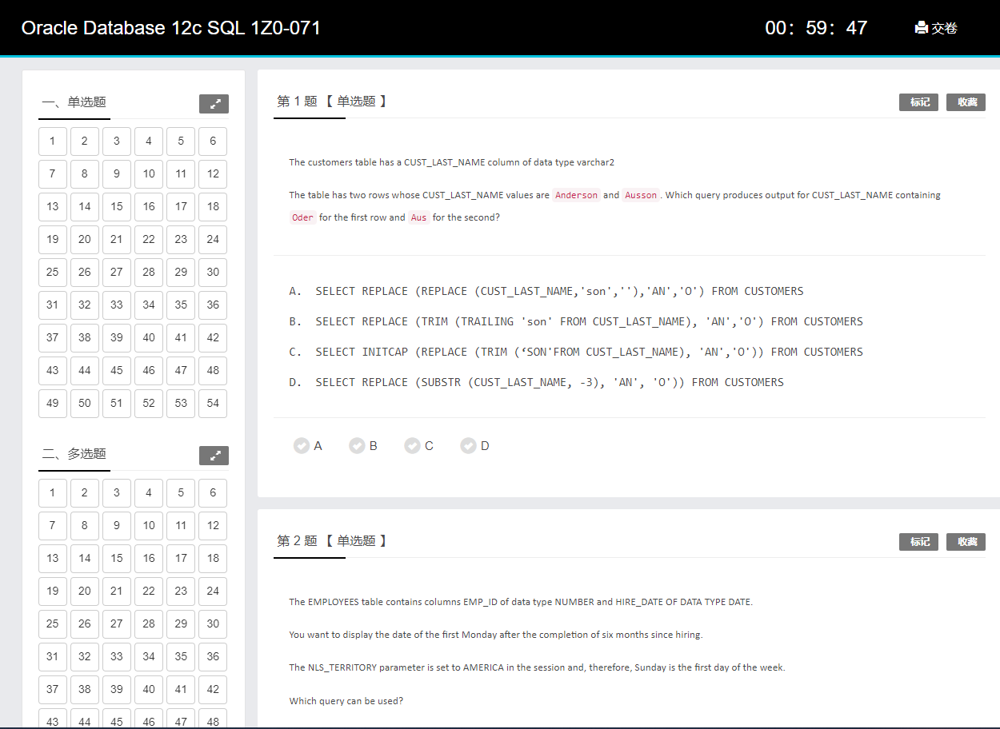
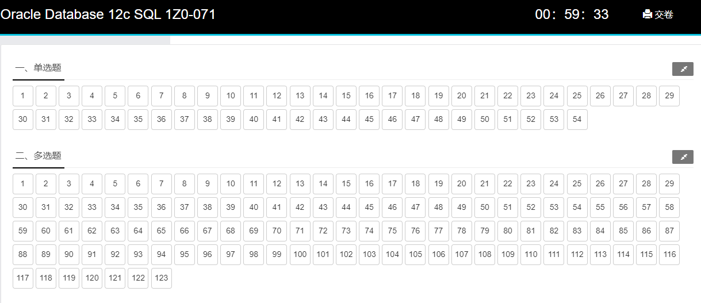
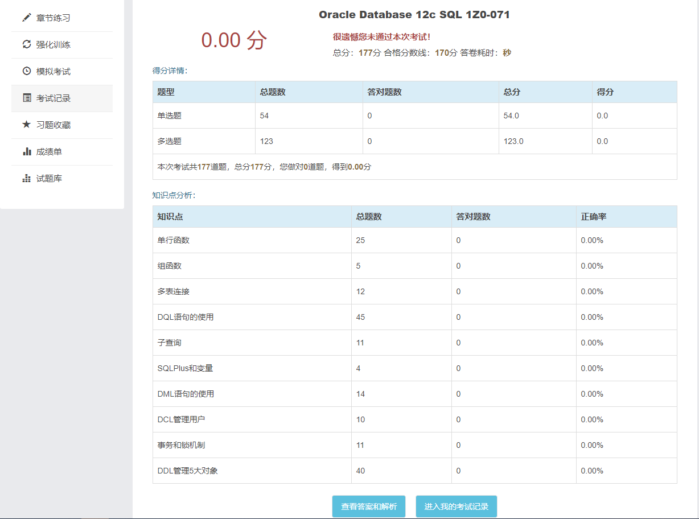

# 1Z0-071题目概览

| 编号 | 知识点       | 题目数量 |
| ---- | -------------- | ---- |
| 1   | [单行函数](#单行函数)       | 25   |
| 2    | [组函数](#组函数)          | 4    |
| 3    | [多表连接](#多表连接)       | 13   |
|4    | [子查询](#子查询)         | 11   |
| 5    | [SQLPlus和变量](#sqlplus和变量)  | 4    |
| 6    | [DML语句的使用](#dml语句的使用)  | 14   |
| 7    | [DDL管理5大对象](#ddl管理5大对象) | 40   |
| 8    | [DCL管理用户](#dcl管理用户)    | 10   |
| 9    | [DQL语句的使用](#dql语句的使用)  | 46   |
| 10    | [事务和锁机制](#事务和锁机制)   | 11   |
|      |                | 178  |

# 单行函数

[OCP在线模拟考试系统](http://10.0.0.121/)                                                                                                                                                                                                                                                                                                                                                                                                                                                                                                            				

自己搭建的LAMP架构的考试系统，有需要的邮件联系我。

部分考题

## 第 1 题 【 单选题 】

The customers table has a CUST_LAST_NAME column of data type varchar2

The table has two rows whose CUST_LAST_NAME values are `Anderson` and `Ausson`. Which query produces output for CUST_LAST_NAME containing `Oder` for the first row and `Aus` for the second?

---

A.  SELECT REPLACE (REPLACE (CUST_LAST_NAME,'son',''),'AN','O') FROM CUSTOMERS
B.  SELECT REPLACE (TRIM (TRAILING 'son' FROM CUST_LAST_NAME), 'AN','O') FROM CUSTOMERS
C.  SELECT INITCAP (REPLACE (TRIM (‘SON'FROM CUST_LAST_NAME), 'AN','O')) FROM CUSTOMERS
D.  SELECT REPLACE (SUBSTR (CUST_LAST_NAME, -3), 'AN', 'O')) FROM CUSTOMERS

---

**正确答案**

**A**

---

**试题解析**

考点：单行函数 字符串函数

Anderson and Ausson 转变为

Oder and Aus

观察后，

An 替换为'O'

son 替换为 ''

## 第 2 题 【 单选题 】

The EMPLOYEES table contains columns EMP_ID of data type NUMBER and HIRE_DATE OF DATA TYPE DATE.

You want to display the date of the first Monday after the completion of six months since hiring.

The NLS_TERRITORY parameter is set to AMERICA in the session and, therefore, Sunday is the first day of the week.

Which query can be used?

---

A.  SELECT EMP_ID, NEXT_DAY (ADD_MONTHS (HIRE_DATE, 6),’MONDAY’) FROM EMPLOYEES

B.  SELECT EMP_ID, ADD_MONTHS (HIRE_DATE, 6) NEXT_DAY (’MONDAY’) FROM EMPLOYEES

C.SELECT EMP_ID, NEXT_DAY (MONTHS_BETWEEN (HIRE_DATE, SYSDATE), 6) FROM EMPLOYEES

D.  SELECT EMP_ID, NEXT_DAY（ADD_MONTHS (HIRE_DATE, 6), 1) FROM EMPLOYEES

---

**正确答案**

**A**

---

**试题解析**

考点：单行函数 日期函数

题意 求六个月后的第一个星期一，时区设定一个星期第一天是星期天。

Next_day 指定日期的下一天

分析：A 对 指定 monday

B 错 格式错，不是内嵌函数

C 错 months_between 得出负数

D 错 没有指定星期一