<!-- TOC depthFrom:1 depthTo:6 withLinks:1 updateOnSave:1 orderedList:0 -->

- [oracle 11g 数据库安装](#oracle-11g-数据库安装)
	- [安装数据库软件有三种方法](#安装数据库软件有三种方法)
		- [安装前环境配置](#安装前环境配置)
			- [安装依赖关系包](#安装依赖关系包)
			- [创建相关的组](#创建相关的组)
			- [创建用户授予密码](#创建用户授予密码)
- [设置oracle用户的口令:](#设置oracle用户的口令)
			- [修改ora10g用户的系统环境变量](#修改ora10g用户的系统环境变量)
- [使环境变量生效:](#使环境变量生效)
			- [创建安装数据库软件的目录](#创建安装数据库软件的目录)
			- [修改shell限制](#修改shell限制)
			- [修改内核参数](#修改内核参数)
- [使内核参数生效](#使内核参数生效)
			- [将oracle安装介拷贝到系统下并解压](#将oracle安装介拷贝到系统下并解压)
			- [总结](#总结)
		- [使用OUI安装向导图形化安装](#使用oui安装向导图形化安装)
			- [将虚拟机的图形输出到宿主机的方法](#将虚拟机的图形输出到宿主机的方法)
			- [调用安装程序](#调用安装程序)
		- [卸载oracle软件](#卸载oracle软件)
- [1.停止oem](#1停止oem)
- [2.停止监听](#2停止监听)
- [3.停止数据库](#3停止数据库)
- [删除相关文件](#删除相关文件)
		- [静默安装](#静默安装)
- [详细操作](#详细操作)
		- [克隆安装](#克隆安装)
		- [创建数据库](#创建数据库)
- [详细操作](#详细操作)
- [将sid改为db01](#将sid改为db01)
		- [连接数据库](#连接数据库)
- [查看当前数据库的状态:](#查看当前数据库的状态)

<!-- /TOC -->

## 安装数据库软件有三种方法

1. 使用OUI安装向导图形化安装
2. 使用应答文件静默安装
3. 克隆安装     

### 安装前环境配置

```shell
[root@database ~]# cat /proc/version
Linux version 2.6.32-696.6.3.el6.x86_64 (mockbuild@c1bl.rdu2.centos.org) (gcc version 4.4.7 20120313 (Red Hat 4.4.7-18) (GCC) ) #1 SMP Wed Jul 12 14:17:22 UTC 2017
[root@database ~]# cat /etc/redhat-release
CentOS release 6.8 (Final)
```

#### 安装依赖关系包

```shell
yum install -y binutils compat-libstdc++-33 elfutils-libelf elfutils-libelf-devel gcc gcc-c++ glibc glibc-common glibc-devel glibc-headers kernel-headers ksh libaio  libaio-devel libgcc libgomp libstdc++ libstdc++-devel make numactl-devel sysstat unixODBC unixODBC-devel
curl -O "http://vault.centos.org/5.11/os/x86_64/CentOS/pdksh-5.2.14-37.el5_8.1.x86_64.rpm"
rpm -e --nodeps ksh
rpm -ivh pdksh-5.2.14-37.el5_8.1.x86_64.rpm
```


#### 创建相关的组

> oinstall为产品所有者，dba是数据库的安全审核用户组，官方要求

```shell
groupadd oinstall
groupadd dba
```

#### 创建用户授予密码

> 用户名可以自定义

```shell
useradd -g oinstall -G dba -m oracle

#设置oracle用户的口令:
passwd oracle
```


#### 修改ora10g用户的系统环境变量

```shell
su - oracle

vi .bashrc
---------------------------------------------------------
export ORACLE_BASE=/u01/app/oracle
export ORACLE_HOME=$ORACLE_BASE/product/11.2.0/db_1
export PATH=$ORACLE_HOME/bin:$PATH
export LD_LIBRARY_PATH=$ORACLE_HOME/lib:$LD_LIBRARY_PATH
export ORACLE_SID=orcl
export ORACLE_OWNER=oracle
export ORACLE_TERM=vt100
export THREADS_FLAG=native
export LANG=en_US
---------------------------------------------------------


# 使环境变量生效:
source .bashrc
```

以上环境变量中，最重要的是oracle的home和sid，其他的当前其实用不到。
* ORACLE_BASE 软件解压后所在的位置
* ORACLE_HOME 数据库的家目录（配置、数据、执行文件、库文件等）
* PATH=$ORACLE_HOME/bin:$PATH 将oracle的可执行指令添加到PATH变量中
* ORACLE_SID=orcl
其他都是非主要的，将来中间件需要调用的参数
* LD_LIBRARY_PATH oracle的库文件所在路径


#### 创建安装数据库软件的目录

```shell
mkdir -p /u01/app/oracle
chown -R oracle.oinstall /u01/app
```

#### 修改shell限制

```shell
vi /etc/security/limits.conf
---------------------------------------------
oracle soft nofile 65536
oracle hard nofile 65536
oracle soft nproc 16384
oracle hard nproc 16384
```

#### 修改内核参数


> 最大共享内存为3.768 G，最小4 K，（shmmax & shmmin）
> shmall为共享内存的大小

```shell
vi /etc/sysctl.conf
---------------------------------------------
kernel.shmmax = 4046471168
kernel.shmmni = 4096
kernel.shmall = 2097152
kernel.sem = 250 32000 100 128
fs.file-max = 6815744
net.ipv4.ip_local_port_range = 9000 65500
net.core.rmem_default = 262144
net.core.rmem_max = 4194304
net.core.wmem_default = 262144
net.core.wmem_max = 1048576
fs.aio-max-nr = 1048576
---------------------------------------------
# 使内核参数生效
sysctl -p
```


#### 将oracle安装介拷贝到系统下并解压

```shell
scp p13390677_112040_Linux-x86-64_1of7.zip oracle@172.25.0.11:/home/oracle/
scp p13390677_112040_Linux-x86-64_2of7.zip oracle@172.25.0.11:/home/oracle/

unzip p13390677_112040_Linux-x86-64_1of7.zip
unzip p13390677_112040_Linux-x86-64_2of7.zip
```

#### 总结

初始化环境步骤如下：
1. 用户和组的组的创建
2. 数据库安装目录的创建
2. 环境变量的设定
3. 内核参数的设定
4. 文件句柄和进程数的设定
5. oracle安装包的下载和解压


###  使用OUI安装向导图形化安装

#### 将虚拟机的图形输出到宿主机的方法

1. 使用root用户以带图形的方式连接到虚拟机 `ssh root@172.25.0.11 -X`
2. 打开普通用户调用Xserver的权利`xhost +`
3. 再使用oracle用户以带图形的方式连接到虚拟机`ssh oracle@172.25.0.11 -X`

#### 调用安装程序

```shell
cd ~/database
./runInstaller
```

1)是否有技术支持的密码，这里我们是免费使用的，所以需要将勾去掉，点击下一步

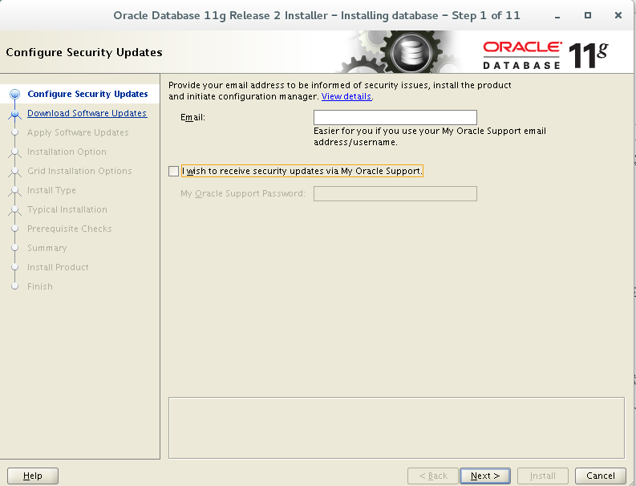

2)是否确认不输入邮件，选择yes

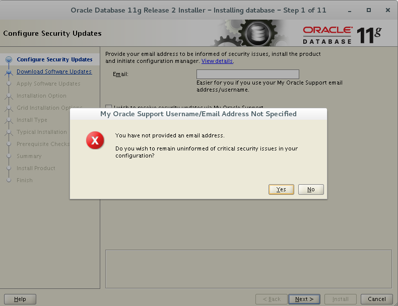

3)是否进行软件更新？免费是不能更新的，所以选择"Skip software updates"

> 服务费是软件的22%，例如100万的产品，则22万的服务费，一年一次；没买服务就是没有补丁和技术支持

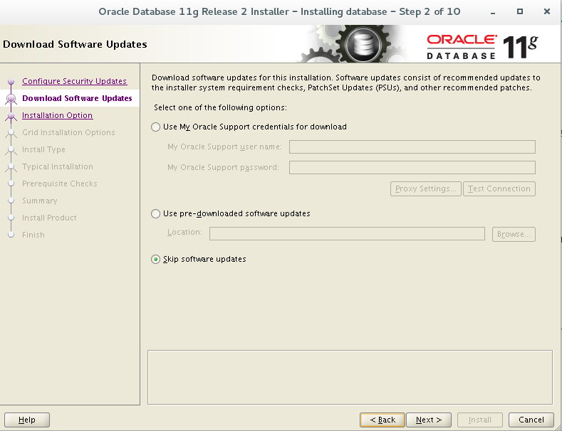

4)选择只安装软件，数据库我们后面再创建，因此选择"install database software only"

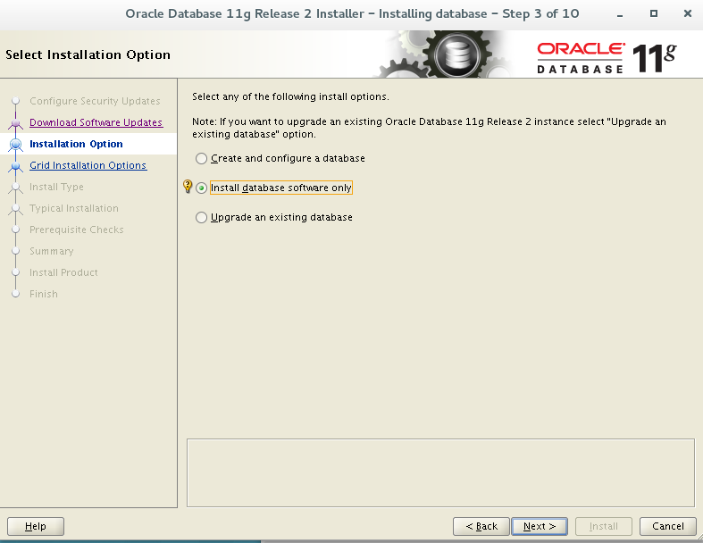

5)默认选择安装单实例的数据库，不用修改，点击下一步


6)语言选择默认的英文，不用修改，点击下一步

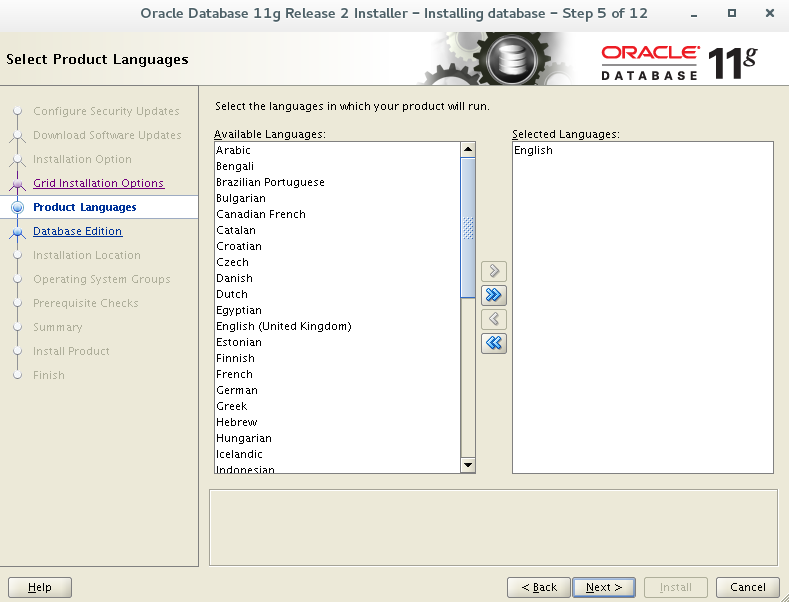

7)软件安装版本，默认为功能最全的企业版，不用修改，点击下一步

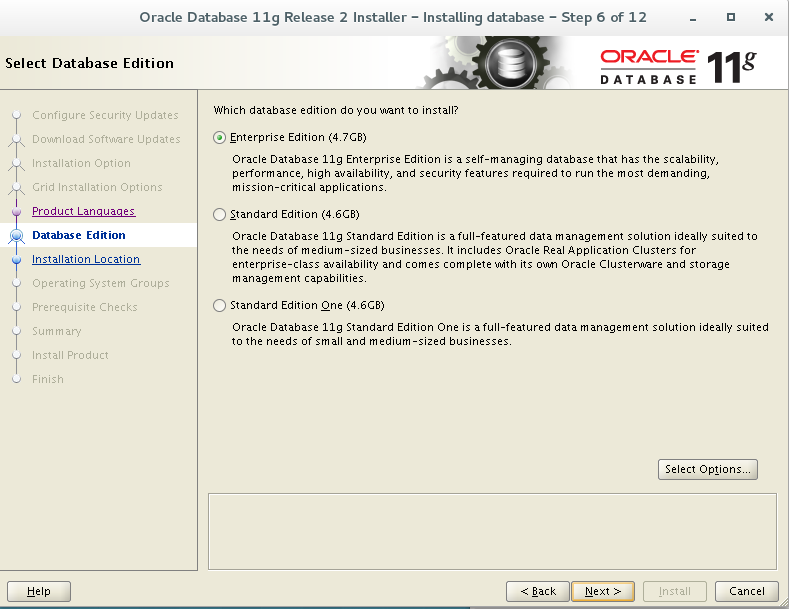

8)软件的安装路径，会根据设定的环境变量自动填写，此处不需要修改


9)产品信息存放路径，使用默认即可，需要预先创建该目录

```shell
[root@install0 ~]# mkdir /u01/app/oraInventory
[root@install0 ~]# ll /u01/app
total 8
drwxr-xr-x 2 oracle oinstall 4096 Apr 19 15:43 oracle
drwxr-xr-x 2 root   root     4096 Apr 19 15:46 oraInventory
[root@install0 ~]# chown oracle.oinstall /u01/app/oraInventory/
```

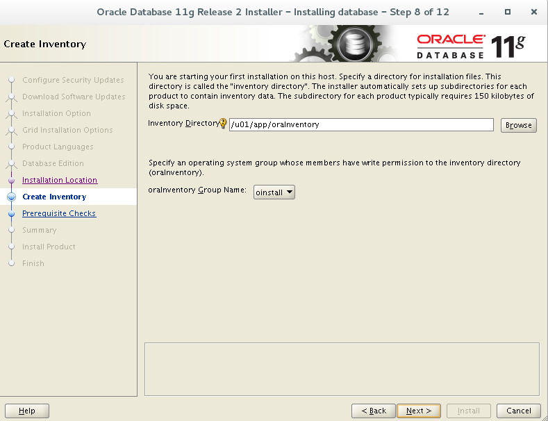

10)操作员的组需要选择，可以选择dba的组

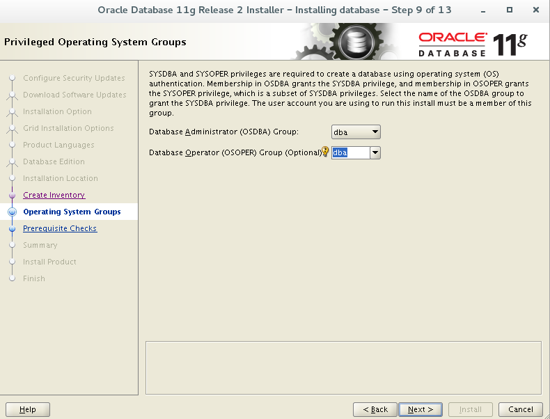

11)进行预检测后，进入以下界面，可以点击"save response file"来录制应答文件，为静默安装做准备。

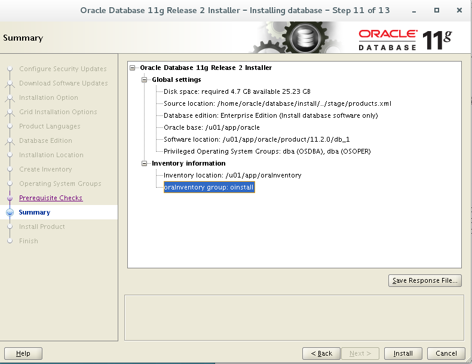

> 注意，此处我的环境已经将依赖关系包都事先安装好了，所以没有检测出问题，但是不同的环境下肯定是不同的，要根据检测结果进行调整


* 将该文件保存在默认路径下 `/home/oracle/db.rsp`
* 文件的作用是，可以脱离java引擎使用命令行无人执守安装oracle的应答文件

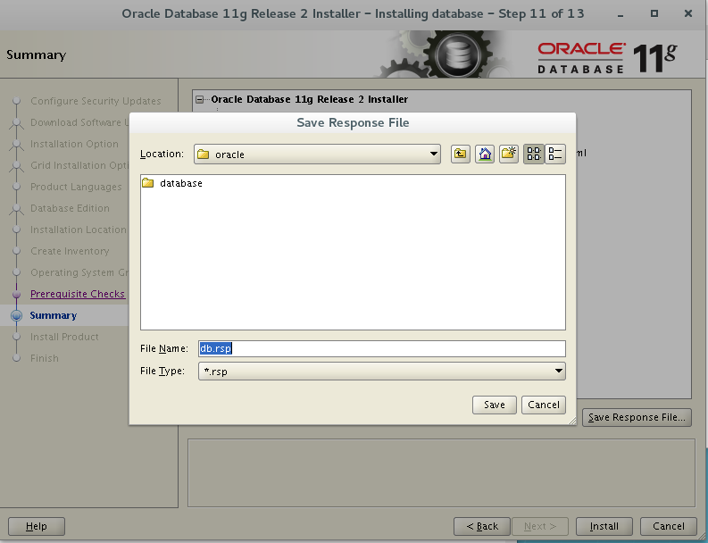

12) 安装过程如下图

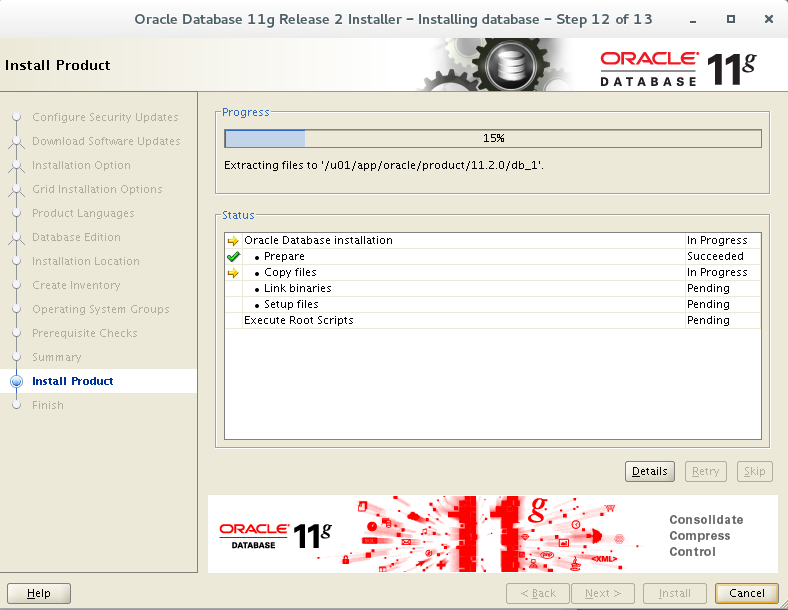

13)安装好后需要root执行两个shell脚本

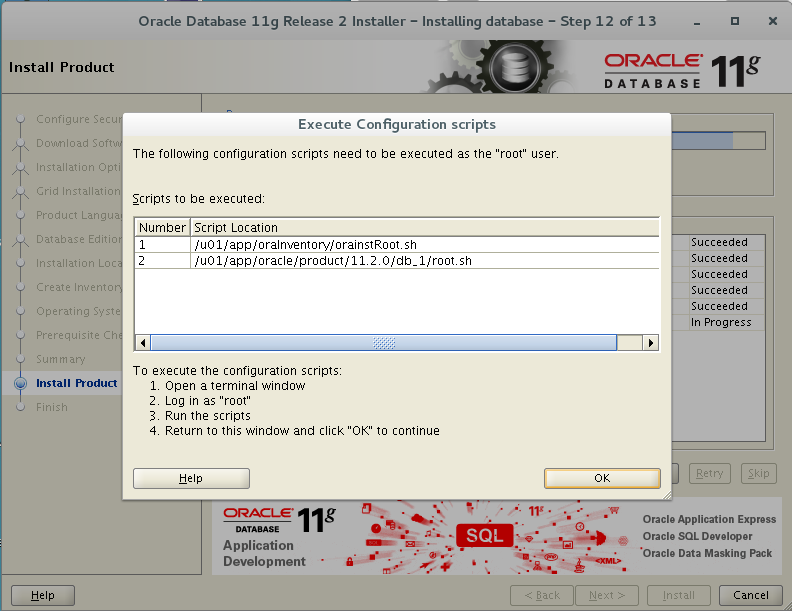

```shell
[root@install0 ~]# /u01/app/oraInventory/orainstRoot.sh
Changing permissions of /u01/app/oraInventory.
Adding read,write permissions for group.
Removing read,write,execute permissions for world.

Changing groupname of /u01/app/oraInventory to oinstall.
The execution of the script is complete.
[root@install0 ~]# /u01/app/oracle/product/11.2.0/db_1/root.sh
Performing root user operation for Oracle 11g

The following environment variables are set as:
    ORACLE_OWNER= oracle
    ORACLE_HOME=  /u01/app/oracle/product/11.2.0/db_1

Enter the full pathname of the local bin directory: [/usr/local/bin]:
   Copying dbhome to /usr/local/bin ...
   Copying oraenv to /usr/local/bin ...
   Copying coraenv to /usr/local/bin ...


Creating /etc/oratab file...
Entries will be added to the /etc/oratab file as needed by
Database Configuration Assistant when a database is created
Finished running generic part of root script.
Now product-specific root actions will be performed.
Finished product-specific root actions.
```

14)安装成功

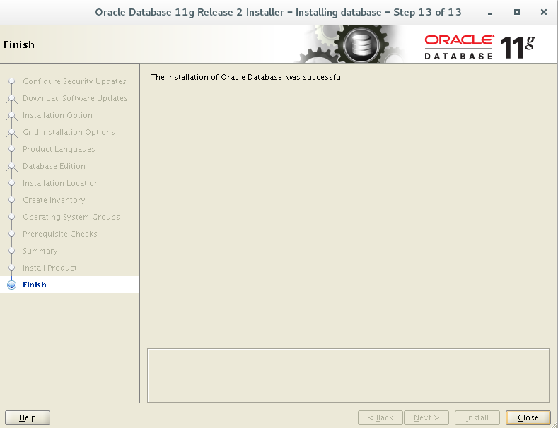


### 卸载oracle软件

```shell
# 1.停止oem
emctl stop dbconsole db

# 2.停止监听
lsnrctl stop

# 3.停止数据库
sqlplus / as sysdba
shut immediate

# 删除相关文件
rm -fr /u01/app/*
rm -fr /etc/ora*
rm -f /usr/local/bin/coraenv
rm -f /usr/local/bin/dbhome
rm -f /usr/local/bin/oraenv
```

### 静默安装

> 使用另一种安装方法:静默安装

1. 修改OUI安装向导保存的应答文件`/home/oracle/db.rsp`,指定数据库的初始口令

```shell
oracle.install.db.config.starterdb.password.ALL=Oracle11g
```

2. 启动安装

```shell
cd ~/database
./runInstaller -silent -responseFile /home/oracle/db.rsp

# 详细操作
[oracle@install0 database]$ grep password.ALL ../db.rsp
oracle.install.db.config.starterdb.password.ALL=Oracle11g

[oracle@install0 database]$ ./runInstaller -silent -responseFile /home/oracle/db.rsp
Starting Oracle Universal Installer...

Checking Temp space: must be greater than 120 MB.   Actual 28261 MB    Passed
Checking swap space: must be greater than 150 MB.   Actual 3999 MB    Passed
Preparing to launch Oracle Universal Installer from /tmp/OraInstall2017-05-26_02-25-51PM. Please wait ...[oracle@install0 database]$ You can find the log of this install session at:
 /u01/app/oraInventory/logs/installActions2017-05-26_02-25-51PM.log
The installation of Oracle Database 11g was successful.
Please check '/u01/app/oraInventory/logs/silentInstall2017-05-26_02-25-51PM.log' for more details.

As a root user, execute the following script(s):
	1. /u01/app/oraInventory/orainstRoot.sh
	2. /u01/app/oracle/product/11.2.0/db1/root.sh


Successfully Setup Software.
```

### 克隆安装

> 第三种安装方法：克隆安装

将安装好的数据库产品，克隆到宿主机

1. 在虚拟机中将数据库正常停止

```shell
SQL> conn / as sysdba
SQL> shut immediate
```

2. 宿主机创建组和用户

* 组：oinstall,dba
* 用户：oracle

3. 修改用户的.bashrc
4. 创建安装目录：/u01/app/
5. 修改宿主机shell限制
6. 修改宿主机内核参数，并且生效
7. 将虚拟机/u01/app/* 传到宿主机/u01/app/

```shell
cd /u01/app/
tar -cf - oraInventory | ssh oracle@172.25.0.12 'cd /u01/app; tar -xf -'

cd /u01/app/oracle/product/11.2.0
tar -cf - db_1 | ssh oracle@172.25.254.250 'cd /u01/app/oracle/product/11.2.0; tar -xf -'

tar: oracle/product/11.2.0/db_1/bin/nmhs: Cannot open: Permission denied
tar: oracle/product/11.2.0/db_1/bin/nmo: Cannot open: Permission denied
tar: oracle/product/11.2.0/db_1/bin/nmb: Cannot open: Permission denied
tar: oracle/product/11.2.0/db_1/install0.example.com_orcl/sysman/log/emoms.trc:

chmod 4710
```

运行脚本：

```shell
/u01/app/oraInventory/orainstRoot.sh
/u01/app/oracle/product/11.2.0/db_1/root.sh
```


### 创建数据库

命令 dbca


```shell
dbca -silent -createDatabase -templateName General_Purpose.dbc -gdbName db01 -sid db01 -sysPassword oracle -systemPassword oracle -datafileDestination /u01/app/oracle/oradata -characterSet we8mswin1252 -nationalCharacterSet al16utf16 -responseFile NO_VALUE

# 详细操作
[oracle@install0 ~]$ dbca -silent -createDatabase -templateName General_Purpose.dbc -gdbName db01 -sid db01 -sysPassword oracle -systemPassword oracle -datafileDestination /u01/app/oracle/oradata -characterSet we8mswin1252 -nationalCharacterSet al16utf16 -responseFile NO_VALUE
Copying database files
1% complete
3% complete
11% complete
18% complete
26% complete
37% complete
Creating and starting Oracle instance
40% complete
45% complete
50% complete
55% complete
56% complete
60% complete
62% complete
Completing Database Creation
66% complete
70% complete
73% complete
85% complete
96% complete
100% complete
Look at the log file "/u01/app/oracle/cfgtoollogs/dbca/db01/db01.log" for further details.
[oracle@install0 oracle]$ vim /home/oracle/.bashrc
# 将sid改为db01
export ORACLE_SID=db01
[oracle@install0 oracle]$ source /home/oracle/.bashrc
[oracle@install0 oracle]$ sqlplus / as sysdba

SQL*Plus: Release 11.2.0.4.0 Production on Fri May 26 16:41:23 2017

Copyright (c) 1982, 2013, Oracle.  All rights reserved.


Connected to:
Oracle Database 11g Enterprise Edition Release 11.2.0.4.0 - 64bit Production
With the Partitioning, OLAP, Data Mining and Real Application Testing options

SQL> show parameter name

NAME				     TYPE	 VALUE
------------------------------------ ----------- ------------------------------
cell_offloadgroup_name		     string
db_file_name_convert		     string
db_name 			     string	 db01
db_unique_name			     string	 db01
global_names			     boolean	 FALSE
instance_name			     string	 db01
lock_name_space 		     string
log_file_name_convert		     string
processor_group_name		     string
service_names			     string	 db01
SQL> select name from v$datafile;

NAME
--------------------------------------------------------------------------------
/u01/app/oracle/oradata/db01/system01.dbf
/u01/app/oracle/oradata/db01/sysaux01.dbf
/u01/app/oracle/oradata/db01/undotbs01.dbf
/u01/app/oracle/oradata/db01/users01.dbf

SQL> select status from v$instance;

STATUS
------------
OPEN


```

### 连接数据库

```shell
sqlplus / as sysdba

SQL> show user
USER is "SYS"

# 查看当前数据库的状态:
SQL> select status from v$instance;

STATUS
------
OPEN
```
