> **Practices for Lesson 5: Configuring the Oracle Network Environment**
>
> 2020.01.29 BoobooWei

<!-- MDTOC maxdepth:6 firsth1:1 numbering:0 flatten:0 bullets:0 updateOnSave:1 -->

[实践5:管理网络](#实践5管理网络)   
&emsp;[实践5:概览](#实践5概览)   
&emsp;[实践5-1:配置Oracle网络以访问另一个数据库](#实践5-1配置oracle网络以访问另一个数据库)   
&emsp;&emsp;[Overview](#overview)   
&emsp;&emsp;[Task](#task)   
&emsp;&emsp;[Practice](#practice)   
&emsp;&emsp;[KnowledgePoint](#knowledgepoint)   
&emsp;[实践5-2:创建另一个监听](#实践5-2创建另一个监听)   
&emsp;&emsp;[Overview](#overview)   
&emsp;&emsp;[Task](#task)   
&emsp;&emsp;[Practice](#practice)   
&emsp;&emsp;[KnowledgePoint](#knowledgepoint)   
&emsp;&emsp;&emsp;[关于网络工具](#关于网络工具)   
&emsp;&emsp;&emsp;[网络配置文件](#网络配置文件)   
&emsp;[实践5-3:配置Oracle网络以访问PDB数据库](#实践5-3配置oracle网络以访问pdb数据库)   
&emsp;&emsp;[Overview](#overview)   
&emsp;&emsp;[Task](#task)   
&emsp;&emsp;[Practice](#practice)   

<!-- /MDTOC -->

## 实践5:概览

Practices for Lesson 5: Overview

In this practice, you configure connectivity between your machine and a database on one of your classmate’s machines. You also configure and test an additional listener.

**Note:** This practice is entirely for educational purposes and no future practices rely on successful completion of this practice.

在此实践中，您将配置您的计算机与某个同学计算机上的数据库之间的连接。您还可以配置和测试一个额外的监听器。
注意:这个练习完全是为了教育目的，未来的练习不依赖于这个练习的成功完成。


## 实践5-1:配置Oracle网络以访问另一个数据库

Practice 5-1: Configuring the Oracle Network to Access Another Database

### Overview

Configure your network environment so that you can connect to a partner’s orcl database. Use local naming and create a new network service name called testorcl that maps to your partner’s orcl database. Test your network changes by attempting to connect to your partner’s database by using the testorcl service name.

### Task

1. Make a copy of your **tnsnames.ora** file. It is in your database **$ORACLE_HOME/network/admin** directory.
2. Use Oracle Net Manager (**netmgr**) to create the testorcl net service name on your machine.
3. Test your changes to the network configuration by using SQL*Plus. Enter **system@testorcl** and then enter **oracle_4U** when prompted for the password. Select the INSTANCE_NAME and HOST_NAME columns from the V$INSTANCE  view to view information about the host.

### Practice

配置网络环境，以便可以连接到合作伙伴的orcl数据库。使用本地命名并创建一个名为testorcl的新网络服务名称，该名称映射到您的合作伙伴的orcl数据库。通过使用testorcl服务名称尝试连接到合作伙伴的数据库来测试网络更改。

1. 复制文件`tnsnames.ora`，该文件所在目录为`$ORACLE_HOME/network/admin`

   ```bash
   [oracle@oracle01 ~]$ cd $ORACLE_HOME/network/admin
   [oracle@oracle01 admin]$ pwd
   /u01/app/oracle/product/12.2.0/db_1/network/admin
   [oracle@oracle01 admin]$ ll
   total 16
   -rw-r-----. 1 oracle oinstall  343 Sep 22 17:02 listener.ora
   drwxr-xr-x. 2 oracle oinstall   64 Sep 22 14:58 samples
   -rw-r--r--. 1 oracle oinstall 1441 Aug 28  2015 shrept.lst
   -rw-r-----. 1 oracle oinstall  198 Sep 22 17:02 sqlnet.ora
   -rw-r-----. 1 oracle oinstall  430 Nov  3 19:42 tnsnames.ora
   [oracle@oracle01 admin]$ cp tnsnames.ora tnsnames.old
   ```

2. 使用Oracle 网络管理工具 `netmgr`创建 `testorcl` 网络服务。

   | 步骤 | 窗口                                        | 选择/值                                                      |
   | ---- | ------------------------------------------- | ------------------------------------------------------------ |
   | a.   | bash界面切换到oracle用户                    | **$ netmgr**                                                 |
   | b.   | Net Manager navigation pane                 | Expand **Local**.                                            |
   | c.   |                                             | Select **Service Naming**.                                   |
   | d.   |                                             | Expand **Service Naming**.                                   |
   | e.   |                                             | Click the green plus sign                                                                        to launch  the net service name wizard. |
   | f.   | Net Service Name  Wizard: Welcome           | Enter Service Name:  **testorcl**  Click **Next**.           |
   | g.   | Net Service Name  Wizard:…Protocol          | Select **TCP/IP (Internet Protocol).**  Click **Next**.      |
   | h.   | Net Service Name  Wizard:…Protocol Settings | Enter Host Name:  **  **address>**  Enter Port Number:  **1521**  Click **Next**. |
   | i.       | Net Service Name  Wizard:…Service | Enter Service: **orcl**  Click **Next**.                     |
   | j.       | Net Service Name  Wizard:…Test    | Click **Test**.                                              |
   | k.       | Connection Test                   | Connection Test was successful  Click **Close**.             |
   | l.       | Net Service Name  Wizard:…Test    | Click **Finish**.                                            |
   | m.       | Oracle Net Manager                | Click **File** > **Save Network Configuration**  Click **File** > **Exit** |

   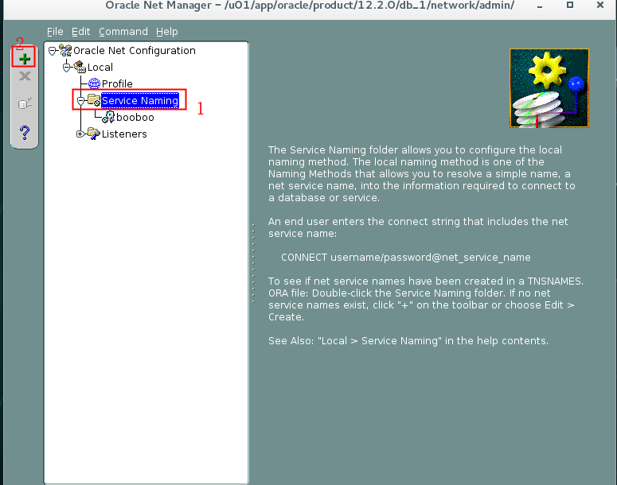

   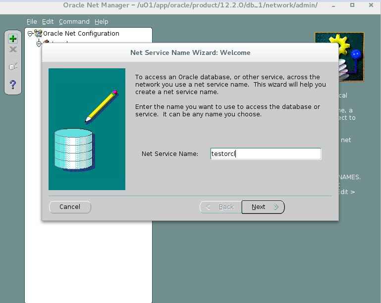

   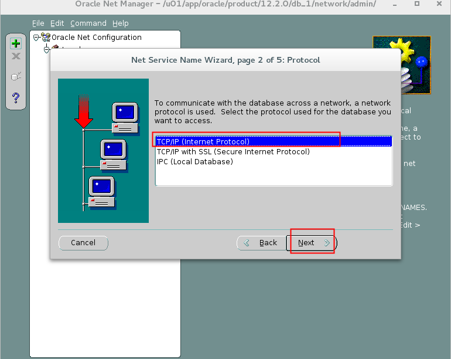

   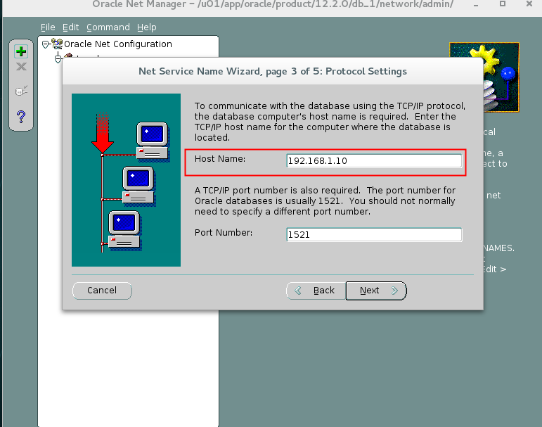

    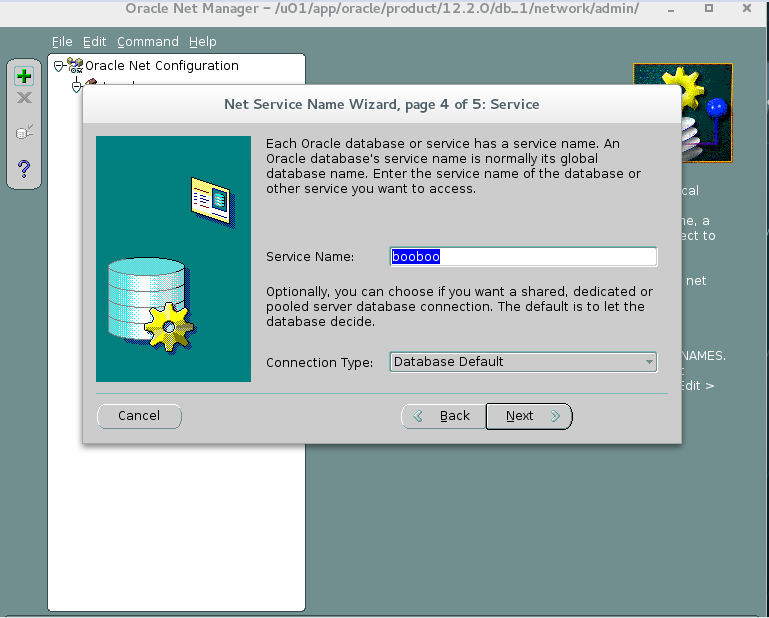

   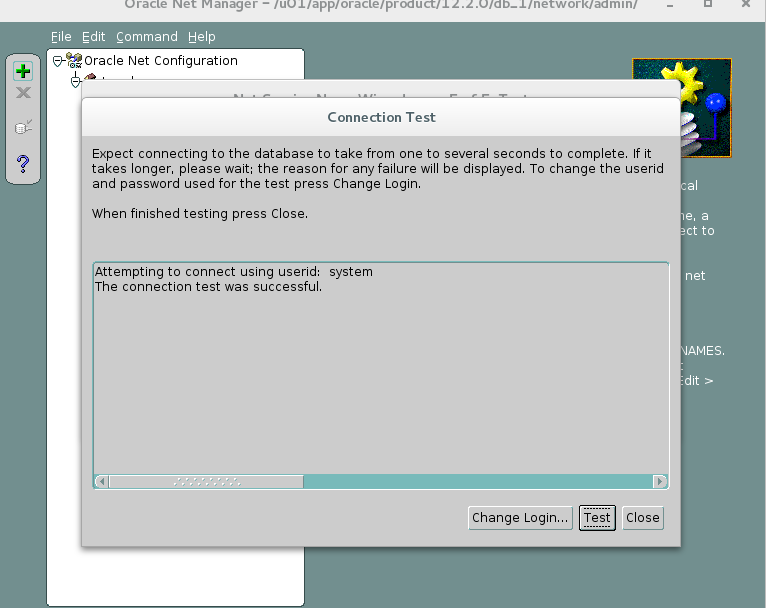

   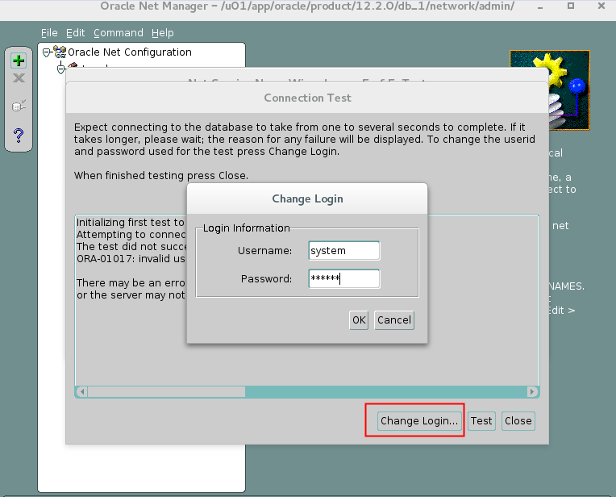

   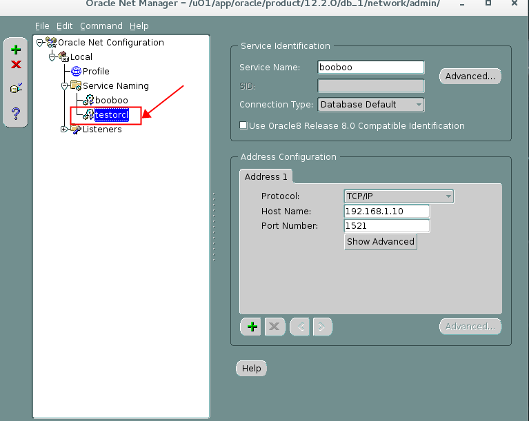


3. 通过 SQL*Plus 测试网络配置。输入 **system@testorcl** 密码为  **oracle_4U** 。从 V$INSTANCE 视图中查询实例名称和主机名。

   ```sql
   sqlplus system@oracle@testorcl
   > select instance_name,host_name from v$instance;
   ```


### KnowledgePoint

客户机为了和服务器连接，必须先和服务器上的监听进程联络。ORACLE通过`tnsnames.ora`文件中的连接描述符来说明连接信息。一般`tnsnames.ora` 是建立在**客户机**上的。如果是客户机/服务器结构，整个网络上只有一台机器安装了ORACLE数据库服务器，那么只需在每个要访问ORACLE服务器的客户机上定义该文件，在服务器上无需定义。但是，如果网络上有多台机器均安装了ORACLE数据库服务器，并且服务器之间有数据共享的要求，那么在每台服务器上都必须定义该文件。

## 实践5-2:创建另一个监听

Practice 5-2: Creating an Alternative Listener

### Overview

In this practice, you create a second listener named LISTENER2 by using Oracle Net Manager.

### Task

1.	Create a new listener called **LISTENER2**. Use port **1561** for this listener. Use Oracle Net Manager (**netmgr**) to create the new listener.
2.	Create a Service Name for both listeners by using Oracle Net Manager.
3.	Start the **LISTENER2** listener by using the listener control utility.
4.	Configure the database to register with both listeners. Alter the **LOCAL_LISTENER**
initialization parameter.
5.	Check the status of the new listener and test the new listener.
6.	You can now stop the new **LISTENER2** listener because you do not need it for the remainder of the course.
7.	Reset the **LOCAL_LISTENER** initialization parameter to the default value.

### Practice

1. 使用Oracle网络管理工具 `netmgr` 创建一个新监听 `LISTENER2` ，监听端口为 `1561`。

  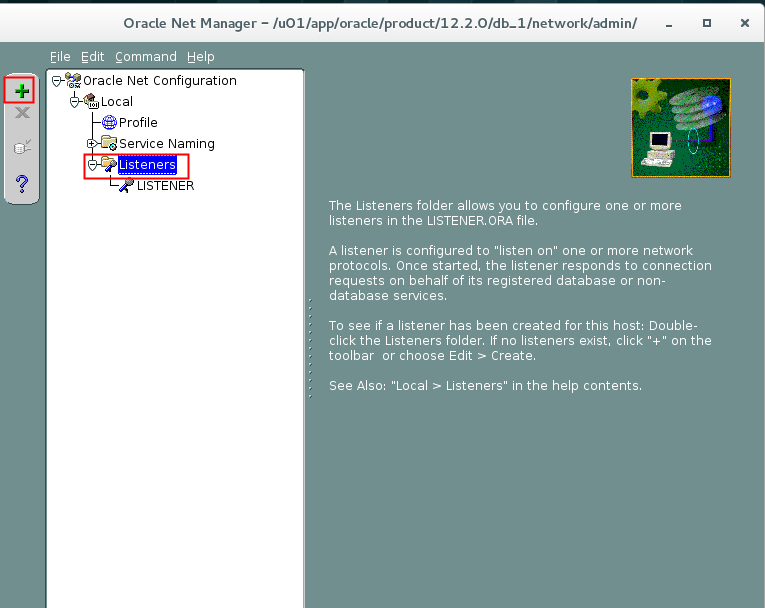

  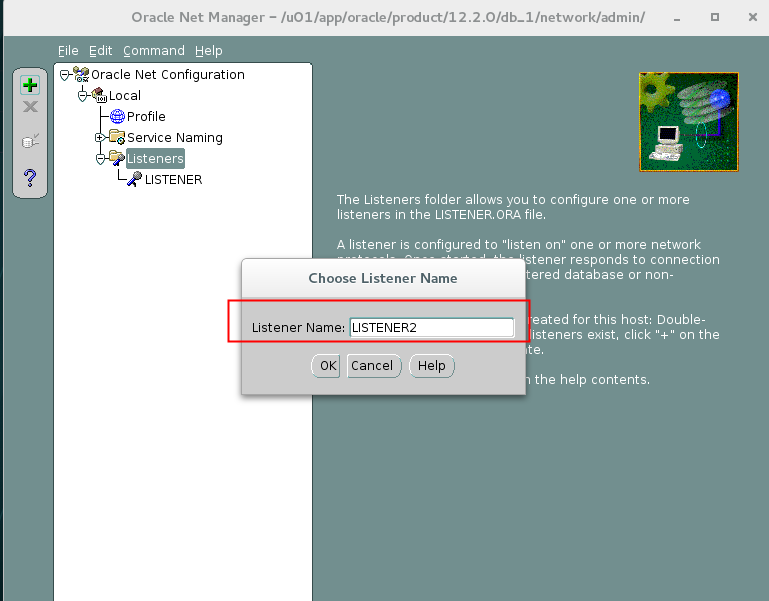

  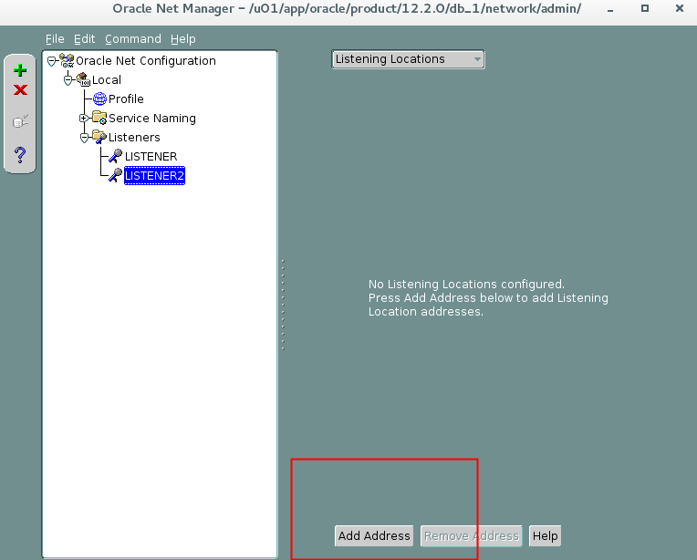

  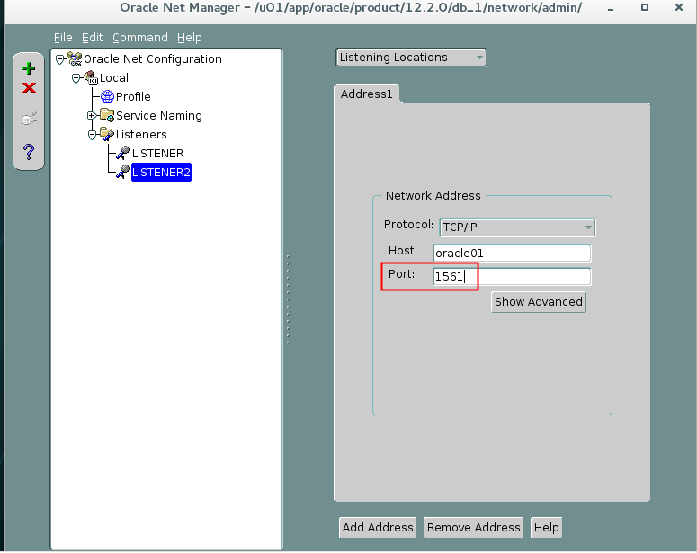

2. 使用Oracle网络管理工具 `netmgr` 创建一个新服务名 `LISTENER2`。

  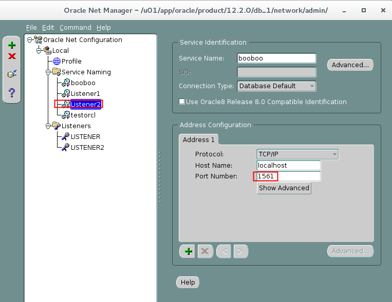

3. 启动新监听 `LISTENER2`。

  ```bash
  lsnrctl start LISTENER2
  ```

4. 通过修改参数 `LOCAL_LISTENER` 配置数据库的注册新监听。

  ```sql
  show parameter local_listener;
  ALTER SYSTEM SET LOCAL_LISTENER=LISTENER2,LISTENER_BOOBOO SCOPE=BOTH;

  System altered.

  SYS@booboo>show parameter local_listener;

  NAME				     TYPE	 VALUE
  ------------------------------------ ----------- ------------------------------
  local_listener			     string	 LISTENER2, LISTENER_BOOBOO
  SYS@booboo>exit
  ```

5. 检查新监听 `LISTENER2` 的状态，测试新监听。

  ```bash
  lsnrctl status LISTENER2
  ```

6. 停止新监听 `LISTENER2`。

  ```bash
  lsnrctl stop LISTENER2
  ```

7. 重制参数 `LOCAL_LISTENER` 到默认值。

  ```sql
  alter system reset local_listener scope=spfile;
  shutdown immediate
  startup
  show paramter local_listener;
  ```

执行结果

```sql
# 将参数改为默认值
SYS@booboo>alter system reset local_listener scope=spfile;

System altered.

# 关闭数据库实例
SYS@booboo>shutdown immediate;
Database closed.
Database dismounted.
ORACLE instance shut down.

# 启动数据库实例
SYS@booboo>startup
ORACLE instance started.

Total System Global Area  855638016 bytes
Fixed Size		    8798504 bytes
Variable Size		  327159512 bytes
Database Buffers	  515899392 bytes
Redo Buffers		    3780608 bytes
Database mounted.
Database opened.

# 查看参数
SYS@booboo>show parameter local_listener;

NAME				     TYPE	 VALUE
------------------------------------ ----------- ------------------------------
local_listener			     string
SYS@booboo>exit
Disconnected from Oracle Database 12c Enterprise Edition Release 12.2.0.1.0 - 64bit Production


# 查看新增监听listener2，看到无服务
[oracle@oracle01 ~]$ lsnrctl status listener2

LSNRCTL for Linux: Version 12.2.0.1.0 - Production on 31-JAN-2020 00:32:57

Copyright (c) 1991, 2016, Oracle.  All rights reserved.

Connecting to (DESCRIPTION=(ADDRESS=(PROTOCOL=TCP)(HOST=oracle01)(PORT=1561)))
STATUS of the LISTENER
------------------------
Alias                     LISTENER2
Version                   TNSLSNR for Linux: Version 12.2.0.1.0 - Production
Start Date                30-JAN-2020 23:27:27
Uptime                    0 days 1 hr. 5 min. 29 sec
Trace Level               off
Security                  ON: Local OS Authentication
SNMP                      OFF
Listener Parameter File   /u01/app/oracle/product/12.2.0/db_1/network/admin/listener.ora
Listener Log File         /u01/app/oracle/diag/tnslsnr/oracle01/listener2/alert/log.xml
Listening Endpoints Summary...
  (DESCRIPTION=(ADDRESS=(PROTOCOL=tcp)(HOST=ol7-122.localdomain)(PORT=1561)))
  (DESCRIPTION=(ADDRESS=(PROTOCOL=ipc)(KEY=EXTPROC1561)))
The listener supports no services
The command completed successfully

# 将新监听的服务名注册到数据库实例
[oracle@oracle01 ~]$ sqlplus / as sysdba

SQL*Plus: Release 12.2.0.1.0 Production on Fri Jan 31 00:33:01 2020

Copyright (c) 1982, 2016, Oracle.  All rights reserved.


Connected to:
Oracle Database 12c Enterprise Edition Release 12.2.0.1.0 - 64bit Production

SYS@booboo>ALTER SYSTEM SET LOCAL_LISTENER=LISTENER2,LISTENER_BOOBOO SCOPE=BOTH;

System altered.

SYS@booboo>show parameter local_listener;

NAME				     TYPE	 VALUE
------------------------------------ ----------- ------------------------------
local_listener			     string	 LISTENER2, LISTENER_BOOBOO
SYS@booboo>exit
Disconnected from Oracle Database 12c Enterprise Edition Release 12.2.0.1.0 - 64bit Production

# 再次查看新监听服务时，正常
[oracle@oracle01 ~]$ lsnrctl status listener2

LSNRCTL for Linux: Version 12.2.0.1.0 - Production on 31-JAN-2020 00:33:30

Copyright (c) 1991, 2016, Oracle.  All rights reserved.

Connecting to (DESCRIPTION=(ADDRESS=(PROTOCOL=TCP)(HOST=oracle01)(PORT=1561)))
STATUS of the LISTENER
------------------------
Alias                     LISTENER2
Version                   TNSLSNR for Linux: Version 12.2.0.1.0 - Production
Start Date                30-JAN-2020 23:27:27
Uptime                    0 days 1 hr. 6 min. 2 sec
Trace Level               off
Security                  ON: Local OS Authentication
SNMP                      OFF
Listener Parameter File   /u01/app/oracle/product/12.2.0/db_1/network/admin/listener.ora
Listener Log File         /u01/app/oracle/diag/tnslsnr/oracle01/listener2/alert/log.xml
Listening Endpoints Summary...
  (DESCRIPTION=(ADDRESS=(PROTOCOL=tcp)(HOST=ol7-122.localdomain)(PORT=1561)))
  (DESCRIPTION=(ADDRESS=(PROTOCOL=ipc)(KEY=EXTPROC1561)))
  (DESCRIPTION=(ADDRESS=(PROTOCOL=tcps)(HOST=ol7-122.localdomain)(PORT=5500))(Security=(my_wallet_directory=/u01/app/oracle/admin/booboo/xdb_wallet))(Presentation=HTTP)(Session=RAW))
  (DESCRIPTION=(ADDRESS=(PROTOCOL=tcp)(HOST=ol7-122.localdomain)(PORT=5505))(Presentation=HTTP)(Session=RAW))
Services Summary...
Service "96710507bcb024c7e0553ce49b3eaf97" has 1 instance(s).
  Instance "booboo", status READY, has 1 handler(s) for this service...
Service "96710c6c558f2859e0553ce49b3eaf97" has 1 instance(s).
  Instance "booboo", status READY, has 1 handler(s) for this service...
Service "96711442bf1f28abe0553ce49b3eaf97" has 1 instance(s).
  Instance "booboo", status READY, has 1 handler(s) for this service...
Service "96711b8e377f28d4e0553ce49b3eaf97" has 1 instance(s).
  Instance "booboo", status READY, has 1 handler(s) for this service...
Service "booboo" has 1 instance(s).
  Instance "booboo", status READY, has 1 handler(s) for this service...
Service "boobooXDB" has 1 instance(s).
  Instance "booboo", status READY, has 1 handler(s) for this service...
Service "booboopdb1" has 1 instance(s).
  Instance "booboo", status READY, has 1 handler(s) for this service...
Service "booboopdb2" has 1 instance(s).
  Instance "booboo", status READY, has 1 handler(s) for this service...
Service "booboopdb3" has 1 instance(s).
  Instance "booboo", status READY, has 1 handler(s) for this service...
Service "booboopdb4" has 1 instance(s).
  Instance "booboo", status READY, has 1 handler(s) for this service...
The command completed successfully
```


### KnowledgePoint

Oracle Net Listener是在数据库服务器上运行的独立进程。它接收传入的客户端连接请求，并管理这些请求到数据库服务器的流量。了解如何配置侦听器以接受客户端连接。

- [Oracle Net Listener概述](https://docs.oracle.com/en/database/oracle/oracle-database/12.2/netag/configuring-and-administering-oracle-net-listener.html#GUID-A3263EB4-C3F2-4529-ABC2-ADE749114D33)
- [配置动态服务注册](https://docs.oracle.com/en/database/oracle/oracle-database/12.2/netag/configuring-and-administering-oracle-net-listener.html#GUID-A7F49477-1F13-49E7-9B23-9A50A4627862)
- [在安装过程中配置Oracle Net Listener](https://docs.oracle.com/en/database/oracle/oracle-database/12.2/netag/configuring-and-administering-oracle-net-listener.html#GUID-E3D471CD-0528-42CF-8F44-43AD3A18EDA5)
- [定制Oracle Net Listener配置](https://docs.oracle.com/en/database/oracle/oracle-database/12.2/netag/configuring-and-administering-oracle-net-listener.html#GUID-AFD99154-6F3B-492E-A90B-F65E25356880)
- [管理侦听器](https://docs.oracle.com/en/database/oracle/oracle-database/12.2/netag/configuring-and-administering-oracle-net-listener.html#GUID-F23E3733-0A34-4488-AE23-23A9FE65BC85)
- [了解侦听器重定向](https://docs.oracle.com/en/database/oracle/oracle-database/12.2/netag/configuring-and-administering-oracle-net-listener.html#GUID-63F36312-FDA8-4B20-B8E1-4949AD55707A)

#### 关于网络工具

**使用用户界面工具**

Oracle Net Services提供了可帮助您执行配置和管理任务的工具。本节包含以下主题：

- [使用Oracle Enterprise Manager Cloud Control配置Oracle Net Services](https://docs.oracle.com/en/database/oracle/oracle-database/12.2/netag/managing-oracle-net-services.html#GUID-697E4B64-854C-49BB-B287-C2B4C57F987F)
- [使用Oracle Net Manager配置Oracle Net Services](https://docs.oracle.com/en/database/oracle/oracle-database/12.2/netag/managing-oracle-net-services.html#GUID-2294BF67-B05F-44A2-9584-6CF0855A0F56)
- [决定何时使用Oracle Enterprise Manager Cloud Control和Oracle Net Manager](https://docs.oracle.com/en/database/oracle/oracle-database/12.2/netag/managing-oracle-net-services.html#GUID-B3CC9C4B-BE5E-45C0-85F7-8DF36ABF14C1)
- [使用Oracle Net Configuration Assistant配置网络组件](https://docs.oracle.com/en/database/oracle/oracle-database/12.2/netag/managing-oracle-net-services.html#GUID-D8861C13-A525-4A57-97FD-BD8F2DC5A662)

#### 网络配置文件

| 配置文件       | 描述                                                         |
| :------------- | :----------------------------------------------------------- |
| `tnsnames.ora` | 该文件主要位于客户端上，包含映射到[**连接描述符**](https://docs.oracle.com/en/database/oracle/oracle-database/12.2/netag/glossary.html#GUID-1662D2D4-17E4-4C1B-8150-0A9AC1588932) s的[**网络服务名称**](https://docs.oracle.com/en/database/oracle/oracle-database/12.2/netag/glossary.html#GUID-D52448C2-3D8F-47E6-9AF7-66AEEEB3DB77)。该文件用于[**本地命名**](https://docs.oracle.com/en/database/oracle/oracle-database/12.2/netag/glossary.html#GUID-9CCDDCF7-CC56-47B7-A472-36CE6C902B69)方法。 |
| `sqlnet.ora`   | 位于客户端和数据库服务器计算机上，此文件可能包括以下内容：客户端域追加到不合格的服务名称或网络服务名称客户端解析名称时应使用的命名方法顺序记录和跟踪功能以使用连接路线外部命名参数Oracle安全性参数数据库访问控制参数 |
| `listener.ora` | 位于数据库服务器上的用于[**侦听器的**](https://docs.oracle.com/en/database/oracle/oracle-database/12.2/netag/glossary.html#GUID-4F56FD1C-0AE2-448C-8F90-1A4A92AAC04A)此配置文件可能包括以下内容：协议地址，它正在接受连接请求正在监听的数据库和非数据库服务侦听器使用的控制参数 |
| `cman.ora`     | 该配置文件位于运行Oracle Connection Manager的计算机上，包括以下组件：监听端点访问控制规则列表参数清单每个Oracle Connection Manager配置都封装在单个名称-值（NV）字符串中，该字符串由前面的组件组成。 |

## 实践5-3:配置Oracle网络以访问PDB数据库

### Overview

通过本实践掌握新建服务名用于访问pdb数据库的配置方法。

### Task

1. Make a copy of your **tnsnames.ora** file. It is in your database **$ORACLE_HOME/network/admin** directory.
2. Use Oracle Net Manager (**netmgr**) to create the booboopdb1 net service name on your machine.
3. Test your changes to the network configuration by using SQL*Plus. Enter **scott/tiger@booboopdb**.

### Practice

配置网络环境，以便可以连接到PDB数据库 `booboopdb1`。使用本地命名并创建一个名为booboopdb1的新网络服务名称，该名称映射到PDB的booboopdb1数据库。通过使用booboopdb1服务名称连接pdb数据库。

1. 使用Oracle 网络管理工具 `netmgr`创建 `booboopdb1` 网络服务。

  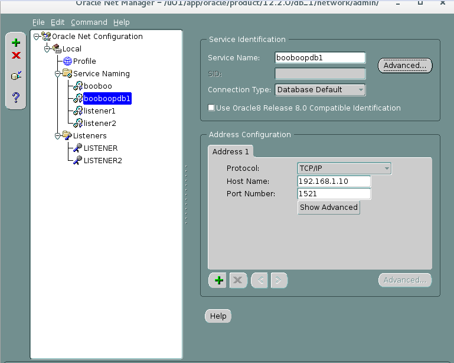

2. 通过使用`booboopdb1` 服务名称连接PDB数据库。

  ```bash
  sqlplus scott/tiger@booboopdb1
  ```

执行结果：  

```sql
[oracle@oracle01 admin]$ sqlplus scott/tiger@booboopdb1

SQL*Plus: Release 12.2.0.1.0 Production on Fri Jan 31 00:44:55 2020

Copyright (c) 1982, 2016, Oracle.  All rights reserved.

Last Successful login time: Thu Jan 30 2020 23:46:00 +08:00

Connected to:
Oracle Database 12c Enterprise Edition Release 12.2.0.1.0 - 64bit Production

SCOTT@booboopdb1>select tname from tab;

TNAME
----------------------------------------------------------------------------------------------------
BONUS
DEPT
EMP
EMPTEST
SALGRADE
T02

6 rows selected.
```
