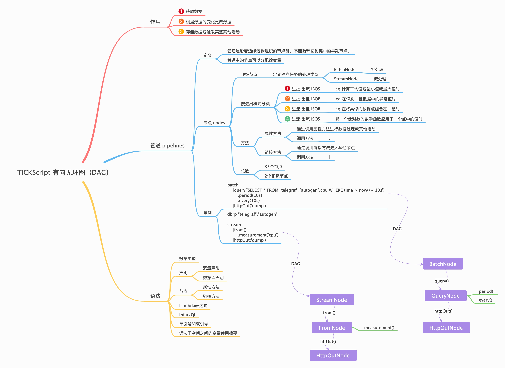

<!-- TOC depthFrom:1 depthTo:6 withLinks:1 updateOnSave:1 orderedList:0 -->

- [TICKscript 语法](#tickscript-语法)
	- [介绍](#介绍)
	- [符号](#符号)
	- [语法](#语法)
	- [关键字](#关键字)
	- [运算符](#运算符)
	- [链接运算符](#链接运算符)

<!-- /TOC -->

# TICKscript 语法

## 介绍

TICKscript语言是一种用于定义数据处理管道的调用链语言。




## 符号

使用`Extended Backus-Naur Form`（“EBNF”）指定语法。`EBNF`与`Go`编程语言规范中使用的符号相同，可在此处找到。

```go
Production  = production_name "=" [ Expression ] "." .
Expression  = Alternative { "|" Alternative } .
Alternative = Term { Term } .
Term        = production_name | token [ "…" token ] | Group | Option | Repetition .
Group       = "(" Expression ")" .
Option      = "[" Expression "]" .
Repetition  = "{" Expression "}" .
```

符号运算符按优先顺序排列：

```go
|   alternation
()  grouping
[]  option (0 or 1 times)
{}  repetition (0 to n times)
```

## 语法


以下是TICKscript的EBNF语法定义。

```go
unicode_char        = (* an arbitrary Unicode code point except newline *) .
digit               = "0" … "9" .
ascii_letter        = "A" … "Z" | "a" … "z" .
letter              = ascii_letter | "_" .
identifier          = ( letter ) { letter | digit } .
boolean_lit         = "TRUE" | "FALSE" .
int_lit             = "1" … "9" { digit }
letter              = ascii_letter | "_" .
number_lit          = digit { digit } { "." {digit} } .
duration_lit        = int_lit duration_unit .
duration_unit       = "u" | "µ" | "ms" | "s" | "m" | "h" | "d" | "w" .
string_lit          = `'` { unicode_char } `'` .
star_lit            = "*"
regex_lit           = `/` { unicode_char } `/` .

operator_lit       = "+" | "-" | "*" | "/" | "==" | "!=" |
                     "<" | "<=" | ">" | ">=" | "=~" | "!~" |
                     "AND" | "OR" .

Program      = Statement { Statement } .
Statement    = Declaration | Expression .
Declaration  = "var" identifier "=" Expression .
Expression   = identifier { Chain } | Function { Chain } | Primary .
Chain        = "@" Function | "|" Function { Chain } | "." Function { Chain} | "." identifier { Chain } .
Function     = identifier "(" Parameters ")" .
Parameters   = { Parameter "," } [ Parameter ] .
Parameter    = Expression | "lambda:" LambdaExpr | Primary .
Primary      = "(" LambdaExpr ")" | number_lit | string_lit |
                boolean_lit | duration_lit | regex_lit | star_lit |
                LFunc | identifier | Reference | "-" Primary | "!" Primary .
Reference    = `"` { unicode_char } `"` .
LambdaExpr   =  Primary operator_lit Primary .
LFunc        = identifier "(" LParameters ")"
LParameters  = { LParameter "," } [ LParameter ] .
LParameter   = LambdaExpr |  Primary .
```

注释：通过`//`实现

## 关键字

| **Word**    | **Usage**                          |
| ----------- | ---------------------------------- |
| **TRUE**    | The literal Boolean value “true”.  |
| **FALSE**   | The literal Boolean value “false”. |
| **AND**     | 与                                 |
| **OR**      | 或                                 |
| **lambda:** | lambda表达式                       |
| **var**     | 变量声明                           |
| **dbrp**    | 数据库声明                         |


## 运算符

| **Operator** | **Usage**                                                    | **Examples**                                 |
| ------------ | ------------------------------------------------------------ | -------------------------------------------- |
| **+**        | 加法和字符串连接                            | `3 + 6`, `total + count` and `'foo' + 'bar'` |
| **-**        | 减法                                                  | `10 - 1`, `total - errs`                     |
| *****        | 乘法                                               | `3 * 6`, `ratio * 100.0`                     |
| **/**        | 除法                                                     | `36 / 4`, `errs / total`                     |
| **==**       | 等值判断                                       | `1 == 1`, `date == today`                    |
| **!=**       | 不等于判断                                     | `result != 0`, `id != "testbed"`             |
| **<**        | 小于判断                                         | `4 < 5`, `timestamp < today`                 |
| **<=**       | 小于等于判断                             | `3 <= 6`, `flow <= mean`                     |
| **>**        | 大于判断                                      | `6 > 3.0`, `delta > sigma`                   |
| **>=**       | 大于等于判断                          | `9.0 >= 8.1`, `quantity >= threshold`        |
| **=~**       | 正则匹配判断 | `tag =~ /^cz\d+/`                            |
| **!~**       | 正则不匹配判断 | `tag !~ /^sn\d+/`                            |
| **!**        | 逻辑否定                                                  | `!TRUE`, `!(cpu_idle > 70)`                  |
| **AND**      | 逻辑与                                          | `rate < 20.0 AND rate >= 10`                 |
| **OR**       | 逻辑或                                          | `status > warn OR delta > sigma`             |

## 链接运算符

| **操作符** | **用法**                                                     | **例子**                      |
| ---------- | ------------------------------------------------------------ | ----------------------------- |
| **\|**     | 声明一个链接方法调用，它创建一个新节点的实例并将其链接到它上面的节点。 | `stream`    |`from()`         |
| **.**      | 声明属性方法调用，设置或更改它所属的节点中的内部属性。       | `from()`    `.database(mydb)` |
| **@**      | 声明用户定义的函数（UDF）调用。本质上是一种链接方法，它将新的UDF节点添加到管道中。 | `from()` `...` `@MyFunc()`    |
