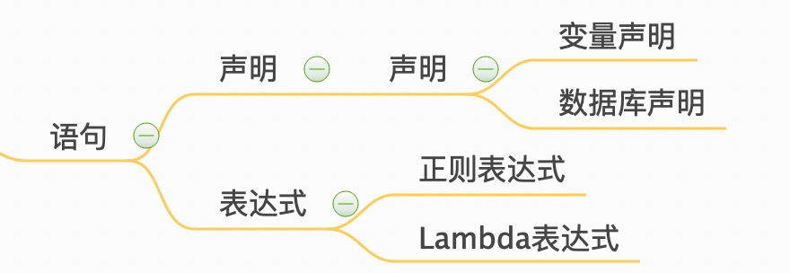

<!-- MDTOC maxdepth:6 firsth1:1 numbering:0 flatten:0 bullets:1 updateOnSave:1 -->

- [Kapacitor简介](#kapacitor简介)   
   - [主要特点](#主要特点)   
   - [学习路径](#学习路径)   
   - [awsome tools](#awsome-tools)   

<!-- /MDTOC -->

[Kapacitor](https://docs.influxdata.com/kapacitor/v1.5/)是一个开源数据处理框架，可以轻松创建警报，运行ETL作业和检测异常。Kapacitor是TICK堆栈的最后一块。

## 主要特点

以下是Kapacitor目前支持的一些功能，使其成为数据处理的绝佳选择。

* 支持两种处理方式：流处理和批处理。
* 通过任务调度，有计划地从InfluxDB数据库中查询数据，且InfluxDB的数据来源非常广泛，只要符合influx协议即可插入数据库。
* 通过`InfluxQL`实现数据的转换。
* 可以将转换后的数据存储在InfluxDB中。
* 支持自用户定义的函数。
* 可以与HipChat，OpsGenie，Alerta，Sensu，PagerDuty，Slack等进行集成（专业的告警管理通知组件）。

## 学习路径

|No.|内容|难度|
|:--|:--|:--|
|1|Kapacitor安装|*|
|2|TICKscript语言|***|
|3|Kapacitor配置文件|**|
|4|Kapacitor命令行|****|
|5|Kapacitor监控案例|**|

## awsome tools

[Ansible Kapacitor](https://github.com/influxdata/ansible-kapacitor) Linux上Kapacitor的配置管理和变更自动化

[kapacitor-course](https://github.com/influxdata/kapacitor-course) kapacitor 脚本教程

[influx-stress](https://github.com/influxdata/influx-stress) InfluxDB压测工具

[InfluxData Sandbox](https://github.com/influxdata/sandbox) TICK 沙箱
